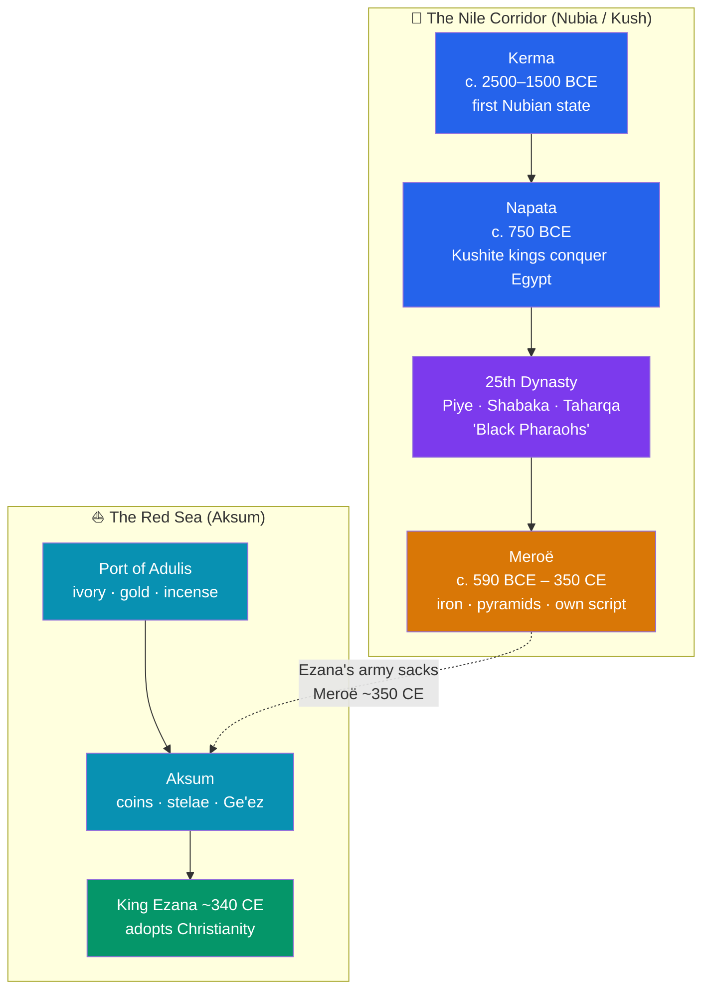

# 🏺 Nubia, Kush, and Aksum

> [!abstract] TL;DR
> South of Egypt, along the great bend of the Nile, lay **Nubia** — home to the powerful **Kingdom of Kush**, which rose at **Kerma**, ruled from **Napata**, and for a century (c. 744–656 BCE) actually *conquered Egypt* as the **25th Dynasty**, the so-called "Black Pharaohs." Driven south by the Assyrians, Kush relocated to **Meroë**, where it forged iron, minted its own script, and raised **more pyramids than Egypt itself**. Far to the southeast, in the highlands of modern **Ethiopia and Eritrea**, the **Kingdom of Aksum** grew rich on **Red Sea trade**, struck its own coins, carved colossal granite **stelae**, and under **King Ezana (c. 340 CE)** became one of the first states on Earth to adopt **Christianity** — a faith preserved to this day in the Ge'ez liturgy of the Ethiopian Orthodox Church.

## Intuition — analogy first

Picture the Nile not as one river running past Egypt, but as a **long highway with many towns strung along it**, and Egypt as only the *northernmost* stretch. Older textbooks treat everything upriver of Aswan as a backwater — a mere supplier of gold and slaves to the "real" civilization at the mouth. That is exactly backwards. The southern towns had their own kings, gods, temples, and pyramids for **three thousand years**, and at one dramatic moment the people from downtown-south (Kush) marched *north* and took over the whole highway, running Egypt themselves.

Now imagine a *second* road — not the Nile, but the **Red Sea shipping lane** — meeting the highlands of the Horn of Africa. A trading city there, **Aksum**, sits at the junction where African ivory, Arabian incense, and Indian pepper all change hands. Whoever controls that junction gets rich, gets cosmopolitan, and — being plugged into the wider world — gets exposed to new ideas. That is how a merchant-king in Africa came to be baptized a Christian centuries before most of Europe.

---

## How It Works — Two African States, Two Lifelines

## Key Concepts

### Nubia and the Rise of Kush

**Nubia** is the region of the Nile valley stretching south from the **first cataract at Aswan** into modern Sudan. Its first great power, the **Kingdom of Kerma** (c. 2500–1500 BCE), built a monumental mud-brick temple, the *Western Deffufa*, and rivaled Middle Kingdom Egypt until the New Kingdom pharaohs (Thutmose I and successors) conquered and colonized Nubia for gold — Egyptians called the land *Ta-Seti*, "Land of the Bow," for its famed archers.

When Egyptian control collapsed after c. 1070 BCE, an independent Nubian state re-emerged around **Napata**, near the sacred mountain of **Gebel Barkal**. These **Kushite** kings adopted Egyptian religion (especially the god **Amun**), pyramid burial, and hieroglyphs — but as rulers of their own increasingly powerful realm.

### The "Black Pharaohs" — the 25th Dynasty

Around **744 BCE**, taking advantage of a fragmented Egypt, the Kushite king **Piye (Piankhi)** marched north and conquered the whole country, founding Egypt's **25th (Nubian/Kushite) Dynasty**. For roughly a century, Nubian kings ruled a combined Egyptian-Kushite empire and styled themselves full pharaohs.

| Kushite Pharaoh | Approx. reign | Note |
|---|---|---|
| **Piye (Piankhi)** | c. 744–714 BCE | Conquered Egypt; commemorated on the *Victory Stele* |
| **Shabaka** | c. 714–705 BCE | Consolidated rule from Memphis |
| **Taharqa** | c. 690–664 BCE | Greatest builder; named in the Hebrew Bible (2 Kings 19:9) |
| **Tanutamun** | c. 664–656 BCE | Last; expelled after Assyrian invasions |

The dynasty fell when the **Assyrians** under **Esarhaddon** and **Ashurbanipal** invaded Egypt (671–663 BCE) with iron weapons, driving the Kushites back south for good.

### Meroë — Iron, Pyramids, and a Native Script

After the Egyptian pharaoh **Psamtik II** sacked Napata (c. 593 BCE), the Kushite capital shifted far south to **Meroë**, between the fifth and sixth cataracts. The **Meroitic period** (c. 590 BCE – 350 CE) was distinctively African rather than Egyptian:

- **Ironworking** — Meroë sat amid iron ore and hardwood for charcoal; its slag heaps earned it the (romantic but debated) nickname *"the Birmingham of Africa."*
- **Pyramids** — Nubia contains **over 200 royal pyramids**, more than all of Egypt. They are smaller and far steeper, with attached offering chapels; the necropolis at **Meroë** is a UNESCO World Heritage Site.
- **The Meroitic script** — Kush abandoned Egyptian hieroglyphs for its **own alphabetic writing system**, the first indigenous script of sub-Saharan Africa. It can be *read phonetically* but the language remains **largely undeciphered**.
- **Powerful queens** — ruling queens and queen-mothers bore the title **Kandake** (Candace); one is referenced in the Christian New Testament (Acts 8:27).

### The Kingdom of Aksum

Emerging around the first century CE in the highlands of northern **Ethiopia and Eritrea**, **Aksum** commanded the Red Sea trade through its port of **Adulis**, exchanging African ivory, gold, and incense for goods from Rome, Arabia, and India. Its achievements were remarkable:

- **Coinage** — Aksum was **one of the few ancient African states to mint its own coins** (gold, silver, bronze), stamped with royal portraits and, later, the cross.
- **Stelae / obelisks** — giant carved granite **stelae** marked royal tombs; the largest ever raised (now fallen) stood ~33 m. The ~24 m **Obelisk of Axum** was looted by Italy in 1937 and finally returned to Ethiopia in **2005**.
- **Global stature** — the 3rd-century Persian prophet **Mani** ranked Aksum among the world's four great powers, alongside Rome, Persia, and China.

### Ezana's Conversion and the Ge'ez Legacy

Around **340 CE**, King **Ezana** converted Aksum to **Christianity** — traditionally credited to **Frumentius**, a shipwrecked Syrian tutor who became the first bishop ("Abba Salama"), consecrated by **Athanasius of Alexandria**. Ezana's coins shift visibly from a pagan crescent-and-disc to the **cross**, giving numismatists a datable record of a nation's conversion. This founded the **Ethiopian Orthodox Tewahedo Church**, whose liturgical language, **Ge'ez**, and its script survive to this day. (Aksum also gave refuge to early Muslims fleeing Mecca in 615 CE, the *first hijra*.) Aksum declined after c. 700 CE as the rise of Islam redirected Red Sea trade and, likely, environmental exhaustion sapped its highland agriculture.

## Primary Sources & Examples

- **Piye's Victory Stele** (Gebel Barkal, c. 720s BCE): a long granite inscription narrating the Kushite conquest of Egypt city by city — one of the most detailed military accounts to survive from the ancient Nile.
- **The Ezana Stone / Ezana's inscriptions** (Aksum): trilingual royal inscriptions in **Ge'ez, Sabaean, and Greek** that record his campaigns — including one against Meroë/Kush — and document the shift from invoking the war-god *Maḥrem/Ares* to invoking the "Lord of Heaven," marking his Christianization.
- **The Aksumite stelae field** and the returned **Obelisk of Axum**: monumental evidence of a wealthy, engineering-capable African state, and a modern case study in the politics of looted heritage.

## Common Pitfalls / Misconceptions

- **"Nubia was just a colony of Egypt."** For long stretches the influence ran the *other* way — Kush ruled Egypt outright as the 25th Dynasty. The two civilizations were rivals and mutual influences, not master and servant.
- **"All those pyramids are Egyptian."** Sudan has *more* pyramids than Egypt; the Meroitic ones are a distinct, steeper style built centuries later.
- **"Africa had no writing before Europeans."** Both **Meroitic** and **Ge'ez** are indigenous African scripts, the latter still in liturgical use.
- **"Ethiopia was Christianized by European missionaries."** Aksum adopted Christianity in the **4th century CE**, before most of Europe, via Alexandria and the eastern Mediterranean — not from later Western missions.
- **Confusing Kush with the biblical "Cush" loosely.** The ancient African kingdom is a specific state with its own kings and archaeology, not merely a scriptural place-name.

## Related Concepts

- [[West_African_Empires]] — the *other* great African tradition of state-building, based on trans-Saharan gold rather than Nile and Red Sea trade
- [[Ancient_Trade_Networks]] — the Red Sea and Indian Ocean routes that made Aksum rich and the Nile corridor that sustained Kush
- [[_MOC_Africa_Pre_Columbian|↑ Section MOC]] — the section hub for Africa & the Pre-Columbian Americas
- Cross-vault: [[_MOC_History_Master|↑ History Master MOC]] — situates the Nile kingdoms alongside pharaonic Egypt and the ancient Near East

## Review Questions

1. Trace the political center of the Kingdom of Kush from Kerma to Napata to Meroë, and explain what caused each shift. Who were the "Black Pharaohs"?
2. List three ways Meroitic Kush was culturally distinct from pharaonic Egypt, despite borrowing Egyptian religion.
3. What evidence lets historians date King Ezana's conversion to Christianity around 340 CE, and why is Aksum significant in the wider history of the religion?

## Sources

- Welsby, D.A. (1996). *The Kingdom of Kush: The Napatan and Meroitic Empires*. British Museum Press
- Phillipson, D.W. (2012). *Foundations of an African Civilisation: Aksum and the Northern Horn, 1000 BC – AD 1300*. James Currey
- Emberling, G. & Williams, B.B. (eds.) (2020). *The Oxford Handbook of Ancient Nubia*. Oxford University Press
- Munro-Hay, S. (1991). *Aksum: An African Civilisation of Late Antiquity*. Edinburgh University Press

#history #africa #nubia #kush #aksum #meroe #ethiopia
