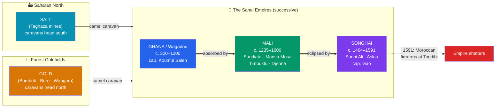

# 🏇 West African Empires

> [!abstract] TL;DR
> Along the **Sahel** — the grassland edge of the Sahara — three great empires rose in succession on the profits of the **trans-Saharan gold-salt trade**. **Ghana** (Wagadou, c. 300–1200 CE) first monopolized the flow of West African gold north across the desert. **Mali**, founded by **Sundiata Keita** around **1235**, grew into one of the wealthiest states of the medieval world; its ruler **Mansa Musa** made a spectacular **hajj to Mecca in 1324**, distributing so much gold in Cairo that he reportedly depressed its price for years, and helped make **Timbuktu** and **Djenné** famed centers of **Islamic learning**. **Songhai**, consolidated by **Sunni Ali** and reformed by **Askia Muhammad**, became the largest of the three from its capital at **Gao**, until firearms carried by a **Moroccan army destroyed it at Tondibi in 1591**. Threaded through all three is the gradual, trade-borne **spread of Islam** into West Africa.

## Intuition — analogy first

Imagine two things that are worthless where they are common and priceless where they are scarce. In the West African forest and savanna, **gold** is plentiful but **salt** — essential to survive the heat and preserve food — is rare. In the Sahara and the north, it is the reverse: **salt** is dug from the ground in slabs, while **gold** is coveted. Between them lies the world's largest desert.

Whoever can move goods across that desert can, in effect, **turn salt into gold and gold into salt** — and take a cut of every load. The **camel** is the ship that crosses this "sand-sea," and the **Sahel** cities are its ports. The empires of Ghana, Mali, and Songhai are what you get when a state parks itself at the southern docks of that desert-ocean and taxes the traffic. Their wealth was not a fluke of mines; it was the profit of **controlling a choke point** — exactly like a medieval Venice, but with dunes instead of water.

---

## How It Works — Three Empires on One Trade Route

## Key Concepts

### The Trans-Saharan Gold-Salt Trade

The engine of all three empires was long-distance exchange across the Sahara, made viable from roughly the **first millennium CE** by the spread of the **domesticated camel**. Southbound caravans carried **salt** (cut in great slabs at desert mines like **Taghaza**), cloth, copper, and manufactured goods; northbound they carried **gold** (from the **Bambuk, Bure, and Wangara** fields), **ivory**, kola nuts, and **enslaved people**. West African gold ultimately supplied the mints of North Africa and Europe. The empires prospered not by mining gold themselves but by **taxing the trade** passing through their markets.

### Ghana — The First Empire of Gold

The **Ghana Empire** (known to its own people as **Wagadou**, ruled by the *Soninke*) flourished c. **300–1200 CE** — note it lay far northwest of the modern country that borrows its name. Arab geographers such as **al-Bakri** (writing in 1068, from earlier reports) described its capital, likely **Koumbi Saleh**, as a twin city — one quarter for the king and traditional religion, one for Muslim merchants — and called its king "the wealthiest of all kings on the face of the earth" for his gold. Ghana declined amid drought, shifting trade routes, and pressure from the Almoravid movement, opening the way for Mali.

### Mali — Sundiata, Mansa Musa, and Timbuktu

The **Mali Empire** was founded around **1235 CE** by **Sundiata Keita** (the "Lion King"), who united the Malinke and defeated **Sumanguru Kanté** of Sosso at the **Battle of Kirina** — a story preserved orally for centuries by **griots** as the *Epic of Sundiata*. Mali controlled the goldfields and grew immensely rich.

Its most famous ruler, **Mansa Musa** (r. c. 1312–1337), undertook the legendary **hajj to Mecca in 1324**. Traveling with an enormous retinue and vast quantities of gold, he spent and gave away so lavishly in **Cairo** that he reportedly **destabilized the price of gold in Egypt for a decade**. His pilgrimage put Mali on European maps — the **Catalan Atlas of 1375** depicts him enthroned holding a golden nugget. Musa patronized architecture and scholarship, and under Mali **Timbuktu** and **Djenné** became renowned hubs of **Islamic learning**, home to the **Sankore** and **Djinguereber** mosques and, later, tens of thousands of manuscripts.

### Songhai — Sunni Ali, Askia Muhammad, and Gao

As Mali fragmented, the **Songhai Empire**, centered on **Gao** on the Niger bend, became the largest of all. **Sunni Ali** (r. 1464–1492) conquered Timbuktu and Djenné and built a powerful army and river navy. After his death, the general **Muhammad Ture** seized power as **Askia Muhammad** ("Askia the Great," r. 1493–1528), who **centralized the administration**, standardized weights and taxes, and made Islam a pillar of state, undertaking his own celebrated **hajj in 1497**. Songhai's end came suddenly in **1591**, when a **Moroccan expeditionary force armed with gunpowder firearms** crossed the Sahara and shattered the far larger Songhai army at the **Battle of Tondibi** — a stark demonstration of the new military advantage of firearms.

| Empire | Peak era | Capital | Key ruler | Downfall |
|---|---|---|---|---|
| **Ghana (Wagadou)** | c. 700–1100 | Koumbi Saleh | (Soninke kings) | Drought, Almoravid pressure, route shifts |
| **Mali** | c. 1235–1400 | Niani | Sundiata; Mansa Musa | Succession disputes, provincial revolts |
| **Songhai** | c. 1464–1591 | Gao | Sunni Ali; Askia Muhammad | Moroccan firearms at Tondibi (1591) |

### The Spread of Islam

Islam entered West Africa **peacefully, through trade**, long before any conquest — carried by North African merchants and welcomed first by the commercial and ruling classes. Rulers often practiced a **blend** of Islam and traditional religion, which the visiting Moroccan traveler **Ibn Battuta** (who reached Mali in 1352) both praised and criticized. Islam brought **literacy in Arabic**, legal and administrative frameworks, and a scholarly network linking Timbuktu to Cairo and Fez — while indigenous beliefs and social structures persisted alongside it.

## Primary Sources & Examples

- **Al-Bakri, *Book of Routes and Realms* (1068):** a Cordoban geographer's detailed secondhand description of the Ghana court, its gold, its army, and the dual Muslim/royal city — a key window on the empire despite the author never having visited.
- **Ibn Battuta's *Rihla* (account of his 1352 visit to Mali):** the great Moroccan traveler's eyewitness report on Mali's justice, court ceremony, and religious life under Mansa Musa's successor — invaluable and, at points, judgmental.
- **The Catalan Atlas (1375):** a Majorcan map showing **Mansa Musa** crowned and holding gold, evidence of how far the fame of Malian wealth spread into Christian Europe.
- **The Timbuktu manuscripts:** tens of thousands of surviving manuscripts on theology, law, astronomy, and medicine — concrete proof of a deep West African tradition of literate scholarship.

## Common Pitfalls / Misconceptions

- **Confusing the ancient Ghana Empire with the modern nation of Ghana.** They are geographically distinct; the modern state adopted the prestigious name at independence in 1957.
- **"Africa was isolated and non-literate."** Timbuktu was a **university town** with a manuscript economy; these empires were fully integrated into Afro-Eurasian trade and Islamic scholarship.
- **Treating Mansa Musa's hajj as mere spectacle.** It was also **diplomacy and pilgrimage**, and it recruited scholars and architects who reshaped Malian cities.
- **Assuming Islam was imposed by conquest.** In West Africa it spread first and foremost through **commerce and gradual conversion**, often coexisting with older beliefs.
- **Overstating the causes of collapse.** No single factor explains any empire's fall; drought, trade-route shifts, succession crises, and — for Songhai — new **firearms technology** all played parts.

## Related Concepts

- [[Ancient_Trade_Networks]] — the trans-Saharan caravan system in mechanical detail, the desert "ports," and its Indian Ocean counterpart
- [[Nubia_Kush_and_Aksum]] — Africa's *other* deep tradition of imperial state-building, on the Nile and Red Sea rather than the Sahel
- [[_MOC_Africa_Pre_Columbian|↑ Section MOC]] — the section hub
- Cross-vault: [[_MOC_History_Master|↑ History Master MOC]] — connects these empires to the medieval Islamic world and the wider Afro-Eurasian economy

## Review Questions

1. Explain the economic logic of the gold-salt trade and why it made the *Sahel* — rather than the goldfields themselves — the seat of empire.
2. Why did Mansa Musa's 1324 hajj become legendary, and what were its lasting effects on Mali's cities and reputation abroad?
3. Compare how Ghana, Mali, and Songhai each ended, and identify what was distinctive about Songhai's fall in 1591.

## Sources

- Levtzion, N. (1973). *Ancient Ghana and Mali*. Methuen
- Gomez, M.A. (2018). *African Dominion: A New History of Empire in Early and Medieval West Africa*. Princeton University Press
- Niane, D.T. (1965). *Sundiata: An Epic of Old Mali* (trans. G.D. Pickett). Longman
- Levtzion, N. & Hopkins, J.F.P. (eds.) (1981). *Corpus of Early Arabic Sources for West African History*. Cambridge University Press

#history #africa #mali #songhai #ghana #timbuktu #islam
