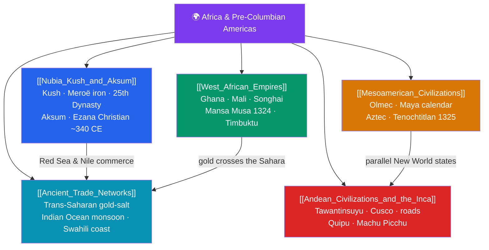

# 🗺️ Africa & Pre-Columbian Americas — Map of Content

> [!abstract] What This Section Covers
> This section recovers the rich civilizations of Africa and the Americas that older Eurocentric narratives long ignored. In Africa's Nile corridor and highlands, **Nubia, Kush, and Aksum** flourished — Kushite kings even ruled Egypt as the 25th Dynasty, worked iron at Meroë, and Aksum in Ethiopia became one of the first states to adopt Christianity under King Ezana (c. 340 CE). The **West African empires** of Ghana, Mali, and Songhai grew wealthy on the trans-Saharan gold-salt trade; Mali's Mansa Musa made his legendary 1324 pilgrimage to Mecca, and Timbuktu became a center of Islamic learning. Across the Atlantic, **Mesoamerican civilizations** — Olmec, Maya, and Aztec — built cities, writing systems, and precise calendars, while the **Andean civilizations and the Inca** forged Tawantinsuyu, the largest empire of the pre-Columbian Americas, with its road network and quipu record-keeping. **Ancient trade networks**, from trans-Saharan caravans to Indian Ocean monsoon routes, tie these worlds together and show that no civilization developed in isolation.

## Concept Map

## Learning Path

1. [[Nubia_Kush_and_Aksum]] — The Nile kingdoms south of Egypt and the Ethiopian trading empire of Aksum.
2. [[West_African_Empires]] — The gold-based empires of Ghana, Mali, and Songhai and the scholarship of Timbuktu.
3. [[Ancient_Trade_Networks]] — Trans-Saharan and Indian Ocean routes that connected Africa to Eurasia.
4. [[Mesoamerican_Civilizations]] — Olmec origins, Maya writing and astronomy, and the Aztec imperial capital.
5. [[Andean_Civilizations_and_the_Inca]] — The Inca state, its engineering, and administration without writing.

## All Notes at a Glance

| Note | Difficulty | What You'll Learn |
|------|------------|-------------------|
| [[Nubia_Kush_and_Aksum]] | Intermediate | Kush and Meroë, the 25th (Nubian) Dynasty, ironworking, Aksum and Ezana's conversion |
| [[West_African_Empires]] | Beginner → Intermediate | Ghana, Mali, Songhai, Mansa Musa's hajj, gold-salt trade, Timbuktu and Islamic learning |
| [[Mesoamerican_Civilizations]] | Intermediate | Olmec colossal heads, Maya glyphs and Long Count calendar, Aztec Triple Alliance and Tenochtitlan |
| [[Andean_Civilizations_and_the_Inca]] | Intermediate | Chavín and Moche roots, Inca Tawantinsuyu, road system, quipu, terrace agriculture |
| [[Ancient_Trade_Networks]] | Intermediate | Trans-Saharan caravans, camel and gold economies, Indian Ocean monsoon trade, Swahili city-states |

## Key Questions This Section Answers

- How did Nubian kings come to rule Egypt, and why is Aksum significant in the history of Christianity?
- What made Mali so wealthy, and why did Mansa Musa's pilgrimage become legendary?
- How did the Maya develop writing and calendars as sophisticated as any in the Old World?
- How did the Inca govern the largest American empire without writing, wheels, or money?
- How did long-distance trade networks link African and Eurasian economies before European arrival?

## Related Sections

- [[_MOC_History_Master|↑ History Master MOC]]
- [[_MOC_Ancient_India_China|← Ancient India & China]]
- [[_MOC_Medieval_World|→ The Medieval World]]

#MOC #History #AfricaAmericas
