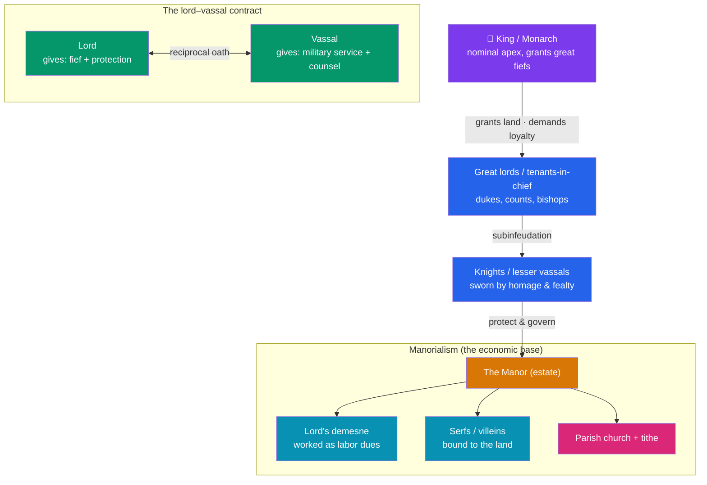

# 🏰 Feudalism and Early Medieval Europe

> [!abstract] TL;DR
> After the Western Roman Empire dissolved, its provinces were carved into **Germanic successor kingdoms** — Franks, Visigoths, Ostrogoths, Lombards, Anglo-Saxons. The old label **"the Dark Ages"** paints this era as a void of ignorance, but historians now reject the term as misleading (see [[Periodization_and_Chronology]]): learning survived and evolved, above all in **monasteries**. The **Franks** under **Charlemagne**, crowned emperor by the Pope in **800 CE**, briefly reunited much of the west and sponsored the **Carolingian Renaissance**. As central authority fragmented again, society reorganized around **feudalism** — a web of personal bonds among **lords, vassals, and fiefs** — and around **manorialism**, the self-sufficient agricultural estate worked by **serfs**. Together they gave early medieval Europe order without a strong state.

## Intuition — analogy first

Imagine a large company whose head office suddenly vanishes. There is no CEO, no HR, no payroll — but the regional managers, the local teams, and the factories are all still there. How do you keep things running without a center?

You improvise a chain of **personal deals**. Each senior person promises protection and a source of income to a junior person, who in return promises loyalty and service. Nobody trusts a distant, abstract "state" anymore — you trust the person who swore an oath to your face. That web of face-to-face promises *is* the government now.

That is **feudalism**: a lord grants a **fief** (usually land) to a **vassal**, who kneels, swears **homage and fealty**, and owes military service in return. Beneath this warrior class, the actual food is grown on the **manor** — a village-sized estate — by **serfs** who are bound to the soil, farming the lord's land in exchange for protection and the right to work strips of their own. Rome's public taxes and salaried army are gone; in their place is a **pyramid of personal loyalty resting on peasant labor**. (Remarkably, medieval Japan improvised a strikingly [[Medieval_Japan_and_the_Samurai|similar system]] with no contact with Europe at all.)

---

## How It Works — The Feudal-Manorial Pyramid

## Key Concepts

### The "Dark Ages"? A Contested Label

Petrarch coined "dark ages" in the 14th century to disparage the centuries between classical antiquity and his own hoped-for revival of letters. Later the term hardened into an image of universal ignorance, violence, and stagnation from roughly **500 to 1000 CE**. Modern historians largely **reject the label** as a value judgment masquerading as a period name (see [[Periodization_and_Chronology]]):
- Learning was **preserved and copied** in monasteries and cathedral schools, not extinguished.
- Real innovation occurred — the heavy plow, the horse collar, and new crop rotations that would power the [[The_High_Middle_Ages|High Middle Ages]].
- The gloomiest connotations reflect a shortage of *written sources*, not necessarily a shortage of activity. "Early Middle Ages" or "Late Antiquity" are the preferred neutral terms.

### Germanic Successor Kingdoms

As Roman administration collapsed in the 5th century (see [[Fall_of_the_Western_Roman_Empire]]), **Germanic peoples** who had migrated into the empire founded kingdoms on its ruins: the **Visigoths** in Iberia, the **Ostrogoths** then **Lombards** in Italy, the **Vandals** in North Africa, the **Anglo-Saxons** in Britain, and the **Franks** in Gaul. These were often hybrid states that fused Roman law, Latin, and Christianity with Germanic warrior custom. The **conversion of the Franks** under **Clovis I** (c. 496) to Catholic Christianity — rather than the Arian creed of many rivals — allied them with the Roman Church and set the stage for Frankish dominance.

### The Franks and Charlemagne

The Franks became the great power of the west. After **Charles Martel** halted a Muslim raiding force at **Tours (732)** and the **Carolingian** dynasty supplanted the old Merovingian kings, **Charlemagne** ("Charles the Great," r. 768–814) conquered an empire spanning modern France, Germany, the Low Countries, and northern Italy. On **Christmas Day, 800**, **Pope Leo III crowned him "Emperor of the Romans"** in Rome — reviving the *idea* of a Western Roman emperor, asserting a partnership between papacy and Frankish crown, and implicitly challenging the Byzantines' claim to be the only Romans (see [[The_Byzantine_Empire]]).

### The Carolingian Renaissance

Charlemagne sponsored a deliberate revival of learning, the **Carolingian Renaissance**, coordinated by the scholar **Alcuin of York** at the palace school in **Aachen**. Its achievements were foundational rather than flashy:
- Standardized Latin and a clear new script, **Carolingian minuscule** (with word spaces and lower-case letters — the ancestor of modern Roman typefaces).
- Mass **copying of classical and Christian texts** in monastic *scriptoria* — most surviving ancient Latin literature reaches us through Carolingian copies.
- Reformed schools, liturgy, and administration. After Charlemagne's death the empire was partitioned among his grandsons by the **Treaty of Verdun (843)**, splitting into rough ancestors of France and Germany.

### Feudalism: Lord, Vassal, and Fief

"Feudalism" is a modern shorthand (the historian Susan Reynolds warned it oversimplifies a messier reality) for the network of obligations among the warrior elite. Its core was a **reciprocal contract**:

| Party | Gives | Receives |
|---|---|---|
| **Lord (suzerain)** | A **fief** (*feudum*) — usually land with its peasants — plus protection and justice | Military service, counsel, financial "aids," and loyalty |
| **Vassal** | An oath of **homage and fealty**; armed service (typically ~40 days/year); attendance at the lord's court | Land, income, and protection |

A vassal could in turn grant portions of his fief to *his own* vassals (**subinfeudation**), producing a layered hierarchy. Because loyalties were personal and could conflict, the system was chronically unstable — a vassal might hold fiefs from two rival lords.

### Manorialism and Serfdom

Feudalism organized the *warriors*; **manorialism** organized the *economy* that fed them. The **manor** was a largely self-sufficient rural estate. Its land was split between the **lord's demesne** and the **peasants' holdings**. Most peasants were **serfs (villeins)** — legally **bound to the land** (they could not leave without permission) and owing the lord **labor services** (working the demesne), rents in kind, and fees. They were not chattel slaves — they could not be sold apart from the land, held their own strips, and had customary rights — but they were unfree. This closed, self-provisioning economy suited a world of weak trade and little cash.

### The Church and Monasticism as Preservers of Learning

The **Roman Catholic Church** was the one institution that spanned the fragmented west, providing continuity, literacy, and law. **Monasteries** — especially those following the **Rule of St. Benedict** (c. 540), with its balance of prayer and manual labor (*ora et labora*) — became the workshops where monks copied manuscripts, ran schools, cleared land, and kept classical learning alive. Irish and Anglo-Saxon monks (e.g., the **Venerable Bede**) re-evangelized parts of the continent. Without the monastic *scriptoria*, much of what we possess of Greco-Roman literature would have been lost.

## Primary Sources & Examples

- **Einhard, *Vita Karoli Magni* (*Life of Charlemagne*, c. 830)** — a courtier's biography modeled on Suetonius; the essential (and admiring) contemporary portrait of Charlemagne.
- **The Domesday Book (1086)** — William the Conqueror's exhaustive survey of English manors, tenants, and serfs; the richest single snapshot of the manorial economy anywhere in Europe.
- **The Rule of St. Benedict (c. 540)** — the founding constitution of Western monasticism, still followed today; a primary source for how learning and labor were institutionalized.
- **The Bayeux Tapestry (c. 1070s)** — an embroidered narrative of the Norman Conquest that vividly depicts mounted knights, oaths of fealty, and the feudal military class in action.

## Common Pitfalls / Misconceptions

- **Taking "the Dark Ages" literally.** The phrase is a discredited value judgment; the period saw real technological and cultural development, and modern scholarship prefers "Early Middle Ages."
- **Treating "feudalism" as a tidy, uniform system.** It was never a single legal code but a patchwork of local customs; some historians (Susan Reynolds) argue the neat textbook "feudal pyramid" is a later construction. Use it as a model, not a law of nature.
- **Confusing serfs with slaves.** Serfs were unfree and bound to the land, but they were not property to be bought and sold as individuals, and they held customary rights and their own plots.
- **Imagining Charlemagne's empire was a true restoration of Rome.** It lacked Rome's cities, taxation, bureaucracy, and Mediterranean reach, and fragmented within two generations. It revived the *title* far more than the *state*.
- **Thinking the Church was purely a spiritual institution.** It was also the era's largest landholder, its main literate bureaucracy, and a political power in its own right — tensions that erupt in the [[The_High_Middle_Ages|Investiture Controversy]].

## Related Concepts

- [[_MOC_Medieval_World|↑ Section MOC]] — the section hub
- [[The_High_Middle_Ages]] — the agricultural surplus and stability built here powered the boom of 1000–1300
- [[The_Byzantine_Empire]] — the centralized, bureaucratic Roman east; the mirror image of the decentralized Latin west
- [[Medieval_Japan_and_the_Samurai]] — an independent feudal order that evolved a strikingly parallel lord–vassal–warrior structure
- [[Periodization_and_Chronology]] — grounds the debate over the loaded "Dark Ages" label used for this era
- Cross-vault: [[Fall_of_the_Western_Roman_Empire]] — the collapse whose vacuum the successor kingdoms and feudalism filled

## Review Questions

1. Why do modern historians reject or heavily qualify the term "Dark Ages" for early medieval Europe? Give at least two concrete reasons.
2. Explain the reciprocal obligations that bound a lord and a vassal, and distinguish feudalism (organizing warriors) from manorialism (organizing the economy). Where do serfs fit?
3. What was the significance of Charlemagne's coronation in 800, and what did the Carolingian Renaissance actually accomplish? Why was the Church central to preserving learning?

## Sources

- Wickham, C. (2009). *The Inheritance of Rome: Illuminating the Dark Ages, 400–1000*. Penguin
- Bloch, M. (1961). *Feudal Society* (2 vols., trans. L.A. Manyon). University of Chicago Press
- Reynolds, S. (1994). *Fiefs and Vassals: The Medieval Evidence Reinterpreted*. Oxford University Press
- Backman, C.R. (2014). *The Worlds of Medieval Europe* (3rd ed.). Oxford University Press

#history #medieval #feudalism #charlemagne #manorialism #monasticism
