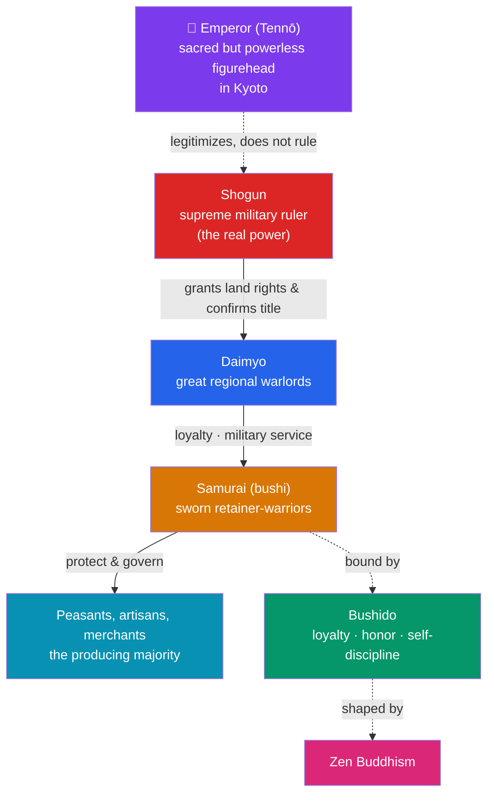

# 🏯 Medieval Japan and the Samurai

> [!abstract] TL;DR
> While Europe developed feudalism, medieval Japan built a strikingly **parallel warrior order** with no contact between them. As the refined **Heian court** (794–1185) weakened, provincial warriors — the ***bushi*** or **samurai** — rose to real power. In **1185** the victorious **Minamoto** clan established the **Kamakura shogunate**, a military government under a **shogun** who ruled in the emperor's name; the **Ashikaga shogunate** followed (1336–1573). Society was ordered as a feudal pyramid of **shogun → *daimyo* → samurai**, bound by the warrior code of ***bushido***. Japan twice repelled massive **Mongol invasions (1274 and 1281)**, saved partly by the typhoons its people called ***kamikaze***, the "divine winds." **Zen Buddhism** shaped samurai culture, discipline, and the arts. The result is one of history's best cases for **comparative study** against European [[Feudalism_and_Early_Medieval_Europe|feudalism]].

## Intuition — analogy first

Here is one of history's most remarkable coincidences. Take two societies on **opposite ends of the Earth** — medieval Japan and medieval Europe — with **no meaningful contact** between them. Give each the same underlying problem: a **weak central authority** unable to project power across the countryside, and a landscape of local estates that need defending. Then watch what they independently invent.

Both build the **same solution**: a class of **mounted, armored professional warriors** (knights / samurai), bound to lords by **personal oaths of loyalty**, rewarded with **rights over land** rather than salaries, and governed by an idealized **code of honor** (chivalry / *bushido*). Both wrap real power around a **ceremonial figurehead** — but here they diverge tellingly: Europe's king was a real (if contested) ruler, whereas Japan's **emperor became a sacred figurehead** while a **shogun** wielded actual power in his name.

This is why historians love the comparison. When two isolated societies converge on such similar structures, it suggests these arrangements are **rational responses to a common problem** — decentralized defense in an age of weak states — rather than accidents of one culture. Japan is the control group that makes "feudalism" look like a pattern, not a fluke.

---

## How It Works — The Japanese Feudal Order

## Key Concepts

### From the Heian Court to the Rise of the Bushi

The **Heian period** (794–1185), centered on the capital **Heian-kyō (Kyoto)**, was a golden age of aristocratic court culture — the era of **Murasaki Shikibu's *The Tale of Genji*** (c. 1010), often called the world's first novel. But real power drained from the imperial court and the dominant **Fujiwara regents** to provincial estates and the **warriors (*bushi*)** who protected them. By the 12th century, great warrior clans — the **Taira (Heike)** and **Minamoto (Genji)** — fought for supremacy. The **Genpei War (1180–1185)** ended in Minamoto victory, immortalized in the epic ***The Tale of the Heike***.

### The Kamakura Shogunate (1185)

In **1185**, **Minamoto no Yoritomo** emerged victorious and in **1192** took the title **shogun** (*seii taishōgun*, "barbarian-subduing great general"), establishing Japan's first **shogunate (*bakufu*, "tent government")** at **Kamakura**. This created Japan's defining **dual structure**: the **emperor reigned** as a sacred figurehead in Kyoto, while the **shogun ruled** through a military government. After Yoritomo, power actually passed to the **Hōjō** clan as regents (*shikken*) behind the shogun — a figurehead behind a figurehead. The Kamakura period (1185–1333) firmly established warrior rule.

### The Ashikaga Shogunate and the Feudal Order

After the Kamakura shogunate fell (1333), the **Ashikaga (Muromachi) shogunate** ruled from **1336 to 1573**, based in Kyoto's Muromachi district. Central authority was weaker, and real power increasingly rested with **regional warlords, the *daimyo***, who held large domains and commanded samurai retinues. The order was a feudal pyramid strikingly like Europe's:

- **Shogun** — supreme military ruler.
- ***Daimyo*** — great landholding lords (roughly parallel to European magnates).
- **Samurai** — sworn warrior-retainers, rewarded with stipends or land rights.
- **Peasants, artisans, and merchants** — the producing classes beneath the warriors.

The system's tensions eventually exploded into the **Ōnin War (1467–1477)** and the century of civil war known as the ***Sengoku* ("Warring States") period**.

### Bushido: The Way of the Warrior

***Bushido*** ("the way of the warrior") was the evolving ethical code of the samurai, emphasizing **loyalty to one's lord, martial skill, courage, honor, frugality, and self-discipline**. A samurai's honor could demand ritual suicide (***seppuku*** or *harakiri*) to atone for failure or avoid capture. The samurai fought first as mounted archers, later as master swordsmen wielding the iconic curved ***katana***. (Note: *bushido* was substantially **idealized and systematized much later**, especially in the peaceful Edo period and by Nitobe Inazō's 1900 book — a caution against reading the polished code straight back onto medieval battlefields; see [[Historical_Bias_and_Revisionism]].)

### The Mongol Invasions and the Kamikaze (1274, 1281)

Under **Kublai Khan**, the **Mongol Empire** — having conquered China and Korea — launched two vast seaborne invasions of Japan:
- **1274** — a first assault was repelled, partly by a storm.
- **1281** — an enormous armada (perhaps the largest of the pre-modern era) was destroyed by a massive **typhoon**.

The Japanese credited their survival to the ***kamikaze*** — the **"divine winds"** sent by the gods to protect Japan — a belief that fed a potent sense of national and sacred destiny (and lent its name, tragically, to the suicide pilots of 1944–45). Ironically, victory strained the Kamakura shogunate: it could not reward its samurai (there was no conquered land to grant), sowing discontent that helped topple it in 1333.

### Zen Buddhism and Samurai Culture

**Zen Buddhism** (Chinese *Chan*), introduced from China in the Kamakura era, deeply influenced the warrior class. Its emphasis on **discipline, meditation, direct intuition, and acceptance of death** resonated with the samurai ethos and shaped an enduring aesthetic — the **tea ceremony**, **ink painting**, **rock gardens**, **Noh theater**, and later **haiku** and swordsmanship as spiritual practice. Zen helped fuse martial life with a refined cultural sensibility.

### Japanese vs. European Feudalism

| Feature | **Medieval Japan** | **Medieval Europe** |
|---|---|---|
| Warrior class | **Samurai (*bushi*)** | **Knights** |
| Great lords | ***Daimyo*** | Dukes, counts, barons |
| Supreme ruler | **Shogun** (emperor a sacred figurehead) | King (a real, if contested, ruler) |
| Land-for-service | Stipends / land rights (*shōen*) | Fiefs (*feuda*) |
| Honor code | ***Bushido*** | Chivalry |
| Religious influence | **Zen Buddhism**, Shinto | Roman Catholic Church |
| Binding tie | Personal loyalty (oath) | Personal loyalty (homage & fealty) |

The parallels are real and instructive, but the differences matter: Japan's emperor was a sacred figurehead legitimizing the shogun, whereas Europe had **no single spiritual-secular figurehead** and a genuinely competing papacy; and Japanese loyalty was less contractual and reciprocal than the European lord–vassal bargain (see [[Feudalism_and_Early_Medieval_Europe]]).

## Primary Sources & Examples

- **Murasaki Shikibu, *The Tale of Genji* (c. 1010)** — the masterpiece of Heian court literature; a primary source for the aristocratic world the samurai would displace.
- ***The Tale of the Heike* (*Heike Monogatari*, 13th c.)** — the great war epic of the Genpei War, the founding literary source of the samurai ideal and Buddhist impermanence.
- **The *Mōko Shūrai Ekotoba* (Mongol Invasion Scrolls, c. 1293)** — picture scrolls commissioned by the samurai **Takezaki Suenaga** depicting the Mongol invasions; a rare firsthand visual account.
- **Hōjō Shigetoki's house codes & later *bushido* texts** — didactic writings on warrior conduct that reveal how the samurai ethos was articulated over time.

## Common Pitfalls / Misconceptions

- **Confusing the emperor with the shogun.** For most of this era the **emperor reigned but did not rule**; the **shogun (and often a regent behind him) held real power**. Japan's is a dual, figurehead-plus-ruler structure.
- **Treating *bushido* as a fixed medieval code.** Much of the polished "way of the warrior" was **codified and romanticized centuries later** (Edo period and after). Read it critically as an evolving ideal, not a battlefield rulebook.
- **Assuming samurai were only swordsmen.** Early samurai were principally **mounted archers**; the cult of the *katana* as the "soul of the samurai" developed over time.
- **Overstating the "identical to Europe" comparison.** The structural parallels are genuine, but Japan's imperial legitimation, weaker contractual reciprocity, and distinct religious framework make it a *comparison*, not a copy.
- **Misreading "kamikaze."** The medieval **"divine winds"** were the typhoons of 1274 and 1281; the WWII suicide pilots borrowed the term much later.

## Related Concepts

- [[_MOC_Medieval_World|↑ Section MOC]] — the section hub
- [[Feudalism_and_Early_Medieval_Europe]] — the essential comparison: an independently evolved feudal order with lords, vassals, and a warrior honor code
- [[The_High_Middle_Ages]] — Europe's contemporaneous era; contrast Japan's warrior culture with Europe's urban and scholastic revival
- [[The_Byzantine_Empire]] — another society organizing land-for-military-service (the theme system); a third point of comparison
- Cross-vault: [[Historical_Bias_and_Revisionism]] — how the *bushido* code and samurai romanticism were retrospectively idealized, a case study in myth-making

## Review Questions

1. Describe the dual power structure established by the Kamakura shogunate in 1185. How did the roles of the emperor and the shogun differ, and where did the Hōjō fit?
2. Lay out the Japanese feudal pyramid (shogun, daimyo, samurai, peasants) and compare it point-by-point with European feudalism. What are two genuine differences beneath the parallels?
3. What were the Mongol invasions of 1274 and 1281, what role did the "kamikaze" play, and how did even this victory contribute to the fall of the Kamakura shogunate?

## Sources

- Sansom, G. (1958). *A History of Japan to 1334*. Stanford University Press
- Turnbull, S. (2003). *Samurai: The World of the Warrior*. Osprey
- Friday, K.F. (2004). *Samurai, Warfare and the State in Early Medieval Japan*. Routledge
- Souyri, P.F. (2002). *The World Turned Upside Down: Medieval Japanese Society* (trans. K. Roth). Columbia University Press

#history #medieval #japan #samurai #shogunate #bushido
