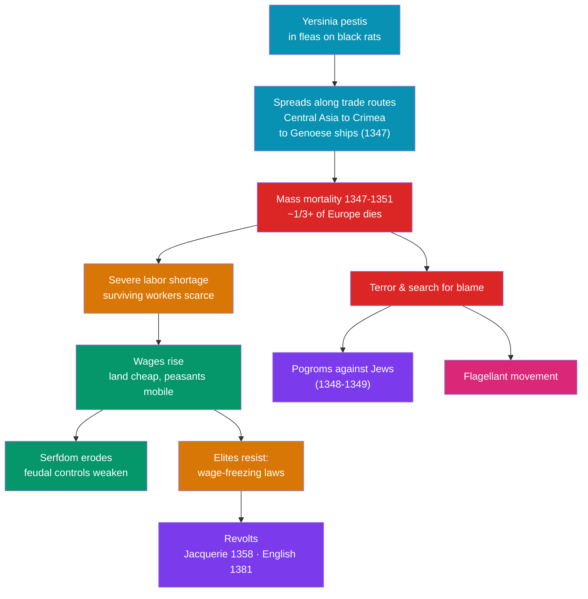

# ☠️ The Black Death

> [!abstract] TL;DR
> The **Black Death** of **1347–1351** was the deadliest pandemic in recorded history, killing perhaps **a third or more of Europe's population** — tens of millions of people — in barely five years. Its agent was the bacterium ***Yersinia pestis***, carried westward from Central Asia along the **trade routes** that the [[The_High_Middle_Ages|High Middle Ages]] had knit together, riding the fleas of black rats onto Genoese ships. Beyond the horror of mass death, its **social and economic aftershocks** reshaped Europe: a catastrophic **labor shortage** drove up **wages** and eroded **serfdom**, fueling revolts like the Jacquerie and the English Peasants' Revolt when elites tried to freeze the old order. Terror also bred cruelty — **pogroms against Jewish communities** scapegoated for the plague, and the self-punishing **flagellant movement** that marched across the continent.

## Intuition — analogy first

Imagine a densely connected computer network with **no firewall and no immunity**. In the [[The_High_Middle_Ages|High Middle Ages]], Europe had spent three centuries building exactly such a network — busy ports, crowded towns, and long trade routes linking the Mediterranean to Asia. Those connections were the engine of prosperity. They were also the perfect superhighway for a pathogen.

A population that has **never met a disease before** has no acquired immunity — like a network with no defenses against a brand-new virus. When *Yersinia pestis* arrived, it did not crawl; it **raced** along the very trade arteries that had made Europe rich, jumping from port to port faster than any warning could travel.

And here is the deeper lesson: a catastrophe this large does not just subtract people — it **rewrites the rules of the system**. Kill a third of the workers and the survivors suddenly become scarce, valuable, and hard to control. Labor that was cheap and coerced becomes expensive and mobile. The Black Death is the classic case of a **demographic shock that cascaded into economic and social revolution** — proof that biology can move history as forcefully as any army or idea.

---

## How It Works — From Pathogen to Social Upheaval

## Key Concepts

### The Pathogen: *Yersinia pestis*

The Black Death was caused by the bacterium ***Yersinia pestis*** (identified in 1894 by Alexandre Yersin, and confirmed in medieval dental-pulp DNA by modern paleogenetics). It normally lives in rodent populations and their **fleas**; when the rats die, infected fleas seek human hosts. It struck in three forms of escalating lethality:

| Form | Transmission | Symptoms | Lethality (untreated) |
|---|---|---|---|
| **Bubonic** | Flea bite | Swollen, blackened lymph nodes (**buboes**), fever | ~30–60% |
| **Pneumonic** | Airborne, person-to-person | Lung infection, bloody cough | ~90–100% |
| **Septicemic** | Bloodstream infection | Blood poisoning, tissue death | Near 100% |

The "black" of the name evokes both the darkened buboes and the sheer dread; contemporaries called it the *Great Pestilence* or *Great Mortality*.

### The Spread Along Trade Routes

Plague erupted in **Central Asia** and moved west along the **Silk Road** and Mongol-era trade networks. A famous flashpoint was the **siege of Caffa (Kaffa)** in Crimea (1346), where, according to the notary Gabriele de' Mussi, the Mongol besiegers catapulted plague-ridden corpses over the walls — an early account of biological warfare. Fleeing **Genoese trading ships** carried it to **Sicily and Constantinople in 1347** (it also devastated [[The_Byzantine_Empire|Byzantium]]), then to **Marseille, Italy, and Spain**, reaching **France and England in 1348**, and **Germany, Scandinavia, and Russia by 1350–1351**. The very trade arteries of the [[The_High_Middle_Ages|commercial revolution]] became the pandemic's highways.

### The Mortality

Estimates vary, but the consensus is that the Black Death killed **roughly 30–60% of Europe's population** — commonly summarized as **"perhaps a third"** or more — within about five years, cutting the continent from around 80 million to perhaps 50 million or fewer. Some towns and regions lost half or more of their people; it took **150–200 years** for Europe's population to recover to pre-plague levels. Medieval medicine, blaming "bad air" (**miasma**) or planetary alignments, was helpless; **quarantine** (from Venetian *quaranta giorni*, forty days) emerged as one of the few partially effective responses.

### Economic Upheaval: Labor, Wages, and the End of Serfdom

The demographic collapse inverted the economics of the [[Feudalism_and_Early_Medieval_Europe|manorial system]]. With so many dead, **labor became scarce and land abundant** — the reverse of the pre-plague squeeze. Surviving **peasants and workers could demand higher wages**, better terms, or simply move to a lord who offered more, undermining the bonds that tied **serfs** to the land. Real wages and living standards for many survivors actually **rose** in the decades that followed. Landlords, desperate to reverse this, pushed **wage-freezing legislation** — England's **Ordinance (1349) and Statute of Labourers (1351)** tried to cap wages at pre-plague levels and bind workers in place. In much of Western Europe, these efforts ultimately failed, hastening the **long decline of serfdom**.

### Revolt: Jacquerie and the Peasants' Revolt

Attempts to force peasants back into the old subordination — combined with heavy taxation and post-plague social tension — provoked major uprisings:
- **The Jacquerie (1358)** — a violent peasant revolt in northern France, brutally suppressed.
- **The English Peasants' Revolt (1381)** — sparked by a poll tax, led by **Wat Tyler** and the preacher **John Ball** (whose slogan "When Adam delved and Eve span, who was then the gentleman?" attacked the whole social hierarchy); rebels reached London before the rising was crushed.

These revolts rarely won immediately, but they signaled that the deferential feudal order had cracked.

### Scapegoating: Pogroms and the Flagellants

Uncomprehending terror bred cruelty and extremism:
- **Pogroms against Jewish communities** — Jews were absurdly accused of causing the plague by **poisoning wells**. In **1348–1349**, massacres swept the Rhineland and beyond; the **Strasbourg massacre (February 1349)** saw hundreds of Jews burned. Pope Clement VI issued bulls condemning the violence and noting Jews were dying of plague too, but the pogroms raged on, accelerating Jewish migration eastward toward Poland.
- **The flagellant movement** — bands of penitents marched town to town **publicly whipping themselves** to atone for the sins they believed had provoked God's wrath. The movement grew so disorderly and anti-clerical that the papacy **condemned it in 1349**.

## Primary Sources & Examples

- **Giovanni Boccaccio, *The Decameron* (c. 1353)** — its frame story of young Florentines fleeing plague-struck Florence opens with a searing eyewitness description of the Black Death's symptoms and social breakdown.
- **The Statute of Labourers (England, 1351)** — a legal primary source revealing elite panic over rising wages and worker mobility in the plague's wake.
- **Chronicles of the Rhineland pogroms and the Strasbourg massacre (1349)** — documenting the scapegoating and murder of Jewish communities.
- **Paleogenetic evidence** — recovered *Yersinia pestis* DNA from medieval mass graves (e.g., London's East Smithfield cemetery) is a modern scientific primary source confirming the pathogen.

## Common Pitfalls / Misconceptions

- **Assuming the Black Death only killed.** Its most historically important effects were the **social and economic transformations** that followed — labor shortage, higher wages, the erosion of serfdom, and revolt.
- **Believing it single-handedly ended feudalism.** It accelerated serfdom's decline in Western Europe, but the process was long and uneven; in parts of Eastern Europe, lords actually *tightened* serfdom afterward (the "second serfdom").
- **Trusting the "ring around the rosy" origin myth.** The popular claim that the nursery rhyme encodes plague symptoms is a modern folk-etymology with no real evidence.
- **Thinking medieval people understood the cause.** They blamed miasma, sin, planetary conjunctions, and scapegoats; the germ theory and *Yersinia pestis* lay five centuries in the future.
- **Overlooking the human cost of scapegoating.** The pogroms against Jewish communities were a direct, deadly consequence of the pandemic, not a footnote.

## Related Concepts

- [[_MOC_Medieval_World|↑ Section MOC]] — the section hub
- [[The_High_Middle_Ages]] — the dense towns, trade routes, and strained food supply that made Europe catastrophically vulnerable to plague
- [[Feudalism_and_Early_Medieval_Europe]] — the manorial and serf-based order that the labor shortage helped unravel
- [[The_Byzantine_Empire]] — hit hard in 1347, and earlier home to the Plague of Justinian (541), the *same* bacterium's first pandemic
- Cross-vault: [[_MOC_Economic_Social_History]] — the wage, labor, and demographic dynamics the plague set in motion are core to economic history

## Review Questions

1. What was the pathogen behind the Black Death, and how did the trade networks of the High Middle Ages accelerate its spread across Europe in 1347–1351?
2. Explain the causal chain from mass mortality to rising wages, the erosion of serfdom, and peasant revolts. Why did wage-freezing laws like the Statute of Labourers (1351) largely fail in Western Europe?
3. Describe two social reactions of fear and scapegoating during the plague (the anti-Jewish pogroms and the flagellant movement). Why did people reach for these responses?

## Sources

- Benedictow, O.J. (2004). *The Black Death, 1346–1353: The Complete History*. Boydell Press
- Herlihy, D. (1997). *The Black Death and the Transformation of the West*. Harvard University Press
- Cohn, S.K. (2002). *The Black Death Transformed: Disease and Culture in Early Renaissance Europe*. Arnold
- Kelly, J. (2005). *The Great Mortality: An Intimate History of the Black Death*. HarperCollins

#history #medieval #plague #pandemic #demography #serfdom
