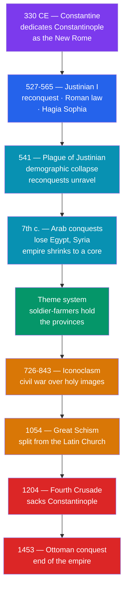

# 🏛️ The Byzantine Empire

> [!abstract] TL;DR
> The **Byzantine Empire** was not a successor to Rome — it *was* Rome, the eastern half of the empire that never fell in 476 and carried on for another **thousand years** from its capital at **Constantinople**. Its people called themselves *Rhōmaioi* (Romans) and spoke Greek. Under **Justinian I** (r. 527–565) it briefly reconquered much of the west, codified Roman law in the ***Corpus Juris Civilis***, and raised the **Hagia Sophia** — even as the **Nika riots** nearly toppled him and the **Plague of Justinian** gutted his empire. Byzantium developed the **theme system** of soldier-farmers to survive the Arab conquests, tore itself apart over **iconoclasm**, and drifted from the Latin west until the **Great Schism of 1054** split Christendom permanently. Weakened by the Crusader sack of its capital in 1204, it finally fell to the **Ottoman conquest of 1453** — the date historians often use to close the Middle Ages.

## Intuition — analogy first

Think of the Roman Empire as a **great tree split by lightning**. The western trunk — Rome, Gaul, Hispania — was struck, rotted, and toppled in the 5th century (see [[Fall_of_the_Western_Roman_Empire]]). But a tree split down the middle can keep half its crown alive if the eastern roots hold. The eastern half, richer and better defended, simply kept growing.

It did not look like the old tree anymore. It spoke **Greek** instead of Latin, prayed in the **Orthodox** rite, and was ruled by an emperor who was also God's viceroy on earth. Later Westerners, uneasy at a "Rome" that was Greek and Christian and *still standing*, invented a new name for it — "Byzantine," after Byzantion, the old Greek town on the site — precisely to deny it the Roman name it always claimed for itself. So when you read "Byzantine," remember it is a **modern label pasted onto living Romans** who would have been baffled to hear they were anything else. That naming gap is itself a lesson in [[Periodization_and_Chronology|how historians carve up the past]].

---

## How It Works — The Thousand-Year Arc of Survival

## Key Concepts

### Constantinople: The New Rome

Emperor **Constantine I** re-founded the Greek town of Byzantion as **Constantinople** in **330 CE**, giving the empire a second, eastern capital straddling the Bosporus — the hinge between Europe and Asia and the choke point of Black Sea trade. Its landward **Theodosian Walls** (built c. 408–413) were the most formidable fortifications of the medieval world and repelled Persian, Avar, Arab, and Rus' assaults for over a thousand years. The city's wealth, its incendiary weapon **"Greek fire,"** and its walls are why the empire endured long after the west collapsed.

### Justinian I and the Age of Reconquest

**Justinian I** (r. 527–565), aided by his formidable empress **Theodora** and his general **Belisarius**, pursued a *renovatio imperii* — the restoration of the Roman Empire. His armies retook **North Africa** from the Vandals (533) and much of **Italy** from the Ostrogoths in the long, ruinous **Gothic War** (535–554), plus a slice of southern Spain. It was the empire's greatest territorial extent — but the gains were overstretched, and most of Italy was lost to the **Lombards** within a generation of his death.

Two catastrophes bracketed his reign:
- The **Nika riots** (532) — rival chariot-racing factions (the Blues and Greens) united in a revolt that burned half of Constantinople and nearly forced Justinian to flee, until Theodora reputedly refused ("purple makes a fine burial shroud") and Belisarius massacred perhaps 30,000 rioters in the Hippodrome.
- The **Plague of Justinian** (from 541) — the first recorded pandemic of *Yersinia pestis*, the same bacterium behind the later [[The_Black_Death|Black Death]]. It may have killed a large share of the empire's population, crippling the economy, tax base, and army, and helping doom the reconquests.

### The *Corpus Juris Civilis* and the Hagia Sophia

Justinian's two most durable achievements were made of law and stone.

| Achievement | What it was | Why it mattered |
|---|---|---|
| ***Corpus Juris Civilis*** (529–534) | A commission under the jurist **Tribonian** distilled centuries of Roman law into the *Code* (imperial statutes), the *Digest* (juristic opinions), the *Institutes* (a textbook), and later *Novellae* | Rediscovered in 11th-century Bologna, it became the foundation of the **civil-law tradition** across continental Europe — arguably Byzantium's greatest gift to the world |
| **Hagia Sophia** (532–537) | The "Church of Holy Wisdom," rebuilt after the Nika riots with a vast, seemingly floating dome by the mathematicians Anthemius and Isidore | The largest enclosed space in the world for ~900 years; the model for Orthodox church architecture and, after 1453, for Ottoman mosques |

### Orthodoxy and the Great Schism of 1054

Byzantium was a **theocratic** society where emperor and church were tightly fused (**caesaropapism**). Over centuries, the **Greek East** and **Latin West** drifted apart over language, ritual, papal authority, and doctrine. The flashpoints included the ***filioque*** clause (whether the Holy Spirit proceeds from the Father "and the Son"), the use of leavened vs. unleavened bread, and above all the **Pope's claim to universal supremacy**, which the Eastern patriarchs rejected in favor of a council of equal patriarchs.

In **1054**, mutual excommunications between Pope Leo IX's legate Cardinal Humbert and Patriarch Michael Cerularius formalized the **East–West Schism** — the split of Christendom into **(Roman) Catholic** and **(Eastern) Orthodox** churches that endures today. The break made the west and the Byzantines rivals as much as co-religionists, a hostility that would culminate in 1204.

### Iconoclasm

Between **726 and 843** (in two phases), emperors led by **Leo III** and **Constantine V** ordered the destruction of religious images (*icons*), condemning their veneration as idolatry. The **iconoclasts** ("image-breakers") clashed bitterly with the **iconodules** ("image-venerators"), especially monks and much of the populace. Theologians such as **John of Damascus** defended icons as legitimate windows to the divine. The **Triumph of Orthodoxy** (843) restored the icons for good and is still celebrated in the Orthodox Church — but the century-long controversy shows how theological questions could become life-or-death political struggles.

### The Theme System

After the **Arab conquests** of the 7th century stripped away Egypt, Syria, and Palestine, the shrunken empire reorganized for survival. The **theme (*thema*) system** divided the remaining territory into military provinces, each garrisoned by **soldier-farmers** who held land in return for hereditary military service and were commanded by a **strategos**. This gave Byzantium a cheap, locally-rooted, self-supplying defensive army — a rough eastern parallel to the land-for-service logic of Western [[Feudalism_and_Early_Medieval_Europe|feudalism]] — and underwrote the empire's recovery and the "Macedonian Renaissance" of the 9th–11th centuries.

### The Long Decline and 1453

The disaster of **Manzikert (1071)**, where the Seljuk Turks crushed the Byzantine army and opened Anatolia — the empire's manpower heartland — to Turkish settlement, began the long decline. Emperor Alexios I's appeal to the west for mercenaries helped trigger [[The_Crusades|the Crusades]]. The **Fourth Crusade** then betrayed Byzantium utterly: in **1204** the Crusaders **sacked Constantinople** itself and carved it into Latin fiefs. The empire was restored in 1261 but never recovered its strength. On **29 May 1453**, after a siege in which cannon breached the ancient walls, **Sultan Mehmed II** and the **Ottomans** took Constantinople; the last emperor, **Constantine XI Palaiologos**, died in the fighting. Rome's eastern half had lasted 1,123 years past the founding of its capital.

## Primary Sources & Examples

- **Procopius of Caesarea** — Justinian's court historian, who wrote both the official *Wars* and *Buildings* and the scandalous *Secret History*, a venomous exposé of Justinian and Theodora. A classic case of a single author supplying wildly contradictory portraits, a puzzle for [[Historical_Bias_and_Revisionism|source criticism]].
- **The Hagia Sophia** — still standing in Istanbul, its 6th-century dome intact; a physical primary source for Byzantine engineering, converted to a mosque in 1453, a museum in 1935, and a mosque again in 2020.
- **The *Corpus Juris Civilis*** — surviving manuscripts of Justinian's codification are the direct root of modern continental (civil) law from France to Japan.
- **Anna Komnene's *Alexiad*** (12th c.) — a princess's history of her father Alexios I, and a Byzantine eyewitness to the arrival of the First Crusade — a rare major medieval history written by a woman.

## Common Pitfalls / Misconceptions

- **"Byzantium was a decadent, static Greek state, not really Rome."** This "Byzantine" caricature (the word is still a synonym for needless complexity) reflects Western and Enlightenment prejudice. Its people were Romans in law, institutions, and self-understanding; the empire was dynamic, literate, and for centuries the richest state in the Christian world.
- **Confusing the two "falls" of Rome.** The *Western* empire fell in **476**; the *Eastern* (Byzantine) empire fell in **1453** — nearly a thousand years apart. There was no single "fall of Rome."
- **Thinking 1453 was Byzantium's first fall.** Constantinople was first sacked not by Muslims but by fellow Christians in the **Fourth Crusade of 1204**; the empire limped on in a fatally weakened form thereafter.
- **Assuming the 1054 Schism was a clean, sudden break.** The mutual excommunications were long in the making and were not universally treated as final at the time; the rupture hardened gradually, and 1204 did more to make it permanent than 1054 did.

## Related Concepts

- [[_MOC_Medieval_World|↑ Section MOC]] — the section hub
- [[Fall_of_the_Western_Roman_Empire]] — Byzantium *is* the half of Rome that did **not** fall; this note is the essential counterpart
- [[Feudalism_and_Early_Medieval_Europe]] — the fragmented Latin west that developed in parallel; contrast its decentralization with Byzantine centralized bureaucracy
- [[The_Crusades]] — the Western holy wars that Byzantium helped spark and that ultimately sacked its capital in 1204
- [[The_Black_Death]] — its bacterium, *Yersinia pestis*, first struck Europe as the Plague of Justinian in 541
- Cross-vault: [[_MOC_Islamic_Golden_Age]] — the Arab conquests that reshaped Byzantium, and the neighboring civilization with which it warred and traded for centuries

## Review Questions

1. Why is it more accurate to say the Byzantine Empire *was* the Roman Empire rather than a successor to it? Address language, self-identity, and the two different "falls" of Rome.
2. List Justinian I's major achievements and the two catastrophes (the Nika riots and the Plague of Justinian) that nearly undid his reign. Why did his western reconquests ultimately fail to endure?
3. What issues divided the Greek and Latin churches, and what was the significance of the Great Schism of 1054? How did the events of 1204 deepen that divide?

## Sources

- Herrin, J. (2007). *Byzantium: The Surprising Life of a Medieval Empire*. Princeton University Press
- Ostrogorsky, G. (1969). *History of the Byzantine State* (rev. ed.). Rutgers University Press
- Norwich, J.J. (1997). *A Short History of Byzantium*. Knopf
- Kaldellis, A. (2019). *Romanland: Ethnicity and Empire in Byzantium*. Harvard University Press

#history #medieval #byzantine #constantinople #justinian #orthodoxy
