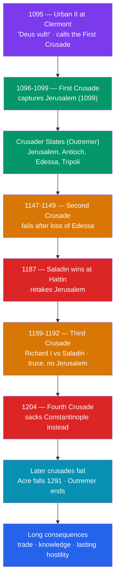

# ⚔️ The Crusades

> [!abstract] TL;DR
> The **Crusades** were a series of religiously sanctioned military campaigns, launched from Western Europe between **1095 and the late 13th century**, aimed chiefly at capturing and holding the **Holy Land**. **Pope Urban II's** call at **Clermont (1095)** unleashed the **First Crusade**, which stormed **Jerusalem in 1099** and founded the **Crusader states** (Outremer). The Muslim recovery came under **Saladin**, who retook **Jerusalem in 1187**, triggering the Third Crusade. The movement then curdled: the **Fourth Crusade (1204)** never reached the Holy Land and instead **sacked Christian Constantinople**, crippling [[The_Byzantine_Empire|Byzantium]]. The last mainland stronghold, Acre, fell in **1291**. The long consequences were profound and double-edged: expanded **Mediterranean trade**, the **transmission of knowledge** from the Islamic world (see [[_MOC_Islamic_Golden_Age]]), stronger papal and royal power — and a legacy of **intercommunal hostility** among Christians, Muslims, and Jews that echoes still.

## Intuition — analogy first

Picture medieval Europe around 1095 as a room full of **armed, restless young men with nowhere to point their swords**. The [[The_High_Middle_Ages|agricultural boom]] had produced a surplus of knights; the custom of primogeniture (the eldest son inherits everything) left younger sons landless and hungry for glory; and the Church was struggling to curb their constant private warfare.

Now a leader offers them a single, dazzling proposal: take those swords *east*, fight not your neighbors but a distant enemy, and in doing so **win both plunder and paradise** — a full remission of sins for any who die on the journey. Redirect the violence outward, and sanctify it.

That is the deep logic of the crusading call. It fused a **genuine religious yearning** (pilgrimage to Jerusalem, penance, salvation) with **material and political drivers** (land, trade, prestige, papal authority). Understanding a crusade means holding both motives at once — the pilgrim and the plunderer were often the *same person*. And once such a machine is built, it can be aimed at targets its founders never intended: heretics, pagans, political rivals — even, in 1204, another Christian empire.

---

## How It Works — The Arc of the Major Crusades

## Key Concepts

### The Call: Urban II at Clermont (1095)

The catalyst was a plea from Byzantine emperor **Alexios I Komnenos** for mercenaries against the Seljuk Turks, who had overrun Anatolia after **Manzikert (1071)**. At the **Council of Clermont** in November **1095**, **Pope Urban II** delivered a rousing (and much-embellished) sermon urging Western knights to aid Eastern Christians and free Jerusalem, reportedly to cries of ***"Deus vult!"*** ("God wills it!"). He offered crusaders an **indulgence** — remission of the temporal penalty for sin. The motives that answered were mixed: piety and pilgrimage, papal ambition, the surplus of landless knights, and hopes of wealth. A disorganized **"People's Crusade"** under Peter the Hermit set out first and was annihilated; it also perpetrated the **Rhineland massacres (1096)**, the murderous pogroms against Jewish communities that darkened the movement from its start.

### The First Crusade and the Capture of Jerusalem (1099)

The First Crusade (**1096–1099**) was, against long odds, the only unambiguous military success. The princes' armies captured **Nicaea** and **Antioch (1098)** after a brutal siege, then reached **Jerusalem**, storming it on **15 July 1099**. The victory was followed by a **notorious massacre** of the city's Muslim and Jewish inhabitants — a slaughter long remembered in the Islamic world. Contemporary Latin chroniclers described the streets running with blood.

### The Crusader States (Outremer)

The conquerors founded four **Crusader states**, collectively **Outremer** ("the land beyond the sea"): the **Kingdom of Jerusalem**, the **Principality of Antioch**, and the **Counties of Edessa and Tripoli**. Organized along Western [[Feudalism_and_Early_Medieval_Europe|feudal]] lines and defended by great castles (e.g., **Krak des Chevaliers**), they were held by a thin Latin elite. Their defense spawned the **military orders** — the **Knights Templar** and **Knights Hospitaller** — warrior-monks who became powerful, wealthy institutions across Europe.

### Saladin and the Fall of Jerusalem (1187)

The Muslim world, initially fragmented, unified under the Kurdish general **Salah ad-Din (Saladin)**, who welded Egypt and Syria into a single power. At the **Battle of Hattin (July 1187)** he destroyed the Crusader army, and shortly after **retook Jerusalem** — this time with comparative restraint, permitting ransomed inhabitants to leave, a contrast that burnished his reputation for chivalry even among Western chroniclers. The shock triggered the **Third Crusade (1189–1192)**, the "Kings' Crusade," featuring **Richard I "the Lionheart"** of England, **Philip II** of France, and **Frederick Barbarossa** (who drowned en route). Richard and Saladin fought to a stalemate and signed a truce: Jerusalem stayed Muslim, but Christian pilgrims were guaranteed access.

### The Fourth Crusade and the Sack of Constantinople (1204)

The **Fourth Crusade (1202–1204)** is the movement's great cautionary tale. Unable to pay the **Venetians** for transport, the crusaders were diverted — first to sack the Christian city of Zara, then, entangled in Byzantine dynastic politics, to attack **Constantinople** itself. In **1204** they **stormed and brutally sacked** the greatest Christian city in the world, looting its churches (much booty adorns Venice's San Marco to this day) and installing a short-lived **Latin Empire**. It permanently crippled [[The_Byzantine_Empire|Byzantium]] and made the [[The_Byzantine_Empire|East–West schism]] unbridgeable.

### The Major Crusades at a Glance

| Crusade | Dates | Trigger / leaders | Outcome |
|---|---|---|---|
| **First** | 1096–1099 | Urban II's call | **Success** — Jerusalem taken, Crusader states founded |
| **Second** | 1147–1149 | Fall of Edessa (1144) | **Failure** — fiasco at Damascus |
| **Third** | 1189–1192 | Saladin retakes Jerusalem (1187) | **Draw** — Richard I vs. Saladin; truce, pilgrim access |
| **Fourth** | 1202–1204 | Venetian debt & Byzantine politics | **Disaster** — sacked Christian Constantinople |
| Later (5th–9th) | 1217–1291 | Various (incl. Louis IX of France) | Largely **failed**; Acre falls 1291, ending Outremer |

### The Long Consequences

The crusading movement reshaped the medieval world well beyond the battlefield:
- **Trade** — Italian cities (Venice, Genoa, Pisa) grew rich shipping and provisioning crusaders, deepening Mediterranean commerce and Europe's taste for Eastern goods.
- **Transmission of knowledge** — heightened contact with the [[_MOC_Islamic_Golden_Age|Islamic world]] (alongside Sicily and Spain) sped the flow of Greek and Arabic learning — Aristotle, medicine, mathematics — that fueled the [[The_High_Middle_Ages|scholastic revival]].
- **Papal and royal power** — the papacy's prestige rose (then, after repeated failures, fell); monarchs taxed and organized for war, strengthening the state.
- **Lasting hostility** — the massacres, the sack of 1204, and the memory of holy war left deep, enduring scars among Christians, Muslims, and Jews, endlessly reinvoked in later centuries.

## Primary Sources & Examples

- **Fulcher of Chartres & the *Gesta Francorum* (c. 1100–1127)** — Latin eyewitness chronicles of the First Crusade, including its capture and massacre of Jerusalem.
- **Anna Komnene, *Alexiad* (12th c.)** — a Byzantine princess's wary, invaluable account of the crusaders arriving at Constantinople (see [[The_Byzantine_Empire]]).
- **Ibn al-Athir & Usama ibn Munqidh (12th–13th c.)** — Arabic chronicles and memoirs giving the crucial *Muslim* perspective on the Franks, Hattin, and Saladin — indispensable for avoiding a one-sided story (see [[Historical_Bias_and_Revisionism]]).
- **Geoffrey of Villehardouin, *On the Conquest of Constantinople* (c. 1207)** — a crusader-leader's firsthand narrative rationalizing the diversion and sack of 1204.

## Common Pitfalls / Misconceptions

- **Reading the Crusades through modern politics.** They were medieval events with medieval motives; projecting 20th- or 21st-century framings onto them (from either side) distorts them.
- **Assuming a single, purely religious motive.** Piety was real and central, but so were land hunger, papal and royal ambition, Italian commercial interest, and the surplus-knight problem. Hold multiple motives together.
- **Thinking the Crusades were a steady Christian advance.** They were mostly a story of **failure** — one clear success (1099), then centuries of setbacks culminating in the loss of Acre in 1291.
- **Ignoring the intra-Christian violence.** The Fourth Crusade's sack of Constantinople (1204) and later crusades against heretics (the Albigensian Crusade) and pagans show the "crusade" mechanism aimed at fellow Christians and non-Muslims.
- **Overstating the "clash of civilizations."** Crusaders and Muslims also traded, allied across religious lines, and lived alongside one another in Outremer; the reality was messier than perpetual holy war.

## Related Concepts

- [[_MOC_Medieval_World|↑ Section MOC]] — the section hub
- [[The_Byzantine_Empire]] — the empire whose appeal helped launch the Crusades and whose capital the Fourth Crusade destroyed in 1204
- [[The_High_Middle_Ages]] — the surplus of knights and expansionist confidence that made crusading possible, and the learning it helped transmit
- [[Feudalism_and_Early_Medieval_Europe]] — the feudal military class and inheritance customs that supplied crusaders and shaped Outremer
- Cross-vault: [[_MOC_Islamic_Golden_Age]] — the civilization the Crusaders fought, traded with, and learned from; essential for the Muslim side of the story

## Review Questions

1. What did Pope Urban II offer and appeal to at Clermont in 1095, and what mix of religious and material motives drove people to take the cross?
2. Trace the fate of Jerusalem across the Crusades: its capture in 1099, Saladin's recapture in 1187, and the outcome of the Third Crusade. How did the two conquests of the city differ in their treatment of inhabitants?
3. Why is the Fourth Crusade (1204) considered a turning point, and what were the major long-term consequences of the crusading movement for trade, knowledge, and intercommunal relations?

## Sources

- Riley-Smith, J. (2005). *The Crusades: A History* (2nd ed.). Yale University Press
- Asbridge, T. (2010). *The Crusades: The War for the Holy Land*. Simon & Schuster
- Maalouf, A. (1984). *The Crusades Through Arab Eyes* (trans. J. Rothschild). Al Saqi Books
- Phillips, J. (2004). *The Fourth Crusade and the Sack of Constantinople*. Viking

#history #medieval #crusades #jerusalem #saladin #outremer
