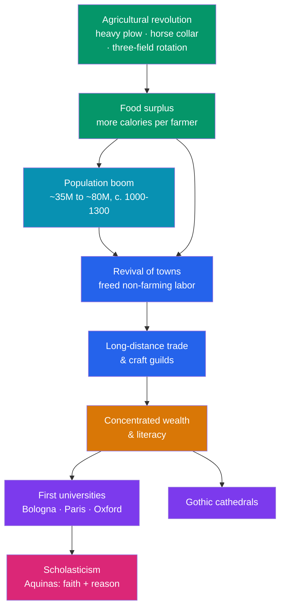

# ⛪ The High Middle Ages

> [!abstract] TL;DR
> The **High Middle Ages** (c. **1000–1300**) were Europe's medieval boom. A quiet **agricultural revolution** — the **heavy plow**, the **horse collar**, and the **three-field system** — produced food surpluses that roughly doubled the population. Surplus and people revived **towns, long-distance trade, and craft guilds** for the first time since Rome. New wealth and questions gave birth to the first **universities** (**Bologna, Paris, Oxford**), to **scholasticism** — the marriage of faith and Aristotelian reason perfected by **Thomas Aquinas** — and to the soaring **Gothic cathedrals**. Meanwhile the **Investiture Controversy** pitted popes against emperors over who could appoint bishops, a struggle that reshaped the balance between church and state. It was the confident, expansive age that also launched [[The_Crusades|the Crusades]] — and whose dense, connected towns would later make it terribly vulnerable to [[The_Black_Death|plague]].

## Intuition — analogy first

Think of early medieval Europe as an **economy running on a nearly empty tank**. Poor plows, scrawny draft animals harnessed inefficiently, and land left half-idle meant a peasant family could grow barely enough to survive, with almost nothing left over. When almost everyone must farm just to eat, there is no one free to be a full-time scholar, merchant, or architect.

Now imagine three cheap upgrades to that engine: a **plow that can turn heavy northern soils**, a **collar that lets a horse pull without choking** (doubling pulling power over the ox), and a **rotation that keeps a third more land in use each year**. Suddenly each farmer grows a **surplus**. Surplus is the magic ingredient: it feeds people who *don't* farm. Those freed hands become the townsfolk, merchants, guild masters, university students, and cathedral masons of the boom.

So the whole glittering culture of the High Middle Ages — Aquinas debating Aristotle, Notre-Dame rising over Paris, bankers financing kings — sits on top of a **better-fed peasantry**. Culture is what a society can afford once its stomach is full.

---

## How It Works — From Surplus to Cathedrals

## Key Concepts

### The Engine: The Medieval Agricultural Revolution

A cluster of technologies transformed northern European farming between roughly 800 and 1200:

| Innovation | What it did | Effect |
|---|---|---|
| **Heavy (mouldboard) plow** | Cut, lifted, and turned the dense, wet clay soils of northern Europe that the light Mediterranean scratch-plow could not work | Opened vast new farmland north of the Alps |
| **Horse collar** (padded, on the shoulders) | Let horses pull without choking, unlike the old throat-strap | Horses (faster than oxen) became viable plow and cart animals |
| **Three-field system** | Rotated land through winter grain, spring legumes, and fallow instead of the old two-field split | Kept ~2/3 of land productive (vs. 1/2) and fixed nitrogen via legumes |
| **Watermills & windmills** | Mechanized grinding and other work | Freed labor and raised output |

The result was **more food, more surplus, and a population that roughly doubled** — from perhaps 35 million to around 80 million between 1000 and 1300.

### The Urban Revival: Towns, Trade, and Guilds

With surplus food and growing population, **towns revived** after centuries of decline. Trade routes reconnected: the **Italian maritime republics** (Venice, Genoa) dominated Mediterranean commerce, while the **Champagne fairs** in France and later the **Hanseatic League** of northern ports linked the continent. Townsfolk (the *burghers*/bourgeoisie) often won **charters of self-government**, and "town air makes free" (*Stadtluft macht frei*) — a serf who lived a year and a day in a town could gain freedom. Crafts organized into **guilds** that set standards, prices, and training (apprentice → journeyman → master), functioning as both cartel and welfare society.

### The First Universities

Rising demand for trained clergy, lawyers, and administrators produced a new institution: the **university** (*universitas*, a corporation of scholars). The earliest and most influential:

- **Bologna** (traditionally 1088) — the model for law, organized as a guild *of students*.
- **Paris** (c. 1150) — the model for theology and the arts, organized as a guild *of masters*; home to Aquinas.
- **Oxford** (c. 1096, consolidated 1167) — England's first, spawning Cambridge (1209).

Teaching followed the **seven liberal arts** (the *trivium* and *quadrivium*) leading to higher faculties of theology, law, and medicine, using the **scholastic method** of lecture (*lectio*) and formal debate (*disputatio*).

### Scholasticism and Thomas Aquinas

**Scholasticism** was the dominant intellectual project of the age: to reconcile **Christian faith with human reason**, especially the rediscovered works of **Aristotle**, which reached the west largely through Arabic translations and commentaries (see [[The_Crusades]] and the [[_MOC_Islamic_Golden_Age|Islamic world]]). Its method dissected questions through rigorous, dialectical argument (Peter Abelard's *Sic et Non* — "Yes and No" — set opposing authorities against each other).

Its towering figure was **Thomas Aquinas** (c. 1225–1274), a Dominican whose ***Summa Theologica*** synthesized Aristotelian philosophy with Catholic doctrine — arguing that reason and revelation, properly used, cannot contradict because both come from God. His **Five Ways** (*quinque viae*) offered rational arguments for God's existence. **Thomism** became the intellectual backbone of Catholic theology.

### Gothic Cathedrals

New wealth and confidence built the era's most breathtaking monuments. The **Gothic style** (emerging at the **Abbey of Saint-Denis** near Paris, c. 1140, under **Abbot Suger**) used three interlocking engineering innovations — the **pointed arch**, the **ribbed vault**, and the **flying buttress** — to channel the roof's weight outward and downward, freeing the walls to soar and to open into vast **stained-glass windows** that filled the interior with colored light. **Chartres, Notre-Dame de Paris, Reims,** and **Cologne** are exemplars: cathedrals were community projects taking generations, showcases of civic pride, faith, and craft.

### The Investiture Controversy

The great church–state struggle of the age was over **lay investiture**: could secular rulers (kings, emperors) appoint bishops and abbots and invest them with the symbols of office? Reforming popes said no — only the Church could. The conflict peaked between **Pope Gregory VII** and **Holy Roman Emperor Henry IV**: Gregory excommunicated Henry, who in 1077 stood barefoot in the snow at **Canossa** begging absolution — then later drove Gregory from Rome. The **Concordat of Worms (1122)** compromised: the Church invested bishops with spiritual authority, the emperor with temporal. The episode marked a decisive assertion of **papal power and the separation of spiritual and secular authority**.

## Primary Sources & Examples

- **Thomas Aquinas, *Summa Theologica* (1265–1274)** — the master text of scholastic synthesis; a primary source for how medieval scholars reasoned through *quaestiones*.
- **Abbot Suger, *De Administratione* (12th c.)** — Suger's own account of rebuilding Saint-Denis, explicitly linking light and architecture to the divine; the founding document of Gothic aesthetics.
- **Guild statutes and the *Livre des métiers* of Étienne Boileau (Paris, c. 1268)** — regulations of Parisian trades, a window into guild economy and daily urban labor.
- **The cathedrals themselves** — Chartres, Notre-Dame, Reims, and Salisbury stand as physical primary sources for medieval engineering, finance, and devotion.

## Common Pitfalls / Misconceptions

- **Believing medieval people thought the earth was flat.** Educated medieval scholars knew the earth was a sphere (following Aristotle and Ptolemy); the "flat-earth myth" is a 19th-century invention projected backward onto the Middle Ages.
- **Seeing scholasticism as anti-scientific dogma.** It was a rigorous, rationalist enterprise that built the university and the disputational method, laying institutional groundwork for later science, even where its conclusions differed.
- **Assuming universities taught a fixed, censored curriculum.** Medieval universities featured vigorous debate, the eager (if contested) reception of pagan Aristotle, and real intellectual autonomy as self-governing corporations.
- **Thinking Gothic height was just decoration.** The pointed arch, ribbed vault, and flying buttress were structural solutions; the soaring, glass-filled interiors were engineering achievements, not mere ornament.
- **Treating the boom as permanent.** By c. 1300 population had outrun food supply (the Great Famine of 1315–1317), leaving Europe fragile on the eve of [[The_Black_Death|the Black Death]].

## Related Concepts

- [[_MOC_Medieval_World|↑ Section MOC]] — the section hub
- [[Feudalism_and_Early_Medieval_Europe]] — the manorial base whose surpluses funded this boom; read it first
- [[The_Crusades]] — the same expansionist energy and the channel through which Aristotle and Arabic learning re-entered Europe
- [[The_Black_Death]] — the dense towns and strained food supply built here made 14th-century Europe catastrophically vulnerable
- Cross-vault: [[_MOC_Islamic_Golden_Age]] — the source, via Arabic translation and commentary (Averroes, Avicenna), of the Aristotelian texts that fueled scholasticism

## Review Questions

1. Explain how three agricultural innovations (heavy plow, horse collar, three-field system) triggered a chain reaction leading to towns, universities, and cathedrals. Why is surplus the key concept?
2. What was scholasticism, and how did Thomas Aquinas attempt to reconcile faith and reason? Where did the Aristotelian texts he relied on come from?
3. What was at stake in the Investiture Controversy, and how did the Concordat of Worms (1122) resolve it? Why does the episode matter for church–state relations?

## Sources

- Bartlett, R. (1993). *The Making of Europe: Conquest, Colonization and Cultural Change, 950–1350*. Princeton University Press
- Haskins, C.H. (1927). *The Renaissance of the Twelfth Century*. Harvard University Press
- Southern, R.W. (1953). *The Making of the Middle Ages*. Yale University Press
- Le Goff, J. (1993). *Intellectuals in the Middle Ages* (trans. T.L. Fagan). Blackwell

#history #medieval #universities #scholasticism #gothic #agriculture
