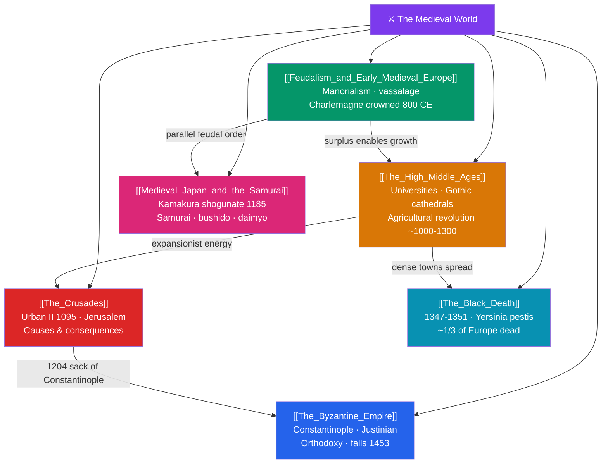

# 🗺️ The Medieval World — Map of Content

> [!abstract] What This Section Covers
> The medieval millennium between Rome's fall and the Renaissance was far from a static "Dark Age." In the East, **the Byzantine Empire** carried Roman statecraft forward from Constantinople — Justinian codified Roman law and built the Hagia Sophia — until the city finally fell to the Ottomans in 1453. In the West, **feudalism and early medieval Europe** organized society around lords, vassals, and manors, and Charlemagne's coronation in 800 CE revived the idea of empire. The **High Middle Ages** (c. 1000–1300) brought an agricultural revolution, the first universities, and soaring Gothic cathedrals. The **Crusades**, launched by Urban II in 1095, sent European armies toward Jerusalem with far-reaching consequences for trade and religion. The **Black Death** of 1347–1351 killed perhaps a third of Europe and shattered the social order. And in **medieval Japan**, a strikingly parallel feudal system produced the shogunate, the samurai, and the code of bushido. Together these notes reveal a dynamic, interconnected age.

## Concept Map

## Learning Path

1. [[Feudalism_and_Early_Medieval_Europe]] — The manorial economy, lord–vassal bonds, Charlemagne, and why the "Dark Ages" label misleads.
2. [[The_Byzantine_Empire]] — The surviving Eastern Roman state, Justinian's achievements, Orthodox Christianity, and the long road to 1453.
3. [[The_High_Middle_Ages]] — Population growth, new farming technology, universities, and the great cathedral-building era.
4. [[The_Crusades]] — The origins, course, and long-term effects of the holy wars between Christendom and Islam.
5. [[The_Black_Death]] — The plague pandemic and the demographic, economic, and social upheaval it unleashed.
6. [[Medieval_Japan_and_the_Samurai]] — Japan's parallel feudal order, the rise of the shogunate, and the warrior ethos of the samurai.

## All Notes at a Glance

| Note | Difficulty | What You'll Learn |
|------|------------|-------------------|
| [[The_Byzantine_Empire]] | Intermediate | Constantinople, Justinian and the Corpus Juris Civilis, Hagia Sophia, the Great Schism, 1453 |
| [[Feudalism_and_Early_Medieval_Europe]] | Beginner → Intermediate | Manorialism, vassalage, Charlemagne and the Carolingians, the "Dark Ages" debate |
| [[The_High_Middle_Ages]] | Intermediate | Heavy plow and three-field system, medieval universities, Gothic architecture, urban revival |
| [[The_Crusades]] | Intermediate | Urban II's call, the capture and loss of Jerusalem, military orders, trade and cultural exchange |
| [[The_Black_Death]] | Intermediate | Plague transmission, mortality, labor shortages, peasant revolts, and the end of serfdom's grip |
| [[Medieval_Japan_and_the_Samurai]] | Intermediate | Kamakura and Ashikaga shogunates, samurai and bushido, daimyo, and Japanese feudal society |

## Key Questions This Section Answers

- Why is the "Dark Ages" a misleading label for early medieval Europe?
- How did the Byzantine Empire preserve Roman law and Greek learning for another thousand years?
- What technological and institutional changes drove the boom of the High Middle Ages?
- What motivated the Crusades, and what were their lasting consequences for East and West?
- How did the Black Death reshape Europe's economy and society, and why did feudal Japan develop a system so similar to Europe's?

## Related Sections

- [[_MOC_History_Master|↑ History Master MOC]]
- [[_MOC_Africa_Pre_Columbian|← Africa & Pre-Columbian Americas]]
- [[_MOC_Islamic_Golden_Age|→ The Islamic Golden Age]]

#MOC #History #Medieval
