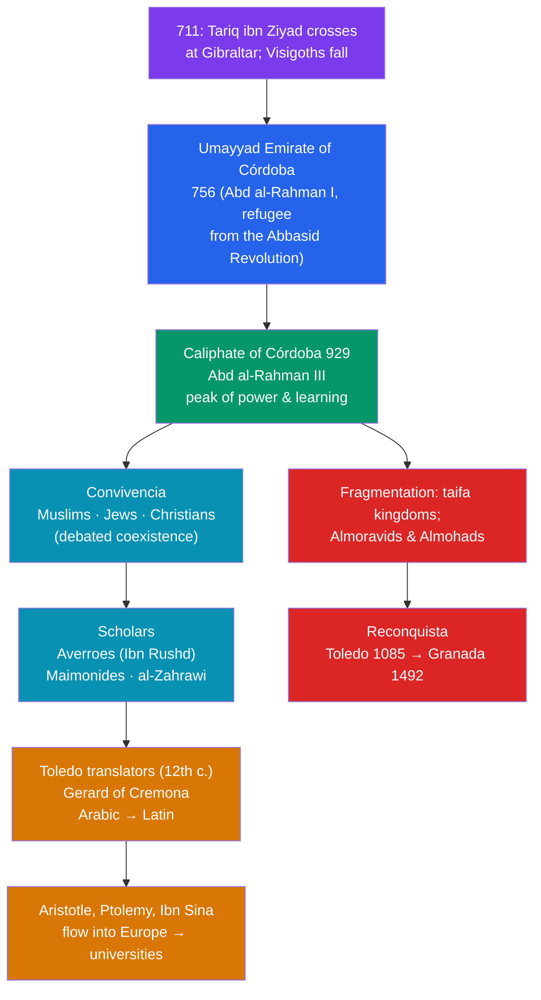

# 🕌 Al-Andalus

> [!abstract] TL;DR
> **Al-Andalus** — Muslim-ruled **Iberia**, from the conquest of **711** to the fall of Granada in **1492** — was the western jewel of the Islamic world. Its high point was the **Caliphate of Córdoba** (proclaimed 929), when Córdoba rivaled Baghdad as a center of learning, boasting one of the largest libraries in the world and the magnificent **Great Mosque**. Al-Andalus is famous — and fiercely debated — for its ***convivencia***, the coexistence of Muslims, Jews, and Christians, which produced luminaries like the philosopher **Averroes (Ibn Rushd)** and the Jewish sage **Maimonides**. Above all, Iberia was the great **conduit**: through the **Toledo translators**, the accumulated science and philosophy of the Islamic world flowed into Latin Europe. The slow Christian **Reconquista** ended Muslim rule in **1492** — the same year of Columbus's voyage and the expulsion of Spain's Jews.

## Intuition — analogy first

Think of medieval Europe and the Islamic world as two rooms separated by a wall, one brightly lit with the accumulated learning of Greece, Persia, and India, the other sitting mostly in the dark after the collapse of Roman literacy in the West. **Al-Andalus was the doorway in that wall** — and Córdoba was the lamp burning just inside it.

For a few remarkable generations, that doorway wasn't just a passage; it was a *meeting place*. In the same cities, a Muslim jurist, a Jewish physician, and a Christian scribe might read the same Arabic manuscript of Aristotle. That mingling — imperfect, unequal, sometimes violent, but real — is what people mean by *convivencia*. It is why a Jewish philosopher like Maimonides wrote his masterwork in Arabic, and why a Córdoban judge like Averroes could become, in Latin translation, simply "The Commentator" to Christian universities.

And when Christian armies pushed south and took cities like **Toledo**, they inherited its libraries. Instead of burning the books, scholars translated them. The doorway swung the other way: the light that Al-Andalus had gathered now poured *into* the dark room, helping wake medieval Europe. To understand Al-Andalus is to understand a border that was, for a time, a bridge.

---

## How It Works — Layers of Al-Andalus and the Path to Europe

## Key Concepts

### Conquest, Emirate, and the Caliphate of Córdoba

In **711**, an army led by the Berber commander **Tariq ibn Ziyad** crossed from North Africa at the rock that bears his name — **Jabal Tariq (Gibraltar)** — and destroyed the **Visigothic kingdom** at the Battle of Guadalete. Within a few years Muslims controlled most of Iberia. When the **Abbasid Revolution** (750) massacred the Umayyads in the east, the survivor **Abd al-Rahman I** fled west and founded an independent **Umayyad Emirate of Córdoba (756)**.

The zenith came in **929**, when **Abd al-Rahman III** declared himself **caliph**, asserting Córdoba's equality with Baghdad. Tenth-century **Córdoba** was among the largest and most cultured cities in the world: paved and lit streets, running water, and the library of **al-Hakam II**, said to hold hundreds of thousands of volumes. The **Great Mosque of Córdoba** (the *Mezquita*), with its forest of red-and-white double arches, remains its enduring monument.

### Convivencia — and the Debate About It

***Convivencia*** ("living together") names the coexistence, under Muslim rule, of the three "**Peoples of the Book**": Muslims, Jews, and Christians. Non-Muslims held protected **_dhimmi_** status, paying the **_jizya_** tax in exchange for security and religious autonomy. For Iberian Jewry this was a genuine **golden age** of Hebrew poetry, philosophy, and scholarship.

Historians disagree sharply about how rosy the picture was:

| View | Emphasis | Associated scholars |
|---|---|---|
| **Romantic / positive** | A model of tolerance and cultural fusion; "the ornament of the world" | Américo Castro; María Rosa Menocal |
| **Revisionist / critical** | Coexistence was hierarchical and precarious, punctuated by persecution and violence | Darío Fernández-Morera and others |

Both sides can point to evidence. There were long stretches of productive coexistence — *and* real subordination and episodes of brutality (the **1066 Granada massacre** of Jews; forced conversions and expulsions under the rigorist **Almohads** in the 12th century, which drove Maimonides into exile). The honest verdict is that *convivencia* was **real but unequal and fragile**, not a modern liberal utopia (a caution against both idealization and dismissal — see [[Historical_Bias_and_Revisionism]]).

### The Scholars: Averroes and Maimonides

Al-Andalus produced towering intellects:

- **Averroes / Ibn Rushd** (1126–1198), a Córdoban judge and polymath, wrote extensive **commentaries on Aristotle** that so shaped Latin thought he was known simply as **"The Commentator."** His rationalism sparked the movement of **Latin Averroism** and deeply influenced Thomas Aquinas and the medieval universities.
- **Maimonides / Moses ben Maimon** (1138–1204), born in Córdoba, was the preeminent Jewish philosopher and legal scholar of the age. Fleeing Almohad persecution, he wrote his philosophical masterwork, ***The Guide for the Perplexed***, in **Arabic**, reconciling Aristotelian philosophy with Jewish theology.
- Others include the surgeon **al-Zahrawi (Abulcasis)**, whose medical encyclopedia influenced European surgery, and the mystic **Ibn Arabi**.

### The Toledo Translators and Transmission to Europe

When Christian forces retook **Toledo in 1085**, they gained a city rich in Arabic manuscripts and a population of Arabic-, Latin-, and Hebrew-reading scholars. The resulting **Toledo School of Translators** (flourishing in the 12th century) rendered a flood of works into **Latin**. The most prolific, **Gerard of Cremona**, translated Ptolemy's *Almagest*, works of al-Khwarizmi and al-Razi, and Ibn Sina's *Canon*. This transmission — Greek and Indian science carried in Arabic, now turned to Latin — was a principal cause of the **12th-century renaissance** and the rise of the medieval universities.

### The Reconquista to 1492

The **Reconquista** was the centuries-long, uneven Christian conquest of Iberia. After Córdoba's caliphate collapsed into squabbling **taifa** kingdoms (1031), North African dynasties (**Almoravids**, then **Almohads**) intervened but could not halt the Christian advance. Toledo fell in 1085; the decisive Christian victory at **Las Navas de Tolosa (1212)** broke Almohad power. The last Muslim state, the **Nasrid Emirate of Granada** — builder of the exquisite **Alhambra** — surrendered to **Ferdinand and Isabella** in **1492**. That same year saw Columbus's first voyage and the **Alhambra Decree** expelling Spain's Jews, closing the era of Iberian *convivencia*.

## Primary Sources & Examples

- **The Great Mosque of Córdoba (the *Mezquita*)** — a standing primary source in stone for the wealth and artistry of Umayyad Al-Andalus.
- **Maimonides, *The Guide for the Perplexed* (c. 1190)** — written in Judeo-Arabic, it is itself evidence of the shared philosophical culture of Al-Andalus.
- **Gerard of Cremona's Latin translations** — the concrete textual pipeline through which Arabic science entered Europe; the surviving manuscripts document exactly what crossed over.
- **The Alhambra of Granada** — the crowning artistic monument of the last Muslim kingdom in Iberia, with its Arabic inscriptions and geometric ornament.

## Common Pitfalls / Misconceptions

- **Idealizing *convivencia* as modern tolerance.** Coexistence was hierarchical (*dhimmi* subordination), conditional, and repeatedly broken by violence; calling it a "paradise" is as distorting as denying it happened.
- **Denying that any coexistence occurred.** The opposite error is equally wrong: the intellectual collaboration across faiths (Maimonides writing in Arabic, mixed translation teams) is well documented.
- **Assuming the Reconquista was one continuous holy war.** It was a fragmented, centuries-long process with frequent Christian–Muslim alliances of convenience, not a single unbroken crusade.
- **Crediting Europe's recovery to Italy alone.** The Iberian (and Sicilian) translation of Arabic learning was a decisive earlier stimulus to the medieval revival that preceded the Italian Renaissance.

## Related Concepts

- [[_MOC_Islamic_Golden_Age|↑ Section MOC]] — the section hub
- [[Islamic_Science_and_Mathematics]] — the algebra, medicine, and astronomy that Al-Andalus transmitted westward
- [[The_House_of_Wisdom]] — the eastern translation movement whose fruits Al-Andalus relayed to Latin Europe
- [[Rise_of_Islam_and_the_Caliphates]] — the Umayyad line whose survivor founded Córdoba after fleeing the Abbasids
- [[The_Mongol_Empire]] — the eastern bookend of the golden age, as Al-Andalus is the western frontier
- Cross-vault: [[_MOC_Psychology_Master]] — the *convivencia* debate is a case study in intergroup contact, tolerance, and prejudice under unequal power

## Review Questions

1. Explain the concept of *convivencia* and summarize the scholarly debate over how tolerant Al-Andalus actually was, citing evidence on both sides.
2. Describe the role of the Toledo translators (e.g., Gerard of Cremona) in transmitting knowledge to Europe. Why was the fall of Toledo in 1085 so consequential?
3. Why is 1492 such a pivotal year in the history of Al-Andalus and of Spain more broadly?

## Sources

- Menocal, M.R. (2002). *The Ornament of the World: How Muslims, Jews, and Christians Created a Culture of Tolerance in Medieval Spain*. Little, Brown
- Fletcher, R. (1992). *Moorish Spain*. University of California Press
- Kennedy, H. (1996). *Muslim Spain and Portugal: A Political History of al-Andalus*. Longman
- Lowney, C. (2005). *A Vanished World: Medieval Spain's Golden Age of Enlightenment*. Free Press

#history #islamic-golden-age #al-andalus #convivencia #reconquista #cordoba
