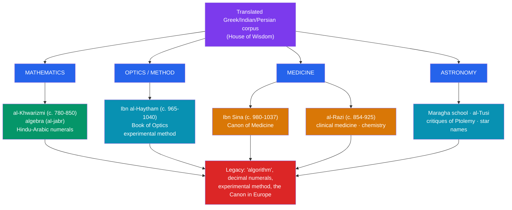

# 🔬 Islamic Science and Mathematics

> [!abstract] TL;DR
> Fueled by the translated corpus of [[The_House_of_Wisdom]], scholars across the Islamic world (c. 800–1300) did not merely preserve ancient science — they transformed it. **Al-Khwarizmi** systematized **algebra** (from *al-jabr*) and popularized the **Hindu-Arabic numerals**; the Latinized form of his name gave us the word **"algorithm."** **Ibn al-Haytham (Alhazen)** revolutionized **optics** and championed a rigorous, experiment-based method centuries before Galileo. **Ibn Sina (Avicenna)** wrote *The Canon of Medicine*, a medical encyclopedia standard in Europe for six centuries, while **al-Razi (Rhazes)** advanced clinical medicine and chemistry. Astronomers built observatories, refined Ptolemy's models, and left their mark on the very names of the stars. This was original, cumulative science — much of it the foundation on which later European science was built.

## Intuition — analogy first

Think of the inherited Greek science as a set of **brilliant but unfinished blueprints**. Euclid had given the world geometry; Ptolemy a model of the heavens; Galen a theory of the body. Impressive — but full of gaps, untested assumptions, and problems no one had pushed further in centuries.

Islamic scholars took these blueprints into a well-funded workshop and started *building and stress-testing*. Where the Greeks had geometry and clumsy word-problems, **al-Khwarizmi** built a general **method** for solving whole classes of equations — a reusable procedure, which is exactly what we now mean by an *algorithm*. Where earlier thinkers argued about how vision works from the armchair, **Ibn al-Haytham** went into a dark room with a pinhole and a lamp and *tested* it, insisting that claims be checked against observation. Where medicine was a scatter of remedies, **Ibn Sina** organized it into a single coherent system you could actually teach.

The mindset shift is the key: from *reading and revering* the ancients to *interrogating, correcting, and extending* them. That is the difference between a library and a laboratory — and it is why so much of this work fed directly into modern science.

---

## How It Works — Fields, Figures, and Legacy

## Key Concepts

### Al-Khwarizmi: Algebra, Algorithms, and the Numerals

**Muhammad ibn Musa al-Khwarizmi** (c. 780–850) worked in Abbasid Baghdad. His book **_al-Kitab al-mukhtasar fi hisab al-jabr wa'l-muqabala_** ("The Compendious Book on Calculation by Completion and Balancing," c. 820) gave systematic methods for solving linear and quadratic equations. The word **algebra** comes directly from *al-jabr* ("restoring/completing"). Notably, his algebra was largely *rhetorical* (written in words, not symbols) yet fully general in method.

He also wrote a treatise on calculating with the **Indian (Hindu-Arabic) numerals**, including the crucial concept of **zero** as a place-holder in a decimal positional system. When this work reached Europe in Latin, its opening — *Dixit Algoritmi* ("al-Khwarizmi said") — turned his Latinized name **Algoritmi** into the word **algorithm**, and the numerals themselves became known in Europe as "Arabic numerals."

### Ibn al-Haytham (Alhazen): Optics and the Experimental Method

**Ibn al-Haytham** (c. 965–1040), known in Latin as **Alhazen**, wrote the seven-volume **_Kitab al-Manazir_ (Book of Optics)**, one of the most important scientific works of the Middle Ages. He decisively supported the **intromission theory** — that we see because light travels *from* objects *into* the eye — refuting the older Greek idea that the eye emits rays. He analyzed reflection, refraction, and the **camera obscura**.

His deeper legacy is **method**. Ibn al-Haytham insisted that hypotheses be tested against **controlled observation and experiment**, and that the investigator distrust his own preconceptions. Many historians of science regard him as one of the earliest practitioners of a recognizably **experimental method**, centuries before Bacon and Galileo.

### Ibn Sina (Avicenna) and al-Razi (Rhazes): Medicine

| Scholar | Dates | Landmark work | Contribution |
|---|---|---|---|
| **al-Razi (Rhazes)** | c. 854–925 | *al-Hawi* (Comprehensive Book); treatise on smallpox and measles | Clinical observation; first clear **clinical distinction of smallpox from measles**; contributions to chemistry and pharmacy |
| **Ibn Sina (Avicenna)** | c. 980–1037 | *al-Qanun fi al-Tibb* (**The Canon of Medicine**) | A systematic encyclopedia synthesizing Greek and Islamic medicine; a **standard European medical textbook into the 17th century**; also a major philosopher (*The Book of Healing*) |

**Ibn Sina's *Canon*** organized the entire medical knowledge of the age into a coherent, teachable system, covering physiology, pathology, pharmacology, and hygiene. Translated into Latin, it was a required text at Padua and other medical schools for centuries. **Al-Razi**, a generation earlier, exemplified the empirical clinician — recording symptoms, questioning authorities (including Galen), and grounding treatment in observed cases.

### Astronomy and Beyond

Astronomers compiled precise observational tables (**_zij_**), built **observatories** (later crowned by the great **Maragha observatory**, 1259), and refined instruments like the **astrolabe**. At **Maragha**, **Nasir al-Din al-Tusi** and colleagues developed mathematical devices (the "Tusi couple") that corrected inconsistencies in **Ptolemy's** planetary models — work that some scholars argue influenced Copernicus. The Arabic legacy is literally written across the night sky: star names such as **Aldebaran, Betelgeuse, Rigel, Altair, and Vega** are Arabic in origin. Related figures include **al-Biruni** (geodesy; a strikingly accurate estimate of Earth's radius; studies of India), **Omar Khayyam** (geometric solution of cubic equations; calendar reform), and **al-Kindi** (who pioneered **frequency analysis** for breaking ciphers).

## Primary Sources & Examples

- **al-Khwarizmi, *al-Jabr* (c. 820)** — the founding text of algebra as a discipline; its methods for quadratics were transmitted to Europe and taught for centuries.
- **Ibn al-Haytham, *Book of Optics* (early 11th c.)** — extant in Arabic and in the Latin *De aspectibus*; directly shaped Roger Bacon, Witelo, and Kepler.
- **Ibn Sina, *The Canon of Medicine*** — surviving in countless Arabic manuscripts and Latin printings; a concrete artifact of six centuries of medical education.
- **The Maragha observatory tables and al-Tusi's astronomy** — evidence of a genuine, model-revising research program in Islamic astronomy, not mere preservation of Ptolemy.

## Common Pitfalls / Misconceptions

- **"They only preserved Greek science."** These scholars corrected Ptolemy, overturned Greek optics, founded algebra as a field, and pioneered experimental method — this was original, cumulative research.
- **Crediting "Arabic numerals" to the Arabs alone.** The decimal positional system originated in **India**; the Islamic world adopted, systematized, and transmitted it (which is why they are also called Hindu-Arabic numerals).
- **Anachronistic labels.** Calling Ibn al-Haytham "the first scientist" flattens history; better to say he practiced key elements of an experimental method early and influentially, within his own intellectual context.
- **Treating the golden age as monolithic or purely "Arab."** Contributors were Persian, Central Asian, Arab, and of many faiths; "Islamic science" names a shared civilization and scholarly language, not one ethnicity.

## Related Concepts

- [[_MOC_Islamic_Golden_Age|↑ Section MOC]] — the section hub
- [[The_House_of_Wisdom]] — the translated corpus that gave these scholars their starting materials
- [[Rise_of_Islam_and_the_Caliphates]] — the Abbasid political order that patronized this science
- [[Al_Andalus]] — the western route by which algebra, numerals, and the *Canon* reached Latin Europe
- Cross-vault: [[_MOC_Mathematics_Master]] — algebra, the decimal numeral system, and algorithms trace directly to al-Khwarizmi's Baghdad work
- Cross-vault: [[_MOC_Physics_Master]] — Ibn al-Haytham's optics and experimental method are foundational to the physics of light
- Cross-vault: [[_MOC_Cybersecurity_Master]] — al-Kindi's frequency analysis is the origin of systematic cryptanalysis

## Review Questions

1. Explain how the single figure of al-Khwarizmi is connected to *three* things we still use: the word "algebra," the word "algorithm," and the numerals on a keypad.
2. What did Ibn al-Haytham change about the theory of vision, and why is his emphasis on controlled experiment historically significant?
3. Why was Ibn Sina's *Canon of Medicine* so influential in Europe, and how did al-Razi's approach to medicine exemplify empirical, clinical thinking?

## Sources

- al-Khalili, J. (2010). *Pathfinders: The Golden Age of Arabic Science*. Allen Lane
- Saliba, G. (2007). *Islamic Science and the Making of the European Renaissance*. MIT Press
- Rashed, R. (ed.) (1996). *Encyclopedia of the History of Arabic Science*. Routledge
- Masood, E. (2009). *Science and Islam: A History*. Icon Books

#history #islamic-golden-age #science #mathematics #medicine #optics
