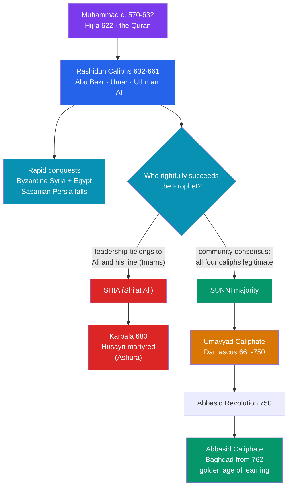

# ☪️ Rise of Islam and the Caliphates

> [!abstract] TL;DR
> In the space of a single lifetime, a merchant from **Mecca** named **Muhammad (c. 570–632)** proclaimed a strict monotheism, unified the fractious tribes of Arabia, and left behind a scripture — the **Quran** — and a community (*umma*) that would within a century rule from the Atlantic to the Indus. His migration to Medina, the **Hijra of 622**, became year 1 of the Islamic calendar. After his death, leadership passed to the **Rashidun ("rightly guided") caliphs**, under whom Arab armies shattered the exhausted Byzantine and Sasanian empires. A bitter dispute over *who* should succeed the Prophet split the community into **Sunni** and **Shia** — a fault line hardened by the killing of Ali (661) and the martyrdom of Husayn at **Karbala (680)**. Power then passed to the **Umayyad Caliphate** in Damascus (661–750) and, after a revolution, to the **Abbasid Caliphate** in Baghdad (from 750), whose cosmopolitan court would host the golden age of Islamic learning.

## Intuition — analogy first

Imagine a **spark dropped between two exhausted wrestlers**. For a generation before Muhammad, the two superpowers of the age — the **Byzantine (East Roman)** and **Sasanian (Persian)** empires — had bled each other white in decades of war, draining their treasuries, alienating their taxpayers, and leaving their desert frontiers thinly held. Neither could imagine a threat from the poor, disunited tribes of Arabia in between.

Then came the spark. A new faith gave those tribes something they had never had: a single shared identity, a common law, and a reason to fight *together* rather than raid one another. When that unified force pushed outward, it did not so much conquer strong empires as walk through open doors held by tired guards. Whole provinces — Syria, Egypt, Persia — changed hands in years, not centuries.

But a movement built around one charismatic founder faces its hardest test the day he dies. *Who speaks for him now?* The community answered that question four times in a row through its early caliphs — and then answered it so violently that the wound never fully healed. Understanding early Islam means understanding both the astonishing speed of the expansion *and* the succession crisis that runs through it like a crack in a bell.

---

## How It Works — From Revelation to Rival Caliphates

## Key Concepts

### Muhammad, the Hijra, and the Quran

Muhammad ibn Abdullah was born in **Mecca** around **570 CE** into the Quraysh tribe, guardians of the **Kaaba** shrine. According to Islamic tradition, around **610** he began receiving revelations through the angel **Jibril (Gabriel)** while meditating on Mount Hira. His preaching of a single God (*Allah*), of social justice, and of a coming judgment threatened Mecca's polytheistic pilgrimage economy and provoked persecution.

In **622**, Muhammad and his followers migrated to the oasis town of **Yathrib**, thereafter called **Medina** ("the City [of the Prophet]"). This migration — the **Hijra** — is so pivotal that the Islamic **Hijri calendar** counts its years from it (formally instituted under Caliph Umar). At Medina, Muhammad became not just a prophet but a statesman and lawgiver, forging the *umma* (the community of believers). By his death in **632** he had unified most of the Arabian Peninsula.

The **Quran** ("the Recitation") is, for Muslims, the literal word of God revealed to Muhammad in Arabic. Transmitted orally and in fragments during his life, it was collected into a standardized written codex under the third caliph, **Uthman** (r. 644–656). Alongside the Quran, the **Hadith** (reports of the Prophet's sayings and deeds) and his *Sunna* (example) became the second great source of Islamic law and practice.

### The Rashidun ("Rightly Guided") Caliphs and the Conquests

A **caliph** (*khalifa*, "successor" or "deputy") led the community after Muhammad. Sunni tradition venerates the first four as the **Rashidun**:

| Caliph | Reign | Notable for |
|---|---|---|
| **Abu Bakr** | 632–634 | Held the community together in the *Ridda* (apostasy) wars; began expansion |
| **Umar ibn al-Khattab** | 634–644 | Vast conquests: Byzantine Syria and Egypt, Sasanian Iraq and Persia; set up administration |
| **Uthman ibn Affan** | 644–656 | Standardized the Quran; assassinated, triggering civil war |
| **Ali ibn Abi Talib** | 656–661 | Muhammad's cousin and son-in-law; reign consumed by the First Fitna; assassinated 661 |

The conquests were breathtakingly fast. At **Yarmouk (636)** the Arabs broke Byzantine power in Syria; at **al-Qadisiyyah (c. 636)** they defeated the Sasanian army in Iraq. **Jerusalem** fell around 637, **Egypt** by 642, and the last Sasanian emperor, Yazdegerd III, was dead by **651** — ending a Persian imperial line over a thousand years old. Conversion was gradual; conquered "**People of the Book**" (Christians, Jews, later Zoroastrians) largely retained their faith as protected *dhimmi* subjects who paid a poll tax (*jizya*).

### The Origins of the Sunni–Shia Division

The great schism of Islam is, at root, a dispute over **legitimate succession and authority**. Two positions crystallized:

- **Sunni** ("people of the *Sunna* and the community"): leadership rightly passed by the **consensus** (*ijma*) of the community; all four Rashidun caliphs were legitimate. Sunnis today are the large majority of Muslims.
- **Shia** (from *Shi'at Ali*, "the party of Ali"): leadership should have stayed within the Prophet's family, beginning with **Ali** as the first divinely sanctioned **Imam**, and passing through his descendants.

The rupture turned bloody in the **First Fitna** (656–661), the civil war after Uthman's murder, pitting Ali against rivals including **Mu'awiya**, the Umayyad governor of Syria. After Ali was assassinated in **661**, Mu'awiya took the caliphate. The defining trauma came in **680** at **Karbala** (in Iraq), where **Husayn ibn Ali** — Muhammad's grandson — and a small band were surrounded and killed by the army of the Umayyad caliph **Yazid I**. Husayn's martyrdom, mourned annually on **Ashura**, became the emotional and theological heart of Shia identity.

### Umayyads (Damascus) and Abbasids (Baghdad)

The **Umayyad Caliphate (661–750)**, ruling from **Damascus**, transformed the caliphate into a hereditary Arab empire. Caliph **Abd al-Malik** (r. 685–705) made Arabic the language of administration, minted a distinctly Islamic coinage, and built the **Dome of the Rock** (691) in Jerusalem. Umayyad armies pushed into **Iberia (711)** and Central Asia but were checked at Constantinople and, in the west, near **Tours (732)**. Critics — especially non-Arab converts (*mawali*) who resented second-class treatment — condemned the dynasty as worldly and unjust.

Discontent exploded in the **Abbasid Revolution** of **750**, which overthrew the Umayyads (a lone survivor, **Abd al-Rahman I**, fled to found an Umayyad emirate in Córdoba — see [[Al_Andalus]]). The **Abbasid Caliphate** moved the center of gravity eastward, founding **Baghdad** in **762** under caliph **al-Mansur**. Drawing on Persian administrative traditions and a more inclusive, cosmopolitan vision, the Abbasid court became the patron of the translation movement and scientific flowering explored in [[The_House_of_Wisdom]].

## Primary Sources & Examples

- **The Quran** — the foundational text; its Uthmanic codex is one of the earliest stable scriptural texts, and early manuscripts (e.g., the Birmingham/Sanaa fragments) are objects of active scholarly dating.
- **Ibn Ishaq's *Sira*** (8th c., surviving via **Ibn Hisham**) — the earliest full biography of Muhammad, a key but theologically shaped source that historians read critically.
- **al-Tabari, *History of the Prophets and Kings*** (early 10th c.) — a monumental Arabic chronicle preserving many earlier narratives of the conquests and the civil wars, though written centuries after the events.
- **The Dome of the Rock (691)** and Umayyad coinage — material and epigraphic evidence that lets historians check the textual tradition, in the spirit of [[Primary_and_Secondary_Sources]].

## Common Pitfalls / Misconceptions

- **"Islam spread purely by the sword."** The military conquests were rapid, but *conversion* of conquered populations was slow and often took centuries; the early state was a minority Arab elite ruling largely non-Muslim subjects who kept their religions.
- **Treating the Sunni–Shia split as purely doctrinal.** It began as a concrete political dispute over succession and leadership; distinctive theology and law developed *afterward* to justify and elaborate the two positions.
- **Projecting later sectarian hatred backward.** The categories "Sunni" and "Shia" hardened gradually; the earliest actors did not think of themselves in the fixed denominational terms used today (a classic presentism trap — see [[Historical_Bias_and_Revisionism]]).
- **Assuming the sources are contemporaneous.** Most detailed narratives (Ibn Ishaq, al-Tabari) were written one to three centuries later, which is why historians corroborate them against coins, inscriptions, and non-Muslim accounts.

## Related Concepts

- [[_MOC_Islamic_Golden_Age|↑ Section MOC]] — the section hub
- [[The_House_of_Wisdom]] — the Abbasid court that grew out of the caliphate this note describes became the engine of the translation movement
- [[Al_Andalus]] — the surviving Umayyad line fled the Abbasid Revolution to build a rival caliphate in Iberia
- [[The_Mongol_Empire]] — the dynasty founded here (the Abbasids) was ended in 1258 by the Mongol sack of Baghdad
- [[The_Byzantine_Empire]] — the great power whose eastern provinces (Syria, Egypt) the Arab conquests seized
- Cross-vault: [[_MOC_Game_Theory_Master]] — the succession crisis is a textbook problem of legitimacy, coalition-building, and commitment without an agreed rule of transfer

## Review Questions

1. What was the Hijra, in what year did it occur, and why is it significant enough to anchor an entire calendar?
2. Trace the origin of the Sunni–Shia division from a *political* dispute over succession to the martyrdom at Karbala (680). Why is Husayn's death so central to Shia identity?
3. Contrast the Umayyad and Abbasid caliphates in terms of capital, ruling ethos, and treatment of non-Arab converts. What grievance helped topple the Umayyads?

## Sources

- Hourani, A. (1991). *A History of the Arab Peoples*. Harvard University Press
- Kennedy, H. (2004). *The Prophet and the Age of the Caliphates* (2nd ed.). Pearson Longman
- Donner, F.M. (2010). *Muhammad and the Believers: At the Origins of Islam*. Harvard University Press
- Hodgson, M.G.S. (1974). *The Venture of Islam, Vol. 1: The Classical Age of Islam*. University of Chicago Press

#history #islamic-golden-age #islam #caliphate #sunni-shia #early-conquests
