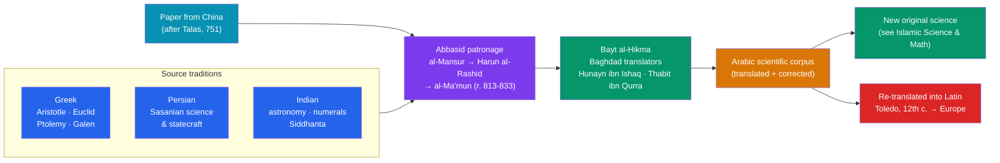

# 📜 The House of Wisdom

> [!abstract] TL;DR
> Under the early **Abbasid caliphs** in **Baghdad**, especially **al-Ma'mun (r. 813–833)**, the court sponsored one of history's great intellectual projects: the **Graeco-Arabic translation movement**. Over roughly two centuries, the surviving scientific and philosophical corpus of **Greece** (Aristotle, Euclid, Ptolemy, Galen), **Persia**, and **India** was systematically rendered into **Arabic** — the era's international language of learning. A palace library and its scholars, later remembered as the **Bayt al-Hikma ("House of Wisdom")**, symbolize this effort. The newly adopted technology of **paper** (learned from China) made books cheap and abundant, fueling libraries across the Islamic world. Crucially, this movement **preserved** classical knowledge that had been lost to Latin Europe — and, centuries later, transmitted it back westward through translation centers like Toledo, helping ignite the European revival of learning.

## Intuition — analogy first

Picture a great **relay race of knowledge** run across a thousand years. The first runner is classical Greece, sprinting with the treasures of geometry, astronomy, logic, and medicine. But by late antiquity that runner collapses: the Western Roman world fragments, Greek literacy fades in Latin Europe, and many of the scrolls are in danger of vanishing forever.

Then a fresh runner takes the baton — Abbasid Baghdad. Backed by immense wealth and a caliph's personal obsession with learning, teams of translators hunt down manuscripts from Byzantine libraries, from Persia, from India. They don't just copy them; they translate, correct, cross-check, and build on them, writing new commentaries and original work. To carry all this, they adopt a wonder-material from China — **paper** — replacing costly parchment and letting books multiply as never before.

Centuries later the baton is passed again, this time *back to Europe*, through the translation shops of Iberia and Sicily, where scholars turn the Arabic (much of it Greek in origin, now enriched) into Latin. The point of the analogy: the "House of Wisdom" was less a single building than **the handoff that kept the race going** — the reason so much ancient learning survived at all, and the bridge that connected it to the modern world.

---

## How It Works — The Pipeline of the Translation Movement

## Key Concepts

### The Bayt al-Hikma and Abbasid Patronage

The **Bayt al-Hikma** ("House of Wisdom") began, in the traditional account, as a **palace library** of the Abbasid caliphs in **Baghdad**, likely rooted in a Persian-style royal archive under **al-Mansur** (r. 754–775) and expanded by **Harun al-Rashid** (r. 786–809). It reached legendary status under **al-Ma'mun** (r. 813–833), who — the sources say — dreamed of Aristotle, sent envoys to acquire Greek manuscripts from Byzantium, and funded scholars to translate them.

Modern historians, notably **Dimitri Gutas**, caution against imagining a single grand "academy" or research university. The evidence points more to a **library and a broad, sustained culture of translation** patronized by the caliphs, the wealthy **Banu Musa** brothers, and other elites — a social movement rather than one institution. Either way, the *phenomenon* is real and immense: state resources deliberately marshaled to acquire and translate the world's learning.

### The Great Translation Movement

Across roughly the **8th to 10th centuries**, scholars rendered an astonishing range of works into Arabic:

| Source tradition | Representative works absorbed | Fields |
|---|---|---|
| **Greek** | Aristotle's logic and physics; Euclid's *Elements*; Ptolemy's *Almagest*; Galen and Hippocrates | Philosophy, geometry, astronomy, medicine |
| **Persian (Sasanian)** | Astronomical/astrological handbooks; *adab* and statecraft | Astronomy, governance, literature |
| **Indian (Sanskrit)** | The *Siddhanta* astronomical texts; the decimal numeral system | Astronomy, mathematics |

The translators were often **Christians, Sabians, and Jews** working in a shared Arabic scholarly culture. The greatest was **Hunayn ibn Ishaq** (809–873), a Nestorian Christian who, with his workshop, translated the Galenic medical corpus with exacting standards — collating multiple manuscripts to establish a reliable text. **Thabit ibn Qurra** (a Sabian from Harran) translated and improved Greek mathematics. Translation was frequently *not* passive: scholars corrected errors, filled gaps, and appended commentaries.

### Paper from China

A quiet technological revolution underwrote all of this. **Papermaking**, a Chinese invention, spread westward in the 8th century — tradition links its transfer to prisoners taken at the **Battle of Talas (751)** between the Abbasids and Tang China. **Paper mills operated in Baghdad by the late 8th century.**

Paper was far **cheaper and more abundant** than parchment (treated animal skin) or Egyptian papyrus. This drove down the cost of books, enabled a booming **bookseller and copyist trade**, and made possible the enormous **libraries** of the Islamic world — in Baghdad, Cairo, and later Córdoba. A civilization of readers and writers, and the mass preservation of texts, rested on this humble material.

### Preservation and Transmission to Europe

The translation movement had two world-historical consequences:

1. **Preservation.** Many Greek works survived *only* because they had been translated into Arabic during a period when Greek learning was fading in the Latin West. Arabic became the ark that carried classical science through the early medieval centuries.
2. **Transmission.** From the **12th century**, scholars in **Toledo** (after its reconquest), Sicily, and northern Spain translated this Arabic corpus — much of it Greek in origin, now enriched by Islamic commentary and original work — into **Latin**. This influx of Aristotle, Euclid, Ptolemy, Ibn Sina, and Ibn Rushd helped fuel the **rise of the medieval universities and Scholasticism** (see [[Al_Andalus]] for the western conduit).

## Primary Sources & Examples

- **Ibn al-Nadim, *al-Fihrist* (c. 987)** — a "catalogue" of the books known in Baghdad, our single richest source on what was translated, by whom, and what libraries held; indispensable evidence for the whole movement.
- **Hunayn ibn Ishaq's *Risala*** — his own account of translating Galen, describing how he hunted for and collated manuscripts to establish accurate texts, a striking early statement of critical editing.
- **Ptolemy's *Almagest*** — its very familiar name comes from the Arabic *al-majisti*; the Greek astronomy it contains reached medieval Europe largely through Arabic and then Latin (Gerard of Cremona's Toledo translation).
- **al-Khwarizmi's works** — produced in this Baghdad milieu, they carried Indian numerals and new algebra into the wider world (see [[Islamic_Science_and_Mathematics]]).

## Common Pitfalls / Misconceptions

- **Imagining a modern "university" or "academy."** The Bayt al-Hikma is best understood as a library and a court-sponsored culture of translation, not an institution with faculties and degrees — much of the "grand academy" image is later romanticization.
- **Thinking translators were mere copyists.** They edited, corrected, cross-checked manuscripts, and wrote original commentaries; the movement produced new knowledge, not just Arabic copies.
- **Assuming it was a solely Arab, solely Muslim effort.** Christians, Jews, Sabians, and Persians were central to the translation work, in a genuinely multi-confessional scholarly world.
- **The "Islam merely stored Greek learning for Europe" myth.** Preservation and transmission were vital, but the same corpus launched centuries of *original* Islamic science; treating the Islamic world as a passive warehouse understates its own achievements.

## Related Concepts

- [[_MOC_Islamic_Golden_Age|↑ Section MOC]] — the section hub
- [[Rise_of_Islam_and_the_Caliphates]] — the Abbasid caliphate whose Baghdad court funded and sheltered the translation movement
- [[Islamic_Science_and_Mathematics]] — the original science that grew directly out of the translated corpus
- [[Al_Andalus]] — the western hub (Córdoba, then Toledo) through which this learning passed into Latin Europe
- [[The_Mongol_Empire]] — the 1258 sack of Baghdad destroyed its libraries and closed this chapter
- Cross-vault: [[_MOC_Mathematics_Master]] — the decimal numerals and algebra that the translation movement helped carry into world mathematics

## Review Questions

1. Why was the adoption of paper (learned from China) so important to the translation movement and to Islamic book culture more broadly?
2. In what sense is it misleading to picture the Bayt al-Hikma as a "university," and what does the historical evidence (e.g., Ibn al-Nadim's *Fihrist*) actually support?
3. Explain the two world-historical consequences of the translation movement — preservation and transmission — with a concrete example of each.

## Sources

- Gutas, D. (1998). *Greek Thought, Arabic Culture: The Graeco-Arabic Translation Movement in Baghdad and Early Abbasid Society*. Routledge
- Lyons, J. (2009). *The House of Wisdom: How the Arabs Transformed Western Civilization*. Bloomsbury
- al-Khalili, J. (2010). *Pathfinders: The Golden Age of Arabic Science*. Allen Lane
- Saliba, G. (2007). *Islamic Science and the Making of the European Renaissance*. MIT Press

#history #islamic-golden-age #translation-movement #baghdad #knowledge-transmission #abbasid
