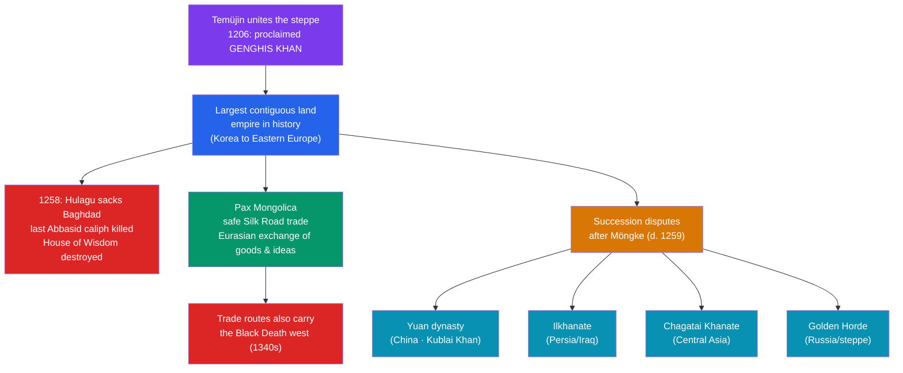

# 🐎 The Mongol Empire

> [!abstract] TL;DR
> In **1206**, a Mongol chieftain named **Temüjin** united the warring tribes of the steppe and took the title **Genghis Khan ("universal ruler")**. Within decades, Mongol armies had built the **largest contiguous land empire in history**, stretching from Korea to the gates of Europe. Their conquests were shockingly destructive — none more symbolically final than the **1258 sack of Baghdad**, which killed the last **Abbasid caliph** and ended the caliphate that had anchored the Islamic golden age. Yet the same empire also created the ***Pax Mongolica***: a generation of relative security across Eurasia that supercharged trade, travel, and the exchange of goods, technologies, and ideas along the Silk Roads. After Genghis's death the empire fragmented into four great **successor khanates** — and the very trade routes it opened may also have carried the **Black Death** west.

## Intuition — analogy first

Imagine the Eurasian landmass in 1200 as a patchwork of walled gardens, each civilization tending its own plot behind hostile borders, bandit-ridden roads, and mutually suspicious rulers. Moving a caravan of silk or a manuscript or an idea from China to Persia to Europe meant crossing a dozen frontiers, each with its own tolls, dangers, and wars.

Now imagine a single storm sweeping across the whole map, tearing down most of those walls at once. That was the Mongol conquest — violent, terrifying, and for the cities in its path, often catastrophic. **Baghdad, the crown of the Islamic world, was swept away.** But once the storm settled into empire, something surprising happened: with one power controlling the roads from the Pacific to the Black Sea, those roads became *safe*. A merchant could, it was said, travel the length of Asia "with a pot of gold on his head" and fear no one.

That is the paradox of the Mongols, and the reason they close the story of the Islamic golden age: they were simultaneously its **destroyer** — extinguishing the Abbasid Caliphate — and the architects of a Eurasian highway of exchange whose traffic (goods, gunpowder, and eventually plague) would reshape the entire Old World.

---

## How It Works — Unification, Empire, Fragmentation

## Key Concepts

### Genghis Khan and the Unification of the Steppe

**Temüjin** (c. 1162–1227) rose from a hard and precarious childhood to master the politics of the Mongolian steppe, binding together its rival tribes through a mix of warfare, alliance, and a **meritocratic** reorganization of society that broke old clan loyalties. In **1206**, a great assembly (*kurultai*) proclaimed him **Genghis Khan** ("universal/fierce ruler").

His innovations made the Mongols formidable far beyond their numbers: a decimal military organization (units of 10 / 100 / 1,000 / 10,000), superb **mounted archers** and horsemanship, brilliant use of intelligence and psychological warfare, ruthless treatment of cities that resisted (and clemency for those that submitted), and a written law code, the ***Yassa***. He also embraced religious tolerance and recruited administrators and engineers from conquered peoples.

### The Largest Land Empire in History

Under Genghis and his successors, the empire expanded with astonishing speed: northern China (the **Jin**), then the wealthy **Khwarazmian Empire** of Central Asia and Persia (1219–1221, with notorious destruction of cities like Nishapur and Merv), then campaigns into Russia and Eastern Europe. At its height (c. 1279) it covered roughly **24 million square kilometers** — about **16% of Earth's land area** — the **largest contiguous land empire ever assembled**, second overall only to the (non-contiguous) British Empire.

### 1258: The Sack of Baghdad

The event that seals this section's story came in **1258**, when **Hulagu Khan** (a grandson of Genghis) led a massive army against **Baghdad**, the Abbasid capital for five centuries. After a short siege the city fell; the Mongols executed the last Abbasid caliph, **al-Musta'sim**, and unleashed a catastrophic sack. Contemporary accounts describe the destruction of libraries and the killing of scholars — the **House of Wisdom's** collections were said to be thrown into the **Tigris** until the river "ran black" with ink (a vivid image, though likely part-legend). Whatever the precise scale, **1258 ended the Abbasid Caliphate** and is the conventional close of the Islamic golden age (see [[Rise_of_Islam_and_the_Caliphates]] and [[The_House_of_Wisdom]]).

### The Pax Mongolica and Eurasian Exchange

Once the conquests settled, a unified Mongol authority over the trans-Asian routes produced the ***Pax Mongolica*** — the "Mongol Peace." For roughly a century, the **Silk Roads** were safer and more integrated than ever, and the Mongols actively encouraged commerce.

| What flowed | Direction | Consequence |
|---|---|---|
| Silk, porcelain, spices, silver | East ↔ West | Booming long-distance trade; enrichment of merchants |
| Gunpowder, printing, the compass, papermaking | China → West | Technologies that reshaped later European history |
| Merchants, envoys, missionaries (**Marco Polo**, Rabban Bar Sauma) | Both ways | Direct Europe–China contact for the first time |
| Administrators, scientists, astronomers | Across khanates | e.g., Persian and Chinese astronomers exchanged at the **Maragha observatory** |

This exchange links directly to [[Ancient_Trade_Networks]]: the Mongols did not invent the Silk Roads but briefly welded them into a single, protected corridor.

### The Successor Khanates

The empire was always meant to be shared among Genghis's heirs, and after the death of the Great Khan **Möngke (1259)** it fractured into four effectively independent realms:

- **Yuan Dynasty** — China and Mongolia, under **Kublai Khan** (declared 1271).
- **Ilkhanate** — Persia and Iraq (Hulagu's line); later converted to Islam.
- **Chagatai Khanate** — Central Asia.
- **Golden Horde** — the Russian steppe and lands north of the Black and Caspian Seas.

These states gradually assimilated to the cultures and religions they ruled — several, tellingly, **adopting Islam** within a few generations of having destroyed the caliphate.

### The Dark Side of the Roads: the Black Death

The integrated Eurasian highway carried more than silk. The **Black Death** — the plague pandemic of the mid-14th century — is widely thought to have spread westward along Mongol-era trade and military routes. A famous episode is the **1346 siege of Caffa** (Kaffa) in the Crimea, where the **Golden Horde**'s army was struck by plague; its arrival in Mediterranean ports soon after opened the catastrophe in Europe (see [[The_Black_Death]]). The same connectivity that enriched Eurasia also made it lethally vulnerable to a shared disease.

## Primary Sources & Examples

- **_The Secret History of the Mongols_ (c. 1240s)** — the sole surviving Mongolian-language narrative of Genghis Khan's rise; a foundational, if partly legendary, primary source.
- **Ata-Malik Juvayni, *History of the World Conqueror*** — a Persian administrator's contemporary account of the conquests and the fall of Baghdad, written from within the Ilkhanate.
- **Marco Polo, *Il Milione* (The Travels)** — a Venetian's account of Yuan China under Kublai Khan; evidence (however embellished) of the Europe–China contact the Pax Mongolica enabled.
- **Rashid al-Din, *Jami al-Tawarikh* (Compendium of Chronicles, c. 1307)** — a monumental Ilkhanid world history, itself a product of Mongol-era cross-cultural exchange.

## Common Pitfalls / Misconceptions

- **Seeing the Mongols as *only* destroyers.** The devastation was immense and real, but the same empire fostered the Pax Mongolica, protected trade, practiced religious tolerance, and transmitted technologies across Eurasia.
- **Overstating "16% of the land" as continuous control.** The empire was vast but governed unevenly and soon split; the four khanates operated as largely independent states within decades.
- **Treating the sack of Baghdad as a single cause of Islamic "decline."** 1258 is a powerful symbolic endpoint, but scholarship increasingly stresses that Islamic science and culture continued (and even flourished, e.g., at Maragha) after it; monocausal "decline" narratives are contested.
- **Reading the Black Death's spread as certain and simple.** The plague's routes and timing are debated; the Mongol-corridor link is well supported but the details (origins, exact vectors) remain areas of active research.

## Related Concepts

- [[_MOC_Islamic_Golden_Age|↑ Section MOC]] — the section hub
- [[Rise_of_Islam_and_the_Caliphates]] — the Abbasid Caliphate that the Mongol sack of Baghdad extinguished in 1258
- [[The_House_of_Wisdom]] — the Baghdad library and translation culture destroyed in that sack
- [[The_Black_Death]] — the pandemic that spread west along the trade routes the Mongols had unified
- [[Ancient_Trade_Networks]] — the Silk Roads that the Pax Mongolica briefly welded into a single protected corridor
- Cross-vault: [[_MOC_Game_Theory_Master]] — the Mongol succession system (division among heirs, the *kurultai*) is a study in how empires fail to solve the transfer-of-power problem

## Review Questions

1. How did Temüjin's reorganization of steppe society and his military innovations allow the Mongols to build the largest contiguous land empire in history?
2. Why is the 1258 sack of Baghdad treated as the endpoint of the Islamic golden age, and what caution do modern historians raise about calling it a simple cause of "decline"?
3. Explain the paradox of the Pax Mongolica: how did the same integrated Eurasian network bring both an exchange boom and the Black Death?

## Sources

- Weatherford, J. (2004). *Genghis Khan and the Making of the Modern World*. Crown
- Morgan, D. (2007). *The Mongols* (2nd ed.). Blackwell
- May, T. (2012). *The Mongol Conquests in World History*. Reaktion Books
- Rossabi, M. (1988). *Khubilai Khan: His Life and Times*. University of California Press

#history #islamic-golden-age #mongols #genghis-khan #pax-mongolica #baghdad-1258
