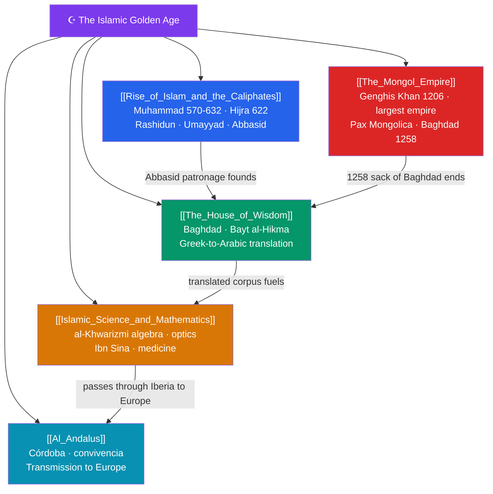

# 🗺️ The Islamic Golden Age — Map of Content

> [!abstract] What This Section Covers
> Between roughly the 8th and 13th centuries, the Islamic world was the intellectual center of gravity of Eurasia. It begins with the **rise of Islam and the caliphates**: Muhammad's mission (570–632), the Hijra of 622, and the explosive expansion under the Rashidun, Umayyad, and Abbasid caliphates. Abbasid Baghdad hosted the **House of Wisdom**, where a great translation movement rendered Greek, Persian, and Indian works into Arabic and preserved knowledge that Europe had lost. From this foundation came a flowering of **Islamic science and mathematics** — al-Khwarizmi's algebra (and the very word "algorithm"), Ibn al-Haytham's optics, and Ibn Sina's medical canon. Far to the west, **Al-Andalus** made Córdoba a jewel of learning and tolerance and became the conduit that transmitted classical and Arabic scholarship to Christian Europe. The section ends with **the Mongol Empire**: Genghis Khan's unification of the steppe in 1206 built history's largest contiguous land empire, whose 1258 sack of Baghdad extinguished the Abbasid Caliphate and closed this golden age.

## Concept Map

## Learning Path

1. [[Rise_of_Islam_and_the_Caliphates]] — The birth of Islam and the rapid expansion under the Rashidun, Umayyad, and Abbasid caliphates.
2. [[The_House_of_Wisdom]] — Baghdad's translation movement and its role in preserving and synthesizing world knowledge.
3. [[Islamic_Science_and_Mathematics]] — Breakthroughs in algebra, optics, astronomy, and medicine by scholars like al-Khwarizmi and Ibn Sina.
4. [[Al_Andalus]] — Muslim Iberia's culture of learning and its transmission of scholarship to medieval Europe.
5. [[The_Mongol_Empire]] — Genghis Khan's conquests, the Pax Mongolica, and the sack of Baghdad that ended the golden age.

## All Notes at a Glance

| Note | Difficulty | What You'll Learn |
|------|------------|-------------------|
| [[Rise_of_Islam_and_the_Caliphates]] | Beginner → Intermediate | Muhammad, the Hijra, the Rashidun, Umayyad Damascus, Abbasid Baghdad, early Islamic expansion |
| [[The_House_of_Wisdom]] | Intermediate | Bayt al-Hikma, the Greco-Arabic translation movement, patronage under al-Ma'mun, paper and libraries |
| [[Islamic_Science_and_Mathematics]] | Intermediate | Algebra and algorithms (al-Khwarizmi), Ibn al-Haytham's optics, Ibn Sina's Canon, astronomy |
| [[Al_Andalus]] | Intermediate | Umayyad Córdoba, convivencia, the Great Mosque, Averroes, transmission of learning to the Latin West |
| [[The_Mongol_Empire]] | Intermediate → Advanced | Genghis Khan, the largest land empire, Pax Mongolica and trade, the 1258 fall of Baghdad |

## Key Questions This Section Answers

- How did Islam expand so rapidly from Arabia into a vast empire within a century of Muhammad's death?
- What made Baghdad's House of Wisdom a turning point in the history of knowledge?
- Which mathematical and scientific ideas from the Islamic world still underpin modern science?
- How did Al-Andalus transmit classical and Arabic learning to a reawakening Christian Europe?
- How did the Mongol conquests reshape Eurasia, and why did 1258 mark the end of the golden age?

## Related Sections

- [[_MOC_History_Master|↑ History Master MOC]]
- [[_MOC_Medieval_World|← The Medieval World]]
- [[_MOC_Renaissance_Reformation|→ Renaissance & Reformation]]

#MOC #History #IslamicGoldenAge
