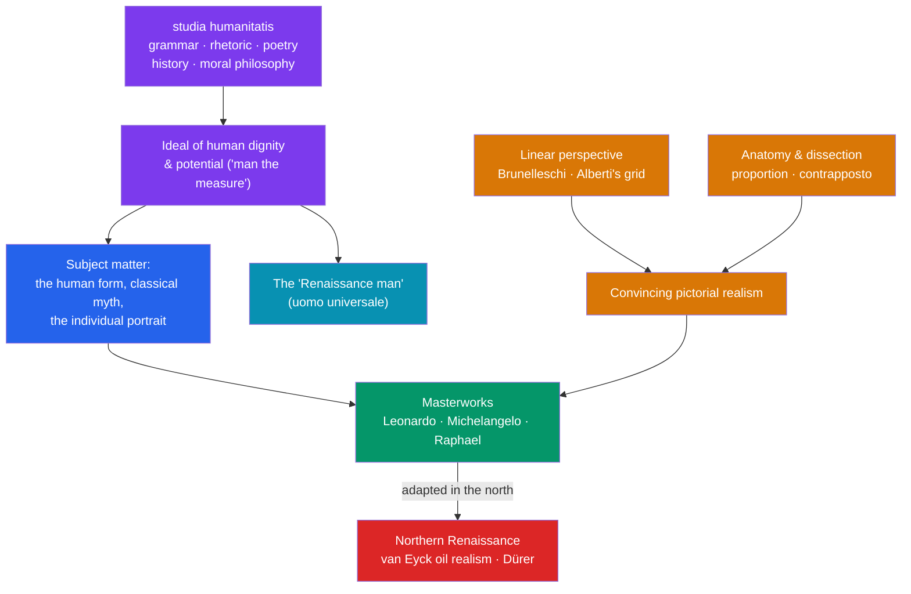

# 🎨 Humanism and the Arts

> [!abstract] TL;DR
> **Renaissance humanism** was an educational and intellectual program centered on the *studia humanitatis* — grammar, rhetoric, poetry, history, and moral philosophy studied through the recovered texts of Greece and Rome. Its watchword was human **dignity, potential, and eloquence**: "man as the measure." From **Petrarch** and **Pico della Mirandola** to the Christian humanist **Erasmus**, humanists prized eloquent Latin, philology, and the active engaged life. In parallel, an **artistic revolution** solved the problem of representing the visible world convincingly: **linear perspective** (Brunelleschi, Alberti), **anatomy** and naturalism, and the balanced classical ideal — perfected by the triumvirate of **Leonardo, Michelangelo, and Raphael**. The polymath **"Renaissance man"** who mastered many fields became the era's ideal, while the **Northern Renaissance** (Dürer, van Eyck) fused these advances with a distinctive oil-painting realism and, later, Christian reform. Humanism supplied the ideas; the arts made them visible.

## Intuition — analogy first

Imagine two teams working on the same project — *reinventing what a human being can be* — from opposite ends.

The **humanists** are the writers and editors. They dig up the "original source code" of Western thought (Cicero, Plato, Livy), clean up the corrupted copies scribes had introduced over a thousand years, and argue that if you study these texts properly you become more fully, more excellently *human*. Their motto might as well be: don't just pray and obey — read, speak well, and act nobly in the world.

The **artists** are the rendering engine. They take the same conviction — that the human being and the visible world are worth depicting with dignity and truth — and solve it as an engineering problem. How do you make a flat wall look like it has depth? (Linear perspective.) How do you make a marble figure look like it could breathe? (Study real anatomy and dissect corpses.) How do you show a face that has an inner life? (Leonardo's *sfumato*, the softened contour.)

The Renaissance is the moment these two teams' outputs lock together: humanist ideas about human worth get a visual language powerful enough to make people *see* them.

---

## How It Works — From Humanist Ideas to Artistic Technique

## Key Concepts

### What Humanism Was (and Was Not)

**Renaissance humanism** was primarily a **curriculum and a method**, not a secular philosophy or an "anti-religion." Humanists championed the *studia humanitatis* — the "humanities": **grammar, rhetoric, poetry, history, and moral philosophy** — studied directly from classical Greek and Latin sources.
- Its method was **philology**: the critical study of texts in their original languages, comparing manuscripts to recover what the author actually wrote.
- Its aim was **eloquence and virtue**: the belief that studying the best ancient authors makes a person a better, wiser, more publicly useful human being.
- Most humanists were **devout Christians**. The term "humanist" (*umanista*) originally meant a teacher of these subjects; it did *not* mean "secularist."

### Key Humanist Thinkers

| Thinker | Dates | Contribution |
|---|---|---|
| **Petrarch** | 1304–1374 | "Father of humanism"; rediscovered Cicero's letters; revived classical Latin and love poetry (the *Canzoniere*) |
| **Lorenzo Valla** | 1407–1457 | Pioneered philology; used linguistic analysis to expose the *Donation of Constantine* as a forgery (1440) |
| **Pico della Mirandola** | 1463–1494 | *Oration on the Dignity of Man* (1486) — a manifesto of human freedom and unlimited potential |
| **Desiderius Erasmus** | 1466–1536 | Leading Christian humanist; edited the Greek New Testament (1516); satirized clerical abuse in *In Praise of Folly* (1509) |
| **Thomas More** | 1478–1535 | English humanist; *Utopia* (1516) used classical form to critique his own society |

**Pico's** famous image — God tells Adam that, unlike all other creatures, he has no fixed nature and may "fashion thyself in whatever shape thou shalt prefer" — crystallizes the humanist ideal of human self-determination. This is the deep meaning of the slogan **"man is the measure of all things"** (borrowed from the ancient Greek Protagoras).

### The Artistic Revolution: Perspective, Anatomy, Realism

Renaissance art achieved a new, systematic **realism** through several breakthroughs:
- **Linear perspective.** The architect **Filippo Brunelleschi** demonstrated one-point perspective (c. 1415), and **Leon Battista Alberti** codified it in *On Painting* (*De pictura*, 1435) as a geometric grid with a single vanishing point — turning the picture plane into a "window" onto measurable space.
- **Anatomy and the human body.** Artists dissected cadavers to render muscle, bone, and movement accurately. The classical pose of **contrapposto** (weight shifted onto one leg) returned the figure to lifelike balance.
- **Naturalism and light.** **Chiaroscuro** (modeling with light and shade) and Leonardo's **sfumato** (smoky, blurred transitions) gave figures volume and psychological depth.
- **Classical ideals.** Harmony, proportion, and balance — often keyed to mathematical ratios — replaced the flatter, hierarchical conventions of much medieval art.

### The Triumvirate of the High Renaissance

The **High Renaissance** (c. 1490s–1520s) is embodied by three figures:
- **Leonardo da Vinci** (1452–1519) — the archetypal *uomo universale*: painter (*Mona Lisa*, *The Last Supper*), anatomist, engineer, and notebook-keeping observer of nature; master of sfumato.
- **Michelangelo Buonarroti** (1475–1564) — sculptor (*David*, 1504; the *Pietà*), painter of the **Sistine Chapel ceiling** (1508–1512), and architect of St. Peter's dome; obsessed with the heroic male nude.
- **Raphael** (1483–1520) — painter of serene, balanced compositions such as *The School of Athens* (1509–1511), which assembles the great philosophers of antiquity as a visual manifesto of humanism itself.

### The "Renaissance Man" (Uomo Universale)

The ideal of the **"Renaissance man"** — the versatile individual accomplished in arts, sciences, letters, and athletics — was articulated by **Baldassare Castiglione** in *The Book of the Courtier* (1528), which prescribed the cultivated qualities of the ideal courtier, including *sprezzatura* (studied, effortless grace). Leonardo is the historical exemplar.

### The Northern Renaissance

As Italian ideas spread north (via trade, travel, and print; see [[The_Printing_Revolution]]), the **Northern Renaissance** developed distinctive traits:
- **Jan van Eyck** (c. 1390–1441) perfected **oil painting**, achieving minute, jewel-like detail and luminous realism (the *Arnolfini Portrait*, 1434) — a naturalism arrived at more through meticulous observation than Italian geometric theory.
- **Albrecht Dürer** (1471–1528) fused German craft traditions with Italian theory of proportion; his **engravings and woodcuts** (e.g., *Melencolia I*, 1514) spread Renaissance imagery cheaply across Europe.
- Northern humanism, led by **Erasmus**, was more explicitly focused on **religious reform** and the direct study of Scripture — a temper that fed directly into the [[The_Protestant_Reformation]].

## Primary Sources & Examples

- **Pico della Mirandola, *Oration on the Dignity of Man* (1486).** Often called the "manifesto of the Renaissance," it stages God granting humanity a uniquely open-ended nature and the freedom to rise or fall by its own choices.
- **Raphael, *The School of Athens* (1509–1511).** Painted in the Vatican, it gathers Plato, Aristotle, Socrates, Euclid, and Ptolemy under classical architecture — a single image summarizing the humanist reverence for ancient learning and the marriage of philosophy with perspective geometry.
- **Alberti, *On Painting* (1435).** The first theoretical treatise on linear perspective, turning painting into a discipline with rules a "scientist of art" could teach and reproduce.
- **Van Eyck, *Arnolfini Portrait* (1434).** A showcase of Northern oil-painting realism — the convex mirror, the textures of fur and brass — demonstrating a naturalism grounded in observation rather than Italian mathematical theory.

## Common Pitfalls / Misconceptions

- **"Humanism meant atheism or secularism."** No. It was a text-based educational program, and most humanists (Erasmus, More, Pico) were sincere Christians seeking to renew, not abandon, their faith.
- **"'Man is the measure' meant the Renaissance rejected God."** It emphasized human dignity and capacity *within* a largely Christian worldview, not the denial of the divine.
- **"Perspective was just an artistic style."** It was a rigorous **geometric technique**; its adoption reflects the era's growing appetite for mathematics and measurable observation — the same appetite behind the [[The_Scientific_Revolution]].
- **"The Northern Renaissance was a pale copy of the Italian."** It had independent strengths — oil technique, printmaking, and a religious-reform emphasis — and shaped Europe as decisively as the Italian original.
- **"Everyone could be a 'Renaissance man.'"** The *uomo universale* was an elite, mostly male ideal; the reality for most people, including talented women artists who faced severe barriers, was far more constrained.

## Related Concepts

- [[_MOC_Renaissance_Reformation|↑ Section MOC]] — the section hub
- [[The_Italian_Renaissance]] — the wealth, patronage, and city-state competition that funded and demanded this art and learning
- [[The_Printing_Revolution]] — how humanist texts and Dürer's images were mass-reproduced and spread across Europe
- [[The_Protestant_Reformation]] — Christian humanism (Erasmus's Greek New Testament) laid groundwork the reformers built on
- [[The_Scientific_Revolution]] — the humanist "return to the sources" and to direct observation carried over into natural philosophy
- Cross-vault: [[_MOC_Computer_Graphics_Master]] — linear perspective is the historical root of the projection geometry used in modern 3D rendering

## Review Questions

1. Define the *studia humanitatis* and explain why "humanism" is better understood as an educational program than as a secular ideology. Reference at least two humanist thinkers.
2. Identify three technical breakthroughs that produced Renaissance pictorial realism, naming a figure associated with each.
3. Compare the Italian and Northern Renaissances: give one distinctive contribution of each, and explain how Northern humanism connected to religious reform.

## Sources

- Kristeller, P.O. (1961). *Renaissance Thought: The Classic, Scholastic, and Humanist Strains*. Harper
- Alberti, L.B. (1435). *On Painting* (*De pictura*)
- Pico della Mirandola, G. (1486). *Oration on the Dignity of Man*
- Nauert, C.G. (2006). *Humanism and the Culture of Renaissance Europe*. Cambridge University Press

#history #renaissance #humanism #art #culture #northern-renaissance
