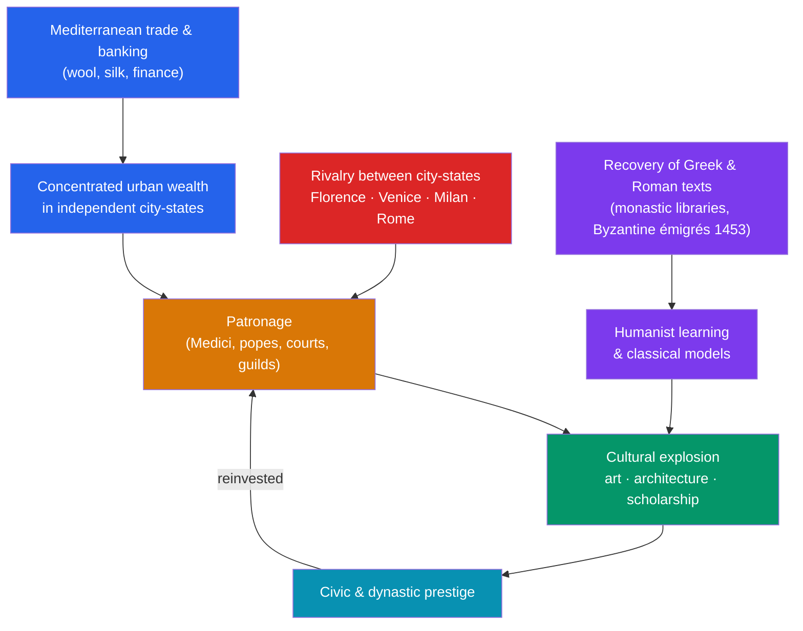

# 🏛️ The Italian Renaissance

> [!abstract] TL;DR
> The **Renaissance** ("rebirth," from the Italian *rinascita*) was the roughly 1300–1600 revival of the art, literature, and civic ideals of classical **Greece and Rome**, and it began in the fragmented, fabulously rich **city-states of Italy** — above all **Florence**. It was not a spontaneous flowering of genius but the product of concrete conditions: banking and trade wealth (the **Medici**), intense **competition** for prestige among rival republics and courts (Florence, Venice, Milan, Rome, Naples), a class of merchant patrons who spent on art and learning, and the **recovery of ancient texts** — accelerated by Greek scholars fleeing the fall of Constantinople (1453). The result was a self-conscious break with what its own thinkers dismissed as a "middle" age, and the intellectual and artistic seedbed for [[Humanism_and_the_Arts]], the [[The_Printing_Revolution]], and eventually the [[The_Scientific_Revolution]].

## Intuition — analogy first

Think of Renaissance Italy as a **hyper-competitive startup ecosystem**, and the city-states as rival firms fighting for market share in *prestige*.

Each city was small, sovereign, and insecure. Florence, Venice, Milan, Rome, and Naples could not out-conquer one another cheaply, so they competed the way ambitious companies do when they can't win on size alone: by out-*branding* each other. A magnificent cathedral dome, a bronze *David*, a private library of rediscovered ancient authors — these were the billboards of civic and dynastic reputation. The **Medici bank** was the venture capital: it turned the profits of finance into commissions, and commissions into artists, and artists into a talent pool that other cities then tried to poach.

And the "product roadmap" everyone was chasing was not the future but the **past** — the recovered wisdom of Athens and Rome. Ancient manuscripts were the hot intellectual property; owning, copying, translating, and imitating them was how a merchant proved he was more than merely rich. The Renaissance is what happens when concentrated money, fierce status competition, and a suddenly-available treasury of classical ideas all collide in one peninsula.

---

## How It Works — The Engine of the Italian Renaissance

## Key Concepts

### Why Italy, and Why the City-States?

Unlike the emerging territorial monarchies of France, England, and Spain, late-medieval Italy was a patchwork of **independent, self-governing city-states**. This fragmentation was decisive:
- **Urbanized wealth.** Italian cities sat astride Mediterranean and overland trade. Florence dominated the **wool and banking** trades; Venice was a maritime empire trading with the Levant; Milan manufactured arms and textiles. Profit accumulated in the hands of merchants, not a distant crown.
- **Republican and civic traditions.** Cities like Florence and Venice cultivated an ideology of **civic humanism** — the idea that the active, public-spirited citizen who serves his republic embodies the classical ideal (see [[Humanism_and_the_Arts]]).
- **Roman ruins underfoot.** Italians lived among the physical remains of antiquity — the Colosseum, the Pantheon, Roman roads and inscriptions — making the classical past a tangible inheritance rather than a foreign import.

### Florence and the Medici

**Florence** is the paradigm case. Its **florin** (first minted 1252) became a standard of European finance, and the **Medici bank**, founded by **Giovanni di Bicci de' Medici** and expanded by his son **Cosimo de' Medici** ("Pater Patriae," effective ruler from 1434), became the largest in Europe, serving even the papacy.

The Medici converted financial power into cultural and political dominance through **patronage** rather than formal kingship:
- **Cosimo de' Medici** funded the rebuilding of San Lorenzo, the Convent of San Marco, and gathered scholars into a circle around the Platonic philosopher **Marsilio Ficino**, who translated Plato into Latin.
- **Lorenzo de' Medici** ("il Magnifico," ruled 1469–1492) presided over Florence's cultural high point, patronizing the young Michelangelo and supporting Botticelli, Poliziano, and Pico della Mirandola.
- Papal Medici — **Leo X** (Giovanni de' Medici) and **Clement VII** (Giulio de' Medici) — extended the dynasty's reach to Rome.

### Patronage as the Economic Engine of Art

Renaissance art was **commissioned**, not speculative. A patron — a wealthy family, a guild, a confraternity, the Church, or a prince — hired an artist by contract, often specifying subject, materials (how much gold and ultramarine), size, and deadline. Patronage motives blended piety, civic duty, family memorial, and naked status competition. Guilds competed to adorn Florence's Baptistery and Orsanmichele; the papacy rebuilt Rome as a statement of Church power.

| City-state | Political form | Economic base | Emblematic patron / project |
|---|---|---|---|
| **Florence** | Republic (Medici-dominated) | Banking, wool | Medici; Brunelleschi's Duomo dome (1436) |
| **Venice** | Merchant oligarchy ("La Serenissima") | Maritime trade with the East | Doges; the Bellini and Titian schools |
| **Rome** | Papal States | Church revenues, pilgrimage | Renaissance popes; St. Peter's, the Sistine Chapel |
| **Milan** | Duchy (Sforza / Visconti) | Manufacturing, arms | Ludovico Sforza; Leonardo's *Last Supper* |
| **Naples** | Kingdom | Agriculture, court | Aragonese court patronage |

### The Recovery of Classical Antiquity

The Renaissance defined itself by **returning to the sources** (*ad fontes*) of Greek and Roman civilization:
- **Petrarch** (1304–1374), often called the "father of humanism," hunted for lost Latin manuscripts and rediscovered Cicero's letters, reviving Ciceronian Latin as a model of eloquence.
- Humanist book-hunters like **Poggio Bracciolini** combed monastic libraries, recovering texts including Lucretius's *De rerum natura* (1417), which reintroduced Epicurean atomism to Europe.
- The **fall of Constantinople to the Ottomans in 1453** sent Greek-speaking Byzantine scholars westward, bringing manuscripts and the ability to read Greek — reviving direct access to Plato, Aristotle in the original, and much else.
- The **printing press** (from c. 1440; see [[The_Printing_Revolution]]), especially the Aldine Press of **Aldus Manutius** in Venice, then mass-produced affordable editions of the classics.

### Periodization and the "Renaissance" Label

The term *rinascita* was used by the artist-biographer **Giorgio Vasari** (*Lives of the Artists*, 1550) to describe a rebirth of art after a period of "decline." The now-standard label **"Renaissance"** was popularized much later by the Swiss historian **Jacob Burckhardt** in *The Civilization of the Renaissance in Italy* (1860), who framed it as the birthplace of the modern individual. Modern historians treat the sharp "medieval vs. Renaissance" divide with caution — much medieval learning persisted, and the "rebirth" narrative is partly the era's own self-flattering myth (a good illustration of the constructedness of period labels; see [[Periodization_and_Chronology]]).

## Primary Sources & Examples

- **Brunelleschi's Dome (completed 1436).** The engineering triumph of the dome of Florence's cathedral, Santa Maria del Fiore — raised without external scaffolding using a self-supporting double shell — was both a technical marvel drawing on the study of Roman construction and a civic advertisement of Florentine ingenuity.
- **Vasari, *Lives of the Most Excellent Painters, Sculptors, and Architects* (1550).** The founding text of art history; it supplies the "rebirth" framework and preserves much (not always reliable) biographical lore about Giotto, Brunelleschi, Leonardo, and Michelangelo.
- **Machiavelli, *The Prince* (written 1513).** A product of Florentine political turmoil, it exemplifies the Renaissance turn toward analyzing power realistically and drawing lessons from classical (especially Roman) history rather than from theology.
- **The Medici account books and commission contracts.** Surviving bank ledgers and artist contracts show, concretely, how finance was translated into culture — down to clauses on pigment quality and delivery dates.

## Common Pitfalls / Misconceptions

- **"The Renaissance was a sudden rebirth after a cultural 'dark age.'"** This is the era's own propaganda. The Middle Ages had universities, sophisticated theology, Gothic cathedrals, and a "12th-century renaissance" of its own. Continuity is as real as rupture.
- **"It was purely about art and genius."** The art is downstream of banking, trade, guild competition, and patronage economics. Ignoring the money and politics mistakes the symptom for the cause.
- **"The Renaissance was democratic or broadly popular."** It was largely an elite phenomenon funded by and made for wealthy merchants, princes, and the Church; most Italians remained illiterate peasants untouched by it.
- **"Renaissance = the whole of Europe at once."** It began in and was centered on Italy for over a century before spreading north (the Northern Renaissance; see [[Humanism_and_the_Arts]]), each region adapting it differently.

## Related Concepts

- [[_MOC_Renaissance_Reformation|↑ Section MOC]] — the section hub
- [[Humanism_and_the_Arts]] — the intellectual and artistic content that Italian wealth and patronage funded
- [[The_Printing_Revolution]] — the technology that mass-produced the recovered classics and spread Italian ideas across Europe
- [[The_Scientific_Revolution]] — the later movement that grew from the humanist return to ancient sources and direct observation
- [[Periodization_and_Chronology]] — why the very label "Renaissance" is a contested, constructed period boundary
- Cross-vault: [[_MOC_Finance_Master]] — the banking, credit, and double-entry bookkeeping that made the Medici fortune possible

## Review Questions

1. Explain three specific conditions of the Italian city-states (political, economic, and geographic) that help account for why the Renaissance began there rather than elsewhere in Europe.
2. Describe the role of the Medici family in Florence. How did they convert banking wealth into political and cultural power *without* being formal monarchs?
3. What does "the recovery of classical antiquity" mean, and how did events like the fall of Constantinople (1453) and figures like Petrarch contribute to it?

## Sources

- Burckhardt, J. (1860). *The Civilization of the Renaissance in Italy*. (English trans. 1878)
- Vasari, G. (1550). *Lives of the Most Excellent Painters, Sculptors, and Architects*
- Hale, J.R. (1993). *The Civilization of Europe in the Renaissance*. HarperCollins
- Brotton, J. (2006). *The Renaissance: A Very Short Introduction*. Oxford University Press

#history #renaissance #italy #medici #florence #patronage
