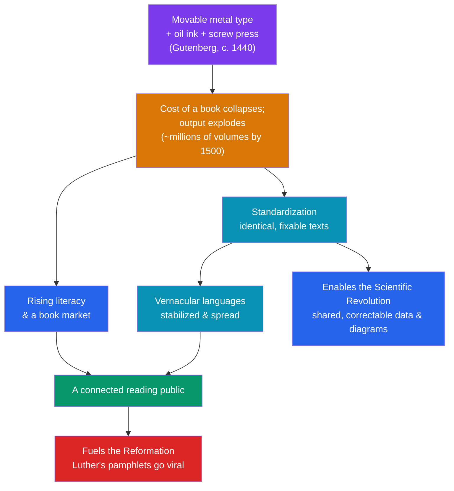

# 🖨️ The Printing Revolution

> [!abstract] TL;DR
> Around **1440**, in Mainz, **Johannes Gutenberg** combined **movable metal type**, an oil-based ink, and an adapted screw press into a system for mechanically reproducing text. The economic effect was staggering: the cost of a book **collapsed** and the number of books in Europe went from roughly tens of thousands of hand-copied manuscripts to hundreds of millions of printed volumes within a century. This triggered a cascade — rising **literacy**, the **standardization** of texts and spelling, the stabilization of **vernacular languages**, cheaper and faster circulation of ideas, and the possibility of a shared, verifiable body of knowledge. Print was the accelerant that turned Luther's local protest into a continent-wide [[The_Protestant_Reformation]] and let the discoveries of the [[The_Scientific_Revolution]] be checked, corrected, and built upon across borders. It is the first great **information technology**.

## Intuition — analogy first

Think of movable type as the difference between **hand-copying every message** and having a **photocopier that also broadcasts**.

Before Gutenberg, every book was a manuscript: a scribe copied it letter by letter over months, introducing errors, at a price only monasteries, universities, and the rich could afford. Knowledge moved at the speed of a human hand, and every copy was slightly different from every other — like a rumor that mutates each time it's retold.

Gutenberg's insight was **modularity**. Instead of carving a whole page (as woodblock printing did), he cast thousands of tiny, reusable metal letters. Compose a page from them, ink it, press paper against it hundreds of times, then **break the page apart and reuse the very same letters** for the next page. Suddenly the marginal cost of the 300th identical copy was almost nothing, and every copy was *exactly* the same.

That combination — cheap *and* identical — is what made print revolutionary. A cheap book spreads an idea; an *identical* book lets a reader in Wittenberg and a reader in Geneva argue about the same sentence on the same page. The photocopier scaled distribution; the exactness turned scattered readers into a single, connected public.

---

## How It Works — The Print Cascade

## Key Concepts

### Gutenberg's Innovation

The Chinese had woodblock printing centuries earlier, and movable type existed in East Asia (Bi Sheng's ceramic type, c. 1040; Korean metal type). **Gutenberg's** achievement (c. 1440–1450) was a *complete, commercially viable system* suited to the European alphabet:
- **Cast, reusable metal type** made from a durable **alloy** (lead, tin, antimony) using a **hand mould** that produced uniform, precisely sized letters on demand.
- **Oil-based ink** that adhered to metal type (water-based inks used for woodblocks would not).
- A **press** adapted from the screw presses used for wine and olive oil, applying even pressure.

His masterpiece, the **Gutenberg Bible** (the *42-line Bible*, c. 1455), proved the technology could match the quality of the finest manuscripts.

### The Collapse in the Cost of Books

The economic shift was the heart of the revolution. Consider the orders of magnitude:

| Measure | Before print (manuscript era) | After print (by c. 1500) |
|---|---|---|
| **Time to produce one book** | Months to years of scribal labor | Copies per day from one press |
| **Relative price** | Affordable only to elites/institutions | Falls by ~an order of magnitude, then more |
| **Total books in Europe** | Estimated low millions of manuscripts over centuries | Perhaps **8–20 million** printed by 1500 (the "incunabula" era) |
| **Consistency** | Every copy differs (scribal errors) | Every copy in a print run is identical |

By 1500, fewer than 50 years after Gutenberg, printing presses operated in over **250 European towns**, having produced an estimated 8–20 million volumes. **Venice**, home of the **Aldine Press** of **Aldus Manutius**, became a printing capital and pioneered portable, affordable editions and *italic* type.

### Standardization and the Rise of Vernaculars

Print did more than multiply books — it **fixed** them:
- **Textual stability.** Because copies were identical, scholars could cite "page 42" and be confident others saw the same words. This made cumulative scholarship, indexes, page numbers, and cross-references possible.
- **Language standardization.** Printers, seeking the widest market, favored particular regional dialects, helping standardize **spelling and grammar** and stabilize emerging **vernacular** written languages (e.g., the influence of print, later reinforced by Luther's German Bible and the King James Bible, on German and English).
- **Erasmus's** scholarly editions and **Luther's** Bible translations were only possible, at scale, because of print.

### An Information Revolution

Historian **Elizabeth Eisenstein** (*The Printing Press as an Agent of Change*, 1979) argued that print was a **transformative agent** in its own right, enabling:
- **Preservation** — knowledge no longer decayed with each recopying; it could be fixed and accumulated.
- **Dissemination** — ideas reached a mass audience quickly and cheaply.
- **Comparison and correction** — scholars could lay competing editions side by side, spot errors, and improve them, creating a self-correcting knowledge system.

Later historians (e.g., Adrian Johns) qualified this, stressing that print did not automatically guarantee accuracy — early printed books were riddled with errors, and "fixity" was partly a *social achievement* of publishers and readers, not an automatic property of the machine.

### The Two Movements Print Made Possible

- **The Reformation.** When Luther posted his 95 Theses (1517), printers translated and reprinted them across Germany within weeks. Luther became, in effect, the first "best-selling author," his cheap **pamphlets** (*Flugschriften*) and vernacular Bible reaching a mass audience the Church could not silence. Print made the [[The_Protestant_Reformation]] the first mass-media religious movement.
- **The Scientific Revolution.** Print let observations, star tables, anatomical diagrams, and mathematical arguments be reproduced *exactly* and circulated internationally — so that Kepler could work from Tycho Brahe's printed data and Newton could build on Galileo. Precise, repeatable **diagrams** were as important as text (see [[The_Scientific_Revolution]]).

## Primary Sources & Examples

- **The Gutenberg Bible (c. 1455).** The first major book printed with movable type in the West; about 49 copies survive. Its quality demonstrated that mechanical printing could rival the finest scribal work, launching the print trade.
- **Luther's *Flugschriften* (pamphlets, 1517–1525).** Short, cheap, vernacular tracts printed in the hundreds of thousands. They are the clearest historical demonstration of print converting an individual's protest into a mass movement.
- **The Aldine Press editions (Venice, from 1494).** Aldus Manutius's affordable, pocket-sized *libelli portatiles* and elegant italic type made the classics of [[Humanism_and_the_Arts]] widely available and helped invent the modern book as a portable consumer object.
- **Vesalius, *De humani corporis fabrica* (1543).** A landmark of anatomical illustration whose precise, reproducible woodcuts show how print fused image and text into a new kind of scientific document.

## Common Pitfalls / Misconceptions

- **"Gutenberg invented printing / movable type."** Woodblock printing and movable type both existed earlier in East Asia. Gutenberg engineered a *practical, integrated European system* (metal type, oil ink, press) — the innovation was the system, not the bare idea.
- **"Printing instantly made everyone literate."** Literacy rose gradually over generations; for a long time books were often read aloud to the illiterate. The press created the *conditions* for mass literacy, not literacy overnight.
- **"Printed books were automatically accurate."** Early print propagated errors as readily as truth; reliable "fixity" was achieved through editorial and social practices, not guaranteed by the machine.
- **"Print only mattered for the Reformation."** Its effects were general — commerce, law, science, administration, and vernacular literature all transformed. The Reformation is the most dramatic case, not the whole story.

## Related Concepts

- [[_MOC_Renaissance_Reformation|↑ Section MOC]] — the section hub
- [[The_Protestant_Reformation]] — the movement print turned viral; Luther's pamphlets are the textbook case of print-driven change
- [[The_Scientific_Revolution]] — print enabled the exact, shareable, correctable diagrams and data that cumulative science requires
- [[Humanism_and_the_Arts]] — humanist scholarship and Aldine classical editions were mass-produced by the press
- [[The_Italian_Renaissance]] — Venice's Aldine Press made Italy a center of the new book trade
- Cross-vault: [[_MOC_Networking_Master]] — print was the first technology to turn scattered individuals into a connected information network, a distant ancestor of digital broadcast

## Review Questions

1. What exactly did Gutenberg invent around 1440, given that woodblock printing and movable type already existed in East Asia? Name the three components of his system.
2. Explain two distinct consequences of the collapse in book prices — one economic/social and one intellectual (e.g., standardization) — and why "identical copies" mattered as much as "cheap copies."
3. How did the printing press enable *both* the Protestant Reformation and the Scientific Revolution? Give one concrete mechanism for each.

## Sources

- Eisenstein, E. (1979). *The Printing Press as an Agent of Change*. Cambridge University Press
- Febvre, L. & Martin, H-J. (1958). *The Coming of the Book*. (English trans. 1976)
- Johns, A. (1998). *The Nature of the Book: Print and Knowledge in the Making*. University of Chicago Press
- Pettegree, A. (2010). *The Book in the Renaissance*. Yale University Press

#history #renaissance #printing #gutenberg #media #information-revolution
