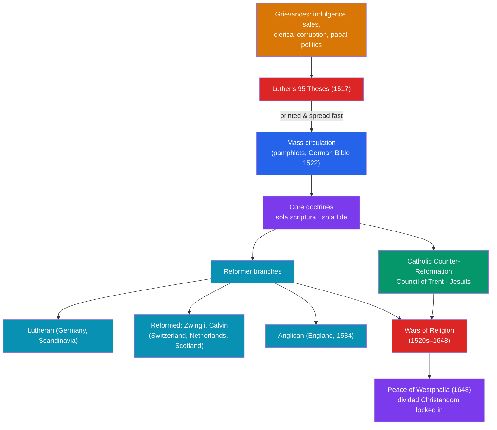

# ✝️ The Protestant Reformation

> [!abstract] TL;DR
> In 1517 the German monk **Martin Luther** publicly attacked the sale of **indulgences** in his **95 Theses**; within a few years his protest, amplified by the [[The_Printing_Revolution]], had split Western Christianity. Luther's core claims were **sola scriptura** (Scripture, not Church tradition or the pope, is the final authority) and **sola fide** (salvation comes through faith alone, not works or purchased merit). Other reformers went further: **Huldrych Zwingli** in Zurich and, most influentially, **John Calvin** in Geneva, whose doctrine of **predestination** shaped a disciplined, international Reformed movement. The Catholic Church responded with the **Counter-Reformation** — the reforming and dogma-defining **Council of Trent** (1545–1563) and the missionary, educational **Jesuits**. The split unleashed more than a century of **Wars of Religion**, ending with the **Peace of Westphalia (1648)**, which recognized a permanently divided Christendom and reshaped the European state system.

## Intuition — analogy first

Imagine a single, monopoly institution that, for a thousand years, has been the sole authorized **gatekeeper between you and salvation** — the only one who can read the "source contract" (the Bible, in a language you can't read), interpret it, and sell you the services you need to reach heaven.

Now three things happen at once. First, a whistleblower (**Luther**) points out that the monopoly is selling a shady product — **indulgences**, essentially receipts claiming to reduce your time in purgatory, marketed with the jingle "as soon as the coin in the coffer rings, the soul from purgatory springs." Second, a new technology (**the printing press**) lets the whistleblower's complaint go viral before management can suppress it. Third — and this is the radical part — the whistleblower argues you don't need the gatekeeper at all: the source contract should be **in your own language**, and each believer can read it directly (*sola scriptura*), saved by faith rather than by the services the monopoly sells (*sola fide*).

Once you tell people the gatekeeper is optional, you can't un-tell them. The monopoly fractures into competing providers (Lutheran, Reformed, Anglican), fights brutal wars to reclaim its market, reforms itself to compete (the Counter-Reformation) — and Europe never has a single religious authority again.

---

## How It Works — From Protest to Permanent Schism

## Key Concepts

### The Spark: Indulgences and the 95 Theses

An **indulgence** was a Church-granted remission of the temporal punishment (in purgatory) due for sins already forgiven. By the early 16th century they were being **sold**, notoriously by the friar **Johann Tetzel**, partly to fund the rebuilding of **St. Peter's Basilica** in Rome. On **31 October 1517**, **Martin Luther** (1483–1546), a professor at Wittenberg, issued his **Ninety-Five Theses** (*Disputation on the Power of Indulgences*) — traditionally said to be nailed to the door of the Wittenberg Castle Church. They challenged the theology and abuse of indulgences and invited academic debate; instead, printed and translated, they ignited a movement.

### The Core Protestant Doctrines

Luther's theology rested on a small set of "**alone**" principles that denied the Church's mediating monopoly:

| Principle | Meaning | What it rejected |
|---|---|---|
| **Sola scriptura** ("Scripture alone") | The Bible is the sole ultimate authority for faith | Papal authority and unwritten Church tradition as co-equal |
| **Sola fide** ("faith alone") | Salvation is a free gift received by faith | Salvation earned through works, penance, or purchased indulgences |
| **Sola gratia** ("grace alone") | Salvation originates entirely in God's grace | Human merit as a cause of salvation |
| **Priesthood of all believers** | Every Christian has direct access to God | The clergy as an indispensable intermediary caste |

Because ordinary believers were now supposed to read Scripture themselves, Luther's **German translation of the New Testament (1522)** and full Bible (1534) — a landmark of the German language — was central to the movement (and possible only because of print; see [[The_Printing_Revolution]]).

### From Luther to a Movement: Zwingli and Calvin

The Reformation quickly diversified:
- **Huldrych Zwingli** (1484–1531) led reform in **Zurich**, pushing a more radical rejection of imagery and, crucially, differing with Luther over the **Eucharist** (Zwingli saw the Lord's Supper as symbolic; Luther insisted on Christ's real presence). Their failure to agree at the **Marburg Colloquy (1529)** showed Protestantism would not be unified.
- **John Calvin** (1509–1564), a French humanist based in **Geneva**, became the most systematic and internationally influential reformer. His *Institutes of the Christian Religion* (1536) and doctrine of **predestination** (God has eternally elected who will be saved) produced a disciplined, well-organized, and missionary **Reformed** tradition that spread to the Netherlands, Scotland (the **Presbyterians** under **John Knox**), France (the **Huguenots**), and beyond.
- In **England**, the Reformation began politically: **Henry VIII's** break with Rome (the **Act of Supremacy, 1534**) over the pope's refusal to annul his marriage created the **Church of England**, later given a distinct Protestant-yet-liturgical character (the *via media*).

### The Catholic Counter-Reformation

The Catholic Church mounted a vigorous response, the **Counter-Reformation** (or Catholic Reformation):
- The **Council of Trent (1545–1563)** reaffirmed core Catholic doctrine (the authority of tradition alongside Scripture, the seven sacraments, transubstantiation, justification by faith *and* works), while curbing abuses — banning the sale of indulgences, requiring bishops to reside in their dioceses, and mandating seminaries to train clergy.
- The **Society of Jesus (Jesuits)**, founded by **Ignatius of Loyola** in 1540, became the intellectual and educational spearhead — running schools and universities and driving global missionary work (Francis Xavier in Asia).
- The **Roman Inquisition** and the **Index of Prohibited Books** policed doctrine and, notably, print.

### Wars of Religion and the Peace of Westphalia

The schism produced generations of violent conflict:
- The **Peace of Augsburg (1555)** ended fighting in the Holy Roman Empire with the principle ***cuius regio, eius religio*** ("whose realm, his religion") — each prince chose Lutheranism or Catholicism for his territory.
- The **French Wars of Religion (1562–1598)**, punctuated by the **St. Bartholomew's Day Massacre (1572)**, ended with the **Edict of Nantes (1598)** granting the Huguenots limited toleration.
- The catastrophic **Thirty Years' War (1618–1648)** devastated Central Europe. It closed with the **Peace of Westphalia (1648)**, which extended toleration to Calvinists, entrenched the confessional division of Europe as permanent, and — by affirming state sovereignty over religious affairs — is often taken as a foundation of the modern **sovereign-state system**.

## Primary Sources & Examples

- **The Ninety-Five Theses (1517).** Luther's Latin propositions against indulgences; their rapid printing and translation into German made them the opening document of the Reformation.
- **Luther at the Diet of Worms (1521).** Ordered to recant before Emperor Charles V, Luther's reported refusal — the sense of "Here I stand; I can do no other" — dramatizes *sola scriptura*: conscience bound to Scripture over Church and Empire. He was declared an outlaw but protected by Frederick of Saxony.
- **Calvin, *Institutes of the Christian Religion* (1536, expanded to 1559).** The systematic theological backbone of the Reformed tradition, including predestination and a blueprint for church governance.
- **The Canons and Decrees of the Council of Trent (1545–1563).** The definitive statement of the Catholic response, shaping Roman Catholicism for the next four centuries.

## Common Pitfalls / Misconceptions

- **"Luther set out to found a new church."** He initially sought to *reform* the Catholic Church from within; excommunication (1521) and events pushed the movement into separation.
- **"Protestants all believed the same thing."** From the start, Lutherans, the Reformed (Zwingli, Calvin), Anabaptists, and Anglicans differed sharply — especially over the Eucharist and church governance. "Protestant" is an umbrella, not a single creed.
- **"The Reformation was purely about theology."** Politics, economics, and print were inseparable from it: German princes' resentment of Rome, the appeal of seizing Church lands, and the pamphlet press all shaped its course.
- **"The Counter-Reformation was only repression."** It combined genuine internal reform (Trent's discipline, new religious orders, missionary zeal) with coercion (Inquisition, the Index). Reducing it to censorship misses half of it.
- **"Westphalia created religious freedom."** It entrenched *rulers'* confessional choices and toleration for major confessions, not modern individual freedom of conscience.

## Related Concepts

- [[_MOC_Renaissance_Reformation|↑ Section MOC]] — the section hub
- [[The_Printing_Revolution]] — the technology that turned Luther's local protest into an unstoppable Europe-wide movement
- [[Humanism_and_the_Arts]] — Christian humanism (Erasmus's Greek New Testament, the "back to the sources" ethos) prepared the ground for reform
- [[The_Italian_Renaissance]] — the papacy's Renaissance spending (St. Peter's) helped drive the indulgence sales Luther attacked
- Cross-vault: [[_MOC_Macroeconomics_Master]] — Max Weber's thesis linking the Protestant (Calvinist) ethic to the rise of capitalism connects this schism to economic history

## Review Questions

1. State Luther's two central doctrines (*sola scriptura* and *sola fide*) and explain how each undermined the authority and revenue model of the late-medieval Church.
2. Distinguish the contributions of Luther, Zwingli, and Calvin. On what key doctrine did Luther and Zwingli fail to agree, and why did that failure matter?
3. What was the Counter-Reformation, and what did the Council of Trent both reaffirm and reform? How did the Peace of Westphalia (1648) settle — and permanently entrench — the religious division of Europe?

## Sources

- MacCulloch, D. (2003). *The Reformation: A History*. Viking
- Luther, M. (1517). *Ninety-Five Theses* (*Disputation on the Power of Indulgences*)
- Calvin, J. (1536). *Institutes of the Christian Religion*
- Cameron, E. (1991). *The European Reformation*. Oxford University Press

#history #reformation #luther #calvin #religion #counter-reformation
