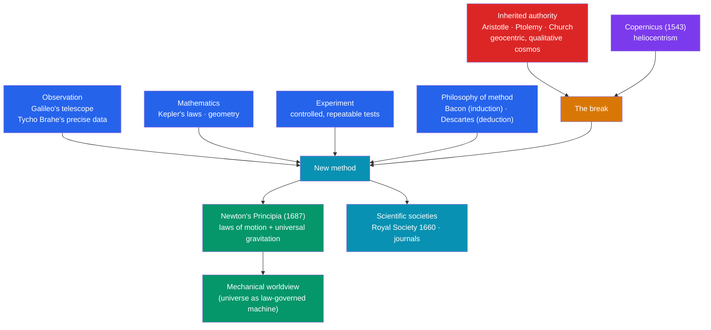

# 🔭 The Scientific Revolution

> [!abstract] TL;DR
> Between roughly **1543 and 1687**, Europeans transformed how they understood nature — replacing the inherited authority of **Aristotle** and the Church with **observation, experiment, and mathematics**. It opened with **Copernicus's** heliocentric model (1543), which moved the Earth from the center of the cosmos, and it climaxed with **Newton's** *Principia* (1687), which unified the heavens and the earth under universal laws of motion and gravitation. Along the way, **Galileo** turned the telescope on the sky and championed the mathematical, experimental method; **Kepler** derived the laws of planetary orbits from **Tycho Brahe's** data; and **Bacon** and **Descartes** articulated rival visions of method (empirical induction vs. rational deduction). The period established the **mechanical worldview** — the universe as a law-governed machine — and the social institution of science, embodied in new **scientific societies** (the Royal Society, 1660).

## Intuition — analogy first

For nearly 2,000 years, understanding nature meant **consulting the manual** — the works of Aristotle and Ptolemy, refined by generations of commentators. If you wanted to know why objects fall or how the planets move, you looked up the authoritative answer. Knowledge was a settled inheritance to be interpreted, the way a lawyer interprets a founding statute.

The Scientific Revolution is the moment Europe stops trusting the manual and starts **running its own tests**. Instead of asking "What did Aristotle say heavy objects do?", Galileo rolls balls down inclined planes and *times them*. Instead of assuming the heavens are perfect and unchanging, he points a telescope and sees mountains on the Moon and moons around Jupiter — things the manual said couldn't exist. Instead of describing motion in words, he and his successors insist that "the book of nature is written in the language of mathematics" and demand equations.

The revolution is not any single discovery but a change in **what counts as an answer**: not the citation of an ancient authority, but a claim you can *measure, calculate, and repeat*. Once that standard takes hold, knowledge stops being a fixed inheritance and becomes a self-correcting, cumulative project — which is exactly what modern science is.

---

## How It Works — From Authority to Experiment

## Key Concepts

### The Old Order It Overthrew

Pre-revolutionary natural philosophy rested on two pillars:
- **Aristotelian physics** — a qualitative account of a cosmos of natural places, where heavy objects fall to seek the center and the heavens are made of a perfect, unchanging fifth element.
- **Ptolemaic astronomy** — an Earth-centered (**geocentric**) model in which the Sun, Moon, planets, and stars revolve around a stationary Earth, its complexities patched with epicycles.

This synthesis, absorbed into medieval Christian thought, carried the weight of both ancient and ecclesiastical **authority** — which is precisely what the revolution learned to question.

### Heliocentrism: Copernicus to Kepler

- **Nicolaus Copernicus** (1473–1543) proposed a **Sun-centered (heliocentric)** cosmos in *De revolutionibus orbium coelestium* (1543), published as he died. It was simpler in some respects but still used perfect circles.
- **Tycho Brahe** (1546–1601) compiled the most **precise naked-eye astronomical observations** ever made — the empirical raw material for what followed.
- **Johannes Kepler** (1571–1630), using Tycho's data, discovered that planets move in **ellipses**, not circles, formulating his **three laws of planetary motion** (published 1609 and 1619) — the first mathematically exact description of the heavens.

### Galileo and the Experimental-Mathematical Method

**Galileo Galilei** (1564–1642) is pivotal on two fronts:
- **Observation.** With an improved **telescope** (from 1609), he discovered the Moon's mountains, the phases of Venus, sunspots, and the four large **moons of Jupiter** (the "Galilean moons") — evidence incompatible with a perfect, Earth-centered heaven.
- **Method.** He treated motion **quantitatively**, using experiments (e.g., inclined planes) and famously declared that the "book of nature is written in the language of mathematics." His advocacy of Copernicanism led to his **condemnation by the Inquisition (1633)** and house arrest — the era's starkest clash between the new science and religious authority.

### Two Philosophies of Method: Bacon and Descartes

The revolution needed a theory of *how* to know:

| Thinker | Method | Core idea |
|---|---|---|
| **Francis Bacon** (1561–1626) | **Empiricism / induction** | Knowledge is built up from systematic **observation and experiment**; *Novum Organum* (1620) proposed a new inductive logic to replace Aristotle |
| **René Descartes** (1596–1650) | **Rationalism / deduction** | Certain knowledge is derived by **reason** from indubitable first principles ("*Cogito, ergo sum*"); pioneered analytic geometry and mechanistic philosophy |

Their traditions — reasoning **up from data** vs. **down from principles** — are the two poles the actual practice of science combines.

### Newton's Synthesis and the Mechanical Worldview

**Isaac Newton** (1643–1727) unified the strands in *Philosophiæ Naturalis Principia Mathematica* (1687). His **three laws of motion** and the law of **universal gravitation** explained, with a single mathematical framework, both **Kepler's** planetary ellipses and **Galileo's** falling bodies — demonstrating that the *same* laws govern the heavens and the earth. This cemented the **mechanical worldview**: nature as a vast, orderly, mathematically describable **machine** operating by discoverable laws. (For the physics itself, see cross-vault [[_MOC_Physics_Master]].)

### The New Institutions of Science

Science became a **collective, public enterprise**:
- The **Royal Society of London** (chartered **1660**) and the **French Académie des Sciences** (1666) institutionalized experiment, demonstration, and peer scrutiny.
- **Scientific journals** — the Royal Society's *Philosophical Transactions* (1665) — created a permanent, cumulative record, made possible by the [[The_Printing_Revolution]], which let precise data and diagrams circulate identically across Europe.
- The ethos of **skepticism toward authority, empirical testing, and open communication** distinguishes this new practice from earlier natural philosophy.

## Primary Sources & Examples

- **Copernicus, *De revolutionibus orbium coelestium* (1543).** The book that displaced the Earth from the center of the universe; its cautious, technical presentation nonetheless launched the "Copernican Revolution."
- **Galileo, *Sidereus Nuncius* ("Starry Messenger," 1610).** His report of telescopic discoveries — Jupiter's moons, lunar mountains — that provided observational ammunition against the geocentric, perfect-heavens model.
- **Galileo, *Dialogue Concerning the Two Chief World Systems* (1632).** The work that provoked his Inquisition trial; a vivid dramatization of the confrontation between Copernican and Ptolemaic astronomy.
- **Newton, *Principia Mathematica* (1687).** The capstone of the revolution: the mathematical laws of motion and universal gravitation, arguably the most influential scientific book ever written.

## Common Pitfalls / Misconceptions

- **"Science and religion were simply at war."** The picture is more tangled: many key figures (Kepler, Boyle, Newton himself) were deeply religious and saw their work as uncovering God's rational design. Galileo's trial was a dramatic conflict but not the whole story.
- **"It was a sudden, clean break made by lone geniuses."** It unfolded over ~150 years, built on medieval and Islamic astronomy and mathematics (see the Islamic Golden Age), and depended on data-gatherers like Tycho and communities like the Royal Society, not solitary heroes.
- **"Everyone accepted heliocentrism at once."** Copernicanism was resisted for over a century on scientific, religious, and common-sense grounds (the Earth *feels* stationary); Kepler's ellipses and Galileo's evidence were needed to win it, and Newton to complete it.
- **"'Scientific Revolution' is an uncontested fact."** The term was coined later (popularized by Alexandre Koyré and Herbert Butterfield in the 20th century), and historians debate how revolutionary and how unified it really was.
- **"Bacon or Descartes 'invented the scientific method.'"** They articulated influential but one-sided *ideals* (pure induction; pure deduction); real science blends observation, experiment, and mathematics rather than following either alone.

## Related Concepts

- [[_MOC_Renaissance_Reformation|↑ Section MOC]] — the section hub
- [[The_Printing_Revolution]] — the technology that let exact data, star tables, and diagrams be reproduced and built upon internationally
- [[Humanism_and_the_Arts]] — the humanist "return to the sources" and to direct observation carried over into the study of nature
- [[The_Italian_Renaissance]] — the mathematical and empirical culture of the Italian city-states (and Galileo's Padua/Florence) seeded the new science
- Cross-vault: [[_MOC_History_of_Science]] — the dedicated history-of-science thread that continues this story into the Enlightenment and beyond
- Cross-vault: [[_MOC_Physics_Master]] — the actual physics (Newton's laws, gravitation, mechanics) born in this period

## Review Questions

1. Explain what was "revolutionary" about the Scientific Revolution in terms of *what counts as a valid answer*, contrasting reliance on Aristotelian/Ptolemaic authority with the new emphasis on observation, experiment, and mathematics.
2. Trace the heliocentric argument from Copernicus through Tycho Brahe and Kepler to Galileo. What did each contribute, and why was Kepler's move to ellipses important?
3. How did Newton's *Principia* (1687) unify the work of Galileo and Kepler, and what is meant by the "mechanical worldview" it helped establish? Contrast Bacon's and Descartes's methods.

## Sources

- Shapin, S. (1996). *The Scientific Revolution*. University of Chicago Press
- Kuhn, T.S. (1957). *The Copernican Revolution*. Harvard University Press
- Galilei, G. (1610). *Sidereus Nuncius* ("Starry Messenger")
- Newton, I. (1687). *Philosophiæ Naturalis Principia Mathematica*

#history #science #revolution #newton #galileo #heliocentrism
