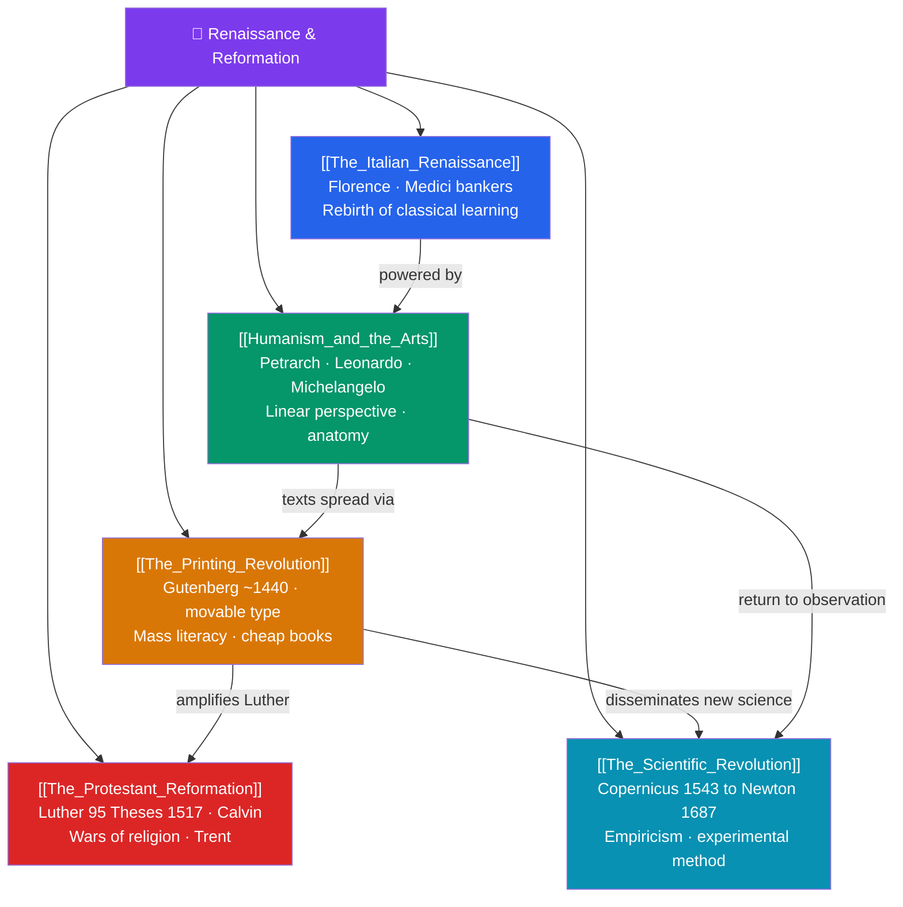

# 🗺️ Renaissance & Reformation — Map of Content

> [!abstract] What This Section Covers
> Between the 14th and 17th centuries, Europe reinvented itself. The **Italian Renaissance**, funded by Florentine bankers like the Medici, revived classical learning and made art, wealth, and civic pride the engines of a new age. **Humanism and the arts** — from Petrarch's rediscovery of the classics to Leonardo, Michelangelo, and Raphael's mastery of perspective and anatomy — placed human potential at the center of thought. Gutenberg's **printing revolution** (c. 1440) then multiplied books, spread literacy, and turned local ideas into continent-wide movements. That new medium supercharged the **Protestant Reformation**: Luther's 95 Theses of 1517, Calvin's theology, and the wars of religion that followed permanently split Western Christianity. Meanwhile the **Scientific Revolution**, from Copernicus's heliocentrism (1543) through Galileo and Kepler to Newton's *Principia* (1687), replaced inherited authority with observation, mathematics, and experiment. These five notes trace how medieval certainties gave way to the modern mind.

## Concept Map

## Learning Path

1. [[The_Italian_Renaissance]] — The city-states, the Medici, and the rebirth of classical learning in 14th–16th century Italy.
2. [[Humanism_and_the_Arts]] — Renaissance humanism and the artistic breakthroughs of perspective, realism, and the human form.
3. [[The_Printing_Revolution]] — Gutenberg's movable type and how cheap print transformed knowledge and society.
4. [[The_Protestant_Reformation]] — Luther, Calvin, the fracturing of Western Christianity, and the wars of religion.
5. [[The_Scientific_Revolution]] — The shift from ancient authority to empirical method, from Copernicus to Newton.

## All Notes at a Glance

| Note | Difficulty | What You'll Learn |
|------|------------|-------------------|
| [[The_Italian_Renaissance]] | Beginner → Intermediate | Florence and the Medici, patronage, city-state politics, revival of Greco-Roman culture |
| [[Humanism_and_the_Arts]] | Intermediate | Petrarch and humanism, Leonardo/Michelangelo/Raphael, linear perspective, classical ideals |
| [[The_Printing_Revolution]] | Beginner → Intermediate | Gutenberg's press, movable type, spread of literacy, standardization, information revolution |
| [[The_Protestant_Reformation]] | Intermediate | Luther's 95 Theses, sola scriptura, Calvinism, the English Reformation, Counter-Reformation |
| [[The_Scientific_Revolution]] | Intermediate → Advanced | Heliocentrism, Galileo and Kepler, Bacon and Descartes, Newton's Principia, the scientific method |

## Key Questions This Section Answers

- Why did the Renaissance begin in the wealthy city-states of Italy?
- What did Renaissance humanism mean, and how did it change art and thought?
- How did the printing press turn Luther's protest into a Europe-wide Reformation?
- Why did the Reformation permanently divide Western Christianity, and what were the consequences?
- How did the Scientific Revolution replace ancient authority with observation and experiment?

## Related Sections

- [[_MOC_History_Master|↑ History Master MOC]]
- [[_MOC_Islamic_Golden_Age|← The Islamic Golden Age]]
- [[_MOC_Exploration_Colonialism|→ Exploration & Colonialism]]
- Cross-vault: [[_MOC_Physics_Master]] — the Scientific Revolution and the birth of modern physics

#MOC #History #Renaissance
