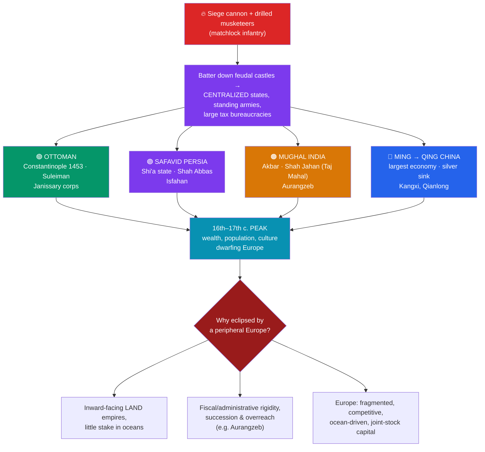

# 🏛️ Gunpowder Empires: Ottoman, Mughal, Qing

> [!abstract] TL;DR
> While Iberian ships were probing the oceans, the wealthiest and most populous states of the early modern world were **land empires in Asia** built on mastery of the cannon and the matchlock musket. The historians **Marshall Hodgson** and **William McNeill** grouped three great Islamic states as the **"gunpowder empires"** — the **Ottomans** (whose Mehmed II took **Constantinople in 1453** and whose **Suleiman the Magnificent** ruled at the 16th-century peak), **Safavid Persia** (a Shi'a state under Shah Abbas), and **Mughal India** (Akbar, Shah Jahan of the Taj Mahal, and Aurangzeb). To these, historians add **Ming and Qing China**, the largest economy on Earth. Gunpowder let centralizing rulers batter down feudal castles and field disciplined infantry, funding vast bureaucracies and cosmopolitan cultures. The key comparative question is **why these mighty empires were eventually eclipsed by a fragmented, peripheral Europe** — a puzzle historians answer with a mix of internal rigidity, missed maritime opportunities, and Europe's competitive, ocean-driven dynamism.

## Intuition — analogy first

In 1600, if a visitor from Mars had been asked to bet on which civilization would dominate the coming centuries, **Europe would have looked like the long shot.** The smart money was on Asia. The Ottomans controlled the eastern Mediterranean and had twice reached the gates of Vienna. Mughal India produced perhaps a **quarter of the world's manufactured goods** and its emperors sat on jeweled thrones that made European kings look shabby. Ming and then Qing China was the largest, richest, most administratively sophisticated state on the planet, drawing in half the world's silver to pay for its tea, silk, and porcelain.

The "gunpowder empire" idea captures *why* these states were so powerful: the same technology — big siege cannon and drilled musketeers — that let European monarchs crush their nobles' castles also let Asian rulers do the same, replacing patchworks of local lords with **centralized, tax-collecting, standing-army states**. The genuinely hard historical question is not why Europe was strong but why these giants **stumbled**. The answer is not that Asia was "stagnant" — a lazy myth — but that these were **land empires facing inward across continents**, while a handful of small, quarrelsome, cash-strapped European states turned **outward to the oceans**, where the real leverage of the next three centuries turned out to lie.

---

## How It Works — Gunpowder, Centralization, and the Great Divergence

## Key Concepts

### The "Gunpowder Empires" Thesis

The phrase comes from **Marshall G.S. Hodgson**'s *The Venture of Islam* (1974) and was developed by **William H. McNeill** (*The Pursuit of Power*, 1982). The core claim: in the 15th–16th centuries, a set of empires rose to dominance by **monopolizing expensive gunpowder weaponry** — heavy siege artillery and firearm-equipped infantry — which only well-organized, cash-rich central states could afford. Cannon rendered the old **stone fortress obsolete**, tilting power decisively toward centralizing monarchs and away from local lords and cavalry aristocracies. Hodgson applied the term specifically to the three great **Islamic** empires (Ottoman, Safavid, Mughal); many textbooks extend the logic to **Ming/Qing China**, **Tokugawa Japan**, and **Muscovite Russia**. The thesis is illuminating but **debated** — critics note gunpowder was not always decisive and that older cavalry and administrative traditions mattered enormously.

### The Ottoman Empire

The **Ottomans** built the longest-lived of the three (c. 1299–1922). Turning points:
- **Mehmed II ("the Conqueror") took Constantinople in 1453**, ending the Byzantine Empire (see the Medieval world) and using enormous bombards to breach the city's ancient walls — a signature demonstration of gunpowder's power. The city became **Istanbul**, capital of a Sunni empire straddling Europe, Asia, and Africa.
- **Suleiman I ("the Magnificent," r. 1520–66)** marked the peak: conquests in Hungary, the **1529 siege of Vienna**, naval dominance in the Mediterranean, a great legal codification (earning him the epithet *Kanuni*, "the Lawgiver"), and the architecture of **Mimar Sinan**.
- Military backbone: the **Janissaries**, an elite standing infantry corps recruited via the ***devshirme*** (a levy of Christian boys) and among the first professional firearm-armed infantry in the world.

### Safavid Persia

Founded by **Shah Ismail I in 1501**, the **Safavids** made **Twelver Shi'a Islam** the state religion of Persia — a decision that permanently shaped the sectarian map of the Middle East and set the Safavids against the Sunni Ottomans and Mughals. Under **Shah Abbas I ("the Great," r. 1588–1629)**, the empire reformed its army with firearms and artillery, curbed the tribal Qizilbash cavalry, and built the magnificent capital of **Isfahan** ("Isfahan is half the world"), a center of art, carpets, and trade. The Safavids were the smallest and militarily most pressured of the three, squeezed between powerful Sunni neighbors.

### Mughal India

The **Mughals** ruled most of the Indian subcontinent (1526–1857 nominally), founded by **Babur**, who used artillery and field tactics to win the **First Battle of Panipat (1526)**.

| Emperor | Reign | Signature |
|---|---|---|
| **Akbar the Great** | 1556–1605 | Religious tolerance (abolished the *jizya* tax on non-Muslims), the syncretic *Din-i Ilahi*, and a sophisticated revenue system (*mansabdari*, Todar Mal's land assessment) |
| **Jahangir / Shah Jahan** | 1605–58 | Zenith of art and architecture; **Shah Jahan built the Taj Mahal** (c. 1632–53) as a mausoleum for Mumtaz Mahal |
| **Aurangzeb** | 1658–1707 | Vast territorial expansion but religious intolerance (reimposed the *jizya*), costly Deccan wars, and overreach that strained the empire and hastened its fragmentation |

At its height Mughal India was extraordinarily wealthy, generating a large share of global manufacturing (especially **cotton textiles**) — the very market that drew the European trading companies.

### Ming and Qing China

**Ming China (1368–1644)** launched **Zheng He's** vast treasure-fleet voyages (1405–33) — reaching East Africa with ships dwarfing anything Iberia would build — then, in a fateful policy reversal, **turned away from state-sponsored ocean exploration**, restricting maritime trade. The **Qing (1644–1912)**, a Manchu dynasty, presided under **Kangxi and Qianlong** over the largest, most populous, and among the richest states on Earth, absorbing much of the world's **silver** in exchange for tea, silk, and porcelain. New World crops from the [[The_Columbian_Exchange|Columbian Exchange]] (maize, sweet potato) helped drive an enormous population boom. China's later 19th-century crises (the Opium Wars) lay well beyond this early-modern peak.

### Why Europe Eventually Eclipsed Them — "The Great Divergence"

Explaining the reversal is one of the great debates in global history:
- **Land vs. sea.** The gunpowder empires were **continental land powers** with limited incentive to invest in oceanic trade and naval power; small, resource-poor European states turned outward to the seas, where the profits of the new global economy (and later industrialization) concentrated.
- **Competition vs. unity.** Europe's very **fragmentation** bred relentless military and commercial competition (and could not suppress innovators — a censored idea could flee to a rival state), whereas large unified empires could enforce conservative choices (Ming maritime withdrawal; Ottoman print restrictions).
- **Institutions and capital.** The European **joint-stock company** and emerging financial markets (see [[Mercantilism_and_Colonial_Empires]]) mobilized private capital for risky overseas ventures at a scale the Asian empires' state-and-tribute systems did not.
- **Internal strains.** Succession crises, fiscal rigidity, and overextension (e.g., **Aurangzeb's** ruinous Deccan wars) weakened the empires from within.
- Scholars such as **Kenneth Pomeranz** (*The Great Divergence*, 2000) stress that Asia was **not backward**; the gap opened **late** (18th–19th c.) and owed much to **coal and colonies** (New World resources and slave-worked plantations) that Europe could exploit — a warning against reading European dominance as inevitable or as proof of prior superiority.

## Primary Sources & Examples

- **The *Ain-i-Akbari* (c. 1590), by Abu'l-Fazl:** The administrative gazetteer of Akbar's empire — detailing revenue, the *mansabdari* ranks, the court, and the provinces — a remarkable window into the sophistication of Mughal statecraft.
- **The Süleymaniye Mosque, Istanbul (completed 1557):** Mimar Sinan's masterwork under Suleiman, a monument to Ottoman wealth, engineering, and imperial self-image at the empire's zenith.
- **The Taj Mahal (c. 1632–53):** Shah Jahan's marble mausoleum at Agra is at once the emblem of Mughal artistic achievement and, in the treasury it consumed, a symptom of the extravagance later critics linked to fiscal strain.

## Common Pitfalls / Misconceptions

- **"Asia was stagnant and Europe was destined to win."** In 1600 these empires were **richer and more powerful than any European state**. The divergence came **late** and was contingent, not preordained — projecting later European dominance backward is a classic error.
- **Treating "gunpowder empires" as an unchallenged fact.** It is a **useful but contested thesis**; gunpowder was not the sole or always-decisive factor, and cavalry, administration, and religion mattered greatly.
- **Lumping the three Islamic empires together as identical.** They were often **rivals and enemies** — Sunni Ottomans and Mughals against Shi'a Safavids — with distinct languages, institutions, and trajectories.
- **Reading the Taj Mahal or Zheng He as mere spectacle.** Each encodes a serious historical argument — about Mughal wealth and expenditure, and about China's deliberate turn *away* from the oceans just as Europe turned toward them.

## Related Concepts

- [[_MOC_Exploration_Colonialism|↑ Section MOC]] — the section hub
- [[The_Age_of_Exploration]] — the European maritime turn that these Asian land empires, controlling the old trade routes, provoked Europeans to bypass
- [[Mercantilism_and_Colonial_Empires]] — the chartered companies (EIC, VOC) that traded with, then subverted, the Mughal and other Asian states
- [[The_Columbian_Exchange]] — New World crops and silver flowed into Qing China and the wider Asian economy, tying these empires into the global system
- Cross-vault: [[_MOC_Islamic_Golden_Age]] — the earlier flowering of Islamic science, statecraft, and culture on which the Ottoman, Safavid, and Mughal empires built

## Review Questions

1. Who coined the "gunpowder empires" concept, which three empires does it classically name, and what did gunpowder weaponry do to the balance between centralizing rulers and local feudal lords?
2. Match each ruler to their empire and achievement: Mehmed II, Suleiman the Magnificent, Shah Abbas I, Akbar, Shah Jahan, Aurangzeb. What does Aurangzeb's reign illustrate about internal sources of imperial decline?
3. Lay out at least three explanations for why these wealthy Asian empires were eventually eclipsed by a peripheral Europe, and explain why Kenneth Pomeranz's "Great Divergence" argument cautions against seeing that outcome as inevitable.

## Sources

- Hodgson, M.G.S. (1974). *The Venture of Islam, Vol. 3: The Gunpowder Empires and Modern Times*. University of Chicago Press
- McNeill, W.H. (1982). *The Pursuit of Power: Technology, Armed Force, and Society since A.D. 1000*. University of Chicago Press
- Pomeranz, K. (2000). *The Great Divergence: China, Europe, and the Making of the Modern World Economy*. Princeton University Press
- Dale, S.F. (2010). *The Muslim Empires of the Ottomans, Safavids, and Mughals*. Cambridge University Press

#history #exploration #colonialism #ottoman #mughal #qing #early-modern
