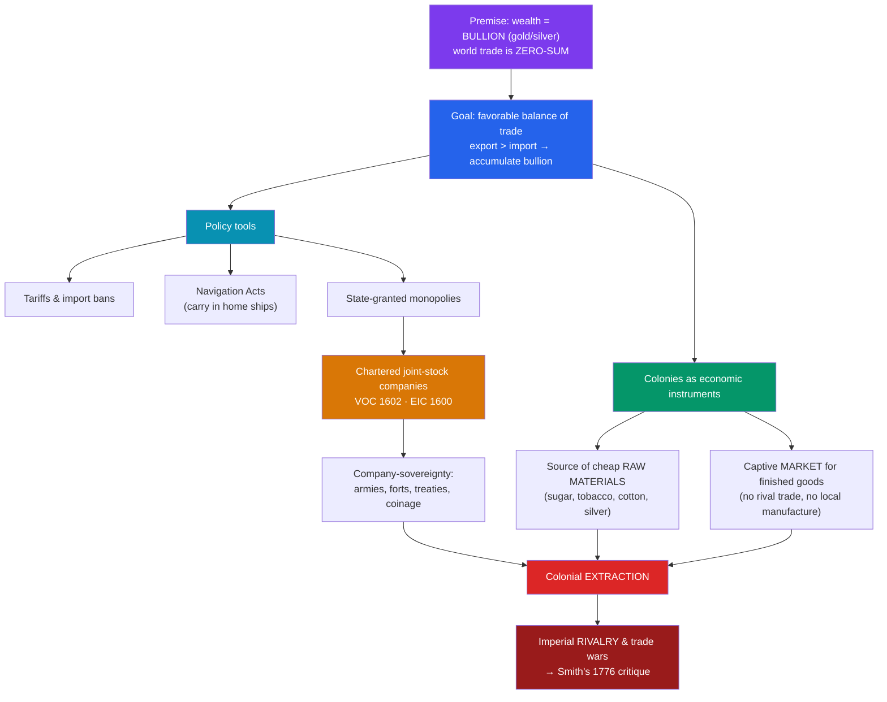

# 💰 Mercantilism and Colonial Empires

> [!abstract] TL;DR
> **Mercantilism** was the dominant economic doctrine of the European colonial powers from roughly the **16th to the late 18th century**. Its core assumptions were that national wealth was measured in **bullion** (gold and silver), that global trade was a **zero-sum game**, and that a state should therefore run a **favorable balance of trade** — exporting more than it imports — protected by tariffs and navigation laws. In this scheme, **colonies existed to serve the mother country**: as sources of cheap raw materials and as **captive markets** for its finished goods, forbidden from trading freely or manufacturing for themselves. States chartered great **joint-stock monopoly companies** — most powerfully the Dutch **VOC (1602)** and the English **East India Company (1600)** — that fused commerce with sovereignty, wielding armies, forts, and treaty-making power. Mercantilism organized centuries of **colonial extraction** and fueled the rise and violent **rivalry of European empires**, until **Adam Smith's** *The Wealth of Nations* (1776) mounted the classic intellectual assault on its foundations.

## Intuition — analogy first

Imagine the world economy as a **poker table with a fixed number of chips on it**. In the mercantilist worldview, the chips are gold and silver, and there is no way to create more of them at the table — so the only way for your nation to get richer is to **win chips away from the other players**. Trade is not mutual benefit; it is combat by other means. Every coin that leaves your country to pay for a foreign import is a chip lost; every coin that flows in from an export is a chip won.

Given that logic, a rational state does two things. First, it **stacks the deck**: high tariffs on imports, subsidies and monopolies for home producers, and laws requiring goods to travel in its own ships. Second, it acquires **colonies as private supply rooms** attached to the table — places that must sell it raw sugar, tobacco, and cotton cheaply, must buy its finished cloth and tools, and are legally barred from dealing with rival players or setting up their own factories. The colony is not a partner in the game; it is a resource the mother country plays *with*. When you grasp that the chips are believed to be finite, every feature of the colonial system — the trade wars, the smuggling, the navigation acts, the armed trading companies — follows almost automatically.

---

## How It Works — From Bullionist Theory to Chartered Extraction

## Key Concepts

### The Mercantilist Doctrine

"Mercantilism" is a label applied *retrospectively* (popularized by Adam Smith and later Gustav von Schmoller) to a loose family of policies rather than a single codified theory. Its recurring principles were:
- **Bullionism** — a nation's power and wealth were equated with its stock of **precious metals**. Spain's flood of American silver from **Potosí** (in modern Bolivia) and Mexico seemed to confirm this — though the resulting inflation (the "**Price Revolution**") arguably *weakened* Spain, an early clue that the theory was flawed.
- **Zero-sum trade** — since world bullion was finite, one nation's gain was another's loss.
- **Favorable balance of trade** — export more than you import, so bullion flows in on net.
- **Protectionism and monopoly** — tariffs, import bans, subsidies to domestic industry, and exclusive trading rights.
- **A large, productive, low-wage population** and a strong merchant marine were national assets.

### Colonies as Economic Instruments

In the mercantilist logic, colonies were valuable **only insofar as they enriched the mother country**. This produced a characteristic set of rules:
- Colonies supplied **raw materials** (sugar, tobacco, cotton, furs, silver) cheaply.
- Colonies were a **captive market** obliged to buy the mother country's **finished manufactures**.
- Colonies were typically **forbidden to manufacture** competing goods or to trade with rival empires.
- Trade was funneled through the mother country in its **own ships** — codified in England's **Navigation Acts (from 1651)**, which reserved colonial trade for English/British vessels and helped provoke the Anglo-Dutch Wars.

These constraints bred pervasive **smuggling** and, in the American colonies, deep resentment — the friction over trade and taxation that fed into the American Revolution.

### The Great Chartered Companies

To pursue trade too risky or capital-intensive for individuals, states granted **royal charters** to **joint-stock companies** with monopoly rights over a region — an early form of the modern corporation that also exercised quasi-state power.

| Company | Founded | Charter power |
|---|---|---|
| **English East India Company (EIC)** | **1600** | Monopoly on English trade east of the Cape; grew to rule much of India with its own armies until the Crown took over in 1858 |
| **Dutch East India Company (VOC)** | **1602** | The first company to issue **publicly-traded shares**; could wage war, negotiate treaties, coin money, and execute — a corporate empire across the Indonesian archipelago |
| **Dutch West India Company (WIC)** | 1621 | Atlantic trade, including the slave trade and New Netherland |
| **Royal African Company** | 1660/72 | English monopoly on the West African trade, above all in **enslaved people** |
| **Hudson's Bay Company** | 1670 | Fur-trade monopoly across a vast swath of North America |

The **VOC** is often described as the first true **multinational corporation** and the origin of the modern **stock exchange** (Amsterdam). These companies show how thin the line was between commerce and conquest: the EIC's private army defeated the Nawab of Bengal at the **Battle of Plassey (1757)**, beginning direct company rule over millions.

### Systems of Colonial Extraction

Beyond trade rules, empires built institutions to pump wealth from colonies:
- **Spain's *encomienda* and *mita*** — forced Indigenous labor systems, the *mita* funneling conscripted workers into the deadly silver mines of Potosí.
- **The plantation complex** — sugar, tobacco, and cotton estates worked by enslaved Africans (see [[The_Atlantic_Slave_Trade]]).
- **The Portuguese *feitoria* network** and Dutch *factorij* trading posts.
- **Monopoly and tribute** extraction by the chartered companies (e.g., the EIC's revenue farming in Bengal after 1765).

### Rivalry and the Rise and Fall of Empires

Because trade was seen as zero-sum, mercantilism made **war and commerce inseparable**. The 17th–18th centuries saw a rolling contest: the **Anglo-Dutch Wars**, the wars of Louis XIV, and above all the global **Seven Years' War (1756–63)** — arguably the first "world war" — after which Britain displaced France as the dominant colonial power. Spain and Portugal, first movers, were gradually eclipsed by the Dutch and then the British.

### The Critique: Adam Smith and After

The intellectual demolition of mercantilism came with **Adam Smith's *The Wealth of Nations* (1776)**. Smith argued that:
- Wealth is not bullion but a nation's **productive capacity** (goods and services), so trade is **positive-sum**, not zero-sum.
- **Free trade** and specialization ("division of labor," comparative advantage) enrich all parties.
- Monopolies and the costs of empire often **impoverished** the mother country while enriching a narrow merchant class.

Smith's ideas, developed by David Ricardo and the classical economists, underpinned the 19th-century turn toward **free trade** — even as the extractive realities of empire persisted well beyond mercantilism's theoretical death.

## Primary Sources & Examples

- **Thomas Mun, *England's Treasure by Forraign Trade* (written c. 1630, published 1664):** The classic English statement of the balance-of-trade doctrine, arguing "the ordinary means... to encrease our wealth and treasure is by Forraign Trade, wherein wee must ever observe this rule; to sell more to strangers yearly than wee consume of theirs."
- **The English Navigation Acts (1651 onward):** Statutes requiring colonial goods to move in English ships and through English ports — the legal skeleton of mercantilist trade policy and a direct source of Anglo-Dutch conflict and later American grievance.
- **The VOC share certificate (1602 onward):** The Dutch East India Company's tradable shares, bought and sold on the Amsterdam bourse, are often cited as the birth of the modern stock market — commerce and empire capitalized by a broad investing public.

## Common Pitfalls / Misconceptions

- **Treating mercantilism as a single, rigorous theory.** It was a **retrospective label** for a bundle of overlapping policies and assumptions that varied by country and era, not a codified school like later classical economics.
- **Assuming bullion = wealth actually worked.** Spain's silver windfall produced **inflation and long-run decline** rather than durable power — a real-time refutation of the bullionist premise.
- **Seeing chartered companies as "just businesses."** The VOC and EIC held **sovereign powers** — armies, forts, courts, the right to wage war — blurring the line between corporation and state in ways with few modern parallels.
- **Mistaking the end of mercantilist *theory* for the end of *extraction*.** Smith's critique won the argument by the 19th century, but colonial extraction, forced labor, and imperial exploitation continued and even intensified under later "free-trade imperialism."

## Related Concepts

- [[_MOC_Exploration_Colonialism|↑ Section MOC]] — the section hub
- [[The_Age_of_Exploration]] — the voyages that created the overseas colonies mercantilism was designed to exploit
- [[The_Atlantic_Slave_Trade]] — the chartered slaving monopolies (e.g., the Royal African Company) and the plantation extraction that mercantilism organized
- [[The_Columbian_Exchange]] — the American silver and plantation commodities that flowed into the mercantilist system
- Cross-vault: [[_MOC_Finance_Master]] — the joint-stock company, the stock exchange, and balance-of-trade thinking are foundational to the history of finance and modern economics

## Review Questions

1. State the three core assumptions of mercantilism (on the nature of wealth, the nature of trade, and the goal of policy), and explain how each one shaped colonial policy toward raw materials and manufacturing.
2. Compare the English East India Company and the Dutch VOC. In what sense did these chartered companies exercise **sovereign** powers, and give one concrete example of a company acting as a state.
3. Summarize Adam Smith's critique of mercantilism in *The Wealth of Nations* (1776). Why did he argue that trade is positive-sum rather than zero-sum, and why does the *end of mercantilist theory* not mean the end of colonial extraction?

## Sources

- Smith, A. (1776). *An Inquiry into the Nature and Causes of the Wealth of Nations*. W. Strahan & T. Cadell
- Heckscher, E.F. (1935). *Mercantilism* (trans. 1955). George Allen & Unwin
- Findlay, R. & O'Rourke, K.H. (2007). *Power and Plenty: Trade, War, and the World Economy in the Second Millennium*. Princeton University Press
- Robins, N. (2006). *The Corporation That Changed the World: How the East India Company Shaped the Modern Multinational*. Pluto Press

#history #exploration #colonialism #economics #mercantilism #empire
