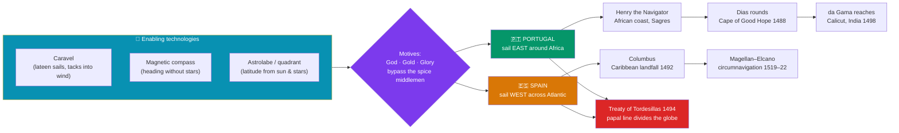

# ⛵ The Age of Exploration

> [!abstract] TL;DR
> Between roughly **1420 and 1600**, two small Iberian kingdoms — **Portugal** and **Spain** — used a new ship, the **caravel**, together with the **magnetic compass** and the **astrolabe**, to sail beyond the edges of the known Old World and stitch the continents into a single oceanic network. Portugal crept down the African coast under the patronage of **Prince Henry "the Navigator"**, rounded the Cape of Good Hope, and reached India when **Vasco da Gama** landed at Calicut in **1498**. Spain gambled on sailing *west*: **Christopher Columbus** made landfall in the Caribbean in **1492**, and **Ferdinand Magellan's** expedition completed the first circumnavigation of the globe (1519–1522). The drivers were a tangle of **"God, gold, and glory"** — crusading zeal, the lust for direct access to the **spice trade**, and dynastic prestige — and the two crowns split the non-European world between themselves in the **Treaty of Tordesillas (1494)**. The voyages opened an era of exchange, conquest, and colonization whose consequences were world-historical and, for many peoples, catastrophic.

## Intuition — analogy first

Imagine medieval Europe as a house whose only door to the wealth of Asia opens onto a **crowded, expensive hallway** controlled by other people. For centuries, the pepper, cinnamon, and silk that Europeans craved arrived overland and by short sea legs through a chain of middlemen — Indian, Persian, Arab, and finally Venetian merchants — each of whom marked up the price. By the time a sack of pepper reached Lisbon, it had passed through a dozen hands and the Ottomans sat astride the eastern end of the corridor.

The Iberians' insight was that if the hallway is blocked, you go around the *outside of the house*. Portugal reasoned that if Africa could be sailed around, a ship could reach the spice markets of India directly, cutting out every middleman. Spain, following Columbus's badly-mistaken arithmetic about the size of the Earth, bet that the shortest way around was to sail *west across the open Atlantic*. One bet paid off as planned; the other blundered into two entire continents nobody in Europe knew were there. Both required a ship that could sail *into* the wind and instruments to fix a position out of sight of land — and once those existed, the age of the closed hallway was over.

---

## How It Works — Enabling Technologies, the Two Iberian Routes, and Their Division

## Key Concepts

### Why Iberia, and Why Then?

The great oceanic push came not from the richest states (Ming China, the Ottomans, Mughal India) but from the **Atlantic fringe** of Europe. Several factors converged:
- **Geography and motive.** Portugal and Castile faced the open Atlantic and stood at the far, most expensive end of the Asian trade routes; they had the strongest incentive to find a way around the Venetian–Ottoman chokehold.
- **The *Reconquista* mindset.** Centuries of crusading war to expel Muslim rulers from Iberia (completed with the fall of **Granada in 1492**) produced a militarized, expansionist, religiously-charged elite looking for new frontiers.
- **State backing.** Unified, ambitious monarchies could fund and license voyages and enforce royal monopolies on their returns.

### Enabling Technologies

No single invention "caused" the voyages, but a **package of maritime technology** — much of it adapted from Arab, Chinese, and Mediterranean precedents — made open-ocean sailing survivable and repeatable.

| Technology | What it did | Origin / note |
|---|---|---|
| **Caravel** | Small, nimble ship with **lateen (triangular) sails** that could *tack* against the wind; later the larger **carrack (nau)** and **galleon** carried cargo and cannon | Portuguese development, ~1450s, blending Mediterranean and Arab rigging |
| **Magnetic compass** | Gave a reliable heading independent of sun or stars | Chinese origin, long transmitted via the Islamic world |
| **Astrolabe & quadrant** | Measured the angle of the sun or Pole Star to estimate **latitude** | Refined from Islamic astronomy; the mariner's astrolabe was a simplified version |
| **Portolan charts & rutters** | Accumulated coastal charts and written sailing directions (*roteiros*) | Built up voyage by voyage |

Crucially, **longitude** could not yet be measured at sea (that awaited the 18th-century chronometer), so navigators relied on **dead reckoning** and latitude sailing — a source of enormous error and risk.

### Portugal: Down the African Coast to India

- **Prince Henry "the Navigator"** (1394–1460) never sailed on the great voyages himself, but as patron he sponsored decades of expeditions creeping down the West African coast, gathering knowledge, gold, and — ominously — the first Portuguese trade in enslaved Africans. His base near **Sagres** became a byword for organized exploration.
- **Bartolomeu Dias** rounded the southern tip of Africa (the **Cape of Good Hope**) in **1488**, proving the Atlantic and Indian Oceans connected.
- **Vasco da Gama** completed the route, reaching **Calicut on the Malabar coast of India in May 1498** — the first direct sea link between Europe and the Asian spice markets. The Portuguese followed with a chain of fortified trading posts (*feitorias*) from Mozambique to **Goa** (1510) and **Malacca** (1511), building a seaborne commercial empire (the *Estado da Índia*).

### Spain: Westward into an Unknown World

- **Christopher Columbus** (Cristóbal Colón), a Genoese navigator sailing for the Castilian crown, argued the Indies could be reached by sailing west. He drastically **underestimated the Earth's circumference** — his voyage would have been fatal had two unknown continents not lain in the way. On **12 October 1492** he made landfall in the **Bahamas**, and went to his death insisting he had reached Asia.
- The name "**America**" came from the later voyager **Amerigo Vespucci**, who recognized the lands as a **New World** (a distinct continent), popularized on **Martin Waldseemüller's map of 1507**.
- The **Magellan–Elcano expedition (1519–1522)** sought a western route to the Spice Islands. **Ferdinand Magellan** (Fernão de Magalhães, a Portuguese sailing for Spain) found the strait at South America's tip that bears his name, crossed the vast Pacific, and was **killed in the Philippines in 1521**. **Juan Sebastián Elcano** brought the sole surviving ship, the *Victoria*, home — completing the **first circumnavigation of the globe** and proving the world was one connected ocean.

### Motives: "God, Gold, and Glory"

The mnemonic compresses a genuine three-part motivation:
- **God** — the crusading impulse to spread Christianity and outflank Islam, sharpened by the myth of **Prester John**, a hoped-for Christian ally in the East or Africa.
- **Gold** — direct access to the **spice trade** (pepper, cinnamon, cloves, nutmeg) and to African and later American gold and silver; spices were both luxury and preservative and commanded staggering markups.
- **Glory** — dynastic prestige, personal fortune, and titles for captains and crowns alike.

### The Treaty of Tordesillas (1494)

After Columbus's return, Portugal and Spain — with papal blessing (building on Pope Alexander VI's bulls) — agreed to divide the newly-contacted world between them. The **Treaty of Tordesillas (7 June 1494)** drew a **north–south meridian roughly 370 leagues west of the Cape Verde Islands**: lands to the **west** fell to **Spain**, lands to the **east** to **Portugal**. The line famously placed the eastern bulge of **Brazil** on the Portuguese side (which is why Brazil speaks Portuguese today). It was a breathtaking act of imperial presumption — two crowns partitioning continents whose inhabitants had no voice in the matter — and it was ignored by the later Dutch, English, and French entrants.

## Primary Sources & Examples

- **Columbus's *Diario* (Journal of the First Voyage), 1492–93:** Surviving through a summary by Bartolomé de las Casas, it records the first European impressions of the Caribbean and its Taíno inhabitants — already musing on how easily they "could be made to work" and converted, foreshadowing conquest.
- **Vasco da Gama's *Roteiro* (c. 1497–99):** An anonymous account of the first voyage to India, describing the rounding of Africa, the East African Swahili ports, and the wary reception at Calicut, where Portuguese trade goods were found cheap and unimpressive by Indian standards.
- **Antonio Pigafetta, *Report on the First Voyage Around the World* (c. 1525):** The Italian chronicler who survived the Magellan expedition left the richest eyewitness account of the circumnavigation, the Pacific crossing, and Magellan's death.

## Common Pitfalls / Misconceptions

- **"Educated people thought the Earth was flat."** False. The sphericity of the Earth had been known since antiquity; the real dispute was over its **size**. Columbus was *wrong* and his learned critics were *right* — he simply got lucky that unknown continents lay in his path.
- **"Discovery" language.** The Americas, Africa, and Asia were long inhabited and, in many cases, home to civilizations wealthier and more populous than Iberia. "Age of Exploration" reflects a European vantage point; from other perspectives it was an age of **contact, invasion, and conquest**.
- **Treating exploration as pure curiosity.** The voyages were **commercial and imperial ventures**, financed for profit and glory, and entangled from the very first Portuguese expeditions with slaving and violence.
- **Assuming European technical supremacy.** Chinese, Arab, and Indian navigators had crossed the Indian Ocean for centuries; **Zheng He's** Ming treasure fleets (1405–1433) dwarfed anything Iberia sent. Europe's edge lay less in raw technology than in the *combination* of oceangoing ships, cannon, and relentless state-backed commercial expansion.

## Related Concepts

- [[_MOC_Exploration_Colonialism|↑ Section MOC]] — the section hub
- [[The_Columbian_Exchange]] — the biological and ecological consequence that contact with the Americas immediately unleashed
- [[Mercantilism_and_Colonial_Empires]] — the economic theory and chartered companies that turned exploration into durable empire
- [[Gunpowder_Empires_Ottoman_Mughal_Qing]] — the powerful Asian land empires whose control of trade routes Europeans were trying to bypass
- Cross-vault: [[_MOC_Renaissance_Reformation]] — the intellectual and technological ferment of Renaissance Europe that formed the backdrop to the voyages

## Review Questions

1. Name the three enabling technologies of the Age of Exploration and explain what navigational problem each one solved. Why could Iberian sailors find their **latitude** but not their **longitude** at sea?
2. Contrast the Portuguese and Spanish strategies for reaching Asia. Who reached India by sea, in what year, and why did the Spanish approach lead instead to contact with the Americas?
3. What did the Treaty of Tordesillas (1494) do, on whose authority, and why is it a striking example of European imperial presumption? Give one lasting consequence still visible today.

## Sources

- Boorstin, D.J. (1983). *The Discoverers*. Random House
- Parry, J.H. (1963). *The Age of Reconnaissance: Discovery, Exploration and Settlement, 1450–1650*. University of California Press
- Abernethy, D.B. (2000). *The Dynamics of Global Dominance: European Overseas Empires, 1415–1980*. Yale University Press
- Crosby, A.W. (1997). *The Measure of Reality: Quantification and Western Society, 1250–1600*. Cambridge University Press

#history #exploration #colonialism #portugal #spain #navigation
