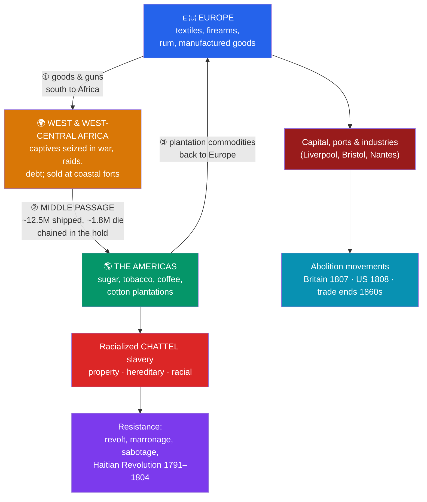

# ⛓️ The Atlantic Slave Trade

> [!abstract] TL;DR
> The transatlantic slave trade was the forced transportation of an **estimated ~12.5 million enslaved African people** across the Atlantic between the early 16th century and the 1860s — of whom roughly **10.7 million survived** the crossing known as the **Middle Passage**, and some **1.8 million died** at sea. It was long organized as a **triangular trade**: European manufactured goods and guns to Africa, enslaved Africans to the Americas, and plantation commodities — above all **sugar**, then tobacco, coffee, and cotton — back to Europe. To meet the labor demand created partly by the [[The_Columbian_Exchange|demographic collapse of Indigenous populations]], Europeans constructed a system of **racialized chattel slavery**: a novel, legally-codified regime in which African-descended people and their children were defined as inheritable **property**, justified after the fact by an invented ideology of race. Enslaved people **resisted** at every stage — from shipboard revolts to the **Haitian Revolution (1791–1804)** — and organized **abolition movements** eventually ended the legal trade (Britain 1807, United States 1808) and, later, slavery itself. Its legacies — the African diaspora, entrenched racism, and vast extracted wealth — remain foundational to the modern world.

## Intuition — analogy first

> [!warning] A note on gravity
> The device below is a lens, not a diminishment. The Atlantic slave trade destroyed and stole millions of individual human lives; no analogy can carry that weight. It is offered only to make the *mechanism* legible.

Think of the plantation colonies as a **machine that consumed human beings to produce sweetness**. Sugar was the first modern mass-luxury: cheap, addictive, endlessly profitable — and staggeringly lethal to grow and refine in tropical heat. The machine needed a constant input of labor, and the disease-driven collapse of the Indigenous population had removed one supply while European wage labor was unwilling and, ideologically, "unsuited."

So the machine's designers reached for a supply of forced labor that could be defined as permanent, inheritable, and — through the newly-built fiction of **race** — placed outside the community of people to whom obligations were owed. What makes the Atlantic system distinct from most slavery in prior history is this fusion: slavery became **chattel** (the person is property, like livestock), **hereditary** (the child of an enslaved mother is born enslaved), and **racial** (bondage mapped onto skin color and African descent). The triangular trade was the machine's supply chain, the Middle Passage its most murderous stage, and the whole apparatus was rational, bureaucratic, and immensely profitable — which is precisely what makes it so chilling.

---

## How It Works — The Triangular Circuit and Its Human Cost

## Key Concepts

### Scale and Chronology

The best modern figures come from the **Trans-Atlantic Slave Trade Database** (SlaveVoyages.org), which documents roughly **36,000 individual voyages**:
- **~12.5 million** Africans were embarked; **~10.7 million** disembarked alive in the Americas; roughly **1.8 million died during the Middle Passage** itself, with many more dying before embarkation and in the first "seasoning" year.
- The trade grew from Portuguese beginnings in the 16th century, peaked in the **18th century**, and continued (increasingly illegally) into the **1860s**.
- **Destinations:** contrary to common assumption, fewer than **4%** of captives went to British North America / the United States. The overwhelming majority went to **Brazil (~46%)** and the **Caribbean (~40%+)**, where brutal sugar regimes killed people so fast that populations did not reproduce and required constant replacement.
- **Carriers:** Portugal/Brazil and Britain were the largest carriers, followed by France, Spain, and the Netherlands.

### The Triangular Trade

The "triangle" is a simplification but a useful one:
1. **Europe → Africa:** ships carried manufactured **textiles, metalware, alcohol, and firearms**. Guns were both payment and an accelerant of the wars that produced captives.
2. **Africa → Americas (the Middle Passage):** the human cargo.
3. **Americas → Europe:** **sugar, molasses, rum, tobacco, coffee, and later cotton** — the commodities that repaid the whole circuit.

Not every voyage traced all three legs (many were direct two-leg runs), but the overall system linked the economies of four continents.

### The Middle Passage

The Atlantic crossing lasted roughly **6 to 12 weeks**. Captives were packed below decks in spaces often less than a meter high, chained in pairs, in conditions of extreme heat, filth, and disease. Dysentery ("the bloody flux"), smallpox, and dehydration were rampant; the **mortality averaged around 15%** and could be far higher. Some captives chose death, refusing food or leaping overboard; there were also shipboard **insurrections**. The **1781 *Zong* massacre** — in which the crew threw over 130 enslaved Africans into the sea to claim on insurance, treating human beings explicitly as jettisoned cargo — became a galvanizing symbol for abolitionists of the trade's moral monstrosity.

### Plantation and Sugar Economies

The demand engine was the **plantation complex**, especially **sugar**. Sugar cultivation and refining were capital-intensive, deadly, and hugely profitable. Colonies like **Saint-Domingue (Haiti)** — the single richest colony in the world in the 18th century — **Barbados, Jamaica, and Brazil** ran on the mass, expendable labor of the enslaved. The work regime was so lethal (and the sex ratio of imports so skewed toward men) that many Caribbean slave populations **declined without constant new imports** — a demographic signature of the system's savagery.

### The Construction of Racialized Chattel Slavery

Slavery is ancient and existed on every continent, including within Africa. What was **historically distinctive** about the Atlantic system was its fusion of three features:

| Feature | Meaning | Contrast with many older slaveries |
|---|---|---|
| **Chattel** | The enslaved person is legally **movable property**, bought and sold like an object | Many older forms allowed personhood, kinship, and paths out of bondage |
| **Hereditary** | Status passed through the mother (*partus sequitur ventrem*), making slavery **permanent and inheritable** | Many older forms were not automatically lifelong or heritable |
| **Racial** | Bondage was mapped onto **African descent and skin color**, and rationalized by an emerging pseudo-scientific ideology of race | Older slaveries were typically about capture/status, not "race" |

Colonial **slave codes** (e.g., Virginia's laws from the 1660s, the French *Code Noir* of 1685) hardened these principles into law. Crucially, the modern concept of **race was in large part a *product* of the slave system**, constructed to justify it — not a pre-existing fact that caused it.

### Resistance

Enslaved people were never passive. Resistance ranged from **everyday sabotage**, tool-breaking, feigned illness, and preservation of African languages, religions, and music, to open action:
- **Marronage** — escape to form free communities (*maroons*, *quilombos*), such as **Palmares** in Brazil, which resisted for most of the 17th century.
- **Revolts** — Jamaica's Tacky's War (1760), the German Coast uprising in Louisiana (1811), and many shipboard mutinies.
- The **Haitian Revolution (1791–1804)** — the only successful large-scale slave revolt to found a nation. Led figures included **Toussaint Louverture** and **Jean-Jacques Dessalines**; enslaved Haitians defeated French, Spanish, and British forces and established the second independent republic in the Americas, sending shockwaves through every slaveholding society.

### Abolition and Legacy

Abolition arose from a convergence of enslaved people's resistance, **Quaker and evangelical activism**, formerly enslaved writers, and shifting economic and political interests:
- Britain abolished the **slave trade in 1807**; the United States banned imports from **1808**; the British Empire abolished **slavery itself in 1833–34**; the U.S. did so via the **Thirteenth Amendment (1865)**; **Brazil**, the last in the Americas, only in **1888** (the *Lei Áurea*).
- Formerly enslaved authors — **Olaudah Equiano**, **Frederick Douglass**, **Ottobah Cugoano** — were central to shifting public conscience.
- **Legacies** run deep: the **African diaspora** and its cultures across the Americas; the entrenchment of anti-Black racism; the vast **capital and industries** that plantation and trade profits helped finance (the "**Williams thesis**" links Atlantic slavery to European industrialization, still debated); and ongoing debates over memory, reparations, and structural inequality.

## Primary Sources & Examples

- **Olaudah Equiano, *The Interesting Narrative of the Life of Olaudah Equiano* (1789):** One of the most influential first-person accounts of the Middle Passage and enslavement, written by a formerly enslaved man; a cornerstone text of the British abolition campaign.
- **The Brookes slave-ship diagram (1788):** The abolitionist engraving showing 482 human beings packed into a single ship's hold became one of history's most powerful pieces of political imagery, making the abstraction of the trade viscerally concrete.
- **The Trans-Atlantic Slave Trade Database (SlaveVoyages.org):** A modern scholarly compilation of some 36,000 voyages that underpins today's population estimates — a primary-source aggregation that transformed the field from guesswork to measurable history.

## Common Pitfalls / Misconceptions

- **"Slavery began with the Atlantic trade."** Slavery is ancient and near-universal historically. What was new was its **chattel, hereditary, racialized** character and its **industrial scale**. Precision here matters both historically and morally.
- **"Most enslaved Africans went to the United States."** No — under **4%** did. Brazil and the Caribbean received the vast majority; U.S. slavery's later prominence owes much to its rare **natural population growth**.
- **"Europeans simply captured people directly."** European traders overwhelmingly **purchased captives at the coast** from African intermediaries and states; African political and commercial elites were participants in supply, even as European demand, guns, and capital drove, distorted, and vastly expanded the system. Acknowledging African involvement does not dilute European responsibility for the transatlantic system.
- **"Enslaved people were passive victims."** Resistance was constant and took countless forms, culminating in the **Haitian Revolution** — the trade and slavery were fought at every turn.
- **"Abolition proves the system was benign."** Abolition came late, was resisted fiercely, and followed centuries of atrocity; it is a testament to the enslaved and the activists, not to the humanity of the institution.

## Related Concepts

- [[_MOC_Exploration_Colonialism|↑ Section MOC]] — the section hub
- [[The_Columbian_Exchange]] — the demographic collapse of Indigenous Americans created the labor vacuum the trade was built to fill
- [[Mercantilism_and_Colonial_Empires]] — the economic doctrine and chartered companies (including slaving monopolies like the Royal African Company) that structured the trade
- [[The_Age_of_Exploration]] — the Portuguese coastal voyages that opened the first European–African slave trafficking
- Cross-vault: [[West_African_Empires]] — the African states and societies (Songhai, and later Dahomey, Asante, Kongo) from which captives were taken and with which European traders dealt

## Review Questions

1. Give the approximate number of Africans embarked and the number who died in the Middle Passage. Where did the majority of captives actually go, and why is the common focus on British North America misleading?
2. What three features made Atlantic slavery **historically distinctive**, and in what sense was the modern concept of "race" a *product* rather than a *cause* of the system?
3. Describe two forms of enslaved resistance and explain the significance of the Haitian Revolution (1791–1804). Then list the key milestones of abolition, from the ending of the British trade in 1807 to Brazil's abolition of slavery in 1888.

## Sources

- Eltis, D. & Richardson, D. (2010). *Atlas of the Transatlantic Slave Trade*. Yale University Press
- Rediker, M. (2007). *The Slave Ship: A Human History*. Viking
- Williams, E. (1944). *Capitalism and Slavery*. University of North Carolina Press
- Equiano, O. (1789). *The Interesting Narrative of the Life of Olaudah Equiano*. London

#history #exploration #colonialism #slavery #abolition #atlantic-world
