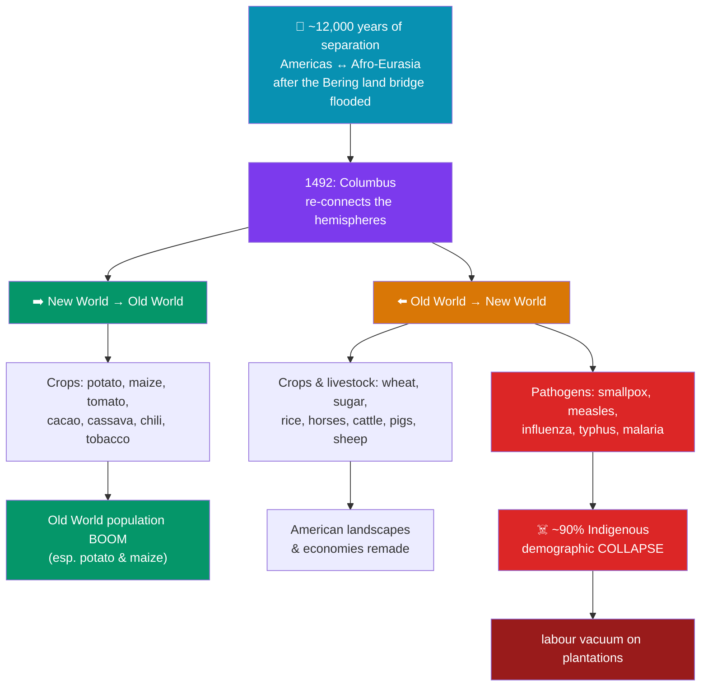

# 🌽 The Columbian Exchange

> [!abstract] TL;DR
> The **Columbian Exchange** — a term coined by the historian **Alfred W. Crosby** in **1972** — names the massive, two-way transfer of **plants, animals, people, and pathogens** between the Americas ("New World") and Afro-Eurasia ("Old World") set off by Columbus's 1492 voyages. American crops — the **potato, maize, tomato, cacao, cassava, chili, tobacco** — flowed east and transformed diets and populations from Ireland to China. Old World crops and livestock — **wheat, sugar, rice, horses, cattle, pigs, sheep** — flowed west and remade American landscapes. But the exchange was brutally **asymmetric**: Old World **diseases** — above all **smallpox**, alongside measles, influenza, and typhus — met populations with no acquired immunity and triggered a demographic catastrophe, killing an **estimated 90% of the Indigenous population of the Americas** within roughly a century and a half. The Columbian Exchange is the single clearest case of how European expansion rewrote not just politics but the **biology and ecology of the planet**.

## Intuition — analogy first

Picture two enormous aquariums that have stood **completely separate for roughly 12,000 years** — ever since rising seas drowned the land bridge between Asia and the Americas at the end of the last Ice Age. Each tank evolved its own fish, plants, and — critically — its own microbes. The organisms in each tank had spent millennia adapting to one another; the fish in each had "learned" to survive the germs in their own water.

In 1492 someone knocked out the glass wall between the tanks. Water, plants, and creatures sloshed both ways, and at first the result looks like enrichment: each tank gains dazzling new species. But the microbes are the hidden story. The Old World tank — with its dense cities, domesticated herds, and long history of epidemics — was a far more *microbially loaded* environment. When its water poured into the New World tank, the fish there had **no immunity whatsoever** to the incoming germs. The dazzling exchange of crops was real; so was the invisible plague that emptied the second tank. Understanding the Columbian Exchange means holding **both halves** in view at once — the potato *and* the pathogen.

---

## How It Works — A Bidirectional Transfer with an Asymmetric Toll

## Key Concepts

### Alfred Crosby and the Idea

Before Crosby, the aftermath of 1492 was told as a story of ships, conquistadors, and treaties. In ***The Columbian Exchange: Biological and Cultural Consequences of 1492*** (1972) and later ***Ecological Imperialism*** (1986), **Alfred W. Crosby** reframed it as a **biological event**: the sudden reunion of ecosystems separated since the Pleistocene. His argument helped found the field of **environmental history** and shifted attention from generals to germs, seeds, and livestock. The insight was that European success in the Americas rested less on swords than on an accidental **biological "shock troop"** of pathogens and invasive species.

### Crops That Reshaped the Old World

The eastward flow of American staples had demographic effects that dwarf most political history:

| Crop (American origin) | Where it transformed diets | Effect |
|---|---|---|
| **Potato** | Ireland, northern Europe, later Russia | Calorie-dense, grew in poor soils; fueled a European population surge — and, when the crop failed, the **Irish Famine (1845–52)** |
| **Maize (corn)** | Southern Europe, Africa, China | High-yield staple; spread rapidly in Ming/Qing China and West Africa |
| **Sweet potato & cassava** | China, Africa | Grew on marginal land, buffering against famine |
| **Tomato, chili pepper** | Italy, India, Southeast Asia | Redefined "traditional" cuisines that predate them by mere centuries |
| **Cacao, tobacco** | Global | New luxury and addictive commodities driving trade and taxation |

Historians credit New World crops — especially the potato and maize — with a significant share of the **global population growth** of the 17th–19th centuries.

### Crops, Livestock, and Landscapes Moving West

Westward went the foundations of European agriculture and, fatefully, the **plantation crops**:
- **Wheat, barley, rice, and sugarcane** — sugar above all would drive the plantation economies of Brazil and the Caribbean (see [[The_Atlantic_Slave_Trade]]).
- **Horses, cattle, pigs, sheep, goats, chickens.** The **horse** revolutionized the cultures of the Great Plains and the Argentine pampas within a few generations. Free-ranging **pigs and cattle** multiplied explosively, trampling native crops and reshaping whole ecosystems — Crosby's "**ecological imperialism**," in which European weeds, pests, and animals colonized the land alongside the colonists.

### The Great Dying: Disease and Demographic Collapse

The exchange's darkest dimension was biological. Old World populations, living for millennia among **domesticated herd animals** and in dense cities, had endured and partially adapted to a battery of **crowd diseases**. The Americas had few domesticable herd animals and thus far fewer such pathogens. When Europeans (and later enslaved Africans) arrived, they brought:
- **Smallpox** — the great killer, which swept ahead of the conquistadors. A smallpox epidemic devastated **Tenochtitlan in 1520**, weakening Aztec resistance to Cortés; another ravaged the **Inca** on the eve of Pizarro's arrival, killing the emperor Huayna Capac and triggering a succession war.
- **Measles, influenza, typhus, and later malaria and yellow fever** (the last two carried west with the slave trade).

With **no acquired or evolved immunity** ("virgin-soil epidemics"), Indigenous populations died in waves. Scholarly estimates of the pre-contact American population range widely (from ~40 million to over 100 million), but a **decline on the order of ~90% within about 150 years** is a common estimate. The scale is such that some scientists argue the reforestation of abandoned farmland pulled enough CO₂ from the atmosphere to contribute to the **cooling of the "Little Ice Age"** around 1600 — a candidate marker for the proposed *Anthropocene*.

### Consequences: Labor, Empire, and Ecology

The demographic collapse was not only a human tragedy but a driver of further catastrophe. As Indigenous labor forces were destroyed, European colonizers turned to **enslaved African labor** to work the sugar, tobacco, and later cotton plantations — directly linking the Columbian Exchange to the [[The_Atlantic_Slave_Trade|Atlantic slave trade]]. The exchange also globalized commodities (sugar, tobacco, chocolate, coffee) and permanently entangled the ecologies of continents that had evolved apart.

## Primary Sources & Examples

- **Bernardino de Sahagún, *Florentine Codex* (c. 1540s–1570s):** This bilingual Nahuatl–Spanish compilation preserves Indigenous eyewitness descriptions of the **1520 smallpox epidemic** in the Valley of Mexico — bodies covered in sores, whole households dying, survivors too weak to feed themselves — a rare record of the catastrophe in Native voices.
- **Bartolomé de las Casas, *A Short Account of the Destruction of the Indies* (1552):** The Dominican friar's polemic against Spanish cruelty also documents the staggering depopulation of the Caribbean islands within a single generation of contact.
- **The Great Plains horse cultures:** Within roughly a century of horses escaping and spreading from Spanish settlements, peoples such as the **Comanche and Lakota** built entirely new mounted, bison-hunting societies — a vivid example of the exchange reshaping cultures far ahead of any direct European presence.

## Common Pitfalls / Misconceptions

- **"Europeans deliberately used germs to conquer."** In the vast majority of cases, disease spread **unintentionally and invisibly**, often outrunning the colonizers themselves. (Documented cases of deliberate infection, such as smallpox-blanket episodes, are exceptional and later.) The catastrophe was structural, not primarily a weapon — which does not lessen its horror.
- **Thinking the exchange went "one way."** It was genuinely **bidirectional**: American crops reshaped Old World demography as profoundly as Old World diseases reshaped American demography.
- **Treating "traditional" cuisines as ancient.** Tomatoes in Italian cooking, chilies in Indian and Thai food, and potatoes in Ireland are all **post-1492** — a reminder of how recent and contingent much "timeless" heritage is.
- **Underrating the numbers.** The demographic collapse of the Americas was arguably the **largest population catastrophe in recorded human history**; casually rounding it away obscures a foundational fact of the modern world.

## Related Concepts

- [[_MOC_Exploration_Colonialism|↑ Section MOC]] — the section hub
- [[The_Age_of_Exploration]] — the voyages of contact that opened the exchange in the first place
- [[The_Atlantic_Slave_Trade]] — the demographic collapse created the labor vacuum that the trade in enslaved Africans was made to fill
- [[Gunpowder_Empires_Ottoman_Mughal_Qing]] — New World crops (maize, sweet potato) also drove population growth in Qing China and beyond, showing the exchange's global reach
- Cross-vault: [[The_Black_Death]] — an earlier crowd-disease catastrophe that illuminates how epidemics reshape societies, and why Old World populations carried the immunities they did

## Review Questions

1. Who coined the term "Columbian Exchange," in what work and year, and what disciplinary shift did the concept help create?
2. Explain *why* the exchange of diseases was so asymmetric. What features of Old World life produced the "crowd diseases," and why were Indigenous American populations so catastrophically vulnerable to them?
3. Give three American crops that reshaped Old World societies and three Old World introductions that reshaped the Americas, and connect the demographic collapse to the rise of the Atlantic slave trade.

## Sources

- Crosby, A.W. (1972). *The Columbian Exchange: Biological and Cultural Consequences of 1492*. Greenwood
- Crosby, A.W. (1986). *Ecological Imperialism: The Biological Expansion of Europe, 900–1900*. Cambridge University Press
- Mann, C.C. (2011). *1493: Uncovering the New World Columbus Created*. Alfred A. Knopf
- Diamond, J. (1997). *Guns, Germs, and Steel: The Fates of Human Societies*. W.W. Norton

#history #exploration #colonialism #environmental-history #disease #agriculture
