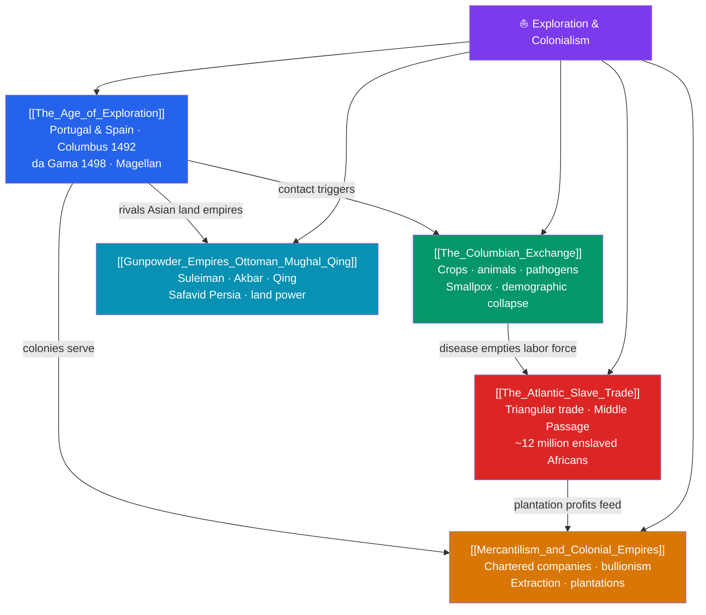

# 🗺️ Exploration & Colonialism — Map of Content

> [!abstract] What This Section Covers
> From the late 15th century, European maritime expansion knit the world's continents into a single, violent system. The **Age of Exploration** — driven by Portugal and Spain, with Columbus's 1492 landfall and Vasco da Gama's sea route to India (1498) — opened new oceans and empires. Contact triggered the **Columbian Exchange**, a two-way transfer of crops, animals, and pathogens: potatoes and maize enriched the Old World while smallpox and measles caused demographic catastrophe among Indigenous Americans. Labor demands and racism produced the **Atlantic slave trade**, whose triangular routes and horrific Middle Passage forcibly transported some twelve million Africans to plantation economies. **Mercantilism and colonial empires** organized this exploitation through chartered companies like the Dutch and British East India Companies and a bullionist drive to extract wealth. Beyond Europe, the **gunpowder empires** — Ottoman, Safavid, Mughal, and Qing — remained formidable land powers, showing that early modernity was a genuinely global, multipolar contest.

## Concept Map

## Learning Path

1. [[The_Age_of_Exploration]] — Portuguese and Spanish voyages, the motives of "God, gold, and glory," and the opening of oceanic routes.
2. [[The_Columbian_Exchange]] — The transfer of crops, animals, and diseases that reshaped diets and populations worldwide.
3. [[The_Atlantic_Slave_Trade]] — The triangular trade, the Middle Passage, and the plantation economies built on enslaved labor.
4. [[Mercantilism_and_Colonial_Empires]] — The economic theory and institutions that organized colonial extraction.
5. [[Gunpowder_Empires_Ottoman_Mughal_Qing]] — The powerful Islamic and East Asian land empires of the early modern world.

## All Notes at a Glance

| Note | Difficulty | What You'll Learn |
|------|------------|-------------------|
| [[The_Age_of_Exploration]] | Beginner → Intermediate | Henry the Navigator, Columbus, da Gama, Magellan, caravels, and the race for sea routes |
| [[The_Columbian_Exchange]] | Intermediate | Bidirectional transfer of maize/potato/horses, smallpox, and the demographic collapse of the Americas |
| [[The_Atlantic_Slave_Trade]] | Intermediate | Triangular trade, the Middle Passage, plantation slavery, and its economic and human legacy |
| [[Mercantilism_and_Colonial_Empires]] | Intermediate | Bullionism, chartered companies, the Dutch and British East India Companies, colonial extraction |
| [[Gunpowder_Empires_Ottoman_Mughal_Qing]] | Intermediate | Ottoman, Safavid, Mughal, and Qing states, gunpowder military power, and administrative sophistication |

## Key Questions This Section Answers

- Why did Europeans, rather than the wealthier Asian empires, launch the great age of oceanic exploration?
- What was the Columbian Exchange, and why was it catastrophic for Indigenous American populations?
- How did the Atlantic slave trade operate, and what were its economic and human consequences?
- How did mercantilism and chartered companies structure early colonial empires?
- Why should the early modern world be seen as multipolar, with the gunpowder empires rivaling Europe?

## Related Sections

- [[_MOC_History_Master|↑ History Master MOC]]
- [[_MOC_Renaissance_Reformation|← Renaissance & Reformation]]
- [[_MOC_Enlightenment_Revolutions|→ Enlightenment & Revolutions]]

#MOC #History #Colonialism
