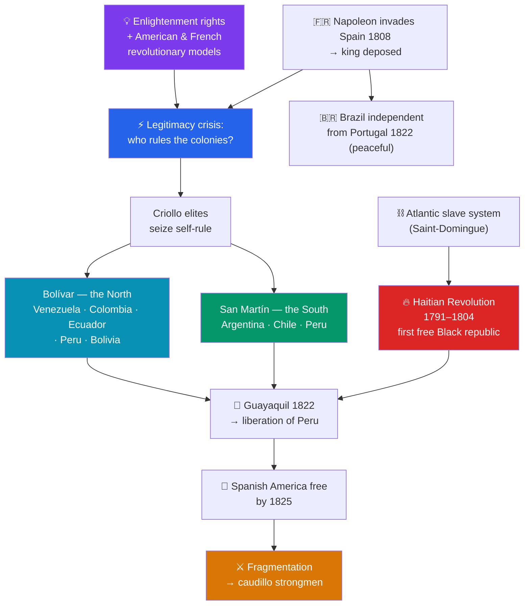

# 🌎 Latin American Independence

> [!abstract] TL;DR
> Between roughly **1791 and 1825**, the Atlantic wave of revolution reached the Americas and dismantled the **Spanish and Portuguese colonial empires**. It opened with the **Haitian Revolution (1791–1804)** — the only **successful slave revolt** in history, which founded the first Black republic and the first independent state in Latin America, born directly out of the Atlantic slave system. On the mainland, **Napoleon's 1808 invasion of Spain** (see [[Napoleon_and_His_Wars]]) removed the legitimate king, and the American-born white elite, the **criollos**, seized the crisis to claim self-rule. Two great liberators — **Simón Bolívar** in the north (Venezuela, Colombia, Ecuador, Peru, Bolivia) and **José de San Martín** in the south (Argentina, Chile, Peru) — led armies that, by **1825**, had freed almost all of Spanish America; **Brazil** separated from Portugal peacefully in **1822**. But the new republics, dominated by the criollo elite and lacking stable institutions, soon fractured into regional states ruled by strongman **caudillos** — a turbulent legacy of independence without deep social revolution.

## Intuition — analogy first

Imagine a chain of family businesses all run from a single **head office overseas**, staffed locally by ambitious managers (the criollos) who do the real work but are never allowed to become owners — the top posts always go to executives shipped in from headquarters. These managers resent the arrangement, but the head office's authority seems unquestionable. Then one day **the head office is suddenly seized by a hostile raider** (Napoleon captures the Spanish king), and the question becomes electric: *if there's no legitimate boss in charge, who governs the branches now?*

The managers' answer is: **we do.** But two very different scripts play out. In one branch — **Haiti** — it is not the managers but the **enslaved workforce** that rises, and their revolution is the most radical of all, overturning slavery itself. On the mainland, the managers take charge, and their revolutions win **political** independence while carefully leaving the **social hierarchy** — land, race, class — largely intact. That gap explains the aftermath: liberation produces new flags and new republics, but not new social orders, and into the resulting instability step the **caudillos**, local strongmen who fill the vacuum where stable institutions were never built.

---

## How It Works — Trigger, Liberators, and Aftermath

## Key Concepts

### The Colonial Order and Its Tensions

Spain's American empire was a rigid **racial and social hierarchy**:
- **Peninsulares** — Spanish-born whites, who monopolized the top offices of Church and state.
- **Criollos (creoles)** — American-born people of Spanish descent; often wealthy landowners and merchants, but **shut out of the highest posts** and chafing under Spain's trade monopoly and taxes.
- **Mestizos, Indigenous peoples, and enslaved Africans** — the vast majority, largely excluded from power.

The resentful, educated **criollos**, steeped in **Enlightenment** ideas (see [[The_Enlightenment]]) and inspired by the American and French revolutions, were the natural leaders of an independence movement — but one focused on **their own** political power, not on overturning the social order beneath them.

### The Haitian Revolution (1791–1804) — the First Domino

In the French sugar colony of **Saint-Domingue**, the richest in the world, enslaved Africans vastly outnumbered whites. Inspired by the French Revolution's Declaration of the Rights of Man — and rooted in the brutal reality of the **Atlantic slave trade** (see [[The_Atlantic_Slave_Trade]]) — a massive **slave uprising erupted in 1791**. Under **Toussaint Louverture**, the rebels abolished slavery and defeated internal enemies; after his capture, **Jean-Jacques Dessalines** defeated a French army sent by Napoleon to restore slavery and declared independence on **1 January 1804**, naming the country **Haiti**.

Its significance is enormous:
- The **only successful large-scale slave revolt** in history.
- The **first independent state in Latin America** and the **first Black-led republic** in the world.
- A profound shock to slaveholding societies everywhere; Bolívar later took refuge in Haiti and received aid in exchange for a promise to abolish slavery.

### The Trigger — Napoleon's Invasion of Spain (1808)

The mainland revolts were detonated by events in Europe. In **1808, Napoleon** invaded Spain, deposed King **Ferdinand VII**, and put his own brother **Joseph** on the throne (see [[Napoleon_and_His_Wars]]). This created a **crisis of legitimacy**: with no rightful king, to whom did the colonies owe allegiance? Across Spanish America, criollos formed **local governing juntas** — initially claiming to rule *in the name of* the captive Ferdinand, but soon moving toward outright independence, especially after the restored Ferdinand tried to reimpose absolutist control in 1814.

### The Great Liberators

| Leader | Region | Key achievements |
|---|---|---|
| **Simón Bolívar** ("El Libertador") | Northern South America | Liberated **Venezuela, New Granada (Colombia), Ecuador**; the epic crossing of the Andes to win **Boyacá (1819)**; victories at **Carabobo (1821)** and (with Sucre) **Ayacucho (1824)**; envisioned a united **Gran Colombia** |
| **José de San Martín** | Southern South America | Secured **Argentina's** independence; led the daring **Army of the Andes** across the mountains to liberate **Chile (Chacabuco/Maipú, 1817–18)**; then advanced by sea to **Peru** |
| **Antonio José de Sucre** | Andes | Bolívar's chief lieutenant; won **Ayacucho (1824)**, the decisive battle; **Bolivia** named for Bolívar |
| **Bernardo O'Higgins** | Chile | Led Chilean independence alongside San Martín |
| **Miguel Hidalgo & José María Morelos** | Mexico | Launched Mexico's popular independence struggle (from the 1810 *Grito de Dolores*); independence finally achieved in **1821** |

The two great campaigns — **Bolívar pressing south** and **San Martín pressing north** — converged on the royalist stronghold of **Peru**. At the mysterious **Guayaquil Conference (1822)**, San Martín met Bolívar and then withdrew from public life, leaving Bolívar to complete the liberation. The royalist cause collapsed at **Ayacucho (1824)**, and by **1825** Spanish America was essentially free.

### Brazil — A Different Path

**Brazil** became independent without a war. When Napoleon invaded Portugal, the Portuguese royal family **fled to Brazil (1807–08)**, making Rio de Janeiro the seat of the empire. When the king returned to Portugal, his son **Dom Pedro** remained; in **1822** he declared Brazilian independence and became **Emperor Pedro I** — a relatively peaceful transition that preserved monarchy and, notably, **slavery** (not abolished until 1888).

### The Criollo Character and the Caudillo Aftermath

Independence was, for the mainland, a **political revolution led by the criollo elite**, not a social one. The racial and economic hierarchies largely survived; land stayed concentrated, and Indigenous and enslaved populations gained little immediately. Bolívar's dream of a united Spanish America **fractured**: **Gran Colombia collapsed** by 1831 into Venezuela, Colombia, and Ecuador. A disillusioned Bolívar reportedly lamented that "**those who serve a revolution plough the sea.**" Into the resulting institutional vacuum stepped the **caudillos** — regional military strongmen who ruled through personal loyalty and force — beginning a long 19th-century pattern of instability, civil war, and authoritarian rule.

## Primary Sources & Examples

- **The Haitian Declaration of Independence (1 January 1804):** Dessalines's proclamation founding the first Black republic — a document that terrified slaveholding states and inspired the enslaved across the Atlantic world.
- **Bolívar, the *Jamaica Letter* (1815):** Written in exile, his brilliant analysis of Spanish America's condition and prospects, forecasting both independence and the difficulty of uniting or stably governing the region.
- **The *Grito de Dolores* (1810):** Father **Miguel Hidalgo's** cry that launched Mexico's independence movement as a broad popular (and partly Indigenous/mestizo) uprising — a rare socially radical strand.
- **The Congress of Angostura (1819):** Where Bolívar laid out his political vision for Gran Colombia, warning that Latin America needed strong, stable institutions suited to its realities rather than mere copies of foreign constitutions.

## Common Pitfalls / Misconceptions

- **"Latin American independence was a single coordinated movement."** It was a **cluster of distinct, often disconnected regional struggles** (Haiti, Mexico, the north, the south, Brazil), with different leaders, timelines, and outcomes — not one unified revolution.
- **"The revolutions overturned the social order."** On the mainland they were largely **criollo elite** projects that won political independence while **leaving slavery, racial hierarchy, and land inequality largely intact** — Haiti (which did overturn slavery) is the great exception.
- **"Independence came mainly from internal ideology."** Ideas mattered, but the immediate **trigger was external**: Napoleon's 1808 invasion of Spain shattered royal legitimacy and created the opening.
- **"Bolívar united Latin America."** His pan-American vision **failed**; Gran Colombia disintegrated, and the region splintered into many rival states led by caudillos.
- **"Brazil's independence looked like Spanish America's."** Brazil's was a **peaceful, monarchical** transition led by a Portuguese prince, preserving the empire and slavery — a very different path.

## Related Concepts

- [[_MOC_Enlightenment_Revolutions|↑ Section MOC]] — the section hub
- [[Napoleon_and_His_Wars]] — his 1808 invasion of Spain was the immediate trigger that shattered colonial legitimacy
- [[The_French_Revolution]] — its Declaration of the Rights of Man directly inspired the Haitian slave uprising and the criollo revolutionaries
- [[The_American_Revolution]] — the first successful anti-colonial republic in the Americas, a model for the liberators
- [[The_Atlantic_Slave_Trade]] — the system that created Saint-Domingue's enslaved majority and made the Haitian Revolution both possible and world-historic
- Cross-vault: [[_MOC_World_Regions]] — the modern political map of Latin America is a direct product of these wars

## Review Questions

1. Explain why the **Haitian Revolution** is described as unique in world history, and how it differed from the mainland Spanish American revolutions in both leadership and social outcome.
2. How did **Napoleon's 1808 invasion of Spain** trigger the mainland independence movements, and what role did the **criollo** elite play?
3. Contrast the campaigns and meeting of **Bolívar** and **San Martín**, and explain why the promise of independence gave way to fragmentation and **caudillo** rule.

## Sources

- Chasteen, J.C. (2008). *Americanos: Latin America's Struggle for Independence*. Oxford University Press
- Lynch, J. (1986). *The Spanish American Revolutions, 1808–1826* (2nd ed.). Norton
- Dubois, L. (2004). *Avengers of the New World: The Story of the Haitian Revolution*. Harvard University Press
- Adelman, J. (2006). *Sovereignty and Revolution in the Iberian Atlantic*. Princeton University Press

#history #revolution #latin-america #decolonization #bolivar #haitian-revolution
