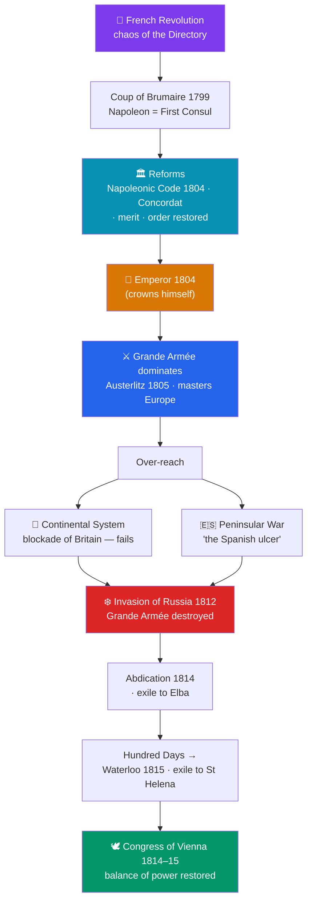

# 🎖️ Napoleon and His Wars

> [!abstract] TL;DR
> **Napoleon Bonaparte** (1769–1821) rose from an artillery officer to master of Europe, embodying the paradox of a **revolutionary who made himself emperor**. Seizing power in the coup of **1799**, he stabilized France as **First Consul**, then crowned himself **Emperor in 1804**. He preserved the Revolution's core gains — legal equality, careers open to talent, and above all the **Napoleonic Code** (1804), a rational civil law that reshaped legal systems worldwide — while restoring order and hierarchy. In the **Napoleonic Wars** his **Grande Armée** dominated the continent (Austerlitz, 1805), spreading Revolutionary reforms even as it imposed French hegemony. But over-reach undid him: the **Continental System's** economic blockade of Britain failed, the **1812 invasion of Russia** destroyed his army, and after a brief return he was finally defeated at **Waterloo (1815)**. The victorious powers met at the **Congress of Vienna (1814–15)** to restore a conservative **balance of power** that kept Europe from general war for a century — yet Napoleon had already carried the Revolution's ideas across Europe irreversibly.

## Intuition — analogy first

Think of the French Revolution as a **wildfire** that burned down the old forest of monarchy and privilege — spectacular, destructive, and impossible to control. Napoleon is the figure who steps into the still-smoking clearing and does something no fire can do: he **builds**. He terraces the ground, lays out roads, and codifies a single rulebook for the whole territory. To the exhausted survivors he offers a bargain: **keep the fire's gains — equality before the law, an end to feudal privilege — but under my order, not the mob's.** Most accept.

The trouble is that the same restless energy that let him build also drives him to **keep expanding the clearing** until he is trying to control the entire forest. He wins battle after battle, but each conquest adds a hostile frontier and a resentful occupied population. Two forces finally break him: an **island he cannot reach** (Britain, protected by its navy) and a **vastness he cannot swallow** (Russia, which trades space and winter for his army). The lesson is the classic tragedy of over-extension — genius at the tactical scale defeated by the strategic arithmetic of empire — while, almost incidentally, his armies leave the Revolution's ideas planted everywhere they marched.

---

## How It Works — Rise, Empire, Over-reach, and Restoration

## Key Concepts

### Rise Out of the Revolution

Born in **Corsica** in 1769, Napoleon was a brilliant young **artillery officer** whose career was made possible by the Revolution's opening of ranks to talent. He won fame crushing a royalist rising in Paris (1795) and in his Italian campaigns (1796–97). Returning from Egypt, he exploited the weakness of the **Directory** (see [[The_French_Revolution]]) to seize power in the **coup of 18 Brumaire (November 1799)**, becoming **First Consul**. He restored domestic order, made peace with the Church via the **Concordat of 1801**, reformed finance and administration, and in **1804 crowned himself Emperor** — famously taking the crown from the Pope's hands to place it on his own head, signaling that his authority came from the nation (and himself), not the Church.

### The Napoleonic Code (1804)

Napoleon's most enduring legacy is the **Civil Code / Code Napoléon (1804)**, which replaced France's chaotic patchwork of feudal and regional laws with a single, rational, clearly written civil code. It entrenched key Revolutionary principles:
- **Equality before the law** and the abolition of feudal privilege
- **Secular authority** over civil matters (marriage, contracts, property)
- **Protection of private property** and freedom of contract
- **Careers open to talent** (meritocracy)

It also **reasserted patriarchy** — sharply limiting the legal rights of married women — showing the Code's mix of liberal and conservative impulses. Carried across Europe by his armies, the Code became the foundation of civil law in dozens of countries, from Belgium and the Netherlands to Latin America and Louisiana. Napoleon himself said it, not his forty victories, would be his true monument.

### The Napoleonic Wars (1803–1815)

A series of coalitions of European powers — funded largely by Britain — repeatedly tried to contain France:

| Event | Year | Significance |
|---|---|---|
| **Battle of Trafalgar** | 1805 | Nelson's Royal Navy destroys the Franco-Spanish fleet; Britain rules the seas, ending invasion hopes |
| **Battle of Austerlitz** | 1805 | Napoleon's tactical masterpiece; crushes Austria and Russia — the height of his power |
| **End of the Holy Roman Empire** | 1806 | Napoleon reorganizes Germany into the Confederation of the Rhine |
| **Peninsular War** | 1808–1814 | The bleeding "**Spanish ulcer**"; guerrilla resistance drains French strength (and destabilizes Spain's empire — see [[Latin_American_Independence]]) |
| **Invasion of Russia** | 1812 | Catastrophe — the turning point of his fall |
| **Battle of Leipzig ("Battle of Nations")** | 1813 | Massive coalition defeat; France driven out of Germany |
| **Waterloo** | 1815 | Final defeat |

His **Grande Armée** revolutionized warfare with mass conscription (the *levée en masse*), the **corps system**, rapid movement, and battlefield initiative — while also spreading Revolutionary reforms (ending serfdom, imposing the Code) in the lands it conquered.

### The Continental System

Unable to defeat Britain at sea after **Trafalgar (1805)**, Napoleon tried economic warfare: the **Continental System (from 1806)**, a **blockade barring European trade with Britain**, intended to strangle the "nation of shopkeepers." It backfired — it hurt continental economies (which needed British goods and markets) more than Britain, spurred smuggling, and its enforcement dragged Napoleon into disastrous commitments, including the invasion of **Portugal and Spain** and, ultimately, **Russia** (which withdrew from the System in 1810).

### 1812 — The Invasion of Russia

To punish Russia for abandoning the Continental System, Napoleon invaded in **June 1812** with a multinational army of roughly **600,000** men. The Russians retreated, employing **scorched-earth** tactics and refusing decisive battle. After the bloody, indecisive **Battle of Borodino** and the occupation of a burning, abandoned **Moscow**, Napoleon was forced into a catastrophic **winter retreat**. Cold, starvation, disease, and Cossack raids annihilated the army — **fewer than 100,000 returned**. It was the greatest military disaster of the age and shattered the myth of his invincibility.

### Waterloo and the Congress of Vienna

The coalition invaded France and Napoleon **abdicated in April 1814**, exiled to the island of **Elba**. He escaped and returned for the **Hundred Days**, but was decisively defeated by the British (Wellington) and Prussians (Blücher) at the **Battle of Waterloo (18 June 1815)** and exiled to remote **St Helena**, where he died in 1821.

Meanwhile the victorious powers — **Britain, Austria (Metternich), Russia, Prussia**, and a restored France (Talleyrand) — met at the **Congress of Vienna (1814–15)** to rebuild Europe. Their principles were:
- **Legitimacy** — restoring "legitimate" (mostly Bourbon) monarchies;
- **Balance of power** — preventing any single state from dominating again, and containing France with strong neighbors;
- **Conservatism** — suppressing the revolutionary and nationalist forces Napoleon had unleashed.

The **"Concert of Europe"** it created preserved general peace among the great powers for roughly a century (to 1914) — even as the national and liberal ideas Napoleon had spread continued to ferment beneath the restored order.

## Primary Sources & Examples

- **The Napoleonic Code (1804):** Still the backbone of civil law across much of continental Europe, Latin America, and beyond — arguably Napoleon's most far-reaching act, exported by conquest and admired by reformers.
- **Jacques-Louis David, *The Coronation of Napoleon* (1805–07):** The monumental painting of Napoleon crowning himself and Josephine — a deliberate image of self-made, national, secular sovereignty.
- **The *bulletins* of the Grande Armée & the 1812 retreat:** The infamous **29th Bulletin** admitting the destruction of the army in Russia (with the phrase later echoed as "the army... needs to reconstitute itself") — propaganda meeting catastrophe.
- **The Final Act of the Congress of Vienna (1815):** The treaty settlement that redrew the European map and codified the balance-of-power system for the 19th century.

## Common Pitfalls / Misconceptions

- **"Napoleon was extraordinarily short."** A myth — he was roughly average height (about 5'7"/1.70 m) for his era; the confusion came partly from British caricature and differences between French and English units of measurement.
- **"He simply betrayed the Revolution."** More accurately he **consolidated and exported some of its gains (the Code, legal equality, meritocracy) while extinguishing its liberty (an authoritarian, censoring empire).** He is best understood as its heir *and* its undertaker.
- **"'General Winter' alone beat him in Russia."** Cold was devastating, but disease, hunger, over-extended supply lines, Russian scorched-earth strategy, and Napoleon's own strategic misjudgment did most of the damage — many losses came before the deep winter.
- **"The Continental System was a minor sideshow."** It was central: its failure and the effort to enforce it dragged him into Spain and Russia, the two theaters that destroyed him.
- **"Vienna simply turned back the clock to 1789."** It restored monarchies and a balance of power, but it could not erase the nationalism and liberalism Napoleon had spread; those forces drove the revolutions of 1830 and 1848.

## Related Concepts

- [[_MOC_Enlightenment_Revolutions|↑ Section MOC]] — the section hub
- [[The_French_Revolution]] — the upheaval whose chaos elevated Napoleon and whose reforms he entrenched in the Code
- [[The_Enlightenment]] — the rationalizing, meritocratic ideals the Napoleonic Code turned into working law
- [[Latin_American_Independence]] — Napoleon's invasion of Spain (1808) shattered royal authority and triggered the Spanish American revolts
- Cross-vault: [[_MOC_Industrial_Revolution]] — the Continental System and the wars accelerated economic and industrial shifts, especially in Britain

## Review Questions

1. Explain the paradox of Napoleon as both heir and undertaker of the French Revolution, using the Napoleonic Code and the creation of the Empire (1804) as evidence.
2. How did the **Continental System** lead, step by step, to the disasters in **Spain** and **Russia** that destroyed Napoleon's power?
3. What principles guided the **Congress of Vienna**, and in what sense did it both succeed (a century of great-power peace) and fail (the survival of nationalism and liberalism)?

## Sources

- Roberts, A. (2014). *Napoleon: A Life*. Viking
- Esdaile, C. (2007). *Napoleon's Wars: An International History, 1803–1815*. Allen Lane
- Lyons, M. (1994). *Napoleon Bonaparte and the Legacy of the French Revolution*. St. Martin's Press
- Zamoyski, A. (2007). *Rites of Peace: The Fall of Napoleon and the Congress of Vienna*. HarperCollins

#history #napoleon #napoleonic-wars #empire #congress-of-vienna #balance-of-power
