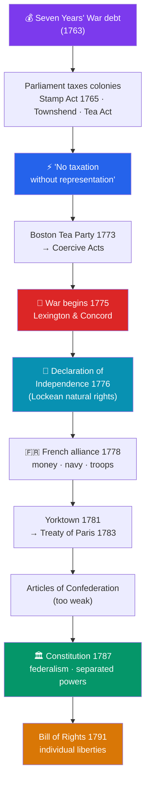

# 🦅 The American Revolution

> [!abstract] TL;DR
> The **American Revolution** (1765–1789) turned thirteen British colonies into the first large, durable **modern republic** founded on Enlightenment principles. It began not over independence but over **taxation**: after the costly Seven Years' War, Parliament taxed the colonies (the **1765 Stamp Act**) without their consent, triggering the cry **"no taxation without representation."** Escalating protest — the **Boston Tea Party** (1773) — led to war in 1775 and the **Declaration of Independence** (1776), whose theory of **natural rights** and **government by consent** is pure **Locke**. **French aid** proved decisive, and British surrender at **Yorktown** (1781) secured independence, confirmed by the Treaty of Paris (1783). The weak first framework (Articles of Confederation) was replaced by the **Constitution (1787)**, which built **federalism**, separated and checked powers, and — with the **Bill of Rights (1791)** — protected individual liberties. The result was a working demonstration that Enlightenment theory could govern a nation, inspiring revolutions across France and Latin America.

## Intuition — analogy first

Picture a group of adult children living in a large, distant wing of the family estate. For years the **head of the household** in London barely notices them, and they quietly run their own affairs. Then the family runs up huge war debts, and the parent suddenly starts **sending bills and imposing house rules** — without ever inviting the children to the table where the rules are made. The children's complaint is not really "we won't pay"; it is **"you don't get to bind us to rules we had no voice in making."** That is *no taxation without representation.*

When the parent responds by tightening control rather than offering a seat at the table, the relationship breaks. But here is the twist that makes the American case distinctive: having declared themselves independent, the former children must now **write their own household constitution from scratch** — and their great achievement is not the divorce but the **rulebook** they draft afterward, one deliberately engineered so that no future head of household can ever again rule without consent. The Revolution's lasting product is that machine of self-government, not the war.

---

## How It Works — From Tax Dispute to Constitutional Republic

## Key Concepts

### Causes — Taxation, Representation, and Resistance

Victory in the **Seven Years' War** (1756–1763) left Britain with an enormous debt and a vast new North American empire to garrison. Parliament decided the colonies should help pay, and imposed a series of taxes the colonists had no elected voice in approving:

| Measure | Year | What it did | Colonial response |
|---|---|---|---|
| **Stamp Act** | 1765 | Tax on printed materials (documents, newspapers, playing cards) | Stamp Act Congress; boycotts; "no taxation without representation"; repealed 1766 |
| **Townshend Acts** | 1767 | Duties on glass, paint, paper, tea | Non-importation agreements; the **Boston Massacre** (1770) |
| **Tea Act** | 1773 | Gave the East India Company a tea monopoly | **Boston Tea Party** — colonists dumped 342 chests of tea into Boston Harbor |
| **Coercive / "Intolerable" Acts** | 1774 | Punished Massachusetts; closed Boston's port | **First Continental Congress** convened |

The core grievance was **constitutional, not merely financial**: colonists insisted that, as Englishmen, they could only be taxed by a body in which they were represented. Britain's reply — the theory of **"virtual representation"** (that Parliament represented all British subjects everywhere) — the colonists flatly rejected.

### The Declaration of Independence (1776) and Locke's Influence

Fighting began at **Lexington and Concord** (April 1775). On **July 4, 1776**, the Second Continental Congress adopted the **Declaration of Independence**, drafted principally by **Thomas Jefferson**. Its philosophy is drawn almost verbatim from **John Locke** (see [[The_Enlightenment]]):
- **Natural rights:** "all men are created equal... endowed... with certain unalienable Rights... Life, Liberty and the pursuit of Happiness." (Jefferson adapted Locke's "life, liberty, and property.")
- **Government by consent:** governments "deriv[e] their just powers from the consent of the governed."
- **Right of revolution:** when a government becomes destructive of these ends, "it is the Right of the People to alter or to abolish it." This is Locke's justification of the 1688 Glorious Revolution, repurposed against George III.

### The War and French Aid

The **Continental Army** under **George Washington** avoided decisive defeat, trading space for time against a superior British force. The turning point was the American victory at **Saratoga (1777)**, which persuaded France — eager to weaken its rival Britain — to enter a formal **alliance in 1778**. **French money, the French navy, and French troops** were decisive: at the **Siege of Yorktown (1781)**, a French fleet blocked British rescue by sea while Franco-American forces trapped Cornwallis's army on land, forcing its surrender. The **Treaty of Paris (1783)** recognized American independence. (France's crippling war debt would help ignite its own revolution — see [[The_French_Revolution]].)

### The Constitution (1787), Federalism, and the Bill of Rights

The first national framework, the **Articles of Confederation** (ratified 1781), created a union so weak it could not tax, regulate commerce, or maintain order (as **Shays' Rebellion**, 1786–87, exposed). Delegates met at the **Philadelphia Convention (1787)** and produced a new **Constitution**, embodying Enlightenment engineering:
- **Federalism** — power **divided between the national government and the states**, each supreme in its own sphere; a genuine institutional innovation.
- **Separation of powers and checks and balances** — legislative (Congress), executive (President), and judicial (courts) branches that limit one another, following **Montesquieu**.
- **Popular sovereignty and republicanism** — "We the People" as the source of authority; a **representative republic**, not a direct democracy.
- **The Bill of Rights (1791)** — the first ten amendments, guaranteeing freedoms of speech, religion, press, assembly, and legal protections, added to secure ratification and protect individuals from the state.

The Constitution was also a document of **compromise and contradiction** — it left slavery intact, counted enslaved people as three-fifths of a person for representation, and restricted the franchise — tensions that would take a civil war and later movements to confront.

### The First Large Modern Republic

Before 1776, "republics" were small city-states or fragile leagues; monarchy was the assumed form of large-scale government. The United States demonstrated that a **large, extended republic** governed by a written constitution and Enlightenment principles could actually **work and endure** — James Madison's *Federalist No. 10* even argued that size and diversity would *protect* liberty by diluting factions. This proof of concept made the American Revolution a template for revolutionaries worldwide.

## Primary Sources & Examples

- **The Declaration of Independence (1776):** Its second paragraph is the most concentrated statement of Lockean political theory ever put into a founding document, and became a global charter for self-determination.
- **Thomas Paine, *Common Sense* (1776):** A runaway bestselling pamphlet that made the popular case for independence in plain language, arguing that it was absurd for a continent to be ruled by an island. It shifted colonial opinion decisively toward a full break.
- **The U.S. Constitution (1787) and *The Federalist Papers* (1787–88):** Madison, Hamilton, and Jay's essays defending ratification remain the classic exposition of federalism, separated powers, and the "extended republic."
- **The Bill of Rights (1791):** The concrete list of protected liberties that transformed abstract natural rights into enforceable law.

## Common Pitfalls / Misconceptions

- **"The Revolution began as a bid for independence."** It began as a demand for the **rights of Englishmen** within the empire; independence became the goal only after years of failed reconciliation, formalized in 1776.
- **"'No taxation without representation' meant the taxes were unaffordable."** The objection was **constitutional**, not economic — colonists rejected being taxed by a Parliament in which they had no vote, whatever the amount.
- **"America won mainly on its own."** **French intervention** — money, the navy at Yorktown, and troops — was decisive; Spain and the Dutch also aided the effort. It was a global war.
- **"The Founders created a democracy."** They deliberately built a **republic** with checks on popular passion; the franchise was narrow, and they were wary of direct democracy. Universal suffrage came much later.
- **"The Declaration's 'all men are created equal' applied to everyone."** In practice it excluded the enslaved, Indigenous peoples, and women — a gap between ideal and reality that defined much of subsequent American history.

## Related Concepts

- [[_MOC_Enlightenment_Revolutions|↑ Section MOC]] — the section hub
- [[The_Enlightenment]] — Locke's natural rights and Montesquieu's separated powers are the direct sources of the Declaration and Constitution
- [[The_French_Revolution]] — inspired by the American example, and financed into crisis by France's aid to the colonists
- [[Latin_American_Independence]] — the American republic served as a model for criollo revolutionaries a generation later
- Cross-vault: [[_MOC_Political_Philosophy]] — the theory of consent, republicanism, and constitutional design elaborated here

## Review Questions

1. Explain why "no taxation without representation" was a constitutional rather than a purely financial grievance, and trace the escalation from the Stamp Act to the outbreak of war.
2. Identify three specific ideas the Declaration of Independence took from John Locke, quoting or paraphrasing the relevant passages.
3. Why were the Articles of Confederation replaced, and what Enlightenment principles were built into the 1787 Constitution and the Bill of Rights to prevent both tyranny and disorder?

## Sources

- Wood, G.S. (1991). *The Radicalism of the American Revolution*. Knopf
- Bailyn, B. (1967). *The Ideological Origins of the American Revolution*. Harvard University Press
- Middlekauff, R. (2005). *The Glorious Cause: The American Revolution, 1763–1789*. Oxford University Press
- Maier, P. (1997). *American Scripture: Making the Declaration of Independence*. Knopf

#history #revolution #american-revolution #republicanism #constitution #federalism
