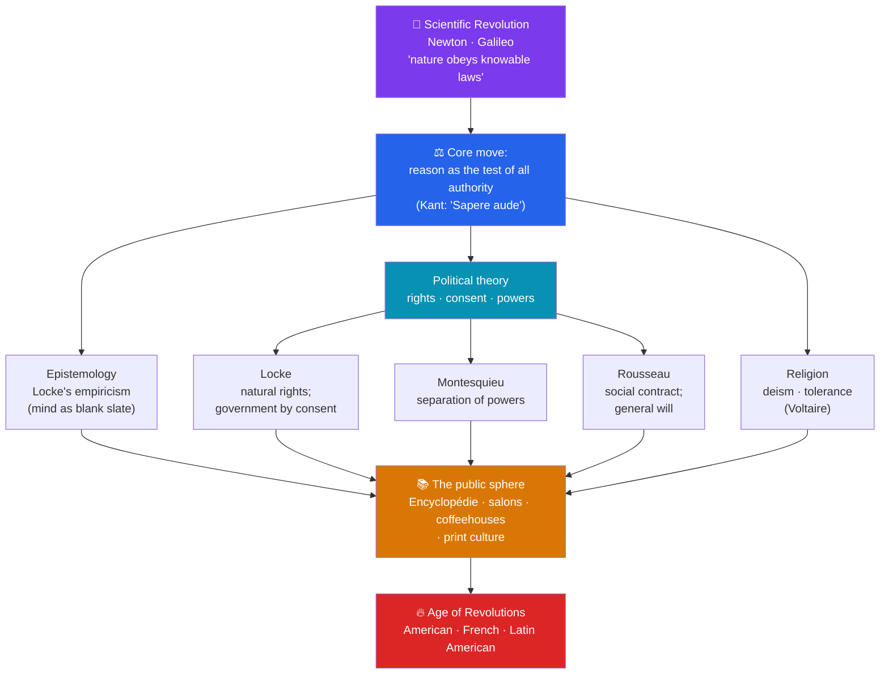

# 💡 The Enlightenment

> [!abstract] TL;DR
> The **Enlightenment** (c. 1680–1800), the "**Age of Reason**," was a European intellectual movement that made **human reason** — rather than tradition, revelation, or royal authority — the test of truth and the standard for judging politics, religion, and society. Drawing on the **Scientific Revolution's** demonstration that nature obeys discoverable laws, thinkers argued that society, too, could be rationally analyzed and improved. **Locke** grounded government in **natural rights** and consent; **Montesquieu** proposed the **separation of powers**; **Rousseau** theorized the **social contract** and the **general will**; **Voltaire** campaigned for **tolerance** and free expression; and **Kant** distilled the whole ethos into *"Sapere aude"* — dare to know. Ideas spread through **Diderot's *Encyclopédie***, **salons**, and **coffeehouses**, forming a new critical **public sphere**. This toolkit of reason, rights, and consent became the ideological gunpowder of the American, French, and Latin American revolutions.

## Intuition — analogy first

Imagine that for centuries a village has run on an **inherited rulebook** nobody is allowed to open — the priest and the lord simply announce what it says, and "because it has always been so" ends every argument. The Enlightenment is the moment a generation finally **pries the book open, reads it by candlelight, and asks: does any of this actually hold up?**

Once you accept that the natural world runs on **laws you can discover for yourself** — Newton had just shown the planets do — it becomes almost irresistible to ask whether human affairs run on discoverable laws too. Why should a king rule by divine right if you can reason out the true origin of political authority? Why should the church police belief if reason, not decree, should settle what is true? That single move — **submit every inherited claim to the tribunal of reason** — is the whole Enlightenment. Kant's slogan *Sapere aude* ("dare to know") is really an instruction to stop waiting for permission and think for yourself. The danger, of course, is that a village which throws out *every* old rule at once may not agree on what to write in the blank pages — a tension the revolutions would soon expose.

---

## How It Works — From Scientific Method to Political Theory

## Key Concepts

### Roots in the Scientific Revolution

The Enlightenment is the political and social sequel to the **Scientific Revolution** (see [[The_Scientific_Revolution]]). **Isaac Newton's** *Principia* (1687) showed that a few mathematical laws govern everything from a falling apple to the orbit of the Moon. If the physical cosmos is orderly and knowable, thinkers reasoned, then **human society** might obey discoverable principles too. **Francis Bacon's** inductive method and **René Descartes'** systematic doubt supplied the temperament: test claims against evidence and reason, not authority. The Enlightenment applied this confidence to law, government, economics, and religion.

### The Key Thinkers

| Thinker | Dates | Key work | Central contribution |
|---|---|---|---|
| **John Locke** | 1632–1704 | *Two Treatises of Government* (1689); *Essay Concerning Human Understanding* (1689) | **Natural rights** (life, liberty, property); government by **consent** of the governed and a **right of revolution**; **empiricism** — the mind as a *tabula rasa* (blank slate) |
| **Montesquieu** | 1689–1755 | *The Spirit of the Laws* (1748) | **Separation of powers** into legislative, executive, and judicial branches to prevent tyranny; comparative study of governments |
| **Voltaire** | 1694–1778 | *Letters on England* (1733); *Treatise on Tolerance* (1763) | Religious **tolerance**, freedom of speech, and fierce anticlericalism; *"Écrasez l'infâme"* ("crush the infamous thing" — bigotry/superstition) |
| **Jean-Jacques Rousseau** | 1712–1778 | *The Social Contract* (1762); *Émile* (1762) | The **social contract** and popular sovereignty; the **general will**; *"Man is born free, and everywhere he is in chains"* |
| **Immanuel Kant** | 1724–1804 | *"What Is Enlightenment?"* (1784) | Defined enlightenment as humanity's release from "self-imposed immaturity"; the motto *"Sapere aude"* — dare to know/think for yourself |
| **Denis Diderot** | 1713–1784 | *Encyclopédie* (1751–1772) | Editor of the great collaborative reference work that gathered and secularized all human knowledge |
| **Adam Smith** | 1723–1790 | *The Wealth of Nations* (1776) | Founder of modern economics; the **"invisible hand"**, division of labor, and the case for free markets over mercantilism |

### Locke, Montesquieu, and Rousseau — The Political Core

- **Locke's natural rights and consent:** In the *Second Treatise* (1689), written to justify England's **Glorious Revolution** (1688), Locke argued that people are born with **natural rights to life, liberty, and property** in a pre-political "state of nature." They form a government only to protect those rights, and its authority rests on their **consent**; if a ruler becomes tyrannical, the people retain a **right to revolution**. This is the direct ancestor of the American Declaration of Independence.
- **Montesquieu's separation of powers:** In *The Spirit of the Laws* (1748), Montesquieu argued liberty is safest when governmental power is **divided among branches that check one another** — legislative, executive, judicial. This became the architectural blueprint of the U.S. Constitution (see [[The_American_Revolution]]).
- **Rousseau's social contract and general will:** Rousseau located sovereignty in **the people as a whole**. Legitimate government expresses the **general will** — what the community wills for the common good. His doctrine of **popular sovereignty** was radically democratic and deeply inspired the French Revolution (see [[The_French_Revolution]]), though the ambiguous "general will" could also be invoked to justify coercion in the name of the people.

### Deism and Religious Tolerance

Many Enlightenment thinkers were **deists**, not atheists. **Deism** holds that reason and the order of nature reveal a Creator — a divine "**clockmaker**" who designed the universe and its laws but does not intervene through miracles or revelation. Deists rejected organized religion's dogma and clerical authority while retaining belief in God. Coupled with **Voltaire's** campaign for **tolerance** (dramatized by his defense of the executed Protestant Jean Calas), this reframed religion as a matter of private conscience rather than state enforcement.

### The Public Sphere — How Ideas Spread

Enlightenment ideas circulated through new **social spaces** that the philosopher Jürgen Habermas later called the **bourgeois public sphere** — a realm of private citizens debating public matters by the use of reason:
- **Salons** — Parisian gatherings, often hosted by educated women (*salonnières* such as **Marie-Thérèse Geoffrin** and **Julie de Lespinasse**), where philosophers, aristocrats, and writers debated.
- **Coffeehouses** — cheap, open venues (especially in London) where men of different ranks read newspapers and argued politics.
- **The *Encyclopédie*** (1751–1772) — **Diderot** and **d'Alembert's** 28-volume compendium, with over 70,000 articles, that synthesized knowledge from a secular, critical standpoint and quietly undermined religious and royal authority.
- **Print culture** — cheap pamphlets, journals, and books, plus expanding literacy, carried ideas far beyond the elite.

Together these built a new kind of **public opinion** — critical, literate, and increasingly willing to judge kings and churches.

## Primary Sources & Examples

- **Locke, *Second Treatise of Government* (1689):** "Men being... by nature all free, equal, and independent, no one can be... subjected to the political power of another without his own consent." The germ of the entire consent-based theory of government.
- **Kant, "What Is Enlightenment?" (1784):** "Enlightenment is man's emergence from his self-imposed immaturity... *Sapere aude!* Have courage to use your own understanding!" The single most quoted definition of the movement.
- **The *Encyclopédie* (1751–1772):** Its very structure — organizing knowledge by reason rather than by scripture, and cross-referencing subversive ideas to slip past censors — made it a monument to and a weapon of the Enlightenment.
- **Rousseau, *The Social Contract* (1762):** "Man is born free, and everywhere he is in chains." The opening line that would echo through the revolutionary decade.

## Common Pitfalls / Misconceptions

- **"The Enlightenment was atheist."** Most leading figures were **deists** who believed in a rational Creator; outright atheism (Baron d'Holbach) was a minority. The target was clerical authority and superstition, not God as such.
- **"It was a single unified school."** The Enlightenment was a **contested conversation**, not a doctrine. Rousseau attacked the arts and sciences the others celebrated; Voltaire and Rousseau despised each other. Later thinkers (Hume, Kant) were sharply critical of naïve confidence in reason.
- **"Its universal 'rights of man' were truly universal."** In practice, most philosophers excluded women, the enslaved, and the poor from full political rights — contradictions that Mary Wollstonecraft's *Vindication of the Rights of Woman* (1792) and the Haitian Revolution (see [[Latin_American_Independence]]) would expose.
- **"Enlightenment = the French Revolution."** The ideas **enabled** but did not **dictate** the Revolution; most philosophers were reformers, not revolutionaries, and several (like Voltaire) admired "enlightened" monarchs rather than democracy.

## Related Concepts

- [[_MOC_Enlightenment_Revolutions|↑ Section MOC]] — the section hub
- [[The_Scientific_Revolution]] — the intellectual parent; Newton's discoverable natural laws inspired the search for rational laws of society
- [[The_American_Revolution]] — the first great political application of Locke's natural rights and Montesquieu's separated powers
- [[The_French_Revolution]] — Rousseau's popular sovereignty and general will translated into revolutionary politics
- [[Latin_American_Independence]] — Enlightenment rights ideology reaching the criollo elites of Spanish America
- Cross-vault: [[_MOC_Psychology_Master]] — Enlightenment empiricism (Locke's blank slate) underlies later theories of mind and learning

## Review Questions

1. Explain how the Scientific Revolution set the stage for the Enlightenment, and state what single intellectual "move" defines the Age of Reason.
2. Match each of Locke, Montesquieu, and Rousseau to his central political idea, and give one concrete way each idea shaped a later revolution.
3. What was the "public sphere," and how did salons, coffeehouses, and the *Encyclopédie* turn abstract philosophy into a force capable of challenging kings and churches?

## Sources

- Israel, J. (2001). *Radical Enlightenment: Philosophy and the Making of Modernity 1650–1750*. Oxford University Press
- Outram, D. (2013). *The Enlightenment* (3rd ed.). Cambridge University Press
- Gay, P. (1966–69). *The Enlightenment: An Interpretation* (2 vols.). Knopf
- Habermas, J. (1962/1989). *The Structural Transformation of the Public Sphere*. MIT Press

#history #enlightenment #philosophy #political-thought #reason #public-sphere
