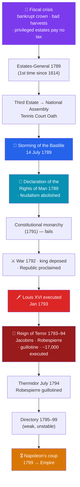

# 🔴 The French Revolution

> [!abstract] TL;DR
> The **French Revolution** (1789–1799) destroyed the **Old Regime** — absolute monarchy, aristocratic privilege, and feudal dues — and tried to rebuild France on Enlightenment principles of **liberty, equality, and fraternity**. It began as a **fiscal crisis**: a bankrupt crown convened the **Estates-General** in 1789, whose Third Estate broke away to form a **National Assembly**. The **storming of the Bastille** (14 July 1789) and the **Declaration of the Rights of Man and of the Citizen** launched a sweeping transformation. But war, fear, and factionalism drove a **radical turn**: the monarchy was abolished, **Louis XVI** was **guillotined** (Jan 1793), and the **Jacobins** under **Robespierre** unleashed the **Reign of Terror** (1793–94), executing tens of thousands until Robespierre himself fell in **Thermidor** (July 1794). Even the seating of deputies — radicals on the **left**, conservatives on the **right** — gave the world its enduring political vocabulary. Though it ended in chaos and then **Napoleon's** dictatorship, the Revolution permanently established popular sovereignty, legal equality, and nationalism as forces in the modern world.

## Intuition — analogy first

Imagine a **hugely over-leveraged company** with a lavish executive suite, a workforce carrying all the costs and none of the votes, and books so cooked that it can no longer pay its debts. To buy time, management finally calls a **shareholder meeting it has avoided for 175 years** — and the ordinary shareholders, once assembled and counting their numbers, realize they could simply **seize control of the whole enterprise.** That is 1789: a bankruptcy meeting that becomes a takeover.

The hard part is what comes next. Overthrowing the old board is one thing; agreeing on how to run the company under **relentless external attack** (foreign armies) and internal sabotage (counter-revolt) is another. Under siege, a faction concludes that survival requires **purging anyone deemed disloyal** — and the machinery built to defend the revolution starts consuming the revolutionaries themselves. This is the tragic engine of the Terror: a movement that begins by proclaiming universal rights and, in the name of saving those rights, ends by suspending them. The Revolution's deepest lesson is how easily **"the will of the people"** can be invoked to justify both liberation and its opposite.

---

## How It Works — From Fiscal Crisis to Terror to Empire

## Key Concepts

### The Old Regime and the Fiscal Crisis

Pre-revolutionary France was divided into three **estates**: the **First** (clergy), the **Second** (nobility), and the **Third** (everyone else — 97% of the population, from peasants to wealthy bourgeoisie). The first two estates enjoyed vast privileges and paid **almost no taxes**, throwing the fiscal burden onto the Third. Decades of war (including the costly aid to the **American Revolution** — see [[The_American_Revolution]]), royal extravagance, and an unfair tax system left **Louis XVI's** government **bankrupt**. Poor harvests spiked bread prices. Unable to force the privileged orders to accept taxation, the king was compelled to summon the **Estates-General** for the first time since **1614**.

### 1789 — The Revolution Begins

- **The National Assembly (June 1789):** When the Estates-General deadlocked over whether to vote by estate (favoring the privileged) or by head (favoring the numerous Third Estate), the Third Estate declared itself the **National Assembly**, representing the nation. Locked out, they swore the **Tennis Court Oath** not to disband until they had written a constitution.
- **The Storming of the Bastille (14 July 1789):** Fearing a royal crackdown, a Paris crowd stormed the **Bastille** fortress-prison, a symbol of royal despotism. The date became France's national day and the iconic start of the Revolution.
- **The Declaration of the Rights of Man and of the Citizen (August 1789):** The Assembly proclaimed that "**Men are born and remain free and equal in rights**," enshrining liberty, property, security, resistance to oppression, popular sovereignty, and equality before the law — a distillation of **Enlightenment** thought (see [[The_Enlightenment]]).
- **Abolition of feudalism (August 1789):** In one night, the Assembly swept away noble privileges, feudal dues, and the tithe.

### The Radical Turn

The moderate phase — a **constitutional monarchy** under the **Constitution of 1791** — collapsed under mounting pressures:
- **Foreign war (April 1792):** Austria and Prussia invaded to crush the Revolution, radicalizing politics and fusing patriotism with revolution.
- **The king deposed:** After the royal family's failed flight to Varennes (1791) and the storming of the Tuileries, the monarchy was abolished and the **First Republic** proclaimed in **September 1792**.
- **Execution of Louis XVI:** Convicted of treason, the king was **guillotined on 21 January 1793**; **Marie Antoinette** followed in October. Regicide horrified Europe's monarchies and widened the war.

### The Reign of Terror (1793–1794)

Facing invasion abroad and revolt at home (the Vendée), the radical **Jacobins** — led by **Maximilien Robespierre** through the **Committee of Public Safety** — governed by emergency dictatorship:

| Element | Detail |
|---|---|
| **Instrument** | The **guillotine** — a machine designed for swift, "egalitarian" execution |
| **Leaders** | Robespierre, Louis Saint-Just, Georges Danton (later himself executed) |
| **Law** | The **Law of Suspects** (Sept 1793) allowed arrest on mere suspicion of disloyalty |
| **Scale** | Roughly **16,000–17,000** officially executed; tens of thousands more died in prison or in the provincial repression (Vendée, Lyon) |
| **Ideology** | "Terror is nothing but justice, prompt, severe, inflexible" (Robespierre); a **"Republic of Virtue"** enforced by fear |
| **De-Christianization** | A revolutionary calendar, the **Cult of the Supreme Being**, and attacks on the Church |

The Terror devoured its own: Danton and the moderates were guillotined, then Robespierre himself fell in the coup of **9 Thermidor (27 July 1794)** and was executed the next day, ending the Terror.

### "Left" and "Right" — A Lasting Vocabulary

The modern political spectrum was born in the seating of the revolutionary assemblies: **supporters of radical change sat on the president's left**, and **defenders of the monarchy and tradition on the right**. "**Left**" and "**right**" have denoted progressive and conservative politics ever since.

### Aftermath and Legacy

The Terror gave way to the **Directory** (1795–1799), a corrupt and unstable regime that finally fell to the coup of **Napoleon Bonaparte** in 1799 (see [[Napoleon_and_His_Wars]]). Despite its bloody course, the Revolution's legacy is immense: it **abolished feudalism and legal privilege**, established **popular sovereignty** and **equality before the law**, ignited modern **nationalism** and mass politics, secularized the state, and spread the ideals of **liberty, equality, fraternity** across Europe and the world — inspiring later revolutions from Latin America (see [[Latin_American_Independence]]) to 1848 and beyond.

## Primary Sources & Examples

- **Declaration of the Rights of Man and of the Citizen (1789):** France's answer to the American Declaration, and the founding charter of liberal democracy in continental Europe. Its assertion of universal equal rights outran its own era's practice.
- **Abbé Sieyès, *What Is the Third Estate?* (1789):** The electrifying pamphlet that framed the crisis — "What is the Third Estate? Everything. What has it been until now? Nothing. What does it want to be? Something." — and justified the Third Estate's claim to be the nation.
- **Olympe de Gouges, *Declaration of the Rights of Woman* (1791):** Demanded that the Revolution's equality extend to women; its author was later guillotined, exposing the Revolution's limits.
- **Robespierre, "On the Principles of Political Morality" (Feb 1794):** The chilling theoretical defense of the Terror as virtue enforced by justice — essential reading on how idealism turned murderous.

## Common Pitfalls / Misconceptions

- **"The Revolution was one continuous event."** It moved through distinct, often contradictory phases — liberal constitutional monarchy (1789–92), radical republic and Terror (1792–94), Thermidorian reaction and Directory (1794–99), then Napoleon. Treating it as a single mood erases its violent internal reversals.
- **"The Bastille was full of political prisoners."** It held only **seven** inmates on 14 July 1789; its storming was symbolic (and about seizing gunpowder), not a mass liberation.
- **"The Terror was mindless bloodlust."** It was a **deliberate wartime policy** by a besieged regime — which explains without excusing it. Understanding its logic (external war + internal revolt + ideology of virtue) is the historian's task.
- **"'Let them eat cake' explains Marie Antoinette."** The quote is almost certainly **apocryphal** and predates her; blaming the Revolution on one queen's callousness ignores its deep fiscal and structural causes.
- **"The Revolution simply established democracy."** It ended in dictatorship (Napoleon) and universal male suffrage was fleeting; its democratic legacy was real but indirect and long-contested.

## Related Concepts

- [[_MOC_Enlightenment_Revolutions|↑ Section MOC]] — the section hub
- [[The_Enlightenment]] — Rousseau's popular sovereignty and general will, and the Declaration's rights language, are the Revolution's intellectual DNA
- [[The_American_Revolution]] — an inspiring model, and — through France's war debt — an unwitting financial trigger
- [[Napoleon_and_His_Wars]] — the strongman who emerged from the Revolution's chaos to both spread and betray its ideals
- [[Latin_American_Independence]] — revolutionary ideals and the weakening of the Iberian monarchies rippled to the Americas
- Cross-vault: [[_MOC_Psychology_Master]] — crowd behavior, moral licensing, and the psychology of political violence illuminate the dynamics of the Terror

## Review Questions

1. Explain how a **fiscal crisis** turned into a political revolution in 1789, tracing the path from the Estates-General to the storming of the Bastille and the Declaration of the Rights of Man.
2. What combination of pressures drove the **radical turn** and the Reign of Terror, and how did the Terror ultimately consume its own leaders?
3. Where do the political terms **"left"** and **"right"** come from, and in what senses is it fair to say the Revolution both created and betrayed modern democratic ideals?

## Sources

- Doyle, W. (2002). *The Oxford History of the French Revolution* (2nd ed.). Oxford University Press
- Schama, S. (1989). *Citizens: A Chronicle of the French Revolution*. Knopf
- Lefebvre, G. (1939/1947). *The Coming of the French Revolution*. Princeton University Press
- Tackett, T. (2015). *The Coming of the Terror in the French Revolution*. Harvard University Press

#history #revolution #french-revolution #reign-of-terror #popular-sovereignty #left-and-right
