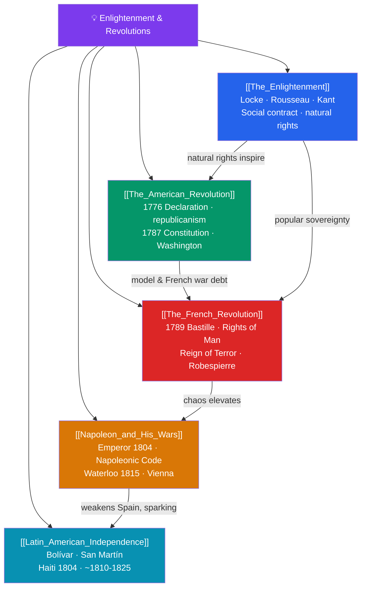

# 🗺️ Enlightenment & Revolutions — Map of Content

> [!abstract] What This Section Covers
> The late 18th century turned Enlightenment ideas into political earthquakes. **The Enlightenment** made reason the measure of authority: Locke argued for natural rights and government by consent, Montesquieu for the separation of powers, Rousseau for the social contract and popular sovereignty, and Kant urged "dare to know." These ideas ignited a wave of revolutions. **The American Revolution** produced the Declaration of Independence (1776) and a durable republican constitution (1787). **The French Revolution** of 1789 stormed the Bastille, proclaimed the Rights of Man, abolished the monarchy, and descended into the Reign of Terror. Out of its chaos rose **Napoleon**, whose empire, the Napoleonic Code, and continental wars ended at Waterloo in 1815. The upheaval spread to the Americas, where **Latin American independence** movements led by Bolívar and San Martín — following the Haitian Revolution of 1804 — dismantled Spain's New World empire. Together these notes trace how "liberty, equality, fraternity" reshaped the modern political order.

## Concept Map

## Learning Path

1. [[The_Enlightenment]] — The philosophers and ideas — reason, rights, the social contract — that underpinned the age of revolutions.
2. [[The_American_Revolution]] — The break from Britain, republican self-government, and the world's first modern written constitution.
3. [[The_French_Revolution]] — The collapse of the Old Regime, the Rights of Man, radicalization, and the Terror.
4. [[Napoleon_and_His_Wars]] — Napoleon's rise, his reforms and code, his continental empire, and his defeat.
5. [[Latin_American_Independence]] — The wars that freed Spanish and Portuguese America, led by Bolívar and San Martín.

## All Notes at a Glance

| Note | Difficulty | What You'll Learn |
|------|------------|-------------------|
| [[The_Enlightenment]] | Intermediate | Locke, Montesquieu, Rousseau, Voltaire, Kant, reason, natural rights, the social contract |
| [[The_American_Revolution]] | Beginner → Intermediate | Causes, the Declaration of Independence, republicanism, the 1787 Constitution and federalism |
| [[The_French_Revolution]] | Intermediate | 1789, the Bastille, the Rights of Man, the abolition of monarchy, the Jacobins and the Terror |
| [[Napoleon_and_His_Wars]] | Intermediate | The Consulate and Empire, the Napoleonic Code, the Grande Armée, Waterloo, the Congress of Vienna |
| [[Latin_American_Independence]] | Intermediate | Simón Bolívar, José de San Martín, the Haitian Revolution, and the fall of Iberian colonial rule |

## Key Questions This Section Answers

- What core Enlightenment ideas about reason, rights, and government inspired the age of revolutions?
- How did the American Revolution translate Enlightenment theory into a working republic?
- Why did the French Revolution turn so radical, and how did it end in Terror and then empire?
- How did Napoleon both spread and betray the ideals of the French Revolution?
- How did the Atlantic revolutions ripple outward to dismantle Spain's empire in the Americas?

## Related Sections

- [[_MOC_History_Master|↑ History Master MOC]]
- [[_MOC_Exploration_Colonialism|← Exploration & Colonialism]]
- [[_MOC_Industrial_Revolution|→ The Industrial Revolution]]

#MOC #History #Revolutions
