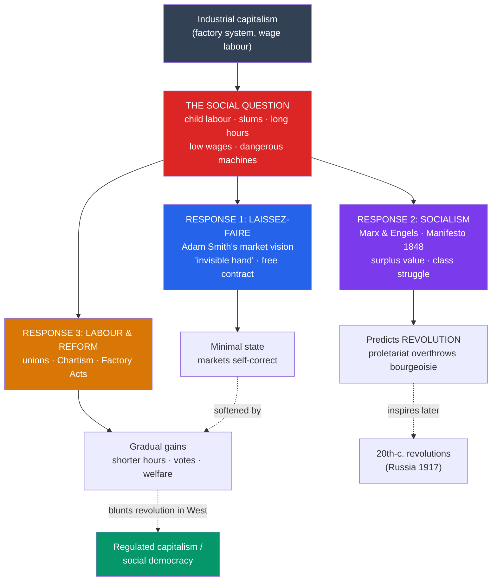

# 🔨 Capitalism, Socialism, and Labor

> [!abstract] TL;DR
> The [[The_First_Industrial_Revolution|factory system]] created enormous wealth and a new class of industrial owners — but it also produced **child labor, disease-ridden slums, and brutal working conditions** that made "the social question" the central issue of the 19th century. The prevailing ideology of **laissez-faire industrial capitalism**, rooted in **Adam Smith**'s vision of self-regulating markets, was challenged head-on by **socialism**, above all the **scientific socialism** of **Karl Marx and Friedrich Engels** — whose *Communist Manifesto* (**1848**) predicted capitalism's overthrow by the proletariat and whose *Das Kapital* (Vol. I, **1867**) dissected exploitation and surplus value. Workers themselves responded pragmatically: through **trade unions**, the mass democratic movement of **Chartism**, and a slow accumulation of **reform legislation** (Factory Acts, franchise extension) that softened capitalism's harshest edges without abolishing it. The clash between market freedom, class conflict, and reform defined modern politics.

## Intuition — analogy first

Imagine a village where a new, wildly productive **machine-mill** appears. It generates more wealth than anyone has ever seen — but the person who owns the mill keeps almost all of it, while the people who tend the machines twelve hours a day, including their children, live in a shack, breathe cotton dust, and can be dismissed at a whim. The wealth is real; so is the misery. This gap is **"the social question,"** and the 19th century produced three great answers to it.

The **first answer** says: *leave the mill alone.* Free exchange, if unobstructed, will over time lift everyone — the owner's greed is disciplined by competition, and the "invisible hand" turns private self-interest into public good. That is **Adam Smith's** market vision, hardened by later followers into **laissez-faire**.

The **second answer** says: *the mill is theft.* The owner grows rich only by paying workers less than the value they create; the gap is not a lubricant of progress but stolen labor. The only fix is for the workers to seize the mill. That is **Marx**.

The **third answer** is quieter and, historically, the one that mostly won in the West: *keep the mill, but change the rules.* Let the workers **organize** to bargain collectively, pass **laws** limiting hours and banning child labor, and give them the **vote** so they can defend themselves in politics. That is the pragmatic path of unions, Chartism, and reform.

---

## How It Works — Three Responses to Industrial Misery

## Key Concepts

### The Human Cost of Industrialization

The early factory economy ran on cheap, disposable labor:

- **Child labor** — Children as young as five or six worked in mills and mines, prized for small hands and low wages; they crawled under machinery and worked shifts of 12–16 hours. Parliamentary inquiries (e.g. the **1832 Sadler Committee** and the **1842 Children's Employment Commission**) gathered harrowing testimony.
- **Working conditions** — Unguarded machinery maimed workers; cotton dust caused **byssinosis** ("brown lung"); there was no compensation for injury and no job security.
- **Slums** — Cities like Manchester and Glasgow grew far faster than sanitation. Families crowded into back-to-back housing and cellars sharing a single privy and standpipe; **cholera** epidemics (1832, 1848–49) swept the courts and alleys. Edwin Chadwick's *Report on the Sanitary Condition of the Labouring Population* (**1842**) documented life expectancies in industrial towns as low as the high teens for laborers.

### The Rise of Industrial Capitalism

**Industrial capitalism** differs from earlier commercial capitalism: wealth now came from **owning the means of production** (factories, machines, mines) and employing **wage laborers** who owned only their labor. A new **industrial bourgeoisie** — mill owners, ironmasters, railway magnates — accumulated fortunes and, after the **1832 Reform Act**, growing political power, while a propertyless **proletariat** sold its time by the hour in a competitive labor market.

The intellectual defense of this order drew on **Adam Smith** (*The Wealth of Nations*, 1776), whose "**invisible hand**" argued that individuals pursuing self-interest in free markets unintentionally promote the general good, and on **David Ricardo** and **Thomas Malthus**, whose pessimistic "laws" were read to imply that wages could not be raised and poverty could not be relieved without harm. Hardened into **laissez-faire**, this doctrine resisted state interference in hours, wages, or safety. (Smith himself was more nuanced — he distrusted merchants' conspiracies and endorsed some public goods.) For the deeper economics, see [[_MOC_Macroeconomics_Master]].

### Marx and Engels: Scientific Socialism

**Utopian socialists** came first — **Robert Owen** (the model mill at New Lanark), **Charles Fourier**, and **Henri de Saint-Simon** imagined cooperative communities. **Karl Marx** and **Friedrich Engels** dismissed these as wishful and offered instead what they called **scientific socialism**:

- ***The Communist Manifesto* (1848)** — Written for the Communist League and published in the year of Europe-wide revolutions, it opens "A spectre is haunting Europe" and frames all history as **class struggle**. It predicts that the **bourgeoisie** produces "its own grave-diggers" — the **proletariat** — who will overthrow it. It ends: "Working men of all countries, unite!"
- ***Das Kapital* (Vol. I, 1867)** — Marx's dense analysis of the capitalist mode of production. Key ideas: the **labor theory of value**; **surplus value**, the difference between the value workers produce and the wages they are paid, which the capitalist appropriates as profit (Marx's account of **exploitation**); **alienation** of workers from their labor; and a tendency toward crises and concentration of capital.

Marx's prediction of proletarian revolution did **not** come true in the advanced industrial states he studied, but his framework reshaped economics, sociology, history, and — through 20th-century revolutionaries — the political map of the world.

| | **Laissez-faire capitalism** | **Marxian socialism** | **Reformist / labor path** |
|---|---|---|---|
| **Core claim** | Free markets maximize wealth for all | Capitalism exploits workers via surplus value | Capitalism is reformable through law and organization |
| **Role of the state** | Minimal ("night-watchman") | Seized then withered after revolution | Active regulator and referee |
| **Key figures** | Adam Smith, Ricardo | Marx, Engels | Union leaders, Chartists, reformers |
| **Prescription** | Leave markets alone | Abolish private ownership of production | Unions, franchise, factory/welfare laws |
| **Historical outcome (West)** | Softened by regulation | Inspired revolutions elsewhere, not the West | Largely prevailed → social democracy |

### Trade Unions, Chartism, and Reform

Most workers pursued neither pure laissez-faire nor revolution but **collective self-defense**:

- **Trade unions** — Illegal under the **Combination Acts** (1799–1800), unions were partly legalized after their **repeal in 1824–25** and given firmer standing by the **Trade Union Act 1871**. The **Tolpuddle Martyrs** (1834), farm laborers transported to Australia for swearing a union oath, became a rallying symbol.
- **Chartism (1838–1848)** — Britain's first mass working-class political movement, built around the **People's Charter** and its six demands (universal male suffrage, secret ballot, annual parliaments, equal constituencies, payment of MPs, and no property qualification). It gathered millions of signatures on petitions; though rejected at the time, **five of its six demands** later became law.
- **Reform legislation** — Piece by piece the state intervened: the **Factory Act 1833** (limited child labor, appointed inspectors), the **Mines Act 1842** (barred women and young children underground), the **Ten Hours Act 1847**, plus **public health** and, later, **franchise** reforms (**1867**, **1884**) that gave many working men the vote. This incremental path — not revolution — became the Western norm.

## Primary Sources & Examples

- **The Sadler Committee testimony (1832):** Sworn accounts before Parliament of children beaten to stay awake at the looms and deformed by long standing — the evidentiary basis for the Factory Act 1833 and a founding document of protective labor law.
- **Marx & Engels, *The Communist Manifesto* (1848):** The most influential political pamphlet of the modern era; its class-struggle framework and revolutionary conclusion should be read as both analysis and call to action.
- **Engels, *The Condition of the Working Class in England* (1845):** Eyewitness reportage on Manchester's slums that supplied Marx with empirical detail and remains a key (committed) primary source on industrial poverty.
- **The People's Charter (1838):** The six-point program of Chartism — a concrete example of workers seeking redress through **democratic** rather than revolutionary means.

## Common Pitfalls / Misconceptions

- **Equating socialism with Soviet communism.** 19th-century socialism was a broad family — utopian, Marxian, Christian, and reformist/social-democratic. Marx's revolutionary strand is only one branch, and most Western labor movements chose the reformist path.
- **Assuming Marx's predictions came true.** In the advanced capitalist countries, revolution did *not* occur; instead wages rose, unions were legalized, and welfare states emerged — arguably *because* reform relieved the pressures Marx expected to explode.
- **Caricaturing Adam Smith as a heartless free-marketeer.** Smith condemned monopoly and merchant collusion, worried about the effects of the division of labor on workers, and supported public education and infrastructure. Laissez-faire dogma was built by later followers.
- **Reading all owners as villains and all workers as saints.** Some industrialists (Owen, the Cadburys, the Salts) built model towns and shorter hours; conditions varied enormously by trade, region, and decade. The picture is one of conflict *and* negotiation, not melodrama.

## Related Concepts

- [[_MOC_Industrial_Revolution|↑ Section MOC]] — the section hub
- [[The_First_Industrial_Revolution]] — the factory system and urbanization that created the industrial working class and "the social question" this note answers
- [[The_Second_Industrial_Revolution]] — the later corporate, mass-production economy in which unions and socialist parties matured
- [[Nationalism_and_Unification]] — the competing 19th-century ideology; class loyalty and national loyalty often pulled workers in opposite directions
- Cross-vault: [[_MOC_Macroeconomics_Master]] — the economic theory (markets, labor, value, distribution) underlying the Smith-versus-Marx debate

## Review Questions

1. Explain Marx's concept of **surplus value** and how it grounds his claim that capitalism is inherently exploitative. Why did he call his socialism "scientific"?
2. Contrast the three main responses to "the social question" — laissez-faire capitalism, Marxian socialism, and reformist labor politics — on the role each assigns to the state.
3. What was **Chartism**, what were its six demands, and in what sense can it be judged both a failure and a long-run success?

## Sources

- Marx, K. & Engels, F. (1848). *Manifesto of the Communist Party*
- Engels, F. (1845). *The Condition of the Working Class in England*
- Hobsbawm, E. (1962). *The Age of Revolution: 1789–1848*. Weidenfeld & Nicolson
- Thompson, E.P. (1963). *The Making of the English Working Class*. Victor Gollancz

#history #industrial #capitalism #socialism #marxism #labor
