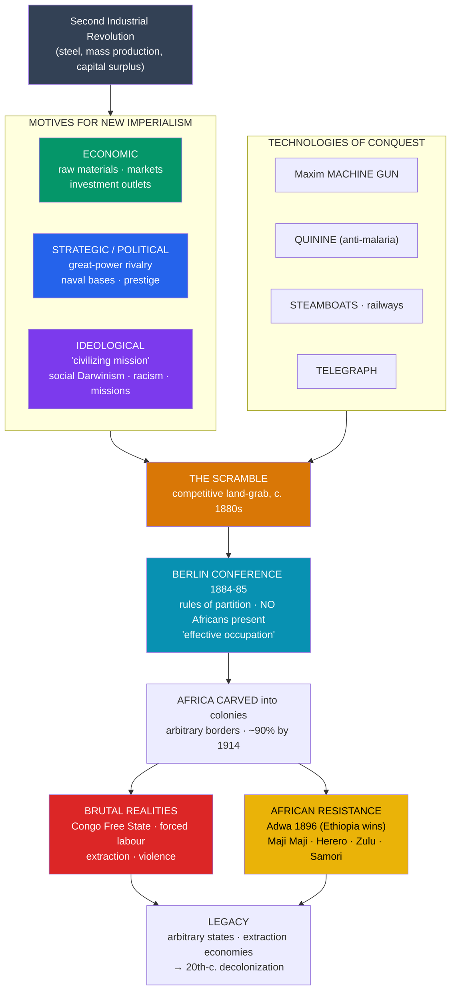

# 🌍 Imperialism and the Scramble for Africa

> [!abstract] TL;DR
> In roughly a single generation (**c. 1870–1914**), European powers seized almost the entire African continent — a burst of conquest so rapid it is called the "**Scramble for Africa**." This "**New Imperialism**" was powered by the [[The_Second_Industrial_Revolution|Second Industrial Revolution]]'s hunger for raw materials and markets, by [[Nationalism_and_Unification|great-power rivalry]] and prestige, and by an **ideology** that fused a self-appointed "civilizing mission" with **social Darwinism** and scientific racism. The **Berlin Conference (1884–85)** set the rules by which Europeans — with no African representation — carved the continent into colonies, drawing borders that ignored existing societies. New **technologies of conquest** — the machine gun, quinine, the steamboat, and the telegraph — made domination possible at low European cost. The realities were often catastrophic, as in **King Leopold II's Congo Free State**, and provoked determined **African resistance** (Ethiopia's victory at **Adwa**, 1896, being the great exception). The arbitrary borders and extraction economies imposed here shaped Africa into the era of [[_MOC_Cold_War_Modern|decolonization]] and beyond.

## Intuition — analogy first

Imagine a handful of newly rich, intensely competitive neighbors who have each just built a factory. Every factory needs cheap **raw materials** (rubber, cotton, minerals, palm oil) coming in and **customers** for finished goods going out. Now imagine there is a vast property next door — Africa — long known to outsiders only around its coasts, its interior guarded for centuries by disease, distance, and powerful local states.

Three things change at once, and the neighbors rush in. First, **new tools** dissolve the old barriers: a drug (**quinine**) that lets Europeans survive malaria, **steamboats** that push up rivers, **telegraphs** that carry orders, and above all a **weapon** — the **machine gun** — that makes a few colonizers a match for thousands of defenders. Second, the neighbors are locked in a **status race**: no one dares let a rival grab territory first, so a claim by one triggers claims by all, like a land rush where planting a flag is easier than governing anything. Third, they tell themselves a **flattering story** — that they are not thieves but civilizers, bearers of a higher race's duty to "uplift" the peoples they conquer.

The result is a **feeding frenzy** more about beating each other than about Africa itself — which is exactly why they eventually sat down at a conference table in Berlin to divide the prize by agreement, drawing lines on a map of a continent none of them understood, and almost none of them had asked the inhabitants about.

---

## How It Works — Motives, Means, and the Partition

## Key Concepts

### "New Imperialism" (c. 1870–1914)

Europe had held overseas empires for centuries, but the **New Imperialism** was distinctive in **pace, scale, and character**. In a few decades, European control of Africa leapt from a handful of coastal enclaves to roughly **90% of the continent**; the entire globe was drawn into a system of formal colonies, protectorates, and spheres of influence. It coincided with — and was fueled by — the Second Industrial Revolution and the intense nationalism of the post-1871 great-power order.

### Motives: Economic, Strategic, and Ideological

Historians debate the balance of causes; most see a **combination**:

| Motive | Content | Debate |
|---|---|---|
| **Economic** | Raw materials (rubber, cotton, copper, gold, diamonds, palm oil), captive **markets**, and outlets for surplus **capital**. | **J.A. Hobson** (*Imperialism*, 1902) and **Lenin** (*Imperialism, the Highest Stage of Capitalism*, 1916) made economics primary; critics note many colonies were unprofitable and trade often followed the flag rather than causing it. |
| **Strategic/political** | Great-power **rivalry** and **prestige**: securing sea routes (the **Suez Canal**, 1869), coaling stations, and denying territory to rivals. A claim by one power forced pre-emptive claims by others. | The "**official mind**" thesis (Robinson & Gallagher) stresses strategy — e.g. Britain occupying Egypt (1882) to guard the route to India. |
| **Ideological** | The "**civilizing mission**" (*mission civilisatrice*), **social Darwinism**, scientific **racism**, and Christian **missionary** zeal. | Ideology both motivated and *justified* conquest; it made domination feel like duty ("the White Man's Burden," Kipling, 1899). |

### Ideology: The "Civilizing Mission" and Social Darwinism

The New Imperialism was drenched in **racial ideology**. **Social Darwinism** misapplied "survival of the fittest" to human societies, casting European domination as natural selection in action and non-European peoples as "lower" races destined to be ruled, "civilized," or displaced. Pseudo-scientific racism, the "civilizing mission," and missionary Christianity combined into a self-justifying story in which conquest was reframed as **altruism**. This ideology is essential to understanding how contemporaries reconciled brutal violence with a sincere belief in their own benevolence — and it is a textbook case of the biases examined in [[Historical_Bias_and_Revisionism]].

### The Berlin Conference (1884–85)

Convened by **Bismarck** in Berlin, the conference of **14 mostly European states** (the U.S. attended; **no African representatives** were present) set the ground rules for partition. Its **General Act (1885)**:

- Established the principle of **"effective occupation"** — to claim territory a power had to demonstrate actual administrative control, which *accelerated* the scramble into the interior.
- Recognized **King Leopold II of Belgium**'s personal control of the **Congo Free State**.
- Declared free navigation on the **Congo and Niger rivers** and nominal commitments to suppress the slave trade.

The conference did not itself partition Africa, but it **legitimized and regulated** the land-grab among the powers — dividing a continent by diplomacy while treating its peoples as absent. The borders drawn cut across ethnic, linguistic, and political lines, splitting some societies and forcing rivals together — a legacy that outlived colonialism.

### Technologies of Conquest

The New Imperialism was, in Daniel Headrick's phrase, powered by "**tools of empire**":

- **Quinine** — prophylaxis against malaria opened the previously deadly African interior to Europeans (the "white man's grave").
- **Steamboats** and **railways** — projected force up rivers and into the interior and moved extracted goods to the coast.
- **The machine gun** — especially the **Maxim gun** (1884), gave tiny European forces devastating firepower. At **Omdurman (1898)**, an Anglo-Egyptian force killed thousands of Sudanese Mahdists for a few hundred of its own losses; Hilaire Belloc's grim couplet — "Whatever happens, we have got / The Maxim Gun, and they have not" — captured the imbalance.
- **The telegraph** — allowed metropolitan governments to coordinate distant conquest and administration.

### Brutal Realities: The Congo Free State

The **Congo Free State (1885–1908)** — held by **Leopold II** as personal property, not even as a Belgian colony — became the era's most infamous atrocity. To extract wild **rubber**, a regime of **forced labor**, hostage-taking, mutilation (severed hands as proof of "productivity"), and terror caused a demographic catastrophe; estimates of the population decline run into the **millions**. The **Congo Reform Association** (E.D. Morel, Roger Casement's official report of 1904) exposed it, and international outrage forced Leopold to hand the territory to the Belgian state in 1908. It stands as the starkest refutation of the "civilizing mission" myth.

### African Resistance

Partition was **contested**, not passively accepted:

- **Ethiopia** decisively defeated Italy at the **Battle of Adwa (1896)** under **Emperor Menelik II**, remaining one of only two African states (with **Liberia**) never colonized — the great exception.
- **Samori Ture** built and long defended the Wassoulou Empire against the French in West Africa.
- The **Zulu** inflicted a famous defeat on the British at **Isandlwana (1879)** before being subjugated.
- Major anti-colonial risings included the **Maji Maji rebellion** (German East Africa, 1905–07) and, met with genocide, the **Herero and Nama** war (German South-West Africa, 1904–08).

Resistance rarely stopped conquest against machine guns, but it shaped colonial rule and seeded later independence movements.

## Primary Sources & Examples

- **The General Act of the Berlin Conference (1885):** The founding document of the partition, with its "effective occupation" clause — read alongside a map of colonial Africa, it shows diplomacy dividing a continent whose peoples were unrepresented.
- **Roger Casement's *Congo Report* (1904) and E.D. Morel's *Red Rubber* (1906):** Official and campaigning exposés of Leopold's atrocities — landmark human-rights documentation and the evidentiary core of the first modern international humanitarian campaign.
- **Joseph Conrad, *Heart of Darkness* (1899):** A literary primary source drawn from Conrad's own Congo voyage; a searing (if Eurocentric) indictment of imperial rapacity, later critiqued by Chinua Achebe.
- **Rudyard Kipling, "The White Man's Burden" (1899):** The imperial ideology in verse — invaluable for understanding how contemporaries framed conquest as reluctant duty rather than plunder.
- **The Battle of Adwa (1896):** Ethiopia's victory over Italy — the outstanding case of successful armed resistance, a touchstone of African and Pan-African pride.

## Common Pitfalls / Misconceptions

- **Believing imperialism was mainly about spreading civilization.** The "civilizing mission" was largely **ideology and justification**; the drivers were economic extraction, strategic rivalry, and prestige, and the record (Congo, forced labor, extraction economies) contradicts the benevolent self-image.
- **Assuming Africa was "empty" or without states.** Pre-colonial Africa held powerful, complex polities (e.g. the [[West_African_Empires|West African empires]] of Mali and Songhai, the Sokoto Caliphate, Ashanti, Ethiopia, Zulu). Colonizers conquered existing societies; they did not fill a vacuum.
- **Reducing every motive to economics.** Many colonies never turned a profit; strategy, national prestige, and pre-emptive rivalry mattered as much as, and sometimes more than, direct economic gain (a genuine historiographical debate).
- **Portraying Africans as passive victims.** Resistance was widespread and sometimes victorious (Adwa); the historical record includes agency, negotiation, and adaptation, not only conquest.
- **Treating the Berlin Conference as the moment Africa was "divided up on a map."** It set **rules and legitimacy**; the actual conquest and boundary-drawing unfolded through subsequent treaties, wars, and occupation over the following decades.

## Related Concepts

- [[_MOC_Industrial_Revolution|↑ Section MOC]] — the section hub
- [[The_Second_Industrial_Revolution]] — the industrial demand for raw materials and markets, and the steel/steam/gun technology, that powered the new imperialism
- [[Nationalism_and_Unification]] — great-power rivalry and national prestige (including a newly unified Germany's ambitions) drove the competitive scramble
- [[Capitalism_Socialism_and_Labor]] — Hobson and Lenin's economic theories of imperialism grew directly out of the critique of industrial capitalism
- [[Historical_Bias_and_Revisionism]] — social Darwinism and the "civilizing mission" are model cases of ideology masquerading as objective science
- Cross-vault: [[West_African_Empires]] — the powerful pre-colonial African states (Mali, Songhai) that colonizers conquered, refuting the "empty continent" myth
- Cross-vault: [[_MOC_Cold_War_Modern]] — the mid-20th-century **decolonization** that dismantled the empires built here, inheriting their arbitrary borders

## Review Questions

1. What made the "**New Imperialism**" (c. 1870–1914) distinct from earlier European empire-building in pace, scale, and ideology? Link it to the Second Industrial Revolution.
2. Explain the significance of the **Berlin Conference (1884–85)**, including the principle of "effective occupation" and the absence of African representation. Did it partition Africa?
3. Assess the claim that the "civilizing mission" was the real motive for imperialism, using the **Congo Free State** and at least one example of **African resistance** in your answer.

## Sources

- Pakenham, T. (1991). *The Scramble for Africa: 1876–1912*. Weidenfeld & Nicolson
- Headrick, D. (1981). *The Tools of Empire: Technology and European Imperialism in the Nineteenth Century*. Oxford University Press
- Hochschild, A. (1998). *King Leopold's Ghost: A Story of Greed, Terror, and Heroism in Colonial Africa*. Houghton Mifflin
- Hobson, J.A. (1902). *Imperialism: A Study*. James Nisbet

#history #industrial #imperialism #africa #colonialism #berlin-conference
