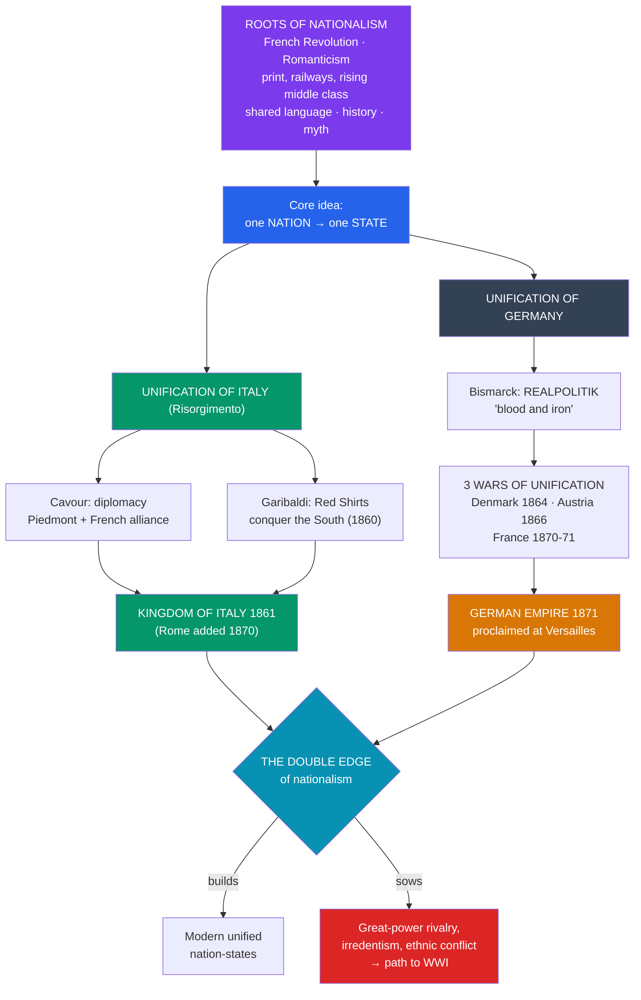

# 🇩🇪 Nationalism and Unification

> [!abstract] TL;DR
> **Nationalism** — the belief that humanity is naturally divided into **nations**, each entitled to its own sovereign state — was the most powerful political force of the 19th century. Fed by the French Revolution, Romanticism, and a rising middle class, and carried by railways and print, it dissolved old dynastic and multinational orders and built new nation-states. Its two great triumphs were the **unification of Italy** (the *Risorgimento*), engineered by **Cavour**'s diplomacy and **Garibaldi**'s volunteers and largely completed by **1861**, and the **unification of Germany**, forged by **Otto von Bismarck**'s ruthless **realpolitik** and three deliberate **wars of unification**, proclaimed as the German Empire at Versailles in **1871**. Nationalism thus *built* modern nations — but the same force, in its exclusive and expansionist forms, hardened great-power rivalries and stirred the ethnic tensions that would help ignite the [[Imperialism_and_the_Scramble_for_Africa|imperial]] and world-war catastrophes of the next century.

## Intuition — analogy first

Before the 19th century, the political map of Europe was organized around **who your ruler was**, not **who your people were**. You were a subject of the Habsburg emperor or the King of Piedmont; whether you spoke German, Italian, Hungarian, or Czech was, for the state, almost beside the point. "Italy" and "Germany" were **geographical expressions** — patchworks of dozens of kingdoms, duchies, and city-states — not countries.

Nationalism flips this logic. It says the natural unit of politics is the **nation** — a community that shares a language, history, culture, and homeland — and that each nation *ought* to have its own state. Imagine a continent of scattered puzzle pieces suddenly told that pieces of the same color belong together: the Italian-speaking pieces should snap into one "Italy," the German-speaking pieces into one "Germany." That re-sorting was the great project of the century.

But notice the **double edge**. The same principle that unites the pieces of one color implies that *other* colors don't belong — so it can just as easily be used to expel minorities, claim a neighbor's land because your co-nationals live there, or teach a nation that its destiny is to dominate. Nationalism is a machine for building nations **and** a machine for building enemies. Both outputs come from the same idea.

---

## How It Works — Nationalism Builds Nations and Rivalries

## Key Concepts

### The Roots of 19th-Century Nationalism

Nationalism drew on several currents:

- **The French Revolution and Napoleon** — mobilized the "nation in arms," spread ideals of popular sovereignty, and, by conquering and reorganizing Europe, provoked national resistance and simplified maps (e.g. dissolving the Holy Roman Empire, 1806).
- **Romanticism** — thinkers like **Johann Gottfried Herder** celebrated the *Volksgeist* ("spirit of the people") expressed in language, folklore, and history; the **Brothers Grimm** collected folk tales as national heritage.
- **A rising middle class** and intelligentsia who found their ambitions blocked by conservative dynastic states.
- **Industrial infrastructure** — railways, newspapers, and a standardizing print language knit dispersed populations into an "**imagined community**" (Benedict Anderson's later term).

The **Revolutions of 1848** ("the Springtime of Peoples") were the first great, if failed, eruption of these liberal-nationalist demands across Europe. Their failure taught a hard lesson: unification might be achieved not by idealist revolution "from below" but by **power politics from above**.

### The Unification of Italy (Risorgimento)

Pre-unification Italy was divided among the Kingdom of Sardinia-Piedmont, Austrian-controlled Lombardy-Venetia, the Papal States, the Kingdom of the Two Sicilies, and several duchies. Three figures embody the movement:

- **Giuseppe Mazzini** — the prophet; his "**Young Italy**" movement supplied the ideal of a unified Italian republic (the romantic soul of the *Risorgimento*).
- **Count Camillo di Cavour** — the brain; prime minister of Piedmont, a shrewd modernizer who used **diplomacy** to secure a French alliance (**Napoleon III**, Plombières agreement 1858) and provoke war with Austria (1859) to expand Piedmont across the north.
- **Giuseppe Garibaldi** — the sword; in **1860** his volunteer "**Red Shirts**" (the Expedition of the Thousand) conquered Sicily and Naples, then handed the south to King **Victor Emmanuel II** of Piedmont.

The **Kingdom of Italy** was proclaimed in **1861** under Victor Emmanuel II. **Venetia** was added in 1866 (via alliance with Prussia) and **Rome** in **1870** (when French troops withdrew during the Franco-Prussian War), completing unification — though the observation attributed to Massimo d'Azeglio, "We have made Italy; now we must make Italians," captured how much regional division remained.

### The Unification of Germany

Germany was a patchwork within the **German Confederation** (39 states) dominated by rivalry between **Austria** and **Prussia**. Economic integration came first via the **Zollverein** (customs union, 1834) under Prussian leadership. Political unification was the work of one man:

- **Otto von Bismarck**, Minister-President of Prussia from 1862, practiced **realpolitik** — politics based on power and practical interest rather than ideology or sentiment. His 1862 declaration that the great questions would be decided "not by speeches and majority resolutions... but by **iron and blood**" became the movement's byword.
- He engineered **three wars of unification**:

| War | Date | Outcome |
|---|---|---|
| **Danish War** (vs. Denmark) | 1864 | Prussia and Austria seize Schleswig-Holstein — setting up a quarrel with Austria |
| **Austro-Prussian War** ("Seven Weeks' War") | 1866 | Prussia defeats Austria, excludes it from German affairs, forms the **North German Confederation** |
| **Franco-Prussian War** (vs. France) | 1870–71 | Prussia defeats France, captures Napoleon III at Sedan; southern German states join Prussia in patriotic war |

Victory over France sealed unity. On **18 January 1871**, the **German Empire** was proclaimed in the **Hall of Mirrors at Versailles**, with **Wilhelm I** as Kaiser and Bismarck as Chancellor. A newly unified, rapidly [[The_Second_Industrial_Revolution|industrializing]] Germany instantly became the strongest power on the continent — and France's loss of **Alsace-Lorraine** planted a lasting grievance.

### The Double Edge of Nationalism

Nationalism was **integrative** where it fused fragments into nation-states (Italy, Germany), but **disintegrative** where nations sought to break *out* of multinational empires — straining the **Austro-Hungarian** and **Ottoman** empires, and stoking Balkan tensions where the map did not match the peoples. It also mutated into more aggressive forms:

- **Irredentism** — the claim to "unredeemed" territory inhabited by co-nationals (Italy's claims on Austrian lands; pan-nationalisms).
- **Integral / ethnic nationalism** — exclusive, often xenophobic, sometimes fused with racism and later fascism.

The unified German Reich upset the European balance of power; unresolved national claims in the Balkans and Alsace-Lorraine became fuses. The force that built nations in 1861–71 helped build the alliance rivalries that exploded in 1914.

## Primary Sources & Examples

- **Bismarck's "Blood and Iron" speech (1862):** His address to the Prussian budget committee — "the great questions of the day will not be decided by speeches and majority resolutions... but by iron and blood" — is the classic statement of *realpolitik*.
- **The proclamation of the German Empire, Hall of Mirrors, Versailles (18 Jan 1871):** Anton von Werner's celebrated painting of the scene is a founding image of the German nation-state — and its setting in France's royal palace deliberately humiliated the defeated French.
- **Garibaldi's Expedition of the Thousand (1860):** The Red Shirts' improbable conquest of the south is the romantic heart of the *Risorgimento* and a case study in nationalism mobilizing volunteers, not just states.
- **Herder and the Grimms' folklore collections:** German Romantic writings that treated language and folk tradition as the essence of nationhood — the cultural taproot of political nationalism.

## Common Pitfalls / Misconceptions

- **Assuming nations are ancient and natural.** Modern nations were substantially *constructed* in the 19th century through education, conscription, standardized language, and "invented traditions." "Italy" and "Germany" as unified states are younger than the United States.
- **Treating unification as inevitable or purely popular.** Both unifications were driven decisively by **states and power politics** (Piedmont, Prussia) exploiting war and diplomacy — the idealist revolutions of 1848 had *failed*.
- **Overstating Garibaldi at Cavour's expense (or vice versa).** Italian unification needed **both** the diplomat and the guerrilla; and it was ultimately the conservative **monarchy of Piedmont**, not Mazzini's republic, that prevailed.
- **Seeing nationalism as simply progressive.** It was liberal and liberating in one guise and exclusionary, militaristic, and expansionist in another. The very success of 1871 destabilized Europe.
- **Confusing the German Empire (1871) with earlier "Germanys."** The Holy Roman Empire (dissolved 1806) and the loose German Confederation were not nation-states; the 1871 Reich was something genuinely new.

## Related Concepts

- [[_MOC_Industrial_Revolution|↑ Section MOC]] — the section hub
- [[The_Second_Industrial_Revolution]] — the industrial and steel power (Krupp, railways, the Zollverein) that underwrote Prussian and then German military strength
- [[Imperialism_and_the_Scramble_for_Africa]] — nationalist great-power rivalry, especially involving a newly unified Germany, drove the competitive race for colonies
- [[The_First_Industrial_Revolution]] — railways, print, and economic integration were the infrastructure that made mass national identity possible
- [[Historical_Bias_and_Revisionism]] — national histories often function as "origin myths"; Hobsbawm's "invented tradition" applies directly to the nations built here
- Cross-vault: [[_MOC_World_Wars]] — the unresolved nationalist tensions (Alsace-Lorraine, the Balkans, German power) that helped trigger 1914

## Review Questions

1. Explain how nationalism could be both an **integrative** force (unifying Italy and Germany) and a **disintegrative** one (straining multinational empires). Give an example of each.
2. Compare the roles of **Cavour** and **Garibaldi** in the Italian *Risorgimento*, and the roles of **diplomacy** and **war** in achieving unification by 1861.
3. What did Bismarck mean by **realpolitik** and "blood and iron," and how did his three wars of unification lead to the proclamation of the German Empire in 1871?

## Sources

- Anderson, B. (1983). *Imagined Communities: Reflections on the Origin and Spread of Nationalism*. Verso
- Hobsbawm, E. (1975). *The Age of Capital: 1848–1875*. Weidenfeld & Nicolson
- Clark, C. (2006). *Iron Kingdom: The Rise and Downfall of Prussia, 1600–1947*. Harvard University Press
- Riall, L. (1994). *The Italian Risorgimento: State, Society and National Unification*. Routledge

#history #industrial #nationalism #germany #italy #unification
