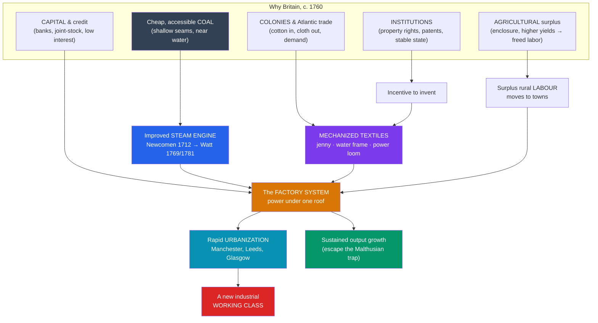

# ⚙️ The First Industrial Revolution

> [!abstract] TL;DR
> Between roughly **1760 and 1840**, Britain became the first society to break the ceiling on output that had constrained every previous economy, replacing muscle, wind, and water with **coal-fired steam power** and moving production out of the cottage and into the **factory**. The trigger was not one invention but a convergence: cheap accessible **coal**, a deep pool of **capital** and credit, wealth and demand from **colonies and Atlantic trade**, an **agricultural surplus** that freed labor, and **institutions** (secure property, patent law, relative political stability) that rewarded innovation. **Mechanized textiles** — the spinning jenny, water frame, and power loom — and the improved **steam engine** of James Watt turned Britain into "the workshop of the world." The cost was borne in the new industrial cities, where millions crowded into slums and a new industrial working class was born — the subject of the [[Capitalism_Socialism_and_Labor|social conflict]] that industrialization unleashed.

## Intuition — analogy first

For roughly ten thousand years, every economy ran on a **strict energy budget**. The only sources of power were muscles (human and animal), moving water, wind, and burning wood — and all of them are limited. You can only breed so many oxen, dam so many rivers, or grow so many forests. This is the **Malthusian trap**: whenever output rose, population rose to eat the surplus, and living standards snapped back to subsistence.

The First Industrial Revolution was the moment humanity **found the buried savings account**. Coal is millions of years of stored sunlight, and the steam engine was the machine that could withdraw it at will. Suddenly power was no longer rationed by how many horses you owned or how fast the river ran — you could dig up more energy and pour it into spinning, weaving, pumping, and hauling. A single steam-driven mill could out-produce a whole valley of hand-weavers.

Think of pre-industrial England as a village where everyone works at home by hand, at the pace of their own arms. The revolution is what happens when someone builds a **giant water- and then steam-powered workshop** in the valley, and the villagers walk down each morning to tend machines that never tire. Output explodes; so do soot, noise, twelve-hour shifts, and a town that did not exist a generation before.

---

## How It Works — The Convergence That Launched Industry

## Key Concepts

### The "Why Britain?" Debate

No single factor explains why sustained industrialization began in Britain rather than in equally sophisticated France, the Netherlands, China, or India. Historians instead point to a **combination** that existed together only in 18th-century Britain:

| Factor | How it enabled industrialization |
|---|---|
| **Coal** | Abundant, shallow, and near navigable water and iron; wood was scarce and dear. Cheap energy made steam power economical — Robert Allen argues high British wages *and* cheap coal made labor-saving machines uniquely profitable to build. |
| **Capital & finance** | Profits from trade and agriculture, a developed banking system, and low interest rates supplied the investment that mills and canals required. |
| **Colonies & trade** | The Atlantic economy — including the slave-worked plantations that supplied raw **cotton** — provided cheap inputs and vast overseas **markets** for finished cloth. |
| **Agricultural surplus** | The "Agricultural Revolution" (crop rotation, selective breeding, and **enclosure**) raised yields so fewer farmers fed more people, releasing labor for factory work. |
| **Institutions** | Secure property rights, an independent legal system, the **1624 Statute of Monopolies** and subsequent patent regime, and relative political stability after 1688 rewarded and protected inventors and investors. |
| **Scientific & tinkering culture** | Provincial societies (e.g. the **Lunar Society** of Birmingham), skilled artisans, and a practical "useful knowledge" ethos linked ideas to workshops. |

The debate is genuinely open: economic historians weigh these factors differently, and it is a lively site of legitimate revision (see [[Historical_Bias_and_Revisionism]]).

### The Steam Engine

- **Thomas Newcomen (1712)** built the first commercially successful **atmospheric engine**, used mainly to pump water out of coal mines. It was hugely inefficient — it cooled and reheated the whole cylinder every stroke.
- **James Watt**, working with the Glasgow instrument trade, added a **separate condenser** (patented **1769**), roughly tripling efficiency. His partnership with the manufacturer **Matthew Boulton** (Boulton & Watt, from 1775) turned the design into a business.
- Watt's later **rotary motion** engine (patented **1781–82**) converted the up-and-down pumping stroke into a turning shaft — the key step that let steam drive *machinery*, not just pumps, freeing factories from riverbank sites and powering the whole industrial expansion. (The SI unit of power, the **watt**, is named for him.)

### Mechanized Textiles

Cotton textiles were the **leading sector** of the first revolution — a series of inventions repeatedly broke bottlenecks between spinning and weaving:

- **Flying shuttle** — John Kay, **1733** — sped up weaving, which starved weavers of thread and created pressure to mechanize spinning.
- **Spinning jenny** — James Hargreaves, **c. 1764–1770** — let one worker spin many threads at once; small enough for a cottage.
- **Water frame** — Richard Arkwright, **1769** — water-powered spinning that produced strong thread and, crucially, required a **mill**; Arkwright's Cromford mill (1771) is a landmark of the factory system.
- **Spinning mule** — Samuel Crompton, **1779** — combined jenny and frame to spin fine, strong yarn; later steam-driven.
- **Power loom** — Edmund Cartwright, **1785** — finally mechanized weaving, though it took decades to perfect and displaced hand-loom weavers, feeding **Luddite** protest (1811–1816).

### The Factory System

The factory was a **social and organizational** invention as much as a technological one. It concentrated a central power source (water, then steam), expensive machinery, and a disciplined workforce under one roof and one clock. This replaced the **"putting-out" (domestic) system**, in which merchants distributed raw material to families who spun and wove at home at their own pace. The factory imposed **time discipline** — the whistle, the shift, the overseer, fines for lateness — a wrenching change from task-oriented rural rhythms that the historian E.P. Thompson analyzed in his essay on "time, work-discipline, and industrial capitalism."

### Rapid Urbanization

Factories clustered where coal, water, and labor met, and towns exploded. **Manchester** ("Cottonopolis") grew from about 25,000 people in 1772 to over 300,000 by 1851; **England became the first majority-urban society** by around 1851. Growth vastly outran sanitation and housing, producing the overcrowded, cholera-prone slums documented by reformers — the physical stage for the labor struggles covered in [[Capitalism_Socialism_and_Labor]].

## Primary Sources & Examples

- **Arkwright's Cromford Mill (1771):** A surviving, water-powered cotton-spinning complex in Derbyshire — effectively the prototype of the modern factory, complete with worker housing and shift labor. Now part of the Derwent Valley Mills UNESCO World Heritage Site.
- **Adam Smith, *The Wealth of Nations* (1776):** Its famous opening account of the **pin factory** describes how the **division of labor** multiplied output — the theoretical charter of the new industrial organization, published at the revolution's dawn.
- **Friedrich Engels, *The Condition of the Working Class in England* (1845):** A young Engels' block-by-block description of Manchester's slums remains a vivid (if committed) eyewitness source on the human geography industrialization produced.
- **The Luddites (1811–1816):** Skilled textile workers who broke machines in the Midlands and North — not mindless technophobes but craftsmen protesting the destruction of their livelihoods and status, a reminder that "progress" had losers.

## Common Pitfalls / Misconceptions

- **"James Watt invented the steam engine."** He did not — engines existed (Savery, Newcomen). Watt *radically improved* efficiency and, with rotary motion, made steam usable for general machinery. Invention was cumulative, not a single eureka.
- **Treating it as an overnight "revolution."** Change was gradual and uneven — it took decades to spread, growth rates were modest by later standards, and hand and machine methods long coexisted. "Revolution" describes the transformation's depth, not its speed.
- **Assuming it raised everyone's living standards immediately.** Real wages for many workers stagnated or fell during the early decades (the "**standard of living debate**" among historians); the clear broad gains came later. Industrialization's early benefits were very unequally shared.
- **Crediting invention alone.** Machines mattered, but so did coal, capital, markets, cheap colonial cotton, and institutions. A great idea without those enabling conditions (as in other societies) did not ignite sustained industrial growth.

## Related Concepts

- [[_MOC_Industrial_Revolution|↑ Section MOC]] — the section hub
- [[Capitalism_Socialism_and_Labor]] — the factory working class this note creates becomes the human center of the era's defining social and political conflict
- [[The_Second_Industrial_Revolution]] — the direct technological sequel, when steel, electricity, and chemicals extended and globalized industry after ~1870
- [[Nationalism_and_Unification]] — the industrial and economic power forged here underwrote 19th-century state-building
- [[Historical_Bias_and_Revisionism]] — the "why Britain?" and "standard of living" debates are model cases of legitimate historiographical revision
- Cross-vault: [[_MOC_History_of_Science]] — the scientific and engineering culture behind the engines and mills

## Review Questions

1. List four distinct preconditions that help explain why sustained industrialization began in Britain around 1760, and briefly explain how each contributed.
2. Distinguish the contributions of Newcomen and Watt to the steam engine, and explain why Watt's **rotary motion** patent (1781–82) mattered more for factories than his separate condenser.
3. What was the "putting-out" system, and in what ways — technological and social — did the factory system replace it? Why was **time discipline** such a wrenching change for workers?

## Sources

- Allen, R.C. (2009). *The British Industrial Revolution in Global Perspective*. Cambridge University Press
- Mokyr, J. (2009). *The Enlightened Economy: An Economic History of Britain 1700–1850*. Yale University Press
- Thompson, E.P. (1967). "Time, Work-Discipline, and Industrial Capitalism." *Past & Present*, 38
- Ashton, T.S. (1948). *The Industrial Revolution 1760–1830*. Oxford University Press

#history #industrial #britain #steam #textiles #factory-system
