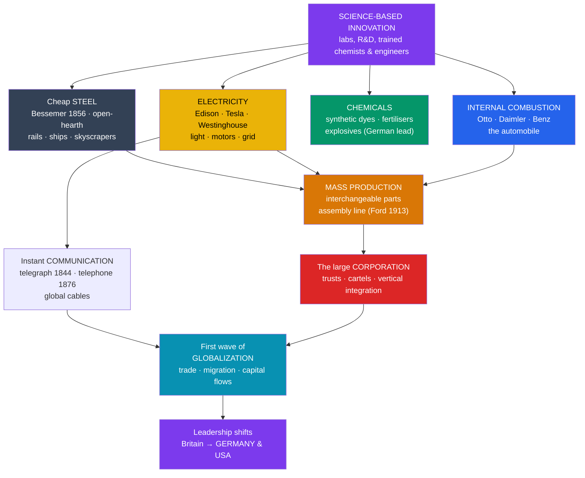

# 🔌 The Second Industrial Revolution

> [!abstract] TL;DR
> Between roughly **1870 and 1914**, a second wave of industrialization — driven by **science-based industry** rather than lone tinkerers — transformed the world again. **Cheap steel** (the **Bessemer** and open-hearth processes) replaced iron; **electricity** (Edison, Tesla, Westinghouse) delivered light and a flexible new power source; the **chemical industry** synthesized dyes, fertilizers, and explosives; the **internal combustion engine** created the automobile; and **mass production** on the **assembly line** (Ford, 1913) slashed the cost of manufactured goods. The **telegraph** and **telephone** annihilated distance in communication. Economically, the era gave rise to the giant **corporation**, trusts, and cartels, and to the **first great wave of globalization**. Crucially, industrial leadership shifted away from Britain toward **Germany and the United States**, reshaping the balance of world power on the eve of the [[Imperialism_and_the_Scramble_for_Africa|imperial]] and world-war crises to come.

## Intuition — analogy first

If the [[The_First_Industrial_Revolution|First Industrial Revolution]] was the story of **muscle** — replacing human and animal effort with steam and iron — the Second was the story of **nerves and precision**. The first gave you a strong but crude body: it could pump, spin, and haul. The second gave that body a nervous system (electricity and the telegraph, carrying power and information instantly along wires), better bones (steel instead of brittle iron), a chemistry set (synthetic dyes, fertilizers, explosives), and a new kind of heart that ran on liquid fuel (the internal combustion engine).

And it changed **how things were made**. The first revolution brought workers *to* the machines in a factory. The second re-thought the factory itself: instead of a skilled worker building a whole product, the product moves past many workers on a **moving line**, each doing one tiny task. The genius of Henry Ford's assembly line is that it doesn't ask workers to be faster — it asks the *conveyor* to set the pace and the *product* to come to the worker. A Model T that took over 12 hours to assemble suddenly took about 90 minutes, and its price collapsed until an ordinary worker could buy one.

The other big shift is invisible in the machines themselves: the era's breakthroughs came out of **laboratories and research departments**, not backyard sheds. Innovation became an industrial process in its own right.

---

## How It Works — From Lone Inventor to Science-Based Industry

## Key Concepts

### Cheap Steel

Iron was strong in compression but brittle; steel (iron with controlled carbon content) is far stronger and more versatile, but before 1856 it was expensive to make in bulk. Two processes changed that:

- **The Bessemer process (1856)** — **Henry Bessemer** blew air through molten pig iron to burn off impurities, producing steel quickly and cheaply. (The American **William Kelly** developed a similar idea independently.)
- **The open-hearth (Siemens–Martin) process** — Slower but allowed better quality control and use of scrap; it became dominant for high-grade steel.

Cheap steel enabled **railways** (steel rails lasted far longer than iron), **steamships**, **bridges**, machine tools, and — with the safety elevator — the **steel-frame skyscraper**. **Andrew Carnegie** built a vertically integrated steel empire in Pittsburgh that helped make the U.S. the world's leading steel producer.

### Electricity

Electricity was the era's signature power source — clean at the point of use, easily transmitted, and endlessly flexible:

- **Michael Faraday**'s earlier work on electromagnetic induction (1831) was the scientific foundation.
- **Thomas Edison** commercialized the **incandescent light bulb** and opened the first central power station (**Pearl Street, New York, 1882**), pushing **direct current (DC)**.
- **Nikola Tesla** and **George Westinghouse** championed **alternating current (AC)**, which could be transmitted efficiently over long distances via transformers; AC won the "**War of the Currents**" and became the basis of the modern grid.
- Electricity powered **streetcars/trams**, subways, factory **electric motors** (freeing machines from central shafts and belts), and eventually the home.

### The Chemical Industry

The first science-based industry proper, and one where **Germany led decisively**. German firms (**BASF, Bayer, Hoechst**) and university-trained chemists pioneered **synthetic dyes** (**William Perkin**'s mauveine, 1856, was British, but Germany industrialized the field), pharmaceuticals (Bayer's aspirin, 1899), and later the **Haber–Bosch process** (c. 1909–1913) for synthesizing ammonia — the basis of artificial **fertilizer** (feeding a growing population) and, ominously, **explosives**.

### The Internal Combustion Engine

- **Nikolaus Otto** built a practical **four-stroke engine** (1876).
- **Karl Benz** produced the first practical **automobile** (1885–86), and **Gottlieb Daimler** developed high-speed petrol engines.
- The engine, burning **petroleum**, launched the automobile and (with the Wright brothers, 1903) aviation, and shifted energy demand toward oil — with vast geopolitical consequences later.

### Mass Production and the Assembly Line

The **American System of Manufactures** — **interchangeable parts** (pioneered in armories) — combined with the moving line to create true mass production:

- **Frederick Winslow Taylor**'s **scientific management** ("Taylorism") broke work into timed, optimized motions.
- **Henry Ford**'s **moving assembly line** at Highland Park (**1913**) applied this to the automobile: assembly time for a **Model T** fell from over 12 hours to about **93 minutes**, and its price dropped from ~$850 (1908) to under $300 (1920s), putting cars within reach of ordinary families. Ford's **$5 day** (1914) both retained workers and helped create mass consumers ("**Fordism**").

### Communications: Telegraph and Telephone

- The **electric telegraph** (Morse's line, 1844) made information travel faster than any vehicle; the first successful **transatlantic cable** (1866) linked continents in minutes rather than weeks.
- **Alexander Graham Bell** patented the **telephone (1876)**, and **Guglielmo Marconi** demonstrated wireless telegraphy (radio) across the Atlantic in 1901.

### Corporations and Globalization

Steel, railways, and utilities required capital far beyond any family firm, giving rise to the **large joint-stock corporation** with professional managers and dispersed shareholders. Firms combined into **trusts** (Rockefeller's Standard Oil) and **cartels** to control markets, prompting **antitrust** law (U.S. Sherman Act, 1890). Falling transport and communication costs, the **gold standard**, mass **migration** (tens of millions crossing oceans), and large **capital flows** produced the **first great wave of globalization** — a deeply integrated world economy that would be shattered by 1914.

| Feature | First Industrial Revolution (c. 1760–1840) | Second Industrial Revolution (c. 1870–1914) |
|---|---|---|
| **Key energy/power** | Coal and steam | Electricity and petroleum (plus steam) |
| **Signature materials** | Iron, cotton textiles | Steel, chemicals, aluminum |
| **Source of innovation** | Skilled artisans, tinkerers | Science, labs, corporate R&D |
| **Production method** | Factory, division of labor | Assembly line, interchangeable parts, mass production |
| **Firm structure** | Family firm, partnership | Large corporation, trusts, cartels |
| **Leading nations** | Britain | Germany and the United States (Britain relatively declining) |
| **Communications** | Roads, canals, early railways | Telegraph, telephone, global cables |

## Primary Sources & Examples

- **The Crystal Palace / later World's Fairs:** International exhibitions (London 1851, Paris 1889 with the Eiffel Tower, Chicago 1893's electrified "White City") were the era's showcases — the 1893 Columbian Exposition dazzled visitors with AC electric lighting, publicly staging the arrival of the electrical age.
- **Ford's Highland Park plant (1913):** The moving assembly line here is the concrete birthplace of 20th-century mass production; contemporary descriptions of the chassis line remain the classic illustration of Fordism.
- **Standard Oil and the Sherman Antitrust Act (1890 / dissolution 1911):** Rockefeller's trust and its court-ordered breakup document both the scale of the new corporation and the state's first serious attempt to police it.
- **The transatlantic telegraph cable (1866):** Its completion — celebrated as linking the "Old" and "New" Worlds in minutes — is a vivid marker of the communications revolution behind first-wave globalization.

## Common Pitfalls / Misconceptions

- **Treating it as merely "more of the same."** The Second Industrial Revolution was qualitatively different: new energy sources (electricity, oil), new science-based industries (chemicals, electricals), and a new organization of both production (the line) and business (the corporation).
- **Assuming Britain stayed on top.** Britain pioneered the *first* revolution but fell behind in steel, chemicals, and electricals; **Germany and the United States** became the industrial leaders, a shift with major consequences for great-power rivalry.
- **Crediting Edison alone for electric power.** The usable modern grid depended on **AC**, championed by **Tesla and Westinghouse**, who won the "War of the Currents" over Edison's DC.
- **Thinking Ford invented the car or the assembly line from scratch.** Benz and Daimler built the automobile; interchangeable parts came from earlier armories. Ford's innovation was integrating the **moving line** with high wages to make cars a mass consumer product.
- **Believing globalization is only a recent phenomenon.** By 1913 the world economy was extraordinarily integrated in trade, migration, and capital — a first globalization that World War I and the interwar years violently reversed.

## Related Concepts

- [[_MOC_Industrial_Revolution|↑ Section MOC]] — the section hub
- [[The_First_Industrial_Revolution]] — the direct predecessor; the Second extended and transformed the industrial economy the First created
- [[Capitalism_Socialism_and_Labor]] — the corporate, mass-production economy in which trade unions and socialist parties matured and mass consumption began
- [[Imperialism_and_the_Scramble_for_Africa]] — industrial demand for raw materials and markets, and steel/steam/gun technology, powered the new imperialism
- [[Nationalism_and_Unification]] — a newly industrialized Germany became the continent's leading power, intensifying great-power rivalry
- Cross-vault: [[_MOC_History_of_Science]] — the science behind steel, electricity, and synthetic chemistry that made this a "science-based" revolution

## Review Questions

1. Name three features that make the Second Industrial Revolution qualitatively distinct from the First, and explain why economic leadership shifted from Britain to Germany and the United States.
2. Explain the significance of cheap **steel** (Bessemer/open-hearth) and of **electricity** (including the AC/DC "War of the Currents") to the transformations of 1870–1914.
3. What was new about **mass production** as organized by Taylor and Ford, and how did "Fordism" link the factory to the emergence of a mass-consumer society?

## Sources

- Landes, D. (1969). *The Unbound Prometheus: Technological Change and Industrial Development in Western Europe from 1750 to the Present*. Cambridge University Press
- Chandler, A.D. (1977). *The Visible Hand: The Managerial Revolution in American Business*. Harvard University Press
- Smil, V. (2005). *Creating the Twentieth Century: Technical Innovations of 1867–1914*. Oxford University Press
- Gordon, R.J. (2016). *The Rise and Fall of American Growth*. Princeton University Press

#history #industrial #steel #electricity #mass-production #corporations
