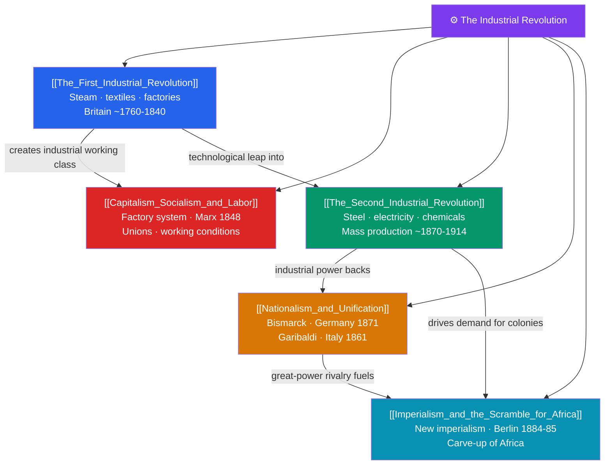

# 🗺️ The Industrial Revolution — Map of Content

> [!abstract] What This Section Covers
> The Industrial Revolution was the most profound economic transformation since farming. The **First Industrial Revolution** began in Britain around 1760–1840, as steam power, mechanized textiles, and the factory system multiplied output and drew millions into cities. The brutal new order provoked competing responses in **capitalism, socialism, and labor**: factory owners amassed fortunes while workers organized unions and Karl Marx, in the *Communist Manifesto* (1848) and *Das Kapital*, forecast capitalism's overthrow. The **Second Industrial Revolution** (c. 1870–1914) added steel, electricity, chemicals, and mass production, shifting industrial leadership toward Germany and the United States. Industrial might fed **nationalism and unification**, as Bismarck forged the German Empire (1871) and Garibaldi and Cavour united Italy (1861). And the hunger for raw materials and markets drove **imperialism and the Scramble for Africa**, formalized at the 1884–85 Berlin Conference, which carved up an entire continent among European powers. These notes explain how industry remade work, wealth, nations, and empires.

## Concept Map

## Learning Path

1. [[The_First_Industrial_Revolution]] — Steam, textiles, and the factory system that launched industrial society in Britain.
2. [[Capitalism_Socialism_and_Labor]] — The social conflict of the factory age: owners, workers, unions, and the rise of Marxism.
3. [[The_Second_Industrial_Revolution]] — Steel, electricity, and chemicals, and the shift of leadership to Germany and the U.S.
4. [[Nationalism_and_Unification]] — How industrial power and nationalist ideology forged unified Germany and Italy.
5. [[Imperialism_and_the_Scramble_for_Africa]] — The "new imperialism" and the Berlin Conference's partition of Africa.

## All Notes at a Glance

| Note | Difficulty | What You'll Learn |
|------|------------|-------------------|
| [[The_First_Industrial_Revolution]] | Beginner → Intermediate | Watt's steam engine, spinning jenny and power loom, factories, urbanization, coal and iron |
| [[Capitalism_Socialism_and_Labor]] | Intermediate | Factory conditions, laissez-faire capitalism, Marx and socialism, trade unions, labor reform |
| [[The_Second_Industrial_Revolution]] | Intermediate | Bessemer steel, electricity, internal combustion, chemicals, assembly lines, corporate capitalism |
| [[Nationalism_and_Unification]] | Intermediate | Romantic nationalism, Bismarck's realpolitik, German unification 1871, the Italian Risorgimento |
| [[Imperialism_and_the_Scramble_for_Africa]] | Intermediate | New imperialism, motives and ideology, the Berlin Conference, colonial rule and resistance |

## Key Questions This Section Answers

- Why did the Industrial Revolution begin in Britain around 1760?
- How did industrialization create both immense wealth and the harsh conditions that gave rise to socialism?
- What made the Second Industrial Revolution distinct, and why did economic leadership shift to Germany and the U.S.?
- How did industrial strength and nationalism combine to unify Germany and Italy?
- What drove the "new imperialism," and how did Europe partition Africa at the Berlin Conference?

## Related Sections

- [[_MOC_History_Master|↑ History Master MOC]]
- [[_MOC_Enlightenment_Revolutions|← Enlightenment & Revolutions]]
- [[_MOC_World_Wars|→ The World Wars]]

#MOC #History #Industrial
