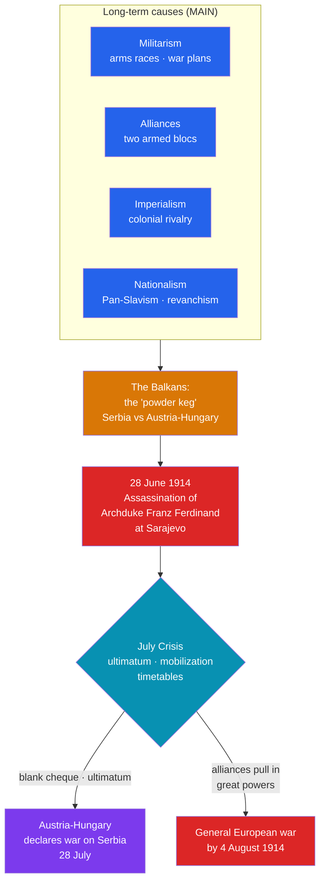

# 🎇 Causes of World War I

> [!abstract] TL;DR
> World War I did not erupt from a single spark but from long-term pressures that made a great-power war likely and a short crisis that made it actual. Historians summarize the deep causes with the mnemonic **MAIN** — **M**ilitarism, **A**lliances, **I**mperialism, and **N**ationalism — which by 1914 had divided Europe into two armed camps: the **Triple Entente** (France, Russia, Britain) and the **Triple Alliance** (Germany, Austria-Hungary, Italy). The **Balkans** were the "powder keg," where a decaying Ottoman Empire, an ambitious Serbia, and a nervous Austria-Hungary collided. The spark was the assassination of Archduke **Franz Ferdinand** in **Sarajevo on 28 June 1914**. In the five-week **July Crisis** that followed, ultimatums, mobilization timetables, and alliance obligations converted a regional murder into a continental war by early August 1914.

## Intuition — analogy first

Picture Europe in 1914 as a **room full of men who have soaked the floor in gasoline and are all holding lit matches**, each insisting he is only there for self-defense.

The gasoline is **militarism** — years of arms races (the Anglo-German naval race, mass conscript armies) and detailed war plans that officers were itching to use. The way the men are **chained together in two gangs** is the **alliance system**: if one is threatened, his partners are bound to fight, so a private quarrel drags in everyone. Their glaring at each other over colonies and prestige is **imperialism**, and their conviction that *their* nation is superior and aggrieved is **nationalism**. The Balkans are the corner of the room where the fumes are thickest — a place where the smallest flame will catch.

The assassination at Sarajevo is the dropped match. On its own, a match on a dry floor is a small fire. On this floor, with these chains, the timetables of **mobilization** meant that once one man reached for his rifle, everyone had to reach first or be shot — and within weeks the whole room was ablaze.

---

## How It Works — From Long-Term Pressures to the July Crisis

## Key Concepts

### The MAIN Causes

The four long-term forces that historians conventionally group under the mnemonic **MAIN**:

| Cause | What it meant in 1914 | Concrete example |
|---|---|---|
| **Militarism** | Glorification of military power; arms races; general staffs whose war plans shaped policy | The **Anglo-German naval race** (dreadnoughts, from 1906); Germany's **Schlieffen Plan** for a two-front war |
| **Alliances** | A web of mutual-defense treaties that turned local disputes into bloc-wide obligations | **Triple Entente** vs. **Triple Alliance** (see below) |
| **Imperialism** | Competition for colonies, markets, and prestige, breeding mistrust | The **Moroccan Crises** of 1905 and 1911 between France and Germany |
| **Nationalism** | Aggressive national pride, ethnic self-determination, and grievance | French **revanchism** over Alsace-Lorraine (lost in 1871); Serbian and Pan-Slav nationalism in the Balkans |

### The Two Armed Camps

By 1914 the great powers had polarized into two coalitions:
- **Triple Entente** — **France, Russia, and Britain.** Built from the Franco-Russian Alliance (1894), the **Entente Cordiale** (1904, Britain–France), and the Anglo-Russian Entente (1907). These were looser "understandings" more than binding pacts, especially for Britain.
- **Triple Alliance** — **Germany, Austria-Hungary, and Italy** (1882). Note that **Italy stayed neutral in 1914 and joined the Entente side in 1915**, arguing the alliance was defensive; the Ottoman Empire and Bulgaria later joined the German–Austrian side as the **Central Powers**.

The tragedy of the alliance system was mechanical: it meant no war could stay small.

### The Balkans — the "Powder Keg of Europe"

The retreat of the **Ottoman Empire** from southeastern Europe left a volatile vacuum. **Serbia**, emboldened after the **Balkan Wars (1912–13)**, sought to unite South Slavs — directly threatening multi-ethnic **Austria-Hungary**, which had annexed **Bosnia-Herzegovina in 1908**, enraging Serbia and its protector **Russia** (the champion of **Pan-Slavism**). The region combined ethnic nationalism, great-power interests, and recent wars — hence the enduring metaphor of the **powder keg**.

### The Spark — Sarajevo, 28 June 1914

Archduke **Franz Ferdinand**, heir to the Austro-Hungarian throne, and his wife Sophie were assassinated in **Sarajevo** by **Gavrilo Princip**, a young Bosnian Serb linked to the Serbian nationalist secret society the **Black Hand**. Austria-Hungary blamed Serbia and saw a pretext to crush it.

### The July Crisis and the Slide into War

The month between the assassination and general war:
- **5–6 July:** Germany gave Austria-Hungary the **"blank cheque"** — unconditional backing against Serbia.
- **23 July:** Austria-Hungary issued a deliberately unacceptable **ultimatum** to Serbia.
- **28 July:** Austria-Hungary **declared war on Serbia**.
- **30 July–1 August:** **Russia mobilized** to defend Serbia; **Germany declared war on Russia** (1 Aug) and, following the **Schlieffen Plan**, on **France** (3 Aug).
- **4 August:** Germany invaded neutral **Belgium**; **Britain declared war on Germany**, citing the 1839 treaty guaranteeing Belgian neutrality.

Rigid **mobilization timetables** created a logic of "mobilize first or lose," stripping statesmen of time to negotiate — a key theme in accounts of how the powers "slid" into catastrophe.

## Primary Sources & Examples

- **The Austro-Hungarian ultimatum to Serbia (23 July 1914):** Ten demands, including allowing Austrian officials to suppress anti-Habsburg activity inside Serbia. Serbia accepted almost all but balked at the clause infringing its sovereignty — the pretext Vienna wanted.
- **The "Willy–Nicky" telegrams:** Frantic last-minute cables between Kaiser **Wilhelm II** and Tsar **Nicholas II** (cousins) show monarchs trying and failing to halt the machinery of mobilization they had helped build.
- **The Fischer thesis (1961):** Historian **Fritz Fischer**'s *Germany's Aims in the First World War* argued Germany bore primary responsibility, deliberately risking war for expansionist aims — igniting a lasting debate (see [[Historical_Bias_and_Revisionism]]) over war guilt beyond the Versailles verdict.

## Common Pitfalls / Misconceptions

- **"The assassination caused the war."** Sarajevo was the *trigger*, not the *cause*. Without militarism, alliances, imperial rivalry, and nationalism, the murder of an archduke would have been a regional tragedy, not a world war.
- **Treating the alliances as identical and binding.** The Entente was looser than the Triple Alliance; Britain's entry hinged on the invasion of Belgium, and Italy defected from its own alliance. Alliances shaped, but did not automatically dictate, choices.
- **Assuming a single guilty nation.** The "war guilt" question is genuinely contested. Some historians stress German and Austrian risk-taking; others (e.g., Christopher Clark's *The Sleepwalkers*) emphasize collective miscalculation across all the powers.
- **Ignoring human agency behind "inevitability."** The war was *made likely* by structures but *made real* by specific decisions in July 1914 — the blank cheque, the ultimatum, the mobilization orders.

## Related Concepts

- [[_MOC_World_Wars|↑ Section MOC]] — the section hub
- [[World_War_I_and_Its_Aftermath]] — what the war these causes ignited actually became: trench stalemate, total war, and the fall of four empires
- [[The_Interwar_Years_and_Great_Depression]] — the punitive peace that followed left grievances that fed a second, larger war
- [[Historical_Bias_and_Revisionism]] — the "war guilt" and Fischer controversies are a case study in how legitimate historiographical debate revises accepted accounts
- Cross-vault: [[_MOC_Cold_War_Modern|Cold War & Modern Era]] — the alliance-and-mobilization dynamics of 1914 became a standing warning studied throughout the nuclear age

## Review Questions

1. Expand the mnemonic **MAIN** and give one concrete pre-1914 example of each cause.
2. Explain why the Balkans were called the "powder keg of Europe," naming the key rivalry and the events of 1908 and 1912–13 that heightened tension.
3. Trace the July Crisis from the assassination on 28 June to Britain's declaration of war on 4 August, and explain how mobilization timetables narrowed the room for diplomacy.

## Sources

- Clark, C. (2012). *The Sleepwalkers: How Europe Went to War in 1914*. Allen Lane
- MacMillan, M. (2013). *The War That Ended Peace: The Road to 1914*. Random House
- Fischer, F. (1961). *Germany's Aims in the First World War*. (English ed. 1967, Norton)
- Joll, J. & Martel, G. (2007). *The Origins of the First World War* (3rd ed.). Pearson

#history #world-wars #wwi #causes #july-crisis #balkans
