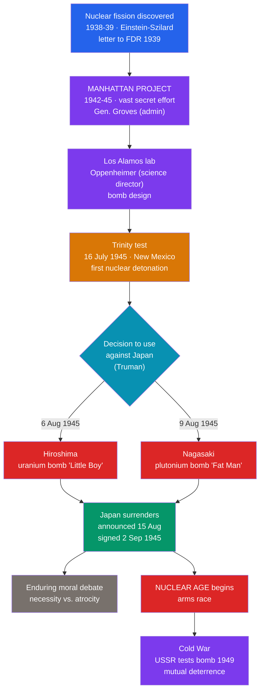

# ☢️ The Atomic Age Begins

> [!abstract] TL;DR
> In the final months of World War II, the United States built and used the first nuclear weapons, opening a new and dangerous era. The secret **Manhattan Project** (1942–1945), led scientifically by **J. Robert Oppenheimer** at **Los Alamos**, harnessed nuclear fission for a bomb. The first device was detonated at the **Trinity test** in New Mexico on **16 July 1945**. Three weeks later, the US dropped atomic bombs on **Hiroshima (6 August 1945)** and **Nagasaki (9 August 1945)**, killing an estimated **110,000–210,000 people**, most of them civilians. Japan announced its surrender on **15 August** (formally **2 September 1945**), ending WWII. The bombings remain the subject of an **enduring moral debate**, and they inaugurated the **nuclear age** — a world of unprecedented destructive power that would define the coming **Cold War**.

## Intuition — analogy first

For all of prior history, war had a kind of natural speed limit: destruction took time, because it was done blow by blow, shell by shell. The atomic bomb **removed the speed limit** — it compressed the destructive power of thousands of bombers into a single flash.

Imagine the difference between a fire you must set house by house and a switch that levels a whole city in an instant. That is the leap from conventional to **nuclear** weapons. It came from a genuinely new source of energy: not chemistry (rearranging molecules, as in TNT) but **nuclear fission** — splitting the nucleus of the atom itself, releasing the vastly greater energy that binds it together.

Once that switch existed and had been thrown twice over real cities, the world could never un-know it. Every great power would race to build its own switch, and for the rest of the century humanity would live under the shadow of a question no earlier generation had faced: *what happens when both sides can end civilization in an afternoon?* The atomic age did not just end one war — it changed the meaning of war forever.

---

## How It Works — From Fission to the Nuclear Era

## Key Concepts

### The Science and the Fear That Launched It

**Nuclear fission** — the splitting of a heavy atomic nucleus (uranium-235 or plutonium-239) releasing enormous energy and neutrons that sustain a **chain reaction** — was discovered in **1938–39**. Fearing that **Nazi Germany** might build such a weapon, émigré physicists prompted the **Einstein–Szilárd letter (1939)** urging President **Roosevelt** to act. This fear of losing an atomic race to Hitler was the project's founding motive.

### The Manhattan Project

The **Manhattan Project** (from 1942) was one of the largest scientific-industrial efforts ever undertaken:

| Element | Detail |
|---|---|
| **Military head** | **Gen. Leslie Groves** (administration, security, industry) |
| **Scientific director** | **J. Robert Oppenheimer**, at the **Los Alamos** laboratory (New Mexico) |
| **Scale** | ~130,000 workers; secret cities at **Oak Ridge** (Tennessee) and **Hanford** (Washington) for uranium enrichment and plutonium production |
| **Secrecy** | So compartmentalized that Vice President **Truman** learned of it fully only after becoming president in April 1945 |

### The Trinity Test

On **16 July 1945**, the first nuclear device (a plutonium implosion bomb, "the Gadget") was detonated at the **Trinity** site near Alamogordo, New Mexico, with a yield of about **20 kilotons of TNT**. Witnessing it, Oppenheimer later recalled a line from the **Bhagavad Gita**: "Now I am become Death, the destroyer of worlds." The weapon worked — and the atomic age had, in a technical sense, already begun.

### Hiroshima and Nagasaki

With Germany defeated (May 1945) and the Pacific War continuing at terrible cost (Okinawa alone caused enormous casualties), President **Harry Truman** authorized the atomic bombing of Japan:

| | **Hiroshima** | **Nagasaki** |
|---|---|---|
| **Date** | 6 August 1945 | 9 August 1945 |
| **Bomb** | "Little Boy" (uranium-235) | "Fat Man" (plutonium-239) |
| **Delivery** | B-29 *Enola Gay* | B-29 *Bockscar* |
| **Immediate + end-of-1945 deaths (est.)** | ~90,000–146,000 | ~60,000–80,000 |

Most victims were **civilians**. Many died instantly; many more died from burns, injuries, and **radiation sickness** in the following weeks, months, and years (the survivors are known as ***hibakusha***). On **8 August**, the **USSR also declared war on Japan** and invaded Manchuria — a further blow to Japanese hopes.

### Surrender and the Dawn of the Nuclear Era

Japan announced surrender on **15 August 1945** (**V-J Day**); the formal instrument was signed aboard the USS *Missouri* on **2 September 1945**, ending World War II. The bombs' shadow was immediate and lasting: the **USSR tested its own bomb in 1949**, launching a **nuclear arms race** and the doctrine of deterrence that would define the **Cold War**. Humanity now possessed, for the first time, the means to destroy itself.

## Primary Sources & Examples

- **John Hersey, *Hiroshima* (1946):** A landmark work of reportage following six survivors through the bombing and its aftermath. Filling an entire issue of *The New Yorker*, it forced Western audiences to confront the human reality behind the mushroom cloud.
- **The Franck Report (June 1945):** A memorandum by Manhattan Project scientists (led by James Franck, with Leó Szilárd) urging a demonstration of the bomb rather than a surprise attack on a city — evidence that moral doubts existed *among the makers themselves* before use.
- **Truman's statement (6 August 1945):** The president's public announcement of the Hiroshima bombing framed it as retribution and as a means to shorten the war and "save lives" — the official justification at the heart of the enduring debate.

### The Enduring Moral Debate

Historians and ethicists remain genuinely divided:
- **Justification (traditionalist) view:** The bombs forced a swift Japanese surrender, avoiding a bloody invasion of the home islands (**Operation Downfall**) projected to cost enormous Allied and Japanese lives.
- **Critical (revisionist) view:** Japan was near collapse and might have surrendered soon regardless; the **Soviet declaration of war** may have been as decisive; the targeting of cities was morally indefensible; and a motive was to intimidate the **USSR** at the dawn of the Cold War.

This is a live historiographical dispute rather than a settled question (see [[Historical_Bias_and_Revisionism]]).

## Common Pitfalls / Misconceptions

- **Assuming the moral question is settled.** Whether the bombings were justified is a genuine, ongoing debate; presenting either side as the obvious "correct" answer misrepresents the evidence and the historiography.
- **Forgetting the radiation deaths.** The tolls were not only from the blast and fire; **radiation sickness** killed and sickened people for decades, a horror distinct from conventional bombing.
- **Ignoring the Soviet factor.** The near-simultaneous Soviet declaration of war on Japan (8 Aug 1945) was a major shock to Tokyo and complicates any single-cause story of the surrender.
- **Thinking the bomb was made against Japan.** The project began out of fear of a **Nazi German** bomb; Germany had surrendered before the weapon was ready, a fact that troubled some scientists who had joined for that reason.

## Related Concepts

- [[_MOC_World_Wars|↑ Section MOC]] — the section hub
- [[World_War_II]] — the war whose Pacific theater the atomic bombings ended, and the context of the decision to use them
- [[The_Interwar_Years_and_Great_Depression]] — the rise of Nazi Germany whose feared atomic program first motivated the Manhattan Project
- [[Historical_Bias_and_Revisionism]] — the debate over the bomb's necessity is a leading example of legitimate historiographical revisionism
- Cross-vault: [[_MOC_Cold_War_Modern|Cold War & Modern Era]] — the nuclear arms race and deterrence that flowed directly from 1945
- Cross-vault: [[_MOC_Physics_Master]] — the nuclear fission and chain-reaction physics that made the bomb possible

## Review Questions

1. Outline the Manhattan Project: its founding motive, its key figures (Groves and Oppenheimer), and the significance of the Trinity test.
2. State the dates, bombs, and approximate death tolls of Hiroshima and Nagasaki, and explain the role of radiation in the casualties.
3. Summarize both sides of the moral debate over the atomic bombings, including the significance of the Soviet declaration of war on Japan.

## Sources

- Rhodes, R. (1986). *The Making of the Atomic Bomb*. Simon & Schuster
- Hersey, J. (1946). *Hiroshima*. Alfred A. Knopf
- Bird, K. & Sherwin, M. (2005). *American Prometheus: The Triumph and Tragedy of J. Robert Oppenheimer*. Knopf
- Hasegawa, T. (2005). *Racing the Enemy: Stalin, Truman, and the Surrender of Japan*. Harvard University Press

#history #world-wars #wwii #manhattan-project #nuclear #hiroshima
