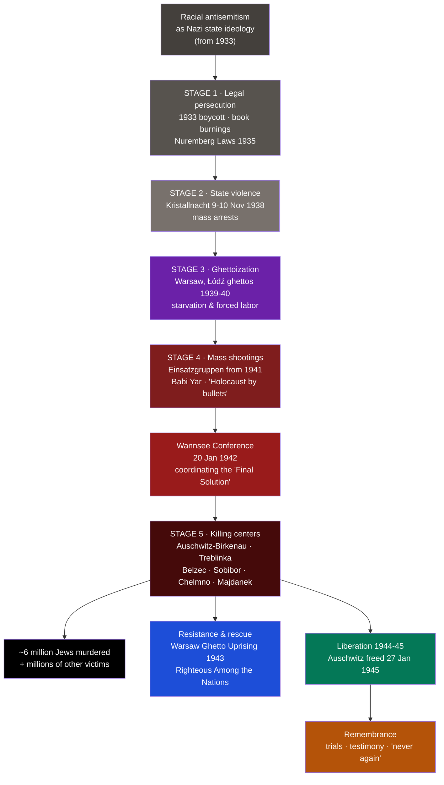

# 🕯️ The Holocaust

> [!abstract] TL;DR
> The Holocaust (Hebrew: *Shoah*) was the systematic, state-sponsored persecution and murder of **six million Jewish people** by Nazi Germany and its collaborators between 1933 and 1945. Alongside the Jews — the central target of a genocide rooted in racial antisemitism — the Nazi regime murdered millions of others, including **Roma (Sinti and Roma)**, **disabled people**, **Soviet prisoners of war**, Poles, political prisoners, homosexuals, and Jehovah's Witnesses. The genocide **escalated in stages**: from **legal persecution** (the **Nuremberg Laws**, 1935) and state violence (**Kristallnacht**, 1938), through **ghettoization** and mass shootings by the **Einsatzgruppen**, to the coordinated **"Final Solution"** and the industrialized killing centers, above all **Auschwitz-Birkenau**. It was met with acts of **resistance and rescue**, and ended with **liberation** by Allied forces in 1944–45. The historical record is overwhelming and beyond dispute. Remembrance — *"never again"* — is a moral and civic obligation.

> [!warning] On the nature of this record
> This note documents a genocide. The facts are established beyond reasonable doubt by perpetrator records, survivor and witness testimony, physical evidence, and the postwar trials. Holocaust denial and minimization are not historical positions but forms of falsification and antisemitism (see [[Historical_Bias_and_Revisionism]]). This note names what happened plainly, out of respect for the victims and for the truth.

## Intuition — analogy first

The most important thing to understand about the Holocaust is that it was **not a single event but a process** — genocide is something a state *builds*, step by deliberate step, and at each step ordinary institutions and people were enlisted or stood aside.

Scholars often describe this escalation as a descending sequence of stages: first a group is **defined** and set apart (by law and propaganda); then it is stripped of rights and property and **excluded** from society; then it is physically **concentrated** — expelled, ghettoized, deported; and finally it is **annihilated**. Each stage made the next appear, to the perpetrators, as a mere administrative continuation of the last. What began with a boycott and a definition of "who is a Jew" ended in the gas chambers.

Understanding it as a process is not a way of softening the horror; it is what makes the horror comprehensible and its warning usable. The machinery of genocide required lawyers, clerks, railway schedulers, police, doctors, and neighbors — not only fanatics. That is why the central lesson of Holocaust remembrance is directed at every society: to recognize the early stages — dehumanization, legal exclusion, the normalization of hatred — long before they reach their end.

---

## How It Works — The Escalation from Persecution to Genocide

## Key Concepts

### The Ideological Roots

The Holocaust grew from **racial antisemitism** made the official ideology of the Nazi state. Hitler and the Nazi movement portrayed Jews not as a religious group but as a "race" and an existential enemy, blending centuries-old European antisemitism with pseudo-scientific racism and conspiracy theories. This ideology defined Jews as targets for exclusion and, ultimately, extermination. It was inseparable from the wider Nazi project of racial hierarchy that also targeted Roma, disabled people, and Slavs.

### Stage 1 — Legal Persecution (1933–1938)

After Hitler took power in **January 1933**, persecution proceeded through law:
- The **April 1933 boycott** of Jewish businesses and the exclusion of Jews from the civil service.
- Public **book burnings** (May 1933).
- The **Nuremberg Laws (September 1935)** — the *Reich Citizenship Law* stripped Jews of German citizenship, and the *Law for the Protection of German Blood and Honour* banned marriage and relations between Jews and non-Jews. These laws legally defined "who was a Jew" and codified second-class status.

### Stage 2 — Kristallnacht (November 1938)

On the night of **9–10 November 1938**, the **"Night of Broken Glass"** saw state-organized violence across Germany and Austria: synagogues burned, Jewish homes, schools, and businesses destroyed, around **91 Jews killed**, and some **30,000 Jewish men arrested and sent to concentration camps**. It marked the turn from legal exclusion to open, violent persecution.

### Stage 3 — Ghettos (1939–1941)

With the invasion of Poland (1939), the Nazis confined Jews to overcrowded, sealed **ghettos**:

| Ghetto | Notes |
|---|---|
| **Warsaw** | The largest; over 400,000 people crammed into a small area; mass death from starvation and disease |
| **Łódź** | Second largest; a center of forced labor |

Ghettos were instruments of concentration, forced labor, and slow death, and staging points for later deportation to the killing centers.

### Stage 4 — Mass Shootings: the "Holocaust by Bullets" (from 1941)

The German invasion of the USSR (**Operation Barbarossa, June 1941**) unleashed the **Einsatzgruppen** — mobile killing squads that, with the Wehrmacht, police, and local collaborators, shot Jewish communities en masse at pits and ravines across Eastern Europe. At **Babi Yar**, near Kyiv, over **33,000 Jews were murdered in two days** (29–30 September 1941). Well over **1.5 million** people were killed in these shootings — a phase sometimes called the "Holocaust by bullets."

### The "Final Solution" and the Wannsee Conference

The Nazi euphemism for genocide was the **"Final Solution to the Jewish Question"** (*Endlösung*). On **20 January 1942**, senior officials met at the **Wannsee Conference** to coordinate the Europe-wide deportation and murder of the Jews across ministries and agencies. Wannsee did not *begin* the killing (it was already underway) but organized and bureaucratized it into a continental program.

### Stage 5 — The Killing Centers

The Nazis built dedicated **extermination (death) camps**, primarily in occupied Poland, designed for mass murder — distinct from concentration and labor camps:

| Camp | Role |
|---|---|
| **Auschwitz-Birkenau** | The largest camp complex; a combined concentration, labor, and extermination center; roughly **1.1 million people murdered**, about **one million of them Jews**, largely by **Zyklon B** gas |
| **Treblinka, Belzec, Sobibor** | The **Operation Reinhard** camps; killing centers where some **1.7 million** Jews were murdered |
| **Chełmno** | The first camp to use gas vans for mass murder |
| **Majdanek** | Combined camp; one of the first liberated (July 1944) |

At Auschwitz-Birkenau, arriving deportees were subjected to "selection": most were sent immediately to the gas chambers; others were worked, starved, and brutalized. The camp's scale and industrial method have made it the defining symbol of the genocide.

### The Victims

The Holocaust's central target was the Jewish people — **six million murdered**, roughly **two-thirds of Europe's Jews**. The Nazi regime also systematically murdered millions of others:

| Group | Fate |
|---|---|
| **Roma (Sinti and Roma)** | Genocide (*Porajmos*); hundreds of thousands murdered |
| **Disabled people** | The **"T4" programme** murdered people with disabilities as "unworthy of life"; a rehearsal in gassing and bureaucratic killing |
| **Soviet POWs** | Roughly **3.3 million** died in German captivity, many deliberately starved |
| **Poles, political prisoners, homosexuals, Jehovah's Witnesses, and others** | Persecuted, imprisoned, and murdered in large numbers |

### Resistance, Rescue, and Liberation

Victims and others resisted despite near-impossible conditions:
- **Armed resistance:** the **Warsaw Ghetto Uprising (April–May 1943)**, the largest Jewish revolt; armed revolts at **Treblinka** and **Sobibor** (1943) and the **Sonderkommando** uprising at Auschwitz (1944); Jewish partisans.
- **Spiritual and everyday resistance:** maintaining faith, education, record-keeping (e.g., the **Oneg Shabbat** archive in Warsaw), and dignity.
- **Rescue:** individuals honored by Yad Vashem as **Righteous Among the Nations** — including **Raoul Wallenberg**, **Chiune Sugihara**, and **Oskar Schindler** — and the collective rescue of most of **Denmark's Jews** (1943).
- **Liberation:** Allied forces reached the camps in 1944–45. The Red Army liberated **Majdanek** (July 1944) and **Auschwitz on 27 January 1945** — now **International Holocaust Remembrance Day**; British forces liberated **Bergen-Belsen** and US forces **Buchenwald** and **Dachau** (April 1945), documenting scenes of mass death that shocked the world.

### Remembrance and "Never Again"

The word **"genocide"** was coined by the jurist **Raphael Lemkin** (1944) partly in response to these crimes; the **Nuremberg Trials (1945–46)** prosecuted leading perpetrators. Institutions such as **Yad Vashem** (Israel) and the **United States Holocaust Memorial Museum** preserve testimony, names, and evidence. Days of remembrance (**Yom HaShoah**; 27 January) and the survivors' testimony sustain the imperative *"never again"* — that such crimes must be recognized and prevented.

## Primary Sources & Examples

- **Survivor testimony:** **Primo Levi**'s *If This Is a Man* (1947) and **Elie Wiesel**'s *Night* (1958) are foundational survivor accounts of Auschwitz; the **Diary of Anne Frank** documents a family in hiding before deportation to Bergen-Belsen. These are read with the gravity owed to firsthand witness.
- **Perpetrator records:** The Nazis' own extensive bureaucratic documentation — deportation lists, camp records, the Wannsee protocol, and orders — provides irrefutable evidence of intent and scale, used at the **Nuremberg Trials**.
- **The Oneg Shabbat (Ringelblum) Archive:** Documents secretly compiled and buried by inhabitants of the **Warsaw Ghetto** to ensure the truth of their lives and deaths would survive — a deliberate act of testimony against erasure.
- **Physical evidence and the liberated camps:** Photographic and film documentation by Allied forces in 1945, and the preserved sites themselves, stand as enduring material record.

## Common Pitfalls / Misconceptions

- **Denial and minimization are not scholarship.** Holocaust denial, downplaying the death toll, or claiming the genocide is exaggerated are forms of falsification and antisemitism, not legitimate historical debate. The evidence is overwhelming and convergent (see [[Historical_Bias_and_Revisionism]] on the Irving v. Lipstadt case).
- **The Holocaust was not only Auschwitz or only gas chambers.** It included years of legal persecution, ghettoization, and the mass shootings of the "Holocaust by bullets," which killed well over a million people before and alongside the death camps.
- **Perpetration was widespread, not the work of a handful of monsters.** Bureaucrats, police, professionals, collaborators across occupied Europe, and bystanders enabled the genocide — a central and disturbing finding of Holocaust scholarship.
- **The victims were not only Jews, but Jews were the central target.** Honoring the full range of victims (Roma, disabled people, Soviet POWs, and others) does not diminish the specific, systematic targeting of the Jewish people at the genocide's core; both truths must be held together.
- **Reducing victims to numbers.** The six million were individuals — families, children, communities with names and lives. Remembrance restores personhood; abstraction erases it.

## Related Concepts

- [[_MOC_World_Wars|↑ Section MOC]] — the section hub
- [[World_War_II]] — the war under whose cover the genocide was carried out, especially on the Eastern Front
- [[The_Interwar_Years_and_Great_Depression]] — the rise of Nazism and racial ideology that made the genocide possible
- [[Historical_Bias_and_Revisionism]] — why Holocaust denial is falsification, not revisionism, and how the historical record is defended
- Cross-vault: [[_MOC_Psychology_Master]] — the psychology of obedience, dehumanization, and bystander behavior that helps explain how ordinary people participated

## Review Questions

1. Explain why the Holocaust is best understood as a process that escalated in stages, naming a key event at each stage from 1935 to 1942.
2. Distinguish the "Holocaust by bullets" (the Einsatzgruppen shootings) from the killing centers, and explain the role of the Wannsee Conference.
3. Identify the full range of the Nazi regime's victims while explaining why the Jewish people were the central target, and discuss why remembrance and the principle of "never again" matter.

## Sources

- Hilberg, R. (1961; rev. 2003). *The Destruction of the European Jews*. Yale University Press
- Browning, C. (1992). *Ordinary Men: Reserve Police Battalion 101 and the Final Solution in Poland*. HarperCollins
- Levi, P. (1947). *If This Is a Man* (*Survival in Auschwitz*). Einaudi
- United States Holocaust Memorial Museum, *Holocaust Encyclopedia* (encyclopedia.ushmm.org)

#history #world-wars #wwii #holocaust #genocide #remembrance
