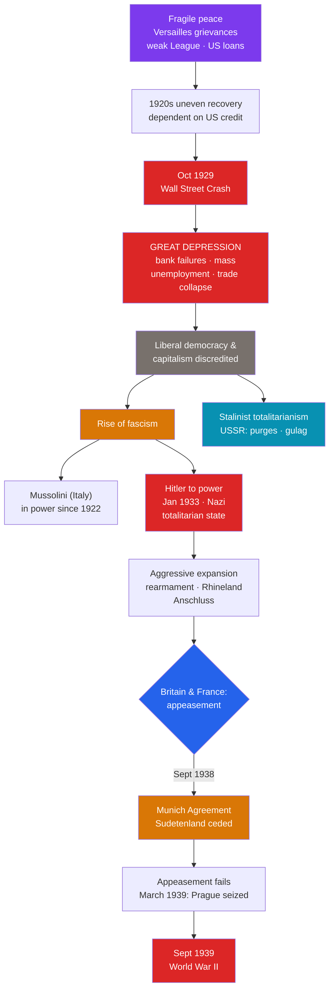

# 📉 The Interwar Years and Great Depression

> [!abstract] TL;DR
> The two decades between the world wars (1919–1939) were a **fragile peace** that failed. The 1920s brought uneven recovery, but the **Wall Street Crash of October 1929** triggered the **Great Depression** — a global collapse of trade, banking, and employment that discredited liberal democracy and capitalism in many eyes. Economic misery and the grievances of Versailles fueled the rise of **fascism**: **Benito Mussolini** had seized power in Italy (1922), and **Adolf Hitler** and the Nazis rose on Depression despair to take power in Germany in **January 1933**, building a totalitarian regime that mirrored **Stalin's** in the USSR. Facing aggressive dictators, Britain and France pursued **appeasement**, hoping concessions would satisfy Hitler; this culminated in the **Munich Agreement (September 1938)**, which handed him Czechoslovak territory. Within a year, appeasement lay in ruins and war returned.

## Intuition — analogy first

Think of the interwar world as a **house rebuilt on a cracked foundation after a fire**. The **Versailles** settlement patched the walls but left the underlying structure — resentful losers, an untested League, economies hooked on American loans — badly weakened.

For a while the house seemed fine; the "Roaring Twenties" put fresh paint on the walls. Then in **1929 the main support beam — the US economy — snapped**. Because everything was propped on American credit, the collapse spread through the whole structure: the **Great Depression**. As the floors buckled and families were thrown out of work, desperate tenants stopped trusting the calm landlords (liberal democracies) who promised gradual repair, and turned to **strongmen** who promised to seize control, name scapegoats, and make the house grand again — the **fascists**.

When one of those strongmen started knocking down his neighbors' walls to enlarge his own rooms, the other householders, terrified of another fire, kept **handing him rooms to keep him quiet** — that is **appeasement**. At **Munich** they gave away a whole wing that belonged to someone else. It bought a few months of silence, then he came for the rest of the house anyway.

---

## How It Works — From Crash to Renewed War

## Key Concepts

### The Fragile Peace of the 1920s

The postwar order rested on shaky ground:
- **Versailles resentment** in Germany, framed as an unjust *Diktat*, and the corrosive **"stab-in-the-back" myth** blaming defeat on internal betrayal.
- A **weak League of Nations**, lacking US membership and any enforcement power.
- **Economic fragility:** German recovery depended on the cycle of US loans (the **Dawes Plan, 1924**) → German reparations → Allied war-debt repayment to the USA. When American credit vanished, the whole chain broke.

### The Wall Street Crash and the Great Depression

- In **October 1929** (Black Thursday 24th, Black Tuesday 29th), the **New York Stock Exchange** collapsed after a speculative boom.
- The crash cascaded into the **Great Depression**: US bank failures, a collapse in demand, and the recall of overseas loans exported the crisis worldwide. **Protectionism** (e.g., the US **Smoot-Hawley Tariff, 1930**) throttled global trade.
- Consequences: **US unemployment ~25%** by 1933; **German unemployment ~6 million**. Mass hardship discredited existing governments and radicalized politics. (For the economic mechanics, see the cross-vault link below.)

### The Rise of Fascism

**Fascism** — an ultranationalist, anti-democratic, anti-communist ideology exalting the state, a charismatic leader, and violence — thrived on Depression desperation:

| Regime | Leader | Path to power | Key features |
|---|---|---|---|
| **Italy** | **Benito Mussolini** | **March on Rome, 1922** | First fascist state; the "corporate state"; *Il Duce* |
| **Germany** | **Adolf Hitler** | Appointed Chancellor **30 Jan 1933**; **Reichstag Fire** and **Enabling Act (March 1933)** | Nazi one-party dictatorship; racial antisemitism; *Führer* cult |

Hitler exploited the Depression, fear of communism, and Versailles grievance to win votes, then dismantled the **Weimar Republic** legally from within — a warning about democracies voting away their own freedoms.

### Stalinist Totalitarianism

In the **Soviet Union**, **Joseph Stalin** built a rival **totalitarian** system: forced **collectivization** of agriculture (causing famine, including the Ukrainian **Holodomor**, 1932–33), breakneck industrialization via **Five-Year Plans**, and the **Great Purge (1936–38)** with its show trials and the **Gulag**. Fascism and Stalinism differed ideologically (right vs. left) but shared one-party rule, a personality cult, secret police, and mass terror.

### Appeasement and the Munich Agreement

Facing Hitler's serial treaty violations, Britain (under **Neville Chamberlain**) and France chose **appeasement** — granting concessions to avoid another world war, motivated by the trauma of WWI, military unpreparedness, economic strain, fear of communism, and a belief that some German grievances were legitimate.

Hitler's escalating moves went unchecked:
- **1935:** Open rearmament, defying Versailles.
- **March 1936:** Remilitarization of the **Rhineland**.
- **March 1938:** The **Anschluss** — annexation of Austria.
- **September 1938:** Demands on the **Sudetenland** (German-speaking Czechoslovakia).

At the **Munich Conference (29–30 Sept 1938)**, Britain, France, Italy, and Germany — **without Czechoslovakia present** — agreed to cede the Sudetenland. Chamberlain returned claiming **"peace for our time."** In **March 1939**, Hitler seized the rest of Czechoslovakia, proving appeasement had failed. Britain and France then guaranteed **Poland** — the trigger for war in September 1939.

## Primary Sources & Examples

- **The Munich Agreement (30 Sept 1938) and Chamberlain's "peace for our time" speech:** A primary document of appeasement's high-water mark — and, in hindsight, its central cautionary tale about negotiating with an aggressor bent on expansion.
- **Dorothea Lange, "Migrant Mother" (1936):** The iconic photograph of the American Depression, part of the Farm Security Administration's documentation of rural poverty — the human face of economic collapse.
- **The Nazi-Soviet (Molotov–Ribbentrop) Pact (23 August 1939):** The shocking non-aggression pact between ideological enemies, with a secret protocol dividing Poland and Eastern Europe — it removed Hitler's last obstacle to invading Poland.

## Common Pitfalls / Misconceptions

- **"Appeasement was simple cowardice."** It was a considered policy with real (if flawed) rationales: memory of WWI's slaughter, military weakness, public opinion, and the hope Hitler had limited aims. Understanding those reasons is not endorsing the outcome (see [[Historical_Bias_and_Revisionism]] on presentism).
- **Blaming the Depression on the crash alone.** The 1929 crash *triggered* a downturn that policy failures — bank collapses, tight money, protectionism, the gold standard — turned into a decade-long catastrophe.
- **Treating fascism and communism as identical.** Both were totalitarian and murderous, but they had opposed ideologies, class bases, and goals; collapsing the distinction obscures how each actually functioned.
- **Assuming Hitler's rise was inevitable.** It depended on contingent factors — the Depression, elite miscalculation that he could be "controlled," and specific decisions like his legal appointment as Chancellor.

## Related Concepts

- [[_MOC_World_Wars|↑ Section MOC]] — the section hub
- [[World_War_I_and_Its_Aftermath]] — the Versailles settlement whose grievances and economic aftershocks this note shows curdling into a second crisis
- [[World_War_II]] — the war that appeasement's failure and fascist aggression brought about
- [[Historical_Bias_and_Revisionism]] — appeasement is a classic subject of hindsight bias and revisionist debate
- Cross-vault: [[_MOC_Economic_Social_History]] — the mechanics and social impact of the Great Depression, mass unemployment, and the collapse of the interwar economic order

## Review Questions

1. Explain the chain by which the 1929 Wall Street Crash became a *global* Great Depression, naming at least two mechanisms that deepened it.
2. How did the Depression and the legacy of Versailles help bring Hitler to power in January 1933? Distinguish his path from Mussolini's.
3. Define appeasement and evaluate its rationale and failure, using the Munich Agreement of 1938 and its aftermath in March 1939.

## Sources

- Overy, R. (2007). *The Inter-War Crisis, 1919–1939* (2nd ed.). Pearson
- Kershaw, I. (2015). *To Hell and Back: Europe 1914–1949*. Allen Lane
- Kindleberger, C. (1973). *The World in Depression, 1929–1939*. University of California Press
- Evans, R.J. (2003–2008). *The Third Reich Trilogy*. Penguin

#history #world-wars #interwar #great-depression #fascism #appeasement
