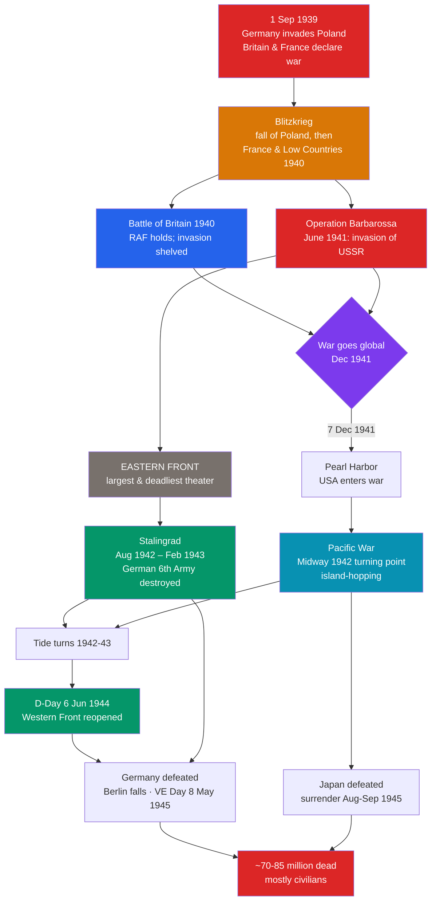

# 🌍 World War II

> [!abstract] TL;DR
> World War II (1939–1945) was the **deadliest conflict in human history**, killing an estimated **70–85 million people**, the majority of them civilians. It began when Nazi Germany invaded **Poland on 1 September 1939**, using fast, combined-arms **Blitzkrieg** tactics that conquered much of Western Europe, including the **fall of France (1940)**. Britain survived the **Battle of Britain** air campaign, and the war became global when Germany invaded the USSR (**Operation Barbarossa, June 1941**) and Japan attacked the US fleet at **Pearl Harbor (7 December 1941)**. The tide turned in 1942–43: the **Eastern Front** ground down the German army at **Stalingrad**, the Western Allies landed in France on **D-Day (6 June 1944)**, and Allied industrial and manpower superiority proved decisive. Germany surrendered in **May 1945** and Japan in **August–September 1945**, ending a war whose scale, totality, and atrocities — above all the **Holocaust** — reshaped the world.

## Intuition — analogy first

If World War I was two boxers stuck in ditches, World War II was **the whole world set on fire at once, with the flames leaping between continents**.

Germany opened by throwing a **fast, hot flame** — **Blitzkrieg**, tanks and aircraft striking together to shatter defenses before they could form a line. It worked spectacularly at first, engulfing Poland and France. But then two things happened that turned a European fire into a global inferno. Germany tried to burn down the **largest house on the block** — the Soviet Union — and discovered it was too vast and too cold to consume before winter. And in the Pacific, Japan struck the sleeping giant — the **United States** — whose immense industrial capacity, once roused, poured water and fuel into the fight on a scale no one could match.

From then on the logic was **grinding attrition on a planetary scale**: two front doors closing on Germany (the **Eastern Front** from the east, the Western Allies from the west after D-Day), and an island-by-island advance on Japan. The side with more steel, oil, food, and people would win — and would keep burning until the other's regime was utterly destroyed. That is why WWII ended not in an armistice, as in 1918, but in **unconditional surrender** and occupation.

---

## How It Works — Theaters and Turning Points

## Key Concepts

### Blitzkrieg and the Fall of France

**Blitzkrieg** ("lightning war") combined **tanks (Panzers), motorized infantry, and air power (Luftwaffe)** in fast, concentrated thrusts that bypassed and encircled enemy forces, avoiding WWI-style static fronts.
- **September 1939:** Poland was overrun in weeks; the USSR invaded from the east under the **Molotov–Ribbentrop Pact**.
- **May–June 1940:** Germany struck through the **Ardennes**, outflanking the French and British. The **Dunkirk** evacuation rescued ~338,000 Allied troops, but **France fell in six weeks**, an event that stunned the world.

### The Battle of Britain

With France conquered, Britain (now led by **Winston Churchill**) stood alone in Western Europe. In **summer–autumn 1940**, the German **Luftwaffe** sought air supremacy to enable invasion (**Operation Sea Lion**). The **Royal Air Force**, aided by **radar** and the Spitfire and Hurricane fighters, denied it — the first major German defeat. Hitler shifted to the terror-bombing of cities (**the Blitz**), which failed to break British morale.

### Operation Barbarossa and the Eastern Front

On **22 June 1941**, Germany launched **Operation Barbarossa**, the invasion of the USSR — the largest land invasion in history and the war's central, most lethal theater.
- Initial German advances were vast, but they failed to take **Moscow** before winter.
- The Eastern Front was a war of **annihilation**, entangled with genocide (see [[The_Holocaust]]) and the deliberate starvation and murder of civilians and **Soviet POWs**.
- The USSR ultimately bore the greatest losses — roughly **27 million** Soviet dead — and inflicted the majority of German military casualties.

### Pearl Harbor and the Pacific War

- On **7 December 1941**, Japan attacked the US Pacific Fleet at **Pearl Harbor**, Hawaii, bringing the **United States** fully into the war. Germany declared war on the US days later.
- Japan swiftly conquered much of Southeast Asia and the Pacific. The **Battle of Midway (June 1942)** crippled Japanese carrier strength and marked the Pacific turning point.
- The Allies then pursued **"island-hopping"** toward Japan, through brutal battles such as Guadalcanal, Iwo Jima, and Okinawa.

### Stalingrad and the Turning of the Tide

The **Battle of Stalingrad (August 1942 – February 1943)** was the war's pivotal battle. After months of house-to-house fighting, the Soviets encircled and destroyed the German **6th Army** (over 90,000 taken prisoner). Combined with the Allied victory at **El Alamein** (North Africa, 1942), 1942–43 marked the strategic turn against Germany.

### D-Day and the Defeat of Germany

- On **6 June 1944 (D-Day)**, the Western Allies launched **Operation Overlord**, the largest seaborne invasion in history, landing in **Normandy** to open a Western Front.
- Caught between the advancing **Red Army** from the east and the Western Allies, Germany was crushed. Hitler committed suicide on **30 April 1945**; Germany surrendered unconditionally, marked as **VE Day, 8 May 1945**.

### The Deadliest Conflict in History

| Dimension | Scale |
|---|---|
| **Total deaths** | ~**70–85 million** (~3% of the 1940 world population) |
| **Civilian majority** | Most victims were civilians — from bombing, starvation, disease, massacre, and genocide |
| **Soviet Union** | ~**27 million** dead — the largest national toll |
| **China** | ~**15–20 million** dead in the prolonged war with Japan |
| **Genocide** | ~**6 million** Jews murdered in the Holocaust, plus millions of other targeted victims |

The war's totality — the mobilization of whole societies, the deliberate targeting of civilians, and industrialized genocide — set it apart even from WWI.

## Primary Sources & Examples

- **Churchill's "We shall fight on the beaches" speech (4 June 1940):** Delivered after Dunkirk, it rallied British resolve to fight on alone — a defining primary document of the war's darkest hour in the West.
- **The Atlantic Charter (August 1941):** Roosevelt and Churchill's joint declaration of war aims (self-determination, free trade, no territorial aggrandizement) foreshadowed the postwar order and the United Nations.
- **The "Big Three" conferences — Tehran (1943), Yalta (Feb 1945), Potsdam (July–Aug 1945):** Meetings of Roosevelt/Truman, Churchill/Attlee, and Stalin that coordinated strategy and shaped the postwar division of Europe — sowing the seeds of the Cold War.

## Common Pitfalls / Misconceptions

- **Overstating the Western Front's role in defeating Germany.** The majority of German losses occurred on the **Eastern Front**; the USSR's sacrifice was central to Nazi Germany's defeat, a fact sometimes underemphasized in Western accounts (see [[Historical_Bias_and_Revisionism]]).
- **Treating Blitzkrieg as invincible.** It excelled against unprepared foes in favorable terrain but faltered against the vast distances of the USSR, Soviet resilience, and Allied industrial mobilization.
- **Reducing the war to Europe.** The **Pacific** and **China-Burma-India** theaters, and the war at sea, were enormous; the conflict was genuinely global.
- **Forgetting the war was fought against a genocidal regime.** WWII cannot be separated from the Holocaust and Nazi racial ideology — these were not incidental but central to the German war effort in the East (see [[The_Holocaust]]).

## Related Concepts

- [[_MOC_World_Wars|↑ Section MOC]] — the section hub
- [[The_Interwar_Years_and_Great_Depression]] — the fascist aggression and failed appeasement that this war grew out of
- [[The_Holocaust]] — the genocide carried out by Nazi Germany under the cover of this war, especially on the Eastern Front
- [[The_Atomic_Age_Begins]] — how the Pacific War ended, with the atomic bombings of Hiroshima and Nagasaki
- Cross-vault: [[_MOC_Cold_War_Modern|Cold War & Modern Era]] — the superpower rivalry and divided world that emerged directly from the Allied victory

## Review Questions

1. Explain how Blitzkrieg worked and why it succeeded against France in 1940 but ultimately failed in the Soviet Union.
2. Identify the two events of 1941 that turned the European war into a global conflict, and explain why each was decisive.
3. Why is the Eastern Front (and especially Stalingrad) considered central to the defeat of Nazi Germany? Support your answer with the scale of losses involved.

## Sources

- Beevor, A. (2012). *The Second World War*. Weidenfeld & Nicolson
- Overy, R. (1995). *Why the Allies Won*. Jonathan Cape
- Weinberg, G. (1994). *A World at Arms: A Global History of World War II*. Cambridge University Press
- Roberts, A. (2009). *The Storm of War: A New History of the Second World War*. Allen Lane

#history #world-wars #wwii #total-war #eastern-front #pacific-war
