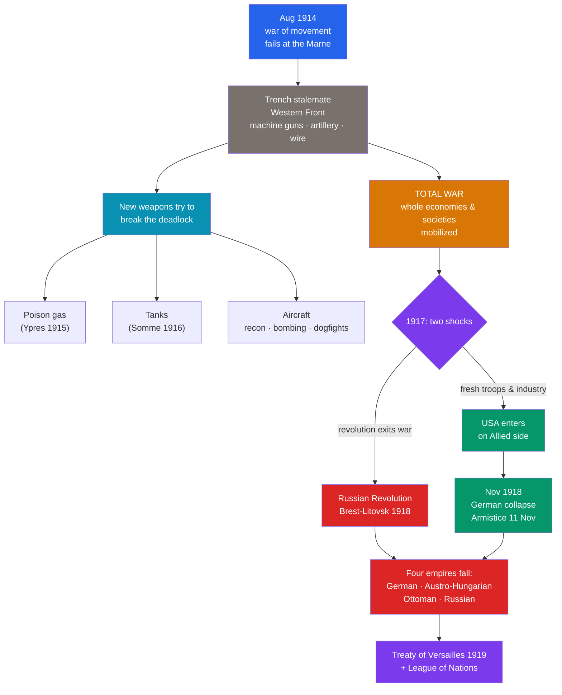

# ⚔️ World War I and Its Aftermath

> [!abstract] TL;DR
> World War I (1914–1918) was the first industrialized **total war**, in which entire societies and economies were mobilized for killing on an unprecedented scale. On the **Western Front**, defensive firepower — **machine guns**, quick-firing artillery, and barbed wire — produced years of **trench stalemate** and catastrophic battles like the **Somme** and **Verdun** (1916). New weapons — **poison gas, tanks, and aircraft** — could not quickly break the deadlock. In 1917 two events reshaped the war: the **Russian Revolution** pulled Russia out, and the **United States entered** on the Allied side. The war shattered **four empires** — **German, Austro-Hungarian, Ottoman, and Russian** — and ended with the punitive **Treaty of Versailles (1919)**, which imposed harsh terms on Germany and created the **League of Nations**, the first attempt at collective security. Roughly **17 million** people died. The peace's flaws seeded the next war.

## Intuition — analogy first

Imagine two boxers who, instead of trading punches, each **dig a ditch across the ring and dare the other to cross it**. The moment either climbs out to attack, the other's fists — fixed, mechanical, tireless — knock him flat. So they crouch in their ditches for years, occasionally sending waves of men across the mud to be cut down, gaining a few yards for tens of thousands of lives.

That is the **industrial battlefield**. The **machine gun and rapid artillery** gave the *defender* an overwhelming edge, so attacking meant walking into a wall of steel. **Trenches** were the rational response — and the stalemate they produced was the strategic disaster of the war. Generals reached for new tools to break the deadlock — **gas** to poison the ditch, **tanks** to roll over it, **aircraft** to see and strike behind it — but none was decisive enough, fast enough, on its own.

Meanwhile the fight was no longer just between the two boxers. Their whole families were drafted in — factories, farms, women in war work, colonies, propaganda. That is **total war**: victory would go to whichever society could out-produce and out-endure the other, until one side's home front — and its empire — simply collapsed.

---

## How It Works — Stalemate, Total War, and Collapse

## Key Concepts

### Trench Warfare and Stalemate on the Western Front

After the German advance was halted at the **First Battle of the Marne (September 1914)**, both sides dug in. A continuous line of **trenches** ran from the North Sea to the Swiss border. Between them lay **"no man's land"** — a cratered waste of mud, wire, and corpses.

- The **defensive triad** — the **machine gun**, quick-firing **artillery**, and **barbed wire** — made frontal assault suicidal.
- **Attritional battles** aimed to "bleed the enemy white": the **Battle of Verdun** (Feb–Dec 1916, ~700,000+ casualties) and the **Battle of the Somme** (Jul–Nov 1916, ~1 million casualties, ~57,000 British casualties on the *first day* alone).
- Life in the trenches meant mud, rats, lice, "trench foot," and constant shellfire, producing the psychological casualty then called **"shell shock."**

### New Weapons of Industrial War

| Weapon | First major use | Effect |
|---|---|---|
| **Poison gas** (chlorine, later phosgene, mustard) | **Second Ypres, 1915** (German) | Terror weapon; caused agony and blindness but rarely decisive; both sides used it |
| **Tanks** | **The Somme, 1916** (British) | Could cross trenches and wire; unreliable early on, but pointed to future armored warfare |
| **Aircraft** | Throughout | Reconnaissance, artillery spotting, bombing, and aerial "dogfights"; birth of air power |
| **Submarines (U-boats)** | German campaign, esp. 1917 | **Unrestricted submarine warfare** throttled Allied shipping and helped draw in the USA |

### Total War

**Total war** meant the mobilization of entire societies:
- **Economies** were directed to munitions; states rationed food and directed labor.
- **Women** entered factories, transport, and services in large numbers, accelerating suffrage arguments.
- **Empires** supplied troops and labor — Indian, African, Caribbean, Canadian, Australian, and New Zealand forces fought and died in Europe and the Middle East.
- **Propaganda** and censorship managed morale on the "home front."

### 1917 — The Two Turning Points

- The **Russian Revolution** (Feb and Oct 1917) toppled the Tsar and brought the **Bolsheviks** to power; Lenin's government signed the **Treaty of Brest-Litovsk (March 1918)**, exiting the war and freeing German troops for a final Western offensive.
- The **United States** declared war on Germany in **April 1917**, provoked by unrestricted submarine warfare and the **Zimmermann Telegram** (Germany's proposal of an anti-US alliance to Mexico). American manpower and industry decisively tipped the balance by 1918.

### The Collapse of Four Empires

The war destroyed the old dynastic order of Europe and the Near East:

| Empire | Fate |
|---|---|
| **German (Hohenzollern)** | Kaiser Wilhelm II abdicated; the **Weimar Republic** proclaimed, Nov 1918 |
| **Austro-Hungarian (Habsburg)** | Dissolved into successor states (Austria, Hungary, Czechoslovakia, Yugoslavia) |
| **Ottoman** | Partitioned; led to modern Turkey and European mandates in the Middle East |
| **Russian (Romanov)** | Overthrown by revolution; replaced by the Bolshevik state, later the USSR |

### The Treaty of Versailles and the League of Nations

The **Paris Peace Conference (1919)**, dominated by the "Big Three" — **Woodrow Wilson (USA), David Lloyd George (Britain), Georges Clemenceau (France)** — produced the **Treaty of Versailles**, signed **28 June 1919** (five years to the day after Sarajevo). Key terms for Germany:
- The **"War Guilt Clause" (Article 231)** assigned Germany and its allies responsibility for the war.
- **Reparations** (later fixed at 132 billion gold marks) burdened the German economy.
- **Territorial losses** (Alsace-Lorraine to France; land to the new Poland) and **military restrictions** (army capped at 100,000; no air force; demilitarized Rhineland).

The treaty also created the **League of Nations**, an intergovernmental body for **collective security** — but the **US Senate refused to join**, fatally weakening it. Many Germans saw Versailles as a humiliating *Diktat*, a grievance nationalists would exploit.

## Primary Sources & Examples

- **Wilfred Owen, "Dulce et Decorum Est" (1917):** The soldier-poet's searing account of a gas attack demolished the old ideal that it is "sweet and fitting to die for one's country" — a primary window into the war's disillusionment.
- **The Fourteen Points (Jan 1918):** Wilson's program for a liberal peace, including self-determination and a "general association of nations," set expectations that Versailles only partly met, breeding resentment on all sides.
- **The Armistice of 11 November 1918:** Fighting ceased at the "eleventh hour of the eleventh day of the eleventh month," commemorated as Remembrance/Armistice Day. Germany signed under military collapse, later feeding the "stab-in-the-back" myth.

## Common Pitfalls / Misconceptions

- **"Generals were simply idiots ('lions led by donkeys')."** The stalemate was primarily a *technological* problem: firepower had outrun mobility and communications. Commanders experimented (creeping barrages, combined arms) and by 1918 had partly solved it.
- **Assuming the Western Front was the whole war.** There were vast **Eastern**, **Italian**, **Balkan**, and **Middle Eastern** fronts, a war at sea, and a global imperial dimension.
- **Thinking Versailles was uniquely vindictive.** Historians debate this: the terms were harsh but arguably not harsh enough to cripple Germany permanently — harsh enough to enrage, too soft to disable. The *combination* proved dangerous.
- **Confusing the Armistice with the peace treaty.** The **Armistice (Nov 1918)** stopped the fighting; the **Treaty of Versailles (June 1919)** set the terms. They are seven months apart.

## Related Concepts

- [[_MOC_World_Wars|↑ Section MOC]] — the section hub
- [[Causes_of_World_War_I]] — the militarism, alliances, and nationalism that produced the war whose course this note traces
- [[The_Interwar_Years_and_Great_Depression]] — how the grievances of Versailles and the trauma of the trenches fed fascism and a second war
- [[World_War_II]] — the "resumption" many historians see, arguing 1914–1945 formed a single "Thirty Years' War"
- Cross-vault: [[_MOC_Industrial_Revolution|The Industrial Revolution]] — the mass-production and metallurgy that made industrialized slaughter possible

## Review Questions

1. Explain why defensive weapons produced trench stalemate on the Western Front, and assess how far gas, tanks, and aircraft broke it.
2. What does it mean to call World War I a "total war"? Give three concrete examples of societal mobilization.
3. Name the four empires that collapsed, and evaluate the claim that the Treaty of Versailles was "too harsh to conciliate, too soft to disable" Germany.

## Sources

- Keegan, J. (1998). *The First World War*. Hutchinson
- Strachan, H. (2003). *The First World War*. Simon & Schuster
- Stevenson, D. (2004). *Cataclysm: The First World War as Political Tragedy*. Basic Books
- MacMillan, M. (2001). *Peacemakers: The Paris Conference of 1919*. John Murray

#history #world-wars #wwi #total-war #versailles #trench-warfare
