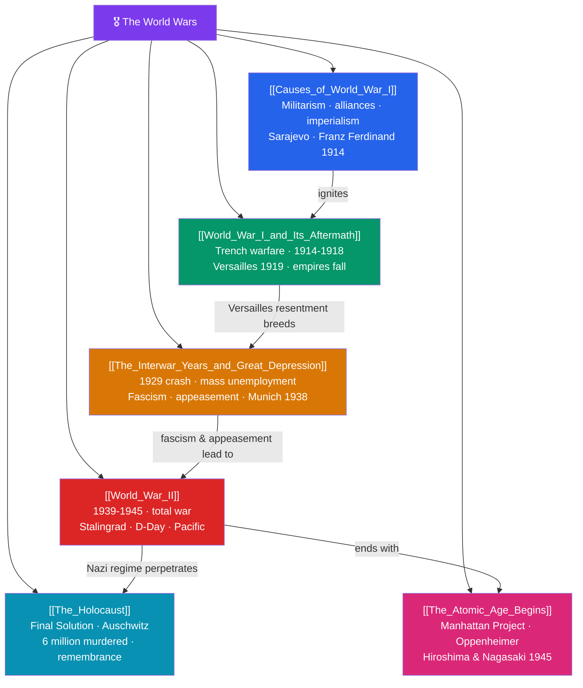

# 🗺️ The World Wars — Map of Content

> [!abstract] What This Section Covers
> The first half of the 20th century was defined by two catastrophic global wars. The **causes of World War I** lay in the tangle of militarism, alliances, imperialism, and nationalism (the "MAIN" causes), detonated by the assassination of Archduke Franz Ferdinand in Sarajevo on 28 June 1914. **World War I and its aftermath** brought industrialized trench slaughter, the fall of four empires, and the punitive Treaty of Versailles (1919). The **interwar years and Great Depression** — the 1929 Wall Street Crash, mass unemployment, the rise of fascism under Mussolini and Hitler, and the failed policy of appeasement — set the stage for renewed war. **World War II** (1939–1945) engulfed Europe, Asia, and the Pacific in total war, from Stalingrad to D-Day. Within it unfolded **the Holocaust**, the industrialized murder of six million Jews and millions of others. The war ended in **the atomic age**, as the Manhattan Project's bombs destroyed Hiroshima and Nagasaki in August 1945, opening the nuclear era. These notes trace how the world twice tore itself apart.

## Concept Map

## Learning Path

1. [[Causes_of_World_War_I]] — The long-term and immediate causes that turned a Balkan assassination into a world war.
2. [[World_War_I_and_Its_Aftermath]] — The war of the trenches, the collapse of empires, and the flawed peace of Versailles.
3. [[The_Interwar_Years_and_Great_Depression]] — Economic collapse, the rise of fascism, and the failure of collective security.
4. [[World_War_II]] — The deadliest conflict in history, its major theaters, and its decisive turning points.
5. [[The_Holocaust]] — The Nazi genocide, its mechanisms, and the imperative of remembrance.
6. [[The_Atomic_Age_Begins]] — The Manhattan Project, the bombing of Japan, and the dawn of nuclear weapons.

## All Notes at a Glance

| Note | Difficulty | What You'll Learn |
|------|------------|-------------------|
| [[Causes_of_World_War_I]] | Intermediate | Militarism, the alliance system, imperial rivalry, nationalism, the Sarajevo assassination, July Crisis |
| [[World_War_I_and_Its_Aftermath]] | Intermediate | Trench warfare, the Western and Eastern Fronts, the fall of four empires, Versailles and the League |
| [[The_Interwar_Years_and_Great_Depression]] | Intermediate | The 1929 crash, the Depression, Mussolini and Hitler, appeasement and the Munich Agreement |
| [[World_War_II]] | Intermediate | Blitzkrieg, the Eastern Front, the Pacific War, the Holocaust context, D-Day, and Allied victory |
| [[The_Holocaust]] | Intermediate → Advanced | Antisemitism, the Final Solution, ghettos and camps, Auschwitz, resistance, and memory |
| [[The_Atomic_Age_Begins]] | Intermediate | The Manhattan Project, Oppenheimer, Hiroshima and Nagasaki, and the moral debate over the bomb |

## Key Questions This Section Answers

- How did a single assassination in Sarajevo escalate into a war that killed millions?
- Why did the Treaty of Versailles fail to secure a lasting peace?
- How did the Great Depression enable the rise of fascism and the drift toward another war?
- What made World War II a "total war," and what were its decisive turning points?
- How was the Holocaust carried out, and why did the war end with the use of atomic weapons?

## Related Sections

- [[_MOC_History_Master|↑ History Master MOC]]
- [[_MOC_Industrial_Revolution|← The Industrial Revolution]]
- [[_MOC_Cold_War_Modern|→ Cold War & Modern Era]]

#MOC #History #WorldWars
