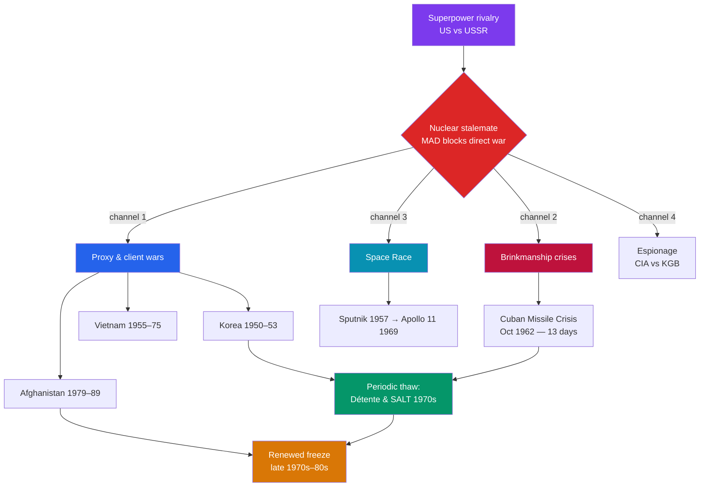

# 🎯 Cold War Proxy Conflicts

> [!abstract] TL;DR
> Because a direct clash between the superpowers risked nuclear annihilation, the U.S. and USSR **never fought each other openly**. Instead the rivalry was displaced onto the periphery, fought through **proxies, clients, and covert operations**. Hot wars flared in **Korea** (1950–53) and **Vietnam**, each killing millions and ending without the clean victory either bloc wanted. In **October 1962** the **Cuban Missile Crisis** brought the world within days — and, in hindsight, within accidents — of nuclear war, and its resolution set the template of brinkmanship followed by bargaining. The rivalry also ran through the **Space Race** (Sputnik 1957, Apollo 11 in 1969) and a vast **espionage** contest between the CIA and KGB. Underpinning it all was **Mutually Assured Destruction (MAD)**: the grim stability of two arsenals that guaranteed the destroyer would also be destroyed. Periodic thaws — **détente** and the SALT treaties of the 1970s — coexisted with fresh flashpoints like the **Soviet–Afghan War** (1979–89), the USSR's own costly quagmire.

## Intuition — analogy first

Think of two chess grandmasters who each hold a loaded pistol under the table, aimed at the other. Neither dares fire — the first shot guarantees both die. But they cannot simply walk away, so their rivalry pours into the **board**: they capture pawns on distant squares (Korea, Vietnam, Angola, Afghanistan), each backing local pieces with money and weapons while keeping their own hands off the trigger. Sometimes a piece moves too close to the king — a spy plane over Cuba, missiles ninety miles from Florida — and both players' hands drift toward the pistols. Those are the crises.

The pistols are the point. **The certainty of mutual death is exactly what keeps the guns holstered** — a stability built on terror, not trust. It works only as long as both players are rational, informed, and lucky. The Cold War's proxy conflicts are what a superpower rivalry looks like when open war is unthinkable: violent, global, and endlessly deferred onto other people's countries. The tragedy is that "no direct war" still meant tens of millions dead on the periphery.

---

## How It Works — Why the Cold War Stayed "Cold" at the Center

## Key Concepts

### The Logic of Proxy War and MAD

**Mutually Assured Destruction (MAD)** is the doctrine that if each side retains a **secure second-strike capability** — enough surviving warheads to devastate the attacker even after absorbing a first strike — then neither can rationally start a nuclear war. Deterrence, paradoxically, made large arsenals *stabilizing*. But it also pushed competition to the margins: unable to fight directly, the superpowers armed and funded **proxies** — client governments and insurgencies — turning local and postcolonial struggles into theaters of the global contest.

### The Korean War (1950–1953)

After Korea was divided at the **38th parallel** in 1945, the North's **Kim Il-sung**, backed by Stalin and Mao, invaded the South in **June 1950**. The U.S. led a **UN coalition**; **General MacArthur's** amphibious landing at **Inchon** reversed the tide and drove north — until **China** intervened with hundreds of thousands of troops, pushing the front back to roughly the original line. The war froze into stalemate and ended with an **armistice in July 1953** — not a peace treaty. Korea remains technically at war, divided at the **Demilitarized Zone**, with a death toll around **2.5–3 million**, most of them civilians.

### The Vietnam War

After the French defeat at **Dien Bien Phu (1954)**, the Geneva Accords split Vietnam at the **17th parallel**. The communist North under **Ho Chi Minh** and the **Viet Cong** insurgency fought the U.S.-backed South. Citing the **Gulf of Tonkin** incident (1964), the U.S. escalated massively; the **Tet Offensive (1968)**, though a military setback for the North, shattered American public confidence. The U.S. withdrew after the **1973 Paris Peace Accords**, and **Saigon fell in 1975**, unifying Vietnam under communist rule. The war killed on the order of **2–3 million** Vietnamese and about **58,000** Americans, and became the cautionary tale against the **"domino theory."**

### The Cuban Missile Crisis (1962): Thirteen Days

In October 1962, U.S. **U-2** reconnaissance photographed Soviet **nuclear missiles** being installed in **Cuba**, ninety miles from Florida. Over **thirteen days**, President **John F. Kennedy** and Premier **Nikita Khrushchev** edged toward war. Kennedy imposed a naval **"quarantine"** (a blockade by another name) and demanded removal. The crisis was defused by a **bargain**: publicly, the USSR withdrew its missiles and the U.S. pledged not to invade Cuba; **secretly**, the U.S. agreed to remove its **Jupiter missiles from Turkey**. It remains the closest the world has come to nuclear war — the danger amplified by accidents nearly triggered on both sides (a Soviet submarine officer, Vasili Arkhipov, refused to authorize a nuclear torpedo). Its legacy: a Washington–Moscow **hotline** and a sobering turn toward arms control.

### The Space Race

Superpower prestige was fought out in orbit. The USSR shocked the West with **Sputnik** (the first satellite, **1957**) and **Yuri Gagarin** (first human in space, **1961**), spurring the U.S. to found NASA and commit to the Moon. The race culminated when **Apollo 11** landed **Neil Armstrong and Buzz Aldrin** on the Moon in **July 1969** — a demonstration that dual-use rocketry (the same technology that lofted warheads) could also project ideological triumph.

### The Soviet–Afghan War (1979–1989)

The USSR invaded **Afghanistan** in December 1979 to prop up a faltering communist government and became mired in a decade-long war against the U.S.-, Pakistani-, and Saudi-backed **mujahideen** — armed, via **Operation Cyclone**, with weapons including **Stinger** anti-aircraft missiles. Often called the **"Soviet Vietnam,"** the war drained Moscow's treasury and legitimacy; the Soviets withdrew in **1989**, and the conflict's long aftermath fed the instability from which the Taliban and al-Qaeda later emerged (see [[Globalization_and_the_Digital_Age]]).

### Détente and Espionage

The rivalry was punctuated by thaw. **Détente** in the early 1970s produced **SALT I** and the **ANti-Ballistic Missile (ABM) Treaty (1972)**, the **Nixon–Brezhnev** summits, Nixon's opening to **China (1972)**, and the **Helsinki Accords (1975)**. Beneath it ran a permanent **espionage** war — the **CIA versus the KGB** — including the **U-2 shoot-down over the USSR (1960)**, the Berlin tunnel, and networks of double agents. Intelligence both stoked crises and, by revealing capabilities, occasionally stabilized them.

| Conflict | Dates | Superpower roles | Outcome |
|---|---|---|---|
| **Korean War** | 1950–53 | US/UN vs North Korea, China, USSR (aid) | Armistice; Korea stays divided |
| **Cuban Missile Crisis** | Oct 1962 | Direct US–USSR standoff | Negotiated de-escalation; arms-control turn |
| **Vietnam War** | 1955–75 | US-backed South vs USSR/China-backed North | Communist unification; US withdrawal |
| **Soviet–Afghan War** | 1979–89 | USSR vs US/Pakistan-backed mujahideen | Soviet withdrawal; "Soviet Vietnam" |

## Primary Sources & Examples

- **NSC-68** (1950): the U.S. National Security Council blueprint that called for a massive military buildup to contain communism globally — the strategic charter behind Korea and much that followed.
- **The Kennedy–Khrushchev correspondence** (October 1962): the exchange of letters during the missile crisis reveals two leaders straining to find an off-ramp, and the secret Turkey deal shows resolution came through **face-saving compromise**, not pure capitulation.
- **The Pentagon Papers** (1971): the leaked internal history of U.S. decision-making in Vietnam, exposing a gap between public optimism and private doubt — a primary-source lesson in how proxy commitments deepened.

## Common Pitfalls / Misconceptions

- **Calling proxy wars "minor."** "Cold" described superpower relations, not the wars themselves — Korea, Vietnam, and Afghanistan together killed several million people.
- **Reading Cuba 1962 as a simple U.S. victory.** The resolution hinged on a **secret** U.S. concession (Jupiter missiles in Turkey) and a no-invasion pledge; both sides retreated. The near-misses also show survival owed something to **luck**.
- **Over-crediting MAD's rationality.** Deterrence assumes rational, well-informed actors; declassified records reveal accidents, false alarms, and rogue local decisions that could have started a war nobody ordered.
- **Believing the domino theory.** Communism did not sweep Southeast Asia after Saigon fell; indeed, communist Vietnam and China soon fought each other (1979). Ideology was less monolithic than Cold War planners assumed.
- **Treating détente as the end of rivalry.** Détente lowered temperatures without ending the contest; the Afghan invasion and the renewed arms buildup of the early 1980s reignited it.

## Related Concepts

- [[_MOC_Cold_War_Modern|↑ Section MOC]] — the section hub
- [[Origins_of_the_Cold_War]] — the bipolar order and arms race whose logic these proxy wars express
- [[Decolonization]] — many proxy conflicts (Vietnam, Angola, Afghanistan) grew out of anti-colonial and postcolonial struggles
- [[Collapse_of_the_Soviet_Union]] — the Afghan quagmire and arms-race spending helped bankrupt the Soviet system
- Cross-vault: [[_MOC_Game_Theory_Master]] — deterrence, second-strike stability, brinkmanship, and the "chicken" and prisoner's-dilemma structure of MAD

## Review Questions

1. Explain Mutually Assured Destruction and use it to account for the paradox that the superpowers built enormous arsenals yet never fought each other directly.
2. Why is the Cuban Missile Crisis considered the closest brush with nuclear war, and what does its resolution reveal about how such crises actually end?
3. In what sense was the Soviet–Afghan War the "Soviet Vietnam"? Compare its costs and consequences to the U.S. experience in Vietnam.

## Sources

- Westad, O.A. (2005). *The Global Cold War: Third World Interventions and the Making of Our Times*. Cambridge University Press
- Dobbs, M. (2008). *One Minute to Midnight: Kennedy, Khrushchev, and Castro on the Brink of Nuclear War*. Knopf
- Halberstam, D. (2007). *The Coldest Winter: America and the Korean War*. Hyperion
- Gaddis, J.L. (2005). *The Cold War: A New History*. Penguin

#history #cold-war #proxy-war #nuclear-deterrence #cuban-missile-crisis #space-race
