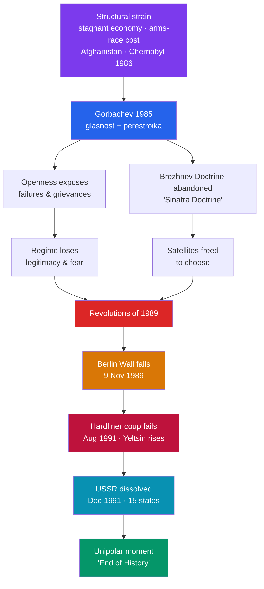

# 🧱 Collapse of the Soviet Union

> [!abstract] TL;DR
> Between 1985 and 1991 the Soviet Union — a nuclear superpower that had seemed permanent — **dismantled itself**, ending the Cold War with a whimper rather than a bang. **Mikhail Gorbachev**, seeking to save the system, launched **glasnost** (openness) and **perestroika** (restructuring); instead, loosening controls exposed decades of stagnation, corruption, and repressed grievance that the system could not survive. By abandoning the **Brezhnev Doctrine** — the threat to invade wayward satellites — Gorbachev removed the fear that held Eastern Europe in place, and in **1989** communist regimes fell in a chain reaction, most vividly with the **fall of the Berlin Wall on 9 November 1989**. A failed hardliner **coup in August 1991** fatally weakened Gorbachev and empowered **Boris Yeltsin**; by **December 1991** the USSR was formally dissolved into fifteen independent states. Francis **Fukuyama** captured the triumphalist mood with **"the end of history,"** and the United States entered a brief **unipolar moment** — though the "end" was far from the end of conflict.

## Intuition — analogy first

Picture a great dam, decades old, its concrete quietly cracking behind a reservoir of pent-up pressure — a stagnant economy, an unwinnable arms race, a war in Afghanistan, and millions of citizens who no longer believe the official story. For years the regime patched the cracks with force and censorship, keeping the water back by **fear**.

Then a new engineer arrives, convinced the dam can be saved only by **opening the sluice gates a little** to relieve the pressure — Gorbachev's reforms. He is half right about the diagnosis and disastrously wrong about the control. The moment the water starts moving, the cracks widen faster than he can patch them. Worse, he announces he will **no longer send troops** to shore up the downstream dams (the satellite states) — so when the people of Poland, Hungary, and East Germany push, there is nothing behind the wall but rotten concrete. In 1989 the downstream dams give way one after another; in 1991 the main dam itself collapses. **The reforms meant to save the system were the crack that broke it** — not because Gorbachev was foolish, but because a structure that stands only on fear cannot survive the removal of fear.

---

## How It Works — Reform, Contagion, Collapse

## Key Concepts

### The Soviet System Under Strain

By the early 1980s the USSR suffered from **economic stagnation** — a rigid command economy that could produce warheads but not consumer goods, hidden behind falsifiable statistics. The burden of matching U.S. **military spending**, the draining **war in Afghanistan** (see [[Cold_War_Proxy_Conflicts]]), collapsing oil prices, and a sclerotic gerontocracy compounded the crisis. The **Chernobyl** nuclear disaster (April 1986) became a metaphor: a catastrophe worsened by secrecy, exposing the rot of a system that lied to itself.

### Gorbachev's Gamble: Glasnost and Perestroika

Becoming General Secretary in **March 1985**, **Mikhail Gorbachev** aimed to **revitalize**, not destroy, Soviet socialism through two policies:
- **Glasnost ("openness")** — relaxed censorship, permitted criticism, and honest discussion of Soviet history, including Stalinist crimes.
- **Perestroika ("restructuring")** — partial economic decentralization and limited market mechanisms, alongside cautious political liberalization (contested elections for a new Congress of People's Deputies).

The gamble backfired: openness **legitimized dissent** and nationalism in the republics, while half-reform disrupted the old economy without building a functioning new one, worsening shortages.

### Ending the Cold War: Summits and the INF Treaty

Gorbachev also pursued genuine **rapprochement** with the West to relieve the arms-race burden. Summits with **Ronald Reagan** — Geneva (1985), the near-breakthrough at **Reykjavik (1986)** — led to the landmark **Intermediate-Range Nuclear Forces (INF) Treaty (1987)**, the first to *eliminate* an entire class of nuclear weapons. Reagan's 1987 call at the Brandenburg Gate — "Mr. Gorbachev, tear down this wall!" — became a slogan of the era's turn.

### The Revolutions of 1989

Crucially, Gorbachev renounced the **Brezhnev Doctrine** (the pledge to use force to keep satellite states communist) — dubbed the **"Sinatra Doctrine"** (they could do it "my way"). Without the threat of Soviet tanks, Eastern European communism collapsed in a single year:

| Country | 1989 event | Character |
|---|---|---|
| **Poland** | Solidarity wins semi-free elections (June) | Negotiated (Round Table) |
| **Hungary** | Opens its border with Austria (summer) | Reformist |
| **East Germany** | Berlin Wall opened (9 Nov) | Mass protest |
| **Czechoslovakia** | Velvet Revolution (November) | Peaceful |
| **Romania** | Ceaușescu overthrown and executed (December) | Violent |

### The Fall of the Berlin Wall (November 1989)

The Wall's opening on **9 November 1989** was famously **accidental in its timing**: an East German spokesman, **Günter Schabowski**, botched the announcement of new travel rules, saying they took effect "immediately." Crowds surged to the crossings, overwhelmed guards opened the gates, and Berliners danced atop the Wall. The image became the definitive symbol of communism's collapse. **German reunification** followed on **3 October 1990**.

### Dissolution of the USSR (1991)

As the republics pressed for sovereignty, hardliners staged a **coup against Gorbachev in August 1991**. It collapsed within days, largely because **Boris Yeltsin**, president of the Russian republic, rallied resistance from atop a tank outside the parliament. The coup's failure shattered central authority. In December, Russia, Ukraine, and Belarus signed the **Belovezha Accords (8 December)** declaring the USSR dissolved; **Gorbachev resigned on 25 December 1991**, and the Soviet Union formally ceased to exist the next day, replaced by **fifteen independent states** and a loose Commonwealth of Independent States.

### "The End of History" and the Unipolar Moment

Political scientist **Francis Fukuyama**, in his essay **"The End of History?"** (1989, book 1992), argued that liberal democracy had defeated its ideological rivals and might represent the **endpoint of humanity's ideological evolution** — not the end of *events* but of fundamental contests over how to organize society. The U.S. stood as the sole superpower in what Charles Krauthammer called the **"unipolar moment."** Both phrases capture a real, if fleeting, sense of Western triumph — and both would be sharply tested (see [[Globalization_and_the_Digital_Age]]).

## Primary Sources & Examples

- **The INF Treaty (1987):** the text and the on-site inspection regime it created are primary evidence that the Cold War was *wound down by agreement*, not merely "won."
- **Fukuyama, "The End of History?"** (*The National Interest*, 1989): the era's defining — and much-misread — argument; note that even Fukuyama hedged it with a question mark and doubts about its emotional emptiness.
- **The Belovezha Accords (December 1991):** the short document by which three republics' leaders declared the USSR extinct — a superpower ended by signature, not by war.

## Common Pitfalls / Misconceptions

- **"The Wall fell" by design.** It was opened amid confusion after a mangled press briefing and popular pressure — a contingent, almost farcical trigger, not a decreed policy.
- **Reducing the collapse to a single cause.** It was **overdetermined**: economic failure, the arms-race burden, Afghanistan, nationalism in the republics, Gorbachev's reforms, and Western pressure all mattered. Beware "the West won" or "Reagan alone did it" as complete explanations — internal Soviet dynamics were central.
- **Assuming collapse was inevitable.** Contemporaries, including most intelligence agencies, did **not** predict it; the specific path (peaceful, rapid, largely bloodless) was far from foreordained.
- **Treating "end of history" as a literal prophecy of permanent peace.** Fukuyama argued about the exhaustion of *ideological alternatives* to liberalism, not the end of war, terrorism, or nationalism — a distinction lost in popular usage.
- **Casting Gorbachev as either pure hero or villain.** He is revered abroad for ending the Cold War peacefully and resented by many Russians for the collapse and hardship that followed — both readings capture part of a genuinely tragic figure.

## Related Concepts

- [[_MOC_Cold_War_Modern|↑ Section MOC]] — the section hub
- [[Origins_of_the_Cold_War]] — the bipolar order and division of Germany that ended here where they most visibly began, in Berlin
- [[Cold_War_Proxy_Conflicts]] — the Afghan war and arms-race spending that helped exhaust the Soviet system
- [[Globalization_and_the_Digital_Age]] — the post-Cold-War order the collapse opened: globalization, U.S. primacy, and its later erosion
- Cross-vault: [[_MOC_Macroeconomics_Master]] — why centrally planned command economies chronically underperformed and could not reform without destabilizing

## Review Questions

1. Explain how glasnost and perestroika, intended to strengthen the Soviet system, instead accelerated its collapse.
2. Why was Gorbachev's abandonment of the Brezhnev Doctrine decisive for the revolutions of 1989? Illustrate with two country cases.
3. Assess Fukuyama's "end of history" thesis. What did he actually claim, how did the "unipolar moment" seem to confirm it, and in what ways has it since been challenged?

## Sources

- Brown, A. (1996). *The Gorbachev Factor*. Oxford University Press
- Sarotte, M.E. (2014). *The Collapse: The Accidental Opening of the Berlin Wall*. Basic Books
- Service, R. (2015). *The End of the Cold War, 1985–1991*. Macmillan
- Fukuyama, F. (1992). *The End of History and the Last Man*. Free Press

#history #cold-war #soviet-collapse #glasnost #perestroika #berlin-wall
