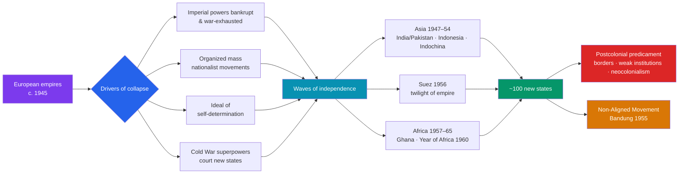

# 🏴 Decolonization

> [!abstract] TL;DR
> In barely three decades after 1945, the European empires that had ruled most of the planet **dissolved**, and roughly a hundred new states took their place. The war had bankrupted the imperial powers, discredited the myth of white supremacy, and armed colonized peoples with organized nationalist movements and the Allied language of **self-determination**. **India and Pakistan** won independence in 1947 — but at the cost of a **Partition** that displaced some 15 million people and killed on the order of a million. Africa's turn came fast: **Ghana** led in 1957, seventeen states became independent in the **1960 "Year of Africa,"** and Harold Macmillan warned of a **"wind of change."** The **Suez Crisis** (1956) exposed Britain and France as no longer able to act without American consent, while the brutal **Algerian War** (1954–62) showed how bloody a fought-for independence could be. Newly free states often refused to line up behind either superpower, forming the **Non-Aligned Movement**. Independence, however, was rarely the end of the story: arbitrary borders, hollowed-out economies, and weak institutions left a hard **postcolonial predicament**.

## Intuition — analogy first

Picture a vast, aging landlord who for a century has run a hundred houses, extracting rent and calling it civilization. Then the landlord is nearly destroyed in a fire he himself helped start (two world wars), emerges broke, and can no longer pay the guards who kept the tenants in line. The tenants — who never accepted the arrangement and have spent decades organizing — now hold the keys.

But *how* the landlord leaves varies enormously. In one house he hands over the deed after negotiation and walks out (India's transfer of power, Ghana's ballot). In another he barricades the door and has to be forced out room by bloody room (Algeria, later Vietnam and the Portuguese colonies). And crucially, walking out does not undo a century of design: the plumbing still runs to the old capital, the property lines were drawn to suit the landlord not the residents, and the new owners inherit debts, boundaries, and rivalries they did not choose. **Decolonization freed the tenants; it did not rebuild the house.** That gap between formal sovereignty and real self-determination is the story's unfinished business.

---

## How It Works — Empires Fall, New Nations Rise

## Key Concepts

### Why Empires Fell After 1945

Decolonization had converging causes rather than one:
- **Imperial exhaustion** — Britain, France, the Netherlands, and Belgium emerged from WWII financially and militarily depleted, dependent on U.S. aid, and unable to sustain costly reconquests.
- **Delegitimized empire** — Japanese victories over European powers in Asia shattered the aura of invincibility, and Nazi racism made European claims of a civilizing mission untenable.
- **Mature nationalism** — decades of organizing produced disciplined movements and charismatic leaders: **Gandhi** and **Nehru** in India, **Nkrumah** in Ghana, **Ho Chi Minh** in Vietnam, **Sukarno** in Indonesia.
- **The Cold War frame** — both superpowers, for their own reasons, opposed old-style European colonialism and competed to win the new states, giving nationalists leverage.

### India's Independence and Partition (1947)

The **Indian National Congress** and the **Muslim League** had built mass movements over decades. As Britain withdrew, the League's **Muhammad Ali Jinnah** insisted on a separate Muslim state, and the last viceroy, **Lord Mountbatten**, accelerated the timetable. At midnight on **14–15 August 1947**, British India split into **India** and **Pakistan** (the latter in two wings, east and west). The hastily drawn **Radcliffe Line** cut through Punjab and Bengal; the result was one of history's largest and bloodiest population transfers — roughly **10–15 million displaced** and estimates of **several hundred thousand to a million dead** in communal violence. Kashmir became a contested fault line that endures. Nehru's **"Tryst with Destiny"** speech captured the promise; Partition captured the price.

### The Suez Crisis (1956): Twilight of Imperial Power

When Egypt's **Gamal Abdel Nasser** nationalized the **Suez Canal** (July 1956), Britain and France — with **Israel** — secretly colluded to invade and retake it (October–November 1956). Militarily they succeeded; politically they were humiliated. The **United States**, furious at not being consulted and fearing Soviet gains, forced a withdrawal by pressuring the pound sterling, while the **USSR** threatened intervention. Suez proved that the old imperial powers could **no longer act independently of the superpowers** — a psychological turning point that accelerated decolonization everywhere.

### The Year of Africa and the "Wind of Change"

- **Ghana** (formerly the Gold Coast) became the first sub-Saharan colony to gain independence, in **1957**, under **Kwame Nkrumah** — a beacon for Pan-Africanism.
- **1960, the "Year of Africa,"** saw **seventeen** African nations become independent in a single year, including Nigeria and the turbulent Congo.
- British Prime Minister **Harold Macmillan**, addressing South Africa's parliament in Cape Town (**3 February 1960**), declared: "The wind of change is blowing through this continent," signalling that Britain accepted African majority rule — a rebuke aimed at apartheid.

### The Algerian War (1954–1962)

Not all decolonization was negotiated. **Algeria** was legally part of France with a large settler (*pied-noir*) population, so Paris fought the nationalist **FLN** in a savage war marked by guerrilla attacks, systematic **torture**, and mass civilian death (estimates range widely, into the hundreds of thousands). The conflict toppled France's Fourth Republic and returned **Charles de Gaulle** to power; he ultimately conceded independence in the **Évian Accords (1962)**. Algeria became the emblem of decolonization's violent variant and, via **Frantz Fanon**, of its revolutionary theory.

### Non-Alignment and the Third World

Refusing to be pawns in the Cold War, many new states sought a third path:
- The **Bandung Conference** (Indonesia, **1955**) gathered 29 Asian and African states around anti-colonial solidarity and peaceful coexistence.
- The formal **Non-Aligned Movement (NAM)** was launched at **Belgrade in 1961** by **Nehru, Nasser, Tito (Yugoslavia), Sukarno, and Nkrumah**.
- Non-alignment was aspirational more than absolute — states still took aid and arms from one side or the other — but it gave the "Third World" a collective voice in a bipolar order.

### The Postcolonial Predicament

Formal independence rarely delivered full self-determination:

| Challenge | What it meant |
|---|---|
| **Arbitrary borders** | Colonial lines ignored ethnic and linguistic realities, seeding secession and civil war (Nigeria/Biafra, Congo, Sudan) |
| **Weak institutions** | Extractive colonial states left few trained administrators or independent courts |
| **Distorted economies** | Reliance on a single export crop or mineral, tied to former rulers' markets |
| **Neocolonialism** | Continued economic dependence — Nkrumah's term for control "by economic and monetary means" without formal rule |
| **Authoritarian drift** | Independence-era parties often hardened into one-party states or military regimes |

These structural inheritances — traced to the imperial system in [[Imperialism_and_the_Scramble_for_Africa]] — shaped the developing world for generations.

## Primary Sources & Examples

- **Nehru, "Tryst with Destiny"** (14 August 1947): "At the stroke of the midnight hour, when the world sleeps, India will awake to life and freedom." The founding text of independent India, spoken as Partition violence raged.
- **Macmillan, "Wind of Change"** (1960): a colonial power publicly conceding the tide of African nationalism — and pointedly, before an apartheid parliament, endorsing majority rule.
- **Bandung Final Communiqué** (1955): the ten principles of Afro-Asian cooperation, an early charter of the Global South and of non-alignment.
- **Frantz Fanon, *The Wretched of the Earth*** (1961): the classic, controversial argument that colonial violence could only be undone through anti-colonial struggle — the intellectual voice of the Algerian revolution.

## Common Pitfalls / Misconceptions

- **Seeing decolonization as a single, peaceful handover.** Outcomes ranged from negotiated transfers (India, Ghana) to protracted wars (Algeria, Vietnam, the Portuguese colonies until 1974–75).
- **Equating independence with sovereignty.** Flags and anthems did not end economic dependence; **neocolonialism** and debt often preserved the old hierarchies.
- **Blaming all postcolonial troubles on internal failings — or entirely on colonialism.** Both the colonial inheritance (borders, extractive institutions) *and* subsequent choices and Cold War interference shaped outcomes. Beware single-cause explanations.
- **Treating Partition as inevitable.** The scale and speed of India's Partition — and its human cost — owed much to a rushed British exit and contingent political failures, not just ancient hatreds.
- **Ignoring the settlers and minorities.** Decolonization also created displaced settler populations (the *pieds-noirs*) and stranded minorities, complicating any simple hero–villain story.

## Related Concepts

- [[_MOC_Cold_War_Modern|↑ Section MOC]] — the section hub
- [[Origins_of_the_Cold_War]] — decolonization unfolded inside the bipolar order; both superpowers courted the new states
- [[Cold_War_Proxy_Conflicts]] — several decolonization struggles (Vietnam, Angola, Afghanistan) became Cold War proxy wars
- [[Globalization_and_the_Digital_Age]] — the postcolonial states later integrated, unevenly, into a globalized economy
- [[Imperialism_and_the_Scramble_for_Africa]] — the empires whose collapse this note charts, and the borders they bequeathed
- Cross-vault: [[_MOC_Macroeconomics_Master]] — theories of development, dependency, and why postcolonial economies struggled to industrialize

## Review Questions

1. Identify three distinct causes of the post-1945 collapse of European empires and explain how they reinforced one another.
2. Why is the Suez Crisis (1956) described as a turning point in the history of empire, even though Britain and France won militarily?
3. What is the "postcolonial predicament"? Give two structural legacies of colonial rule and explain how each constrained newly independent states.

## Sources

- Chamberlain, M.E. (1999). *Decolonization: The Fall of the European Empires* (2nd ed.). Blackwell
- Khan, Y. (2007). *The Great Partition: The Making of India and Pakistan*. Yale University Press
- Fanon, F. (1961). *Les Damnés de la Terre* (*The Wretched of the Earth*). François Maspero
- Springhall, J. (2001). *Decolonization since 1945*. Palgrave

#history #decolonization #empire #partition #non-alignment #suez
